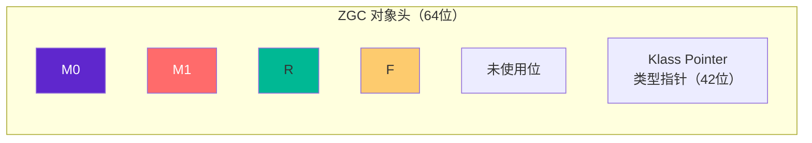
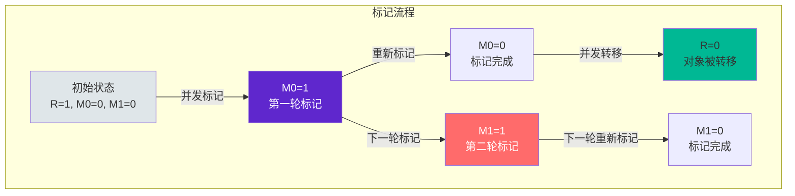
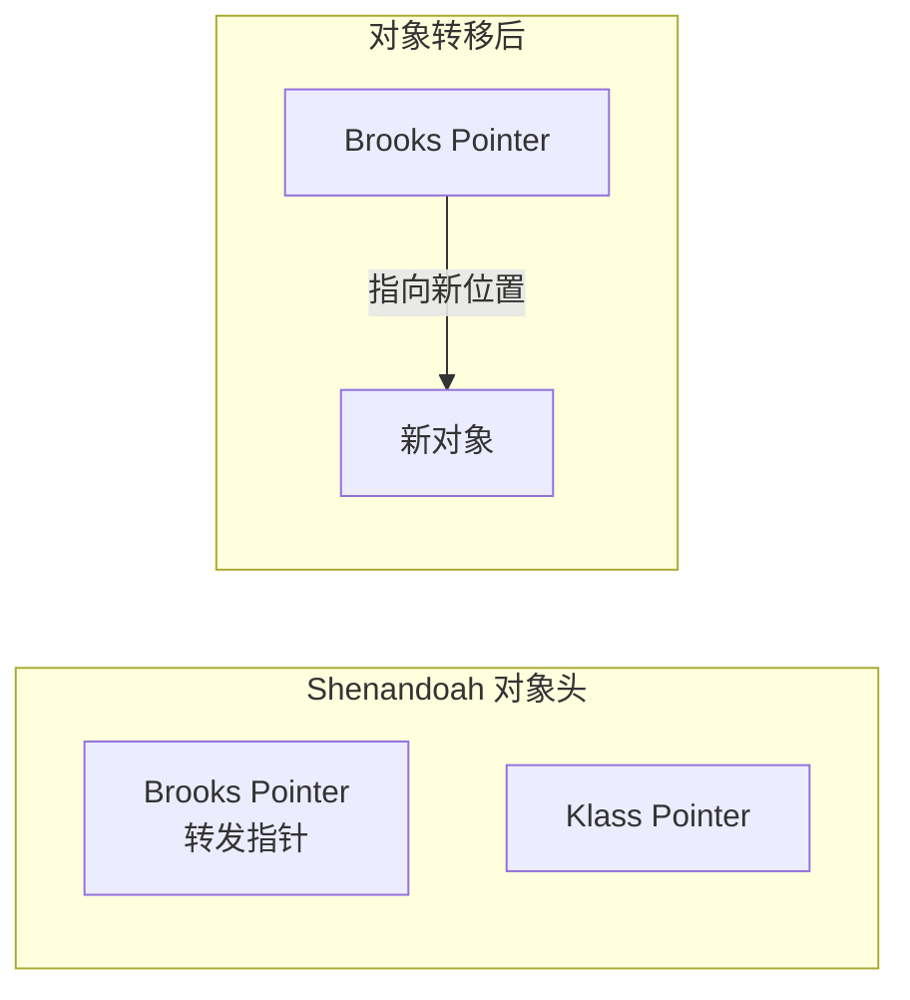
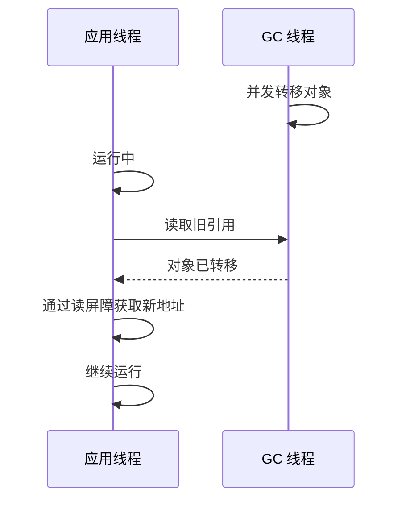

# ZGC 核心：染色指针与读屏障

染色指针（Colored Pointers）和读屏障（Load Barrier）是 ZGC 最核心的技术创新。它们使得 ZGC 能够在高并发的同时保持低停顿。

理解这两个概念，是深入理解 ZGC 原理的关键。

## 染色指针原理

### 传统 GC 的对象头

传统 GC（如 G1、CMS）将 GC 状态信息存储在对象头的 Mark Word 中：


### ZGC 的染色指针

ZGC 将对象头的空闲位用作 GC 状态标记：



在 64 位系统中，ZGC 使用 46 位寻址（可以寻址 64TB），剩余的 18 位可以用于存储 GC 状态。

### 四位着色位

ZGC 使用 4 个着色位（Colored Bits）：

| 位 | 名称 | 用途 |
| --- | --- | --- |
| 0 | Finalizable | 标记包含终结器的对象 |
| 1 | Remapped | 对象是否已重定位到新地址 |
| 2 | Marked1 | 标记位（第二次标记） |
| 3 | Marked0 | 标记位（第一次标记） |

### 着色指针的工作流程



## 读屏障原理

### 为什么需要读屏障

传统 GC 在对象移动后需要停止所有应用线程来更新引用。ZGC 通过读屏障实现**自愈**（Self-Healing），让应用线程在运行时更新引用。

### 读屏障的工作原理

```java
// 读屏障的伪代码
Object readBarrier(Object* ref) {
    Object obj = *ref;  // 读取对象引用
    
    // 检查对象是否正在被 GC 移动
    if (isMarked(obj)) {  // 对象被标记过
        // 检查 Remapped 位
        if (!isRemapped(obj)) {
            // 对象已被移动，从转发表获取新地址
            Object newObj = forwardingTable.get(obj);
            // 自愈：更新本地引用
            *ref = newObj;
            return newObj;
        }
    }
    
    return obj;
}
```

### 读屏障的开销

读屏障每次读取对象引用时都会执行，会带来一定的性能开销：

| 操作 | 开销估算 |
| --- | --- |
| 普通读取 | 基准 |
| ZGC 读屏障 | +3%~5% CPU |

这个开销相比 ZGC 带来的停顿时间优势，在低延迟敏感场景下是完全值得的。

## 与 Shenandoah 的对比

Shenandoah 是另一个低延迟 GC，与 ZGC 有相似的目标，但实现方式不同：

| 特性 | ZGC | Shenandoah |
| --- | --- | --- |
| 着色指针 | 使用 | 使用 |
| 写屏障 | 不需要 | 需要 |
| 读屏障 | 需要 | 需要 |
| 对象头修改 | 染色指针 | Brooks Pointer |
| 指针压缩 | 不支持 | 不支持 |
| 着色位数 | 4 位 | 1 位 |

### Brooks Pointer

Shenandoah 使用 Brooks Pointer（转发指针）代替染色指针：



Brooks Pointer 在对象头中添加一个额外的指针，指向对象的当前位置或新位置。这种方式需要写屏障来更新指针。

## ZGC 的优势

### 无需 Stop The World 整理

传统 GC 在整理（压缩）堆时必须停止所有应用线程，因为对象在移动时引用必须同步更新。

ZGC 通过染色指针和自愈机制，**允许对象在应用线程运行时移动**。应用线程读取到正在移动的对象时，读屏障会自动获取新地址并更新引用。

### 并发重定位

ZGC 的并发重定位阶段与应用并发执行：



应用线程在读取旧引用时会触发读屏障，获取新地址并更新引用（自愈）。这样不需要停止应用线程来统一更新引用。

## 着色指针的局限性

### 地址空间限制

ZGC 使用 4 个着色位后，实际可用地址空间为：

```
46 位地址 = 64TB 寻址空间
```

这意味着 ZGC 不支持 `-XX:+UseCompressedOops`（指针压缩），指针占用空间比传统 GC 大。

### 不支持类数据共享

由于使用了染色指针，ZGC 不支持 `-Xshare`（类数据共享）。

## 性能影响

染色指针和读屏障对性能的影响：

| 维度 | 影响 |
| --- | --- |
| 停顿时间 | 大幅降低（亚毫秒级） |
| 吞吐量 | 轻微下降（5%~15%） |
| 内存占用 | 增加（指针更大） |
| CPU 使用 | 轻微增加（读屏障） |
