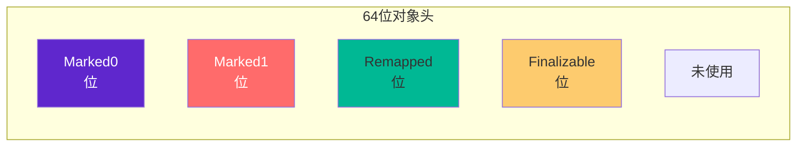
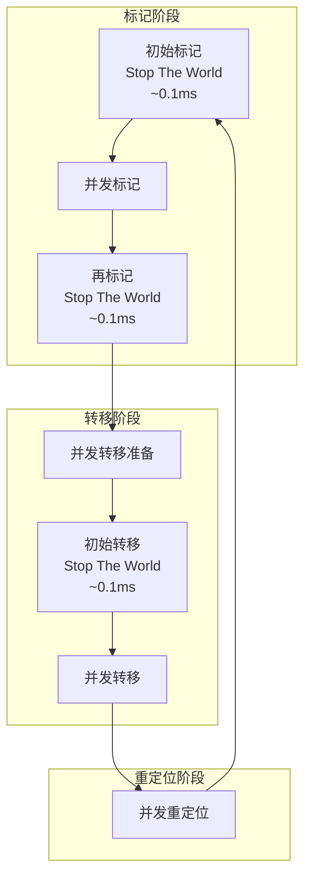
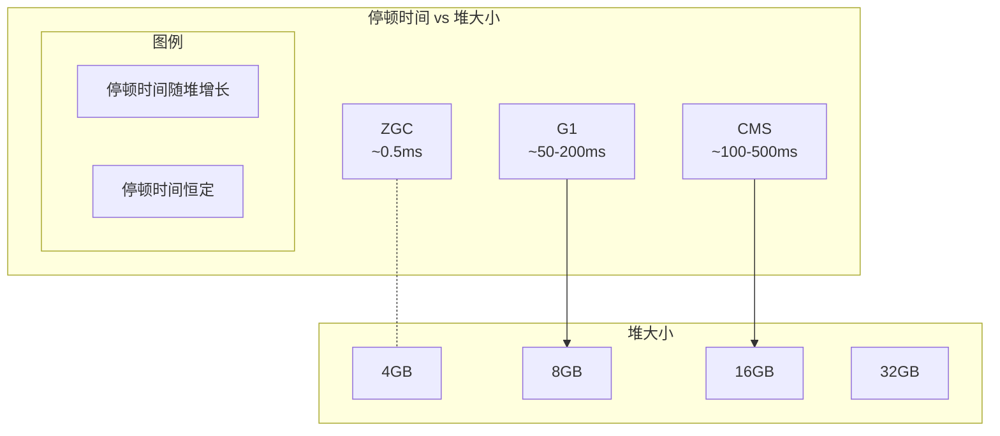

# ZGC 深度解析

ZGC（Z Garbage Collector）是 Oracle 于 Java 11 引入的低延迟垃圾收集器，Java 15 正式生产可用。ZGC 的核心目标是：**将停顿时间控制在 10ms 以内，同时支持数百 GB 甚至 TB 级别的堆内存**。

ZGC 的创新在于：几乎所有 GC 阶段都与应用并发执行，Stop The World 时间与堆大小无关，始终保持在亚毫秒级别。

## ZGC 设计目标

ZGC 的设计目标是解决传统收集器的痛点：

| 问题 | Serial/Parallel | CMS | G1 | ZGC |
| --- | --- | --- | --- | --- |
| 停顿时间 | 长（随堆增长） | 较短 | 可控 | `<1ms` |
| 停顿时间与堆大小关系 | 线性增长 | 线性增长 | 有关 | 无关 |
| 最大堆支持 | - | `~4GB` | `~100GB` | `>16TB` |
| 内存碎片 | 无 | 有 | 可控 | 无 |
| 吞吐量 | 高 | 中 | 中高 | 高 |

## ZGC 工作原理

### 着色指针（Colored Pointers）

ZGC 使用着色指针（Colored Pointers）在对象头中存储 GC 状态信息：



| 位 | 名称 | 说明 |
| --- | --- | --- |
| M0 | Marked0 | 标记位，第一次标记 |
| M1 | Marked1 | 标记位，第二次标记 |
| R | Remapped | 对象是否已重定位 |
| F | Finalizable | 对象是否包含终结器 |

### 读屏障（Load Barrier）

ZGC 在每次读取对象引用时执行读屏障，检查对象的着色指针状态：

```java
// ZGC 读屏障的简化实现
public class ZGCLoadBarrier {
    public Object loadObjectReference(Object* ref) {
        Object obj = *ref;  // 读取引用
        
        // 读屏障检查
        if (needsRelocation(obj)) {
            // 对象正在被 GC 移动，触发自愈
            obj = relocate(obj);
        }
        
        return obj;
    }
    
    private boolean needsRelocation(Object obj) {
        // 检查 Remapped 位
        return !isRemapped(obj) && 
               (inEvacuationPhase() || !inMarkingPhase());
    }
    
    private Object relocate(Object obj) {
        // 转发指针指向新位置
        Object newObj = forwardingTable.get(obj);
        // 自愈：更新引用
        *ref = newObj;
        return newObj;
    }
}
```

## ZGC 工作阶段

ZGC 的工作分为三个主要阶段，每个阶段都尽量与应用并发执行：



### 阶段一：并发标记

1. **初始标记**：Stop The World，标记 GC Roots 直接引用的对象（`<0.1ms`）
2. **并发标记**：与应用并发执行，遍历对象图，标记存活对象
3. **再标记**：Stop The World，处理并发标记阶段的变更（`<0.1ms`）

### 阶段二：并发转移

1. **转移准备**：计算哪些 Region 需要转移，确定转移预算
2. **初始转移**：Stop The World，转移 GC Roots 引用的对象（`<0.1ms`）
3. **并发转移**：与应用并发执行，转移需要回收的 Region 中的对象

### 阶段三：并发重定位

并发重定位与应用并发执行，更新所有对已转移对象的引用。

## ZGC 性能特点

### 停顿时间不随堆增长

传统收集器的停顿时间随堆大小线性增长，而 ZGC 的停顿时间始终保持在亚毫秒级别：



### 吞吐量损失

ZGC 的并发执行带来吞吐量损失，通常为 5%~15%：

| 收集器 | 吞吐量 | 停顿时间 | 最大堆 |
| --- | --- | --- | --- |
| ZGC | 85%~95% | `<1ms` | `>16TB` |
| G1 | 90%~95% | 100~200ms | `~100GB` |
| Parallel | 95%+ | 很长 | - |

## 配置参数

### 启用 ZGC

```bash
# Java 15+ 启用 ZGC
java -XX:+UseZGC -Xms32g -Xmx32g -jar application.jar

# Java 11-14 启用 ZGC
java -XX:+UnlockExperimentalVMOptions -XX:+UseZGC -Xms32g -Xmx32g -jar application.jar
```

### 核心参数

| 参数 | 说明 | 示例 |
| --- | --- | --- |
| `-Xmx` | 最大堆大小 | `-Xmx64g` |
| `-XX:zAllocationSpikeTolerance` | 分配突发容忍度 | `-XX:zAllocationSpikeTolerance=3` |
| `-XX:zContainerSupport` | 容器支持 | `-XX:-zContainerSupport` |
| `-XX:zConcurrentGCThreads` | 并发 GC 线程数 | `-XX:zConcurrentGCThreads=8` |
| `-XX:zUncommitDelayMillis` | 内存归还延迟 | `-XX:zUncommitDelayMillis=300000` |

## 适用场景

ZGC 适合以下场景：

1. **超大内存**：`>16GB` 堆内存，`ZGC` 的停顿时间优势明显
2. **极低延迟**：金融交易、游戏服务器、实时系统
3. **高可用要求**：无法接受长时间 GC 停顿的业务
4. **容器化部署**：容器内存 `>8GB`

```bash
# ZGC 推荐配置
java -XX:+UseZGC \
    -Xms64g -Xmx64g \
    -XX:+ZGenerational \
    -XX:zAllocationSpikeTolerance=5 \
    -XX:+AlwaysPreTouch \
    -Xlog:gc*:file=gc.log:time,uptime,level,tags \
    -jar application.jar
```

## ZGC 的限制

ZGC 不是银弹，有以下限制：

1. **不支持指针压缩**：ZGC 使用完整的 64 位地址，不支持 `-XX:+UseCompressedOops`
2. **不支持类数据共享**：不支持 `-Xshare`
3. **内存不归还不及时**：ZGC 默认延迟 5 分钟才归还未使用内存
4. **不支持 JDK Flight Recorder 的某些功能**
