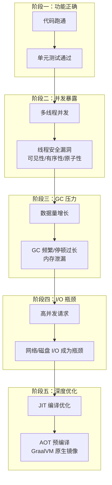
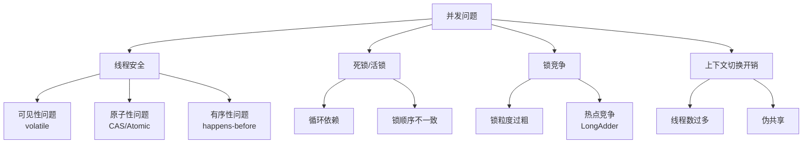
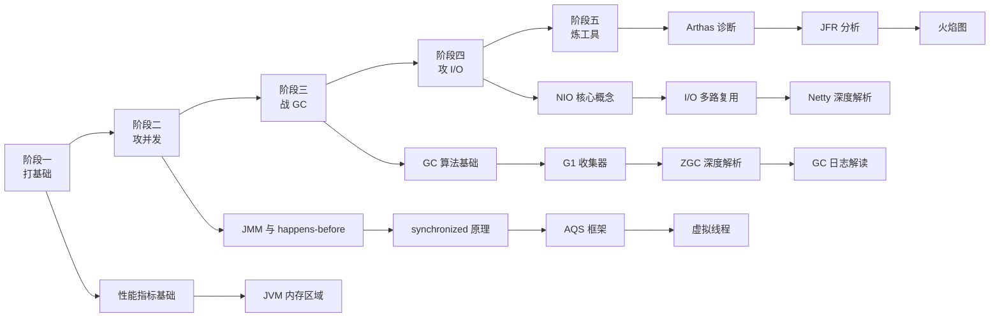

# Java 性能优化

线上 CPU 打满，接口 RT 飙到 5 秒。你开始排查：业务代码没问题，数据库也正常，缓存也生效——但 GC 日志一打开，Young GC 每分钟 20 次，每次停顿 800ms。

这不是极端案例。JVM 性能问题有三个显著特点：**难以复现**（本地怎么测都正常，一上生产就出问题）、**定位困难**（表象是接口慢，但根因可能是 GC、可能是 JIT、可能是 I/O）、**修复成本高**（改错 JVM 参数可能让情况更糟）。

性能优化的本质，是在资源受限的条件下，找到真正的瓶颈并加以解决。很多人花大量时间优化代码细节，却忽视了更根本的问题——线程模型是否合理？GC 配置是否匹配业务特征？I/O 模型是否选对了？

本分类聚焦 Java 性能优化的核心技术体系，从 JVM 内存模型与 GC，到 Java 并发模型与同步机制，再到 JIT 编译原理与 AOT 优化，最后到 I/O 模型与性能剖析工具——帮你建立从「发现问题」到「定位根因」到「正确修复」的完整能力。

## 模块结构

本分类按主题分为 6 个子模块：

| 子模块 | 核心问题 | 典型场景 |
| --- | --- | --- |
| **性能指标** | 怎么衡量性能？哪些指标最关键？ | QPS/TPS 定义、延迟分位数、吞吐量计算 |
| **Java 并发模型** | 线程怎么用？同步怎么做？异步怎么写？ | 线程池配置、死锁排查、虚拟线程迁移 |
| **内存模型与 GC** | 对象怎么分配？垃圾怎么回收？停顿怎么控制？ | Young GC 频繁、Full GC 过长、内存泄漏 |
| **JIT 编译与 AOT** | 代码怎么被编译成机器码？哪些优化是 JIT 做的？ | 方法内联、逃逸分析、GraalVM 原生镜像 |
| **I/O 模型** | 同步 vs 异步、阻塞 vs 非阻塞的取舍？零拷贝怎么用？ | 高并发网络编程、文件传输优化、Netty 调优 |
| **性能剖析** | 怎么找到真正的性能瓶颈？工具怎么用？ | Arthas 诊断、JFR 分析、火焰图解读 |

## 性能问题的演进路径

理解性能问题，要从系统的演进阶段出发：

大多数工程师会在阶段二和阶段三遇到问题，但真正的高手会在设计阶段就避免这些问题的根源。

## 性能优化的核心原则

在动手优化之前，有几条铁律：

**原则一：先测量，再优化。** 不要猜测瓶颈在哪，用数据说话。一个常见误区是「我觉得这里会慢」，结果优化了半天，性能没提升，反而代码可读性下降了。

**原则二：优化要站在 ROI 最高的点。** 优化 1% 的代码不如优化占比 50% 的热点路径。先找到 p99 延迟最高的接口，再找到这个接口中最耗时的方法。

**原则三：理解 trade-off 再做决策。** 切换到 ZGC 降低了停顿时间，但吞吐量可能下降 5%。使用虚拟线程提升了并发能力，但 synchronized 的性能问题会放大。这些权衡必须在优化前就理解清楚。

**原则四：不要优化不存在的问题。** 如果系统 CPU 使用率只有 30%，吞吐量完全满足需求，GC 停顿在可接受范围内——不要动它。过度优化是另一种浪费。

## Java 性能问题的分类

### 并发问题

并发问题是最常见也是最难排查的性能问题类别：

**典型症状**：

- CPU 使用率不高，但接口 RT 高——可能是锁竞争或上下文切换过多
- 线程 dump 显示大量线程处于 BLOCKED/WAITING 状态——锁竞争或死锁
- CPU 使用率高，但吞吐量不高——可能是 GC 问题或 I/O 阻塞

### GC 问题

GC 问题是 JVM 性能问题的重灾区：

| 问题类型 | 典型症状 | 可能原因 | 解决方案 |
| --- | --- | --- | --- |
| Young GC 频繁 | 每分钟 20+ 次，停顿 500ms+ | 对象分配速率过高 | 减少短期对象创建、增大年轻代 |
| Full GC 频繁 | 老年代持续增长 | 内存泄漏、大对象直接晋升 | 排查泄漏、调整晋升阈值 |
| GC 停顿过长 | p99 延迟高 | G1 混合回收时间过长 | 切换 ZGC、调整 G1 参数 |
| 内存持续增长 | OOM | 集合未清理、类加载器泄漏 | 堆转储分析、修复泄漏源 |

### I/O 问题

I/O 问题在高并发场景下尤为突出：

**典型症状**：

- 线程池打满，大量请求等待 I/O——BIO 模型下每个连接一个线程的问题
- 网络延迟高但 CPU 利用率低——可能是阻塞 I/O 导致的线程浪费
- 文件传输性能差——没有利用零拷贝优化

**核心矛盾**：同步 I/O 简单但浪费资源，异步 I/O 高效但编程复杂。选择取决于业务特征。

## 各子模块导读

### 性能指标

如果你不确定怎么衡量性能，从这里开始。

**核心概念**：[性能指标总览](/performance-jvm/metrics/overview)——吞吐量和延迟的区别、黄金指标；[延迟分析](/performance-jvm/metrics/latency)——p50/p90/p99 的含义、延迟分布；[吞吐量](/performance-jvm/metrics/throughput)——QPS/TPS 的定义与计算；[SLO/SLI/SLA](/performance-jvm/metrics/sla-slo-sli)——如何设定性能目标。

**工具与方法**：[性能测试工具](/performance-jvm/metrics/testing-tools)——JMeter、wrk、 Gatling；[JMH 使用指南](/performance-jvm/metrics/jmh)——微基准测试的正确姿势。

### Java 并发模型

这是整个分类的核心模块，与日常开发关系最密切。

**入门必读**：[线程生命周期与状态转换](/performance-jvm/concurrency/thread-lifecycle)——NEW/RUNNABLE/BLOCKED/WAITING/TIMED_WAITING/TERMINATED；[Java 内存模型（JMM）](/performance-jvm/concurrency/jmm)——可见性、有序性、原子性的根源；[happens-before 原则](/performance-jvm/concurrency/happens-before)——8 大规则，理解并发 Bug 的基础。

**同步机制**：[synchronized 实现原理](/performance-jvm/concurrency/synchronized)——锁升级过程；[AQS 框架](/performance-jvm/concurrency/aqs)——ReentrantLock、Semaphore、CountDownLatch 的共同基础；[ReentrantLock](/performance-jvm/concurrency/reentrantlock)——比 synchronized 更灵活的锁；[ReadWriteLock 与 StampedLock](/performance-jvm/concurrency/readwritelock)——读多写少场景的优化。

**原子操作**：[CAS 原理](/performance-jvm/concurrency/cas)——无锁编程的核心；[LongAdder](/performance-jvm/concurrency/longadder)——热点竞争的解决方案。

**异步编程**：[CompletableFuture](/performance-jvm/concurrency/completablefuture)——链式异步调用；[Fork/Join 框架](/performance-jvm/concurrency/fork-join)——分治并行计算；[响应式编程](/performance-jvm/concurrency/reactive)——Reactor 与 WebFlux。

**虚拟线程**：[虚拟线程深度解析](/performance-jvm/concurrency/virtual-thread)——Loom 架构与Continuation；[虚拟线程 vs 平台线程](/performance-jvm/concurrency/vt-vs-pt)——性能对比与选型；[结构化并发](/performance-jvm/concurrency/structured-concurrency)——Java 21 的并发新范式；[Scoped Values](/performance-jvm/concurrency/scoped-values)——线程局部变量的替代。

### 内存模型与 GC

如果你遇到 GC 问题，这里是必读的。

**基础**：[JVM 内存区域划分](/performance-jvm/gc/memory-areas)——堆/栈/元空间/直接内存；[堆内存详解](/performance-jvm/gc/heap)——Eden/Survivor/老年代；[对象生命周期与内存分配](/performance-jvm/gc/object-lifecycle)——分配、晋升、回收。

**原理**：[可达性分析](/performance-jvm/gc/mark-sweep)——GC Roots 的定义；[引用类型](/performance-jvm/gc/reference-types)——强/软/弱/虚引用的回收时机；[标记-清除/复制/整理算法](/performance-jvm/gc/mark-sweep)——三种基础算法；[分代收集理论](/performance-jvm/gc/generational)——为什么分代，分代如何工作。

**收集器**：[Serial/Parallel/CMS](/performance-jvm/gc/serial)——历史收集器；[G1 收集器](/performance-jvm/gc/g1)——Java 9+ 默认；[G1 Region 与 Remembered Set](/performance-jvm/gc/g1-region)——G1 的核心数据结构；[ZGC 深度解析](/performance-jvm/gc/zgc)——亚毫秒停顿的秘诀；[ZGC 染色指针与读屏障](/performance-jvm/gc/zgc-colored-pointer)——ZGC 的底层机制；[Shenandoah](/performance-jvm/gc/shenandoah)——OpenJDK 的低延迟 GC；[GC 对比矩阵](/performance-jvm/gc/comparison)——各收集器的选型建议。

**实战**：[GC 日志解读](/performance-jvm/gc/log-analysis)——GC 日志格式与关键指标；[GC 调优方法论](/performance-jvm/gc/tuning)——常见问题的调优思路；[内存泄漏排查](/performance-jvm/gc/memory-leak)——堆转储分析；[堆转储分析工具](/performance-jvm/gc/heap-dump)——MAT 使用指南。

### JIT 编译与 AOT

如果你对「Java 代码是怎么变成机器码的」感到好奇，这里会给你答案。

**原理**：[执行引擎概述](/performance-jvm/jit-aot/overview)——解释器与编译器；[字节码基础](/performance-jvm/jit-aot/bytecode)——Class 文件结构；[C1/C2 编译器](/performance-jvm/jit-aot/c1)——Client 编译器与 Server 编译器；[分层编译](/performance-jvm/jit-aot/tiered-compilation)——启动性能与峰值性能的平衡。

**核心优化**：[热点检测](/performance-jvm/jit-aot/hotspot-detection)——哪些代码会被 JIT 编译；[方法内联](/performance-jvm/jit-aot/inlining)——最重要的优化；[逃逸分析](/performance-jvm/jit-aot/escape-analysis)——标量替换与栈上分配；[锁优化](/performance-jvm/jit-aot/lock-optimization)——锁消除、锁粗化。

**AOT**：[AOT 编译](/performance-jvm/jit-aot/aot)——jaotc 与预编译；[GraalVM](/performance-jvm/jit-aot/graalvm)——高性能多语言虚拟机；[Native Image](/performance-jvm/jit-aot/graalvm)——Spring Native 与启动优化；[CDS/AppCDS](/performance-jvm/jit-aot/cds)——类数据共享加速启动。

### I/O 模型

如果你要构建高性能网络应用，这里是必读的。

**基础**：[I/O 模型概述](/performance-jvm/io/overview)——BIO/NIO/AIO 的演进；[阻塞 I/O（BIO）](/performance-jvm/io/bio)——经典模式与局限；[非阻塞 I/O（NIO）](/performance-jvm/io/nio)——Channel/Buffer/Selector 核心抽象；[I/O 多路复用](/performance-jvm/io/multiplexing)——select/poll/epoll 的演进。

**高级特性**：[零拷贝原理](/performance-jvm/io/zero-copy)——mmap/sendfile；[直接内存](/performance-jvm/io/direct-memory)——堆外内存的使用；[Netty 深度解析](/performance-jvm/io/netty)——高性能网络框架；[Netty 线程模型](/performance-jvm/io/netty-thread-model)——Boss Group 与 Worker Group。

### 性能剖析

如果你不知道工具怎么用，从这里开始。

**工具**：[Arthas](/performance-jvm/profiling/arthas)——阿里开源的诊断利器；[JFR](/performance-jvm/profiling/jfr)——JDK Flight Recorder；[JMC](/performance-jvm/profiling/jmc)——JDK Mission Control；[火焰图](/performance-jvm/profiling/flame-graph)——CPU 性能分析的可视化方法；[Continuous Profiling](/performance-jvm/profiling/continuous-profiling)——持续性能剖析。

**实战案例**：[CPU 性能问题排查](/performance-jvm/profiling/cpu-case)；[GC 问题排查](/performance-jvm/profiling/gc-case)；[内存问题排查](/performance-jvm/profiling/memory-case)；[延迟问题排查](/performance-jvm/profiling/latency-case)；[死锁问题排查](/performance-jvm/profiling/deadlock-case)。

## 学习路线建议

**入门路线**（希望快速解决生产问题）：

JVM 内存区域 → G1 收集器 → GC 日志解读 → JMM 基础 → synchronized 原理 → Arthas 诊断

**进阶路线**（希望深入理解底层机制）：

JIT 编译优化 → 逃逸分析 → ZGC 染色指针 → AOT 编译 → GraalVM

**专家路线**（希望成为性能领域的专家）：

I/O 多路复用 → Netty 深度调优 → Continuous Profiling → GC 调优方法论 → 性能问题系统性排查

准备好了吗？让我们从性能指标的基础概念开始，建立正确的性能度量思维。
