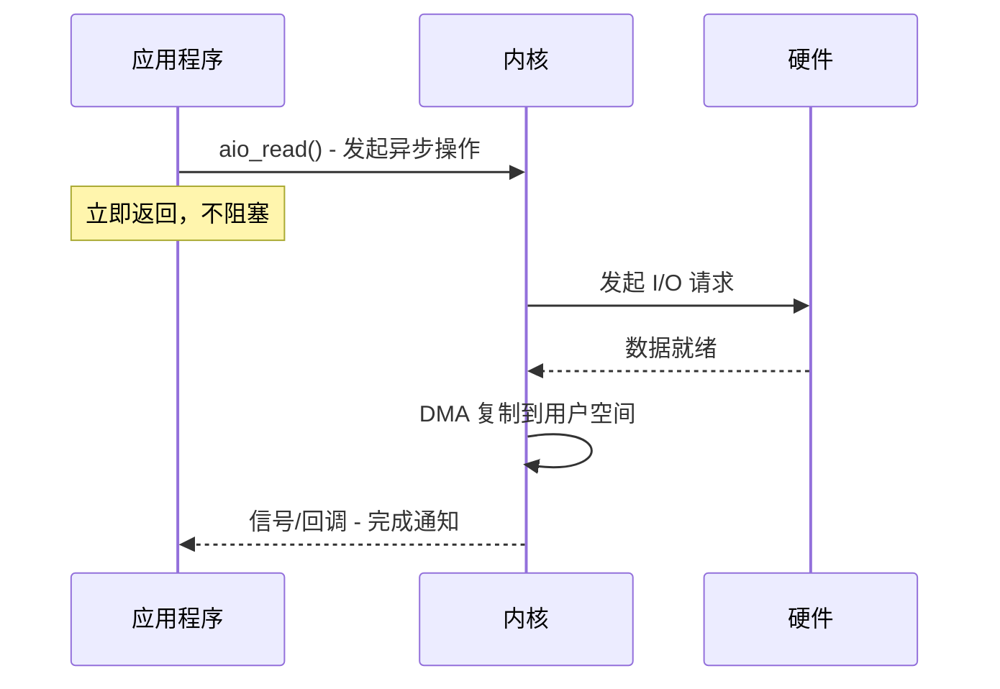

# 异步 I/O（AIO）

异步 I/O（AIO）是 I/O 模型中最高级的形态：应用程序发起操作后立即返回，内核完成全部工作后通知应用程序。整个过程中，应用程序完全不阻塞。

但现实总是比理想骨感。Java 的 AIO 在 Linux 上的实现并不完美，理解这一点是正确使用 AIO 的前提。

## Java NIO.2 异步通道

Java 7 引入了 NIO.2（也称为 AIO），提供了异步文件通道和异步 socket 通道。

### AsynchronousServerSocketChannel

```java title="AIO 服务端"
public class AioServer {
    public static void main(String[] args) throws IOException {
        AsynchronousServerSocketChannel serverChannel =
            AsynchronousServerSocketChannel.open();

        serverChannel.bind(new InetSocketAddress(8080));
        System.out.println("AIO 服务器启动，监听端口 8080...");

        // 异步接受连接
        serverChannel.accept(null, new CompletionHandler<AsynchronousSocketChannel, Void>() {
            @Override
            public void completed(AsynchronousSocketChannel client, Void attachment) {
                // 继续接受下一个连接
                serverChannel.accept(null, this);

                // 处理客户端数据
                ByteBuffer buffer = ByteBuffer.allocate(1024);
                client.read(buffer, buffer, new CompletionHandler<Integer, ByteBuffer>() {
                    @Override
                    public void completed(Integer result, ByteBuffer attachment) {
                        if (result > 0) {
                            buffer.flip();
                            System.out.println("收到: " + new String(buffer.array(), 0, buffer.limit()));

                            // 响应
                            ByteBuffer response = ByteBuffer.wrap("ACK".getBytes());
                            client.write(response, null, new CompletionHandler<Integer, Void>() {
                                @Override
                                public void completed(Integer result, Void attachment) {
                                    System.out.println("响应已发送");
                                }

                                @Override
                                public void failed(Throwable exc, Void attachment) {
                                    exc.printStackTrace();
                                }
                            });
                        }
                    }

                    @Override
                    public void failed(Throwable exc, ByteBuffer attachment) {
                        exc.printStackTrace();
                    }
                });
            }

            @Override
            public void failed(Throwable exc, Void attachment) {
                exc.printStackTrace();
            }
        });

        // 主线程需要保持运行
        System.in.read();
    }
}
```

### 异步 I/O 的两种使用方式

Java AIO 提供了两种使用异步 I/O 的方式：

**方式一：CompletionHandler 回调**

```java
channel.read(buffer, attachment, new CompletionHandler<Integer, Attachment>() {
    @Override
    public void completed(Integer result, Attachment attachment) {
        // 读取成功，result 是读取的字节数
    }

    @Override
    public void failed(Throwable exc, Attachment attachment) {
        // 读取失败
    }
});
```

**方式二：Future**

```java
Future<Integer> future = channel.read(buffer);

while (!future.isDone()) {
    // 做其他事情
}

Integer result = future.get();  // 阻塞直到完成
```

## AIO 的工作原理



应用程序调用 `aio_read()` 后立即返回，内核在后台处理：等待数据就绪、复制数据到用户空间、完成时通知应用程序。

## AIO vs NIO

| 特性 | NIO | AIO |
| --- | --- | --- |
| API 风格 | 事件循环（Reactor） | 回调/ Future（Proactor） |
| 线程模型 | 需要 Selector 轮询 | 回调驱动 |
| 阻塞 | select() 阻塞 | 不阻塞 |
| 编程复杂度 | 中等 | 较高（回调地狱） |
| Linux 底层实现 | epoll | epoll（实际上仍是同步非阻塞） |

## AIO 的真相：Linux 上的"伪异步"

这里有一个重要的事实需要说明：**Linux 上的 Java AIO 底层仍然使用 epoll**，并不是真正的异步 I/O。

```
Java AIO (Linux)
    ↓
AsynchronousChannelGroup
    ↓
epoll (实际是同步非阻塞)
```

Java AIO 的异步实际上是通过线程池模拟的：当 epoll 通知事件就绪后，由线程池中的线程完成 I/O 操作，然后调用回调函数。

**真正的异步 I/O**（类似 Windows IOCP）在 Linux 上有但不成熟：
- Linux 2.6 引入了 `aio_*` 系统调用
- 但只支持文件 I/O，不支持网络 I/O
- 实现不完善，性能不如 epoll

所以，在 Linux 上：
- **Java AIO ≈ NIO + 线程池**
- epoll + 线程池通常比 Linux AIO 性能更好

这就是为什么大多数高性能框架（Netty、Mina）选择 NIO 而不是 AIO。

## AIO 的适用场景

尽管 Linux 上 AIO 并不完美，在以下场景仍可考虑使用：

**Windows 应用**。Windows 的 IOCP 是真正的异步 I/O，Java AIO 在 Windows 上能发挥最大价值。

**异步文件操作**。Java AIO 的文件通道（`AsynchronousFileChannel`）在某些场景下比 NIO 的 `FileChannel` 更方便。

**简化并发模型**。回调模型虽然有回调地狱问题，但对于 IO 密集型任务，它比 Selector 的事件循环更容易理解。

## AIO 编程的注意事项

### 回调地狱

嵌套的 CompletionHandler 会导致回调地狱：

```java
// 回调地狱示例
channel.read(buffer, null, new CompletionHandler<Integer, Void>() {
    @Override
    public void completed(Integer result, Void attachment) {
        // 处理完成后又要写，写完又要读...
        channel.write(response, null, new CompletionHandler<Integer, Void>() {
            @Override
            public void completed(Integer result, Void attachment) {
                // 又要读...
            }
        });
    }
});
```

**解决方案**：使用 `java.util.concurrent.CompletableFuture` 组合异步操作：

```java
CompletableFuture.supplyAsync(() -> readData())
    .thenCompose(data -> processData(data))
    .thenCompose(result -> writeResult(result))
    .exceptionally(ex -> handleError(ex));
```

### 异常处理

AIO 的异常在 CompletionHandler 的 `failed` 方法中处理：

```java
new CompletionHandler<Integer, Attachment>() {
    @Override
    public void completed(Integer result, Attachment attachment) {
        // 成功处理
    }

    @Override
    public void failed(Throwable exc, Attachment attachment) {
        // exc 包含异常信息
        exc.printStackTrace();
        // 关闭资源
        closeChannel();
    }
};
```

### 资源管理

AIO 的资源必须显式关闭：

```java
AsynchronousServerSocketChannel serverChannel = null;
AsynchronousSocketChannel clientChannel = null;

try {
    serverChannel = AsynchronousServerSocketChannel.open();
    // ... 使用 ...
} finally {
    if (serverChannel != null) serverChannel.close();
    if (clientChannel != null) clientChannel.close();
}
```

## 性能对比：AIO vs NIO

理论上的 AIO 应该比 NIO 更好，因为减少了用户态到内核态的切换。但实际上：

| 指标 | NIO | AIO（Linux） | AIO（Windows） |
| --- | --- | --- | --- |
| 吞吐量 | 高 | 略低于 NIO | 高 |
| 延迟 | 低 | 略高于 NIO | 低 |
| 资源占用 | 低 | 线程池额外开销 | 低 |
| 成熟度 | 高 | 中等 | 高 |
| 生态 | 丰富 | 一般 | 一般 |

## 本章小结

AIO 是 I/O 模型的"终极形态"，但实际落地需要考虑平台差异：
- **Linux 上**：Java AIO 底层使用 epoll，并非真正的异步，性能优势不明显
- **Windows 上**：Java AIO 使用 IOCP，是真正的异步，性能优秀
- **实际选择**：大多数场景下 NIO（配合 Netty）仍是最佳选择

对于 Windows 服务或有特殊需求的场景，AIO 的回调模型可能更符合直觉，可以尝试使用。

## 延伸思考

既然 Linux 上的 AIO 不是真正的异步，那"异步 I/O"这个名称是否恰当？

严格来说，Linux 上的 Java AIO 是"异步 API + 同步实现"。它提供了异步的 API 接口（CompletionHandler、Future），但底层仍然依赖 epoll 的同步通知机制。

这种设计有其合理性：
- API 的异步性（不阻塞调用线程）
- 底层实现的成熟稳定（epoll 经过多年验证）
- 跨平台一致性（Linux/macOS/Windows 都有类似实现）

理解这一点，就不会对 AIO 的性能有不切实际的期望。
