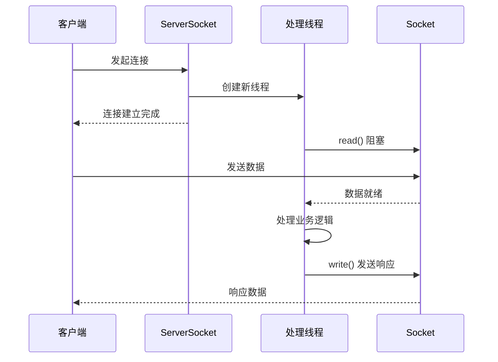

# 阻塞 I/O（BIO）

假设你开了一家电话接线中心。BIO 的做法是：每来一个电话，就分配一个接线员专门守在电话旁。电话没响的时候，接线员只能干等。如果同时有 1000 个电话打进來，你就需要 1000 个接线员——哪怕大部分时间他们都在闲着。

这就是 BIO 的核心思想：**一个线程处理一个连接**。

## 传统 socket 编程

Java 的 `java.io` 包提供了BIO 编程所需的所有组件。`ServerSocket` 用于监听端口，`Socket` 用于与客户端通信。

```java title="BioServer.java"
public class BioServer {
    public static void main(String[] args) throws IOException {
        ServerSocket serverSocket = new ServerSocket(8080);
        System.out.println("服务器启动，监听端口 8080...");

        while (true) {
            // accept() 阻塞等待客户端连接
            Socket clientSocket = serverSocket.accept();
            System.out.println("收到新连接: " + clientSocket.getRemoteSocketAddress());

            // 为每个连接创建新线程处理
            new Thread(() -> handleClient(clientSocket)).start();
        }
    }

    private static void handleClient(Socket clientSocket) {
        try {
            InputStream in = clientSocket.getInputStream();
            OutputStream out = clientSocket.getOutputStream();
            byte[] buffer = new byte[1024];

            // read() 阻塞等待数据
            int len;
            while ((len = in.read(buffer)) != -1) {
                // 处理数据
                String message = new String(buffer, 0, len);
                System.out.println("收到消息: " + message);

                // 响应客户端
                out.write(("响应: " + message).getBytes());
                out.flush();
            }
        } catch (IOException e) {
            e.printStackTrace();
        } finally {
            try {
                clientSocket.close();
            } catch (IOException e) {
                e.printStackTrace();
            }
        }
    }
}
```

这段代码展示了 BIO 服务器的典型模式：`accept()` 阻塞等待连接，每来一个连接就新建一个线程处理。

## BIO 的工作流程



从流程可以看出：
- `ServerSocket.accept()` 在没有连接时会阻塞
- `InputStream.read()` 在没有数据时会阻塞
- 每个连接需要一个独立线程

## BIO 的问题：C10K 问题

BIO 的问题在大规模场景下暴露无遗：

**线程开销巨大**。每个线程默认栈大小约 1MB（`jvm -Xss`），1 万个线程就是 10GB 内存。而且线程的创建、切换、销毁都需要消耗系统资源。

**线程切换成本高**。操作系统调度线程时，需要保存和恢复线程上下文（寄存器、栈指针等）。当线程数超过 CPU 核心数时，大量时间浪费在线程切换上。

**无法应对 C10K 问题**。C10K 问题（10K connections）是指单机同时处理 1 万个并发连接。假设每个连接只需要 1KB 栈内存，1 万个连接也需要 10GB 内存，这还不包括线程调度开销。

| 指标 | 1 万连接 | 10 万连接 | 100 万连接 |
| --- | --- | --- | --- |
| 线程内存（1MB/线程） | 10GB | 100GB | 1TB |
| CPU 切换开销 | 高 | 极高 | 不可行 |
| 响应延迟 | 中等 | 高 | 极高 |

## BIO 的适用场景

BIO 并非一无是处。在某些场景下，它反而是最简单的选择：

**低并发场景**。如果系统并发连接数不超过几百个，BIO 的编程复杂度远低于 NIO。一个请求一个线程的模型非常直观，代码容易理解和维护。

**长连接场景**。如果每个连接的业务处理时间很长（如文件上传下载、数据库查询），线程大部分时间在等待 I/O，而不是空转，那么线程利用率其实不低。

**快速开发场景**。对于原型开发、内部工具、临时服务，BIO 的快速实现能力是优势。等业务稳定后，再考虑迁移到 NIO。

```java title="简单的 BIO 客户端"
public class BioClient {
    public static void main(String[] args) throws IOException {
        Socket socket = new Socket("localhost", 8080);
        PrintWriter out = new PrintWriter(socket.getOutputStream(), true);
        BufferedReader in = new BufferedReader(
            new InputStreamReader(socket.getInputStream())
        );

        // 发送请求
        out.println("Hello Server");

        // 接收响应
        String response = in.readLine();
        System.out.println("服务器响应: " + response);

        socket.close();
    }
}
```

## BIO 与 NIO 的对比

| 特性 | BIO | NIO |
| --- | --- | --- |
| 线程模型 | 一连接一线程 | 多路复用（单线程管理多连接） |
| 线程数量 | 与连接数成正比 | 与 CPU 核心数相关，通常固定 |
| 内存占用 | 1MB × 线程数 | 固定大小（KB 级别） |
| 适用并发 | < 1000 | > 10000 |
| 编程复杂度 | 简单 | 复杂（需要处理半包、状态机等） |

## 线程池优化：有限的线程，无限的连接

有一种 BIO 的改进方案：使用线程池限制线程数量。这不是真正的多路复用，但可以在一定程度上缓解问题。

```java title="线程池优化版 BIO"
ExecutorService executor = Executors.newFixedThreadPool(100);

while (true) {
    Socket clientSocket = serverSocket.accept();
    executor.submit(() -> handleClient(clientSocket));
}
```

这种方案的问题：如果 1000 个连接同时等待数据，线程池只有 100 个线程，其他 900 个连接只能等待。这会导致请求排队，响应时间变长。

## 本章小结

BIO 的核心问题是：**线程是重量级资源，不能与连接数成正比**。当连接数达到数千甚至上万时，线程开销会成为系统的瓶颈。

真正解决问题的方案是 I/O 多路复用——让单个线程管理多个连接，避免为每个连接分配一个线程。下一章我们将学习 NIO 如何实现这一点。

## 延伸思考

如果 BIO 有这么多问题，为什么早期的服务器（如 Tomcat 默认模式）都使用它？

答案很简单：**早期的互联网并发量不高，BIO 的简单性比性能更重要**。而且当时的硬件配置（单核 CPU、几百 MB 内存）也限制了并发连接数。

技术选型永远是权衡。当业务还在早期阶段时，开发效率和可维护性往往比极致性能更重要。等业务发展到一定规模，再考虑迁移到更高效的 I/O 模型。
