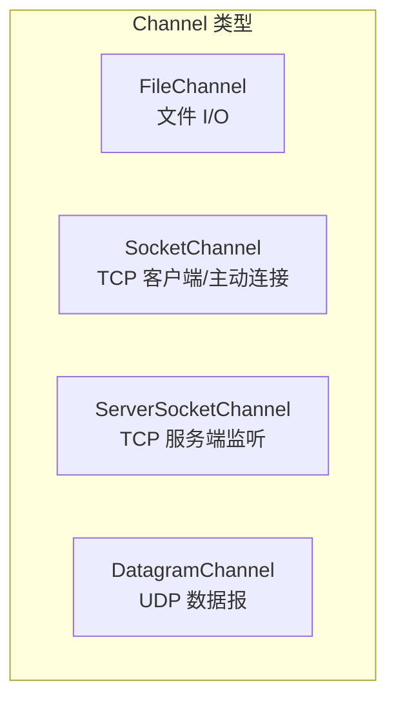
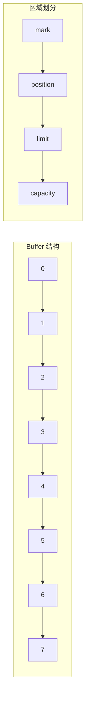
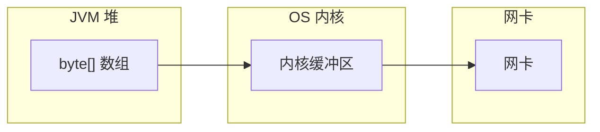
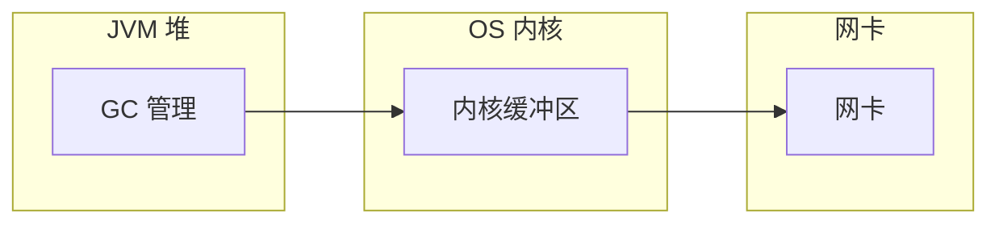

# Channel 与 Buffer 详解

NIO 的核心是 Channel 和 Buffer。Channel 是数据流动的管道，Buffer 是数据的临时容器。理解它们的细节，是掌握 NIO 的基础。

## Channel 类型

Java NIO 提供了多种 Channel 实现，每种适用于不同的场景：



### FileChannel：文件 I/O

FileChannel 是与文件交互的通道，只能通过 `FileInputStream`、`FileOutputStream` 或 `RandomAccessFile` 获取。

```java title="FileChannel 操作示例"
RandomAccessFile file = new RandomAccessFile("data.txt", "rw");
FileChannel channel = file.getChannel();

// 写入数据
ByteBuffer writeBuffer = ByteBuffer.allocate(1024);
writeBuffer.put("Hello NIO".getBytes());
writeBuffer.flip();
channel.write(writeBuffer);

// 读取数据
ByteBuffer readBuffer = ByteBuffer.allocate(1024);
channel.read(readBuffer);
readBuffer.flip();
byte[] data = new byte[readBuffer.remaining()];
readBuffer.get(data);
System.out.println(new String(data));

// 强制刷新到磁盘
channel.force(true);

file.close();
```

FileChannel 的特点是**顺序读写，适合大文件**。它支持 `position()` 定位、`size()` 获取文件大小、`truncate()` 截断等操作。

### SocketChannel：TCP 通信

SocketChannel 用于 TCP 客户端连接，可以工作在阻塞或非阻塞模式。

```java title="SocketChannel 客户端"
SocketChannel channel = SocketChannel.open();
channel.connect(new InetSocketAddress("localhost", 8080));
channel.configureBlocking(false); // 设置非阻塞

// 写入数据
ByteBuffer buffer = ByteBuffer.allocate(1024);
buffer.put("Hello Server".getBytes());
buffer.flip();
channel.write(buffer);

// 读取数据
buffer.clear();
channel.read(buffer);
buffer.flip();
System.out.println(new String(buffer.array(), 0, buffer.limit()));

channel.close();
```

### ServerSocketChannel：TCP 服务端

ServerSocketChannel 用于 TCP 服务端，监听端口并接受连接。

```java
ServerSocketChannel serverChannel = ServerSocketChannel.open();
serverChannel.socket().bind(new InetSocketAddress(8080));
serverChannel.configureBlocking(false); // 必须设置为非阻塞

while (true) {
    SocketChannel client = serverChannel.accept();
    if (client != null) {
        // 处理新连接
        handleClient(client);
    }
}
```

注意：`accept()` 在非阻塞模式下，如果没有新连接，会立即返回 `null`。

### DatagramChannel：UDP 通信

DatagramChannel 用于 UDP 协议，支持无连接的数据发送和接收。

```java title="DatagramChannel UDP"
DatagramChannel channel = DatagramChannel.open();
channel.bind(new InetSocketAddress(8080));

ByteBuffer buffer = ByteBuffer.allocate(1024);
buffer.put("Hello".getBytes());
buffer.flip();

// 发送数据
channel.send(buffer, new InetSocketAddress("localhost", 8081));

// 接收数据
buffer.clear();
SocketAddress address = channel.receive(buffer);
System.out.println("收到来自 " + address + " 的数据");
```

## Buffer 类型

Java NIO 提供了多种 Buffer 实现，对应不同的数据类型：

| Buffer 类型 | 说明 |
| --- | --- |
| `ByteBuffer` | 最常用，可存储字节数据 |
| `CharBuffer` | 存储字符 |
| `ShortBuffer` | 存储短整型 |
| `IntBuffer` | 存储整型 |
| `LongBuffer` | 存储长整型 |
| `FloatBuffer` | 存储浮点型 |
| `DoubleBuffer` | 存储双精度浮点型 |

最常用的是 `ByteBuffer`，因为大多数 I/O 操作都是字节级别的。

## Buffer 的四个核心属性

理解 Buffer 的关键是理解四个属性：**capacity**、**position**、**limit**、**mark**。



### capacity（容量）

Buffer 的固定大小。一旦创建就不能改变。分配 1024 字节的 Buffer，容量就是 1024 字节。

### position（位置）

下一个要读或写的索引位置。初始值为 0，写入数据后 position 前移。

### limit（限制）

第一个不能读或写的索引位置。写模式下，limit 等于 capacity；读模式下，limit 等于已写入的数据量。

### mark（标记）

可选属性，用于记录某个 position 值。调用 `mark()` 保存当前位置，调用 `reset()` 恢复到标记位置。

## Buffer 的读写操作

```java title="Buffer 读写流程"
ByteBuffer buffer = ByteBuffer.allocate(10);

// === 写入阶段 ===
System.out.println("初始状态:");
System.out.println("  position=" + buffer.position());
System.out.println("  limit=" + buffer.limit());
System.out.println("  capacity=" + buffer.capacity());
// position=0, limit=10, capacity=10

// 写入 5 个字节
buffer.put((byte) 1);
buffer.put((byte) 2);
buffer.put((byte) 3);
buffer.put((byte) 4);
buffer.put((byte) 5);
System.out.println("写入 5 字节后:");
System.out.println("  position=" + buffer.position());
// position=5, limit=10, capacity=10

// === 切换到读模式 ===
buffer.flip();
System.out.println("flip() 后:");
System.out.println("  position=" + buffer.position());
System.out.println("  limit=" + buffer.limit());
// position=0, limit=5

// === 读取阶段 ===
byte b = buffer.get(); // 读取第一个字节，position 前移到 1
System.out.println("读取 1 字节后, position=" + buffer.position());

// === 重置缓冲区 ===
buffer.clear();  // position=0, limit=capacity
// 或
buffer.compact(); // 只清除已读部分，保留未读部分
```

### flip() 的作用

`flip()` 是切换读写模式的关键操作：

```java
public final Buffer flip() {
    limit = position;  // limit 设置为 position
    position = 0;     // position 重置为 0
    mark = -1;         // 清除 mark
    return this;
}
```

flip 之后，Buffer 从写模式切换到读模式：limit 限制了可读数据的范围，position 回到起始位置。

### compact() vs clear()

`clear()` 清空整个 Buffer，position=0，limit=capacity。适用于完全重新开始读写。

`compact()` 只清除已读部分，把未读数据移到 Buffer 开头，position 设置为未读数据之后。适用于**一边处理已读数据，一边继续写入新数据**的场景。

## 直接内存 vs 堆内存

Buffer 有两种分配方式：

### 堆内存（Heap ByteBuffer）

```java
ByteBuffer buffer = ByteBuffer.allocate(1024); // 堆内存
```

在 JVM 堆上分配，由 GC 管理。分配速度快，但数据读写需要经过内核缓冲区中转。



### 直接内存（Direct ByteBuffer）

```java
ByteBuffer buffer = ByteBuffer.allocateDirect(1024); // 直接内存
```

在堆外分配，不受 GC 管理。数据可以直接在内核和网卡之间传输，减少一次内存复制。



### 性能对比

| 特性 | 堆内存 | 直接内存 |
| --- | --- | --- |
| 分配速度 | 快（GC 分配） | 慢（系统调用） |
| GC 影响 | 受 GC 影响 | 不受 GC 影响 |
| 读写性能 | 需要额外复制 | 零拷贝可能 |
| 内存占用 | 受 `-Xmx` 限制 | 受 `-XX:MaxDirectMemorySize` 限制 |
| 适用场景 | 小数据、短期使用 | 大数据、长期使用、高性能 |

**实战经验**：Netty 默认使用直接内存的池化 ByteBuf，既避免了 GC 开销，又能高效利用零拷贝。

## Buffer 的批量操作

```java title="批量读写"
FileChannel inChannel = new FileInputStream("input.txt").getChannel();
FileChannel outChannel = new FileOutputStream("output.txt").getChannel();

ByteBuffer buffer = ByteBuffer.allocate(8192);

while (inChannel.read(buffer) != -1) {
    buffer.flip();
    outChannel.write(buffer);  // 写入直到 buffer 空
    buffer.clear();            // 清空，准备下一轮读取
}

inChannel.close();
outChannel.close();
```

### transferTo / transferFrom：高效文件传输

FileChannel 提供了直接在内核空间复制数据的方法：

```java title="高效文件复制"
FileChannel from = new FileInputStream("source.txt").getChannel();
FileChannel to = new FileOutputStream("dest.txt").getChannel();

// 直接在内核空间复制，不需要 Java 代码参与
long bytesTransferred = from.transferTo(0, from.size(), to);
System.out.println("传输了 " + bytesTransferred + " 字节");
```

`transferTo()` 底层会尝试使用 sendfile 系统调用，实现零拷贝。

## 本章小结

Channel 和 Buffer 是 NIO 的核心抽象：
- Channel 是数据流动的通道，有 FileChannel、SocketChannel、ServerSocketChannel、DatagramChannel 四种类型
- Buffer 是数据的临时容器，理解 position/limit/capacity 三个属性是掌握 Buffer 的关键
- 直接内存比堆内存在高性能场景下更有优势，但需要手动管理内存

下一章我们将学习 Selector 多路复用器的原理，理解 NIO 如何实现单线程管理万级连接。

## 延伸思考

为什么 Buffer 要设计 flip() 这个看似反直觉的操作？

根本原因是 Buffer 同时服务于读写两种用途，而读写对 position 和 limit 的含义不同：
- 写模式：position 表示已写入位置，limit = capacity
- 读模式：position 表示已读位置，limit = 有效数据末尾

flip() 就是切换这两种模式的桥梁。这个设计虽然增加了学习成本，但保持了 API 的一致性——读写都使用同一套方法。
