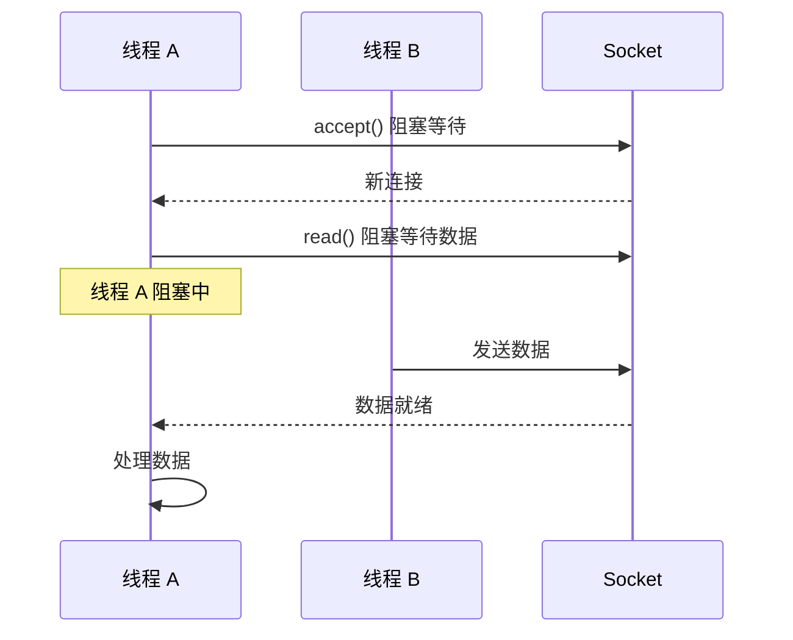
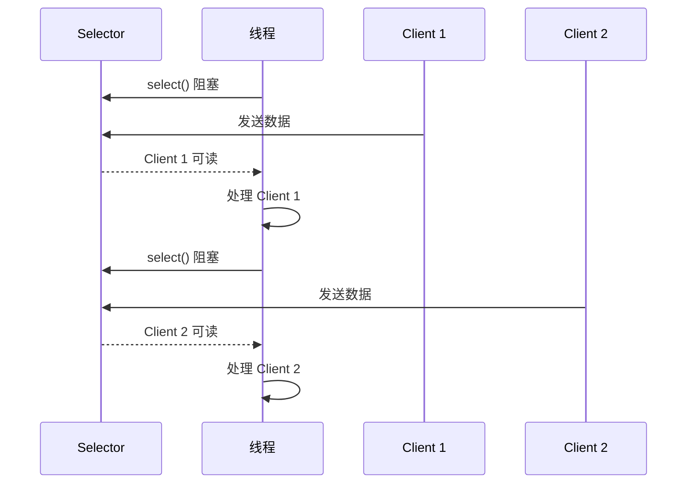
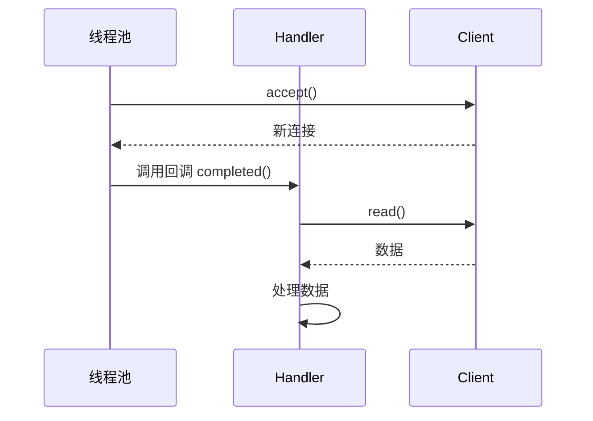
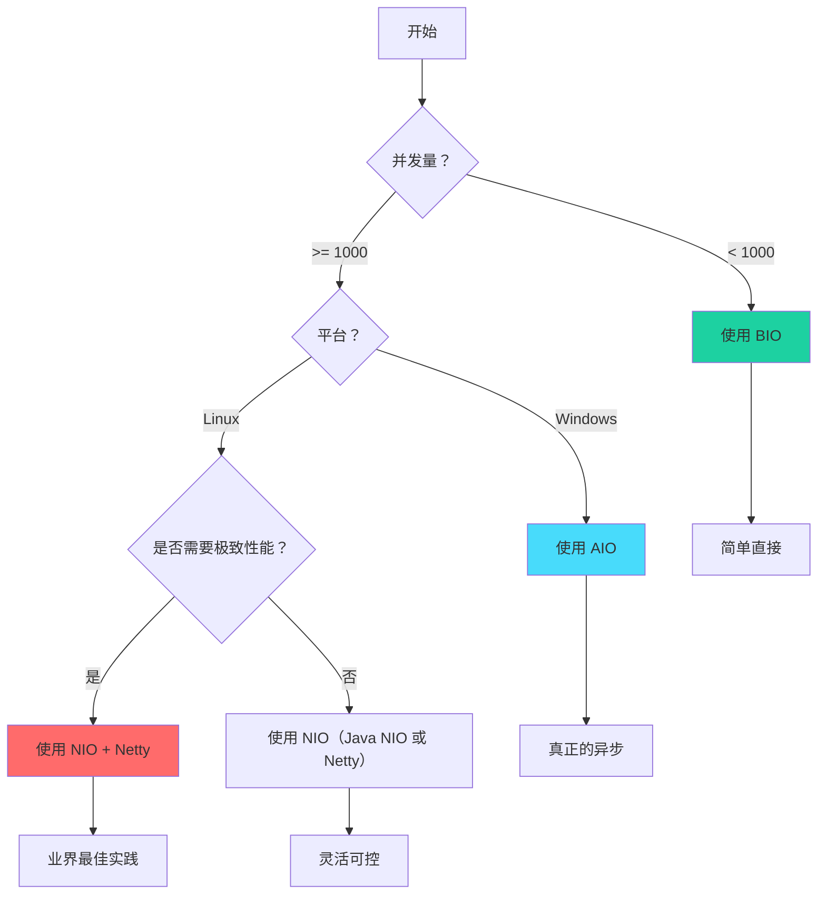

# BIO/NIO/AIO 对比

三种 I/O 模型各有优劣，选择哪一个取决于具体的业务场景和技术栈。理解它们的差异，是做出正确选择的基础。

## 三种模型的核心对比

| 特性 | BIO | NIO | AIO |
| --- | --- | --- | --- |
| **引入版本** | Java 1.0 | Java 1.4 | Java 7 |
| **核心抽象** | Stream（流） | Channel + Buffer + Selector | AsynchronousChannel |
| **同步/异步** | 同步阻塞 | 同步非阻塞 | 异步 |
| **线程模型** | 一连接一线程 | 单线程 + Selector | 回调/ Future |
| **并发能力** | 低（受线程数限制） | 高（单线程可管理万级连接） | 高 |
| **API 复杂度** | 简单 | 较复杂 | 中等 |
| **适用场景** | 低并发、简单协议 | 高并发、快速响应 | 高并发、追求极致性能 |
| **Linux 底层** | socket 阻塞 | epoll | epoll（实际是同步非阻塞） |
| **半包处理** | 无（流式无边界） | 需要手动处理 | 需要手动处理 |
| **代码示例量** | 50 行 | 100 行 | 80 行 |

## 工作模式对比

### BIO：同步阻塞模型



每个连接一个线程，线程在 I/O 操作时阻塞。

### NIO：同步非阻塞 + 多路复用



单线程管理多个连接，通过 Selector 等待就绪事件。

### AIO：异步回调模型



应用程序发起操作后立即返回，通过回调处理结果。

## 线程开销对比

假设同时处理 1 万个并发连接：

| 指标 | BIO | NIO | AIO |
| --- | --- | --- | --- |
| 线程数 | 10000 | 1~N（N=CPU 核心数） | 线程池大小 |
| 内存占用 | ~10GB（1MB × 10000） | ~10MB | ~10MB + 线程池 |
| 上下文切换 | 频繁 | 很少 | 很少 |
| CPU 利用率 | 低（大量阻塞） | 高 | 高 |

## 适用场景分析

### BIO 适用场景

**低并发系统**。如果系统并发连接数不超过几百个，BIO 的简单性是优势。一个请求一个线程的模型非常直观，代码容易理解和维护。

**计算密集型任务**。如果每个请求的业务处理时间很长（如复杂计算、数据库查询），线程大部分时间在处理业务而不是等待 I/O，线程利用率其实不低。

**快速开发阶段**。对于原型开发、内部工具、临时服务，BIO 的快速实现能力是优势。等业务稳定后再考虑迁移。

```java title="BIO 适用场景"
public class SimpleHttpServer {
    public static void main(String[] args) throws IOException {
        ServerSocket server = new ServerSocket(8080);
        System.out.println("简单 HTTP 服务器启动");

        while (true) {
            Socket client = server.accept();
            // 每个连接一个线程处理
            new Thread(() -> handleRequest(client)).start();
        }
    }
}
```

### NIO 适用场景

**高并发系统**。需要支持数万甚至数十万并发连接的场景。Netty 基于 NIO，是高性能网络应用的事实标准。

**高吞吐量系统**。如消息队列、RPC 框架、游戏服务器等，需要高效处理大量短连接或长连接。

**延迟敏感系统**。需要快速响应请求，不能容忍线程阻塞导致的延迟。

```java title="NIO 适用场景"
public class HighPerformanceServer {
    public static void main(String[] args) throws IOException {
        EventLoopGroup bossGroup = new NioEventLoopGroup(1);
        EventLoopGroup workerGroup = new NioEventLoopGroup();

        ServerBootstrap bootstrap = new ServerBootstrap();
        bootstrap.group(bossGroup, workerGroup)
            .channel(NioServerSocketChannel.class)
            .childHandler(new ChannelInitializer<SocketChannel>() {
                @Override
                protected void initChannel(SocketChannel ch) {
                    ch.pipeline().addLast(
                        new HttpServerCodec(),
                        new HttpObjectAggregator(65536),
                        new BusinessHandler()
                    );
                }
            });

        ChannelFuture f = bootstrap.bind(8080).sync();
        System.out.println("高性能服务器启动");
    }
}
```

### AIO 适用场景

**Windows 环境**。Windows 的 IOCP 是真正的异步 I/O，Java AIO 在 Windows 上能发挥最大价值。

**异步优先的系统**。如果业务逻辑本身适合异步处理（如事件溯源、CQRS），AIO 的模型更匹配。

**已有 AIO 经验的团队**。如果团队对 AIO 的编程模型更熟悉，正确使用 AIO 也能达到良好性能。

## 选型决策树



## 常见误区

### 误区一：NIO 一定比 BIO 快

不一定。对于低并发场景（如 < 100 连接），BIO 可能更快，因为 NIO 的 Selector 轮询有固定开销，而 BIO 的阻塞模式没有这个开销。

### 误区二：AIO 一定比 NIO 快

不一定。Linux 上的 Java AIO 底层使用 epoll，本质上还是同步非阻塞。而且 AIO 的回调模型增加了编程复杂度，可能导致更多 bug。

### 误区三：直接使用 NIO 而不用框架

不推荐。直接使用 Java NIO 需要处理大量细节：半包、粘包、心跳、状态管理等。Netty 等框架已经解决了这些问题。

## 实战建议

**从 BIO 开始**。如果系统并发量不高，先用 BIO 实现。简单、可靠、易于维护。

**迁移到 Netty**。当系统面临性能压力时，迁移到 Netty。Netty 基于 NIO，API 友好，性能优秀，生态成熟。

**AIO 谨慎使用**。除非有特殊需求（如 Windows 环境、团队对 AIO 经验丰富），否则不建议使用 AIO。

## 本章小结

| 场景 | 推荐方案 |
| --- | --- |
| 低并发、简单业务 | BIO |
| 高并发、Linux 环境 | NIO + Netty |
| 高并发、Windows 环境 | AIO 或 NIO + Netty |
| 消息队列、RPC 框架 | NIO + Netty |
| 快速开发、原型验证 | BIO |

**记住**：技术选型永远是权衡。不要为了"先进"而选择复杂方案，选择最适合当前业务阶段的方案。

## 延伸思考

既然 NIO + Netty 是最佳选择，为什么还有人在用 BIO？

答案可能出乎意料：**因为大部分系统的并发量没那么高**。很多企业内部系统、后台管理工具、数据处理任务，并发连接数可能只有几十或几百。对于这些场景，BIO 的简单性是真正的优势。

技术选型应该基于实际需求，而不是追求"最先进"。一个能用 BIO 简单解决的系统，非要用 Netty 重写，是对工程资源的浪费。
