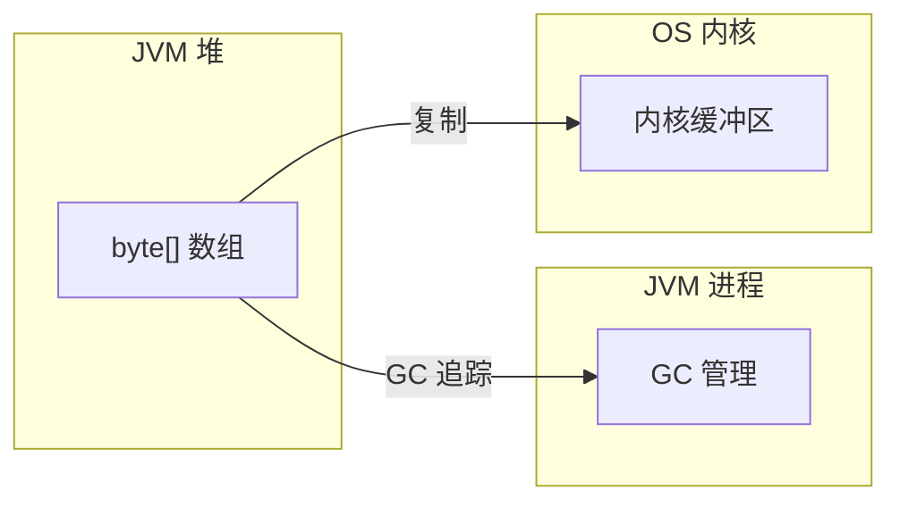
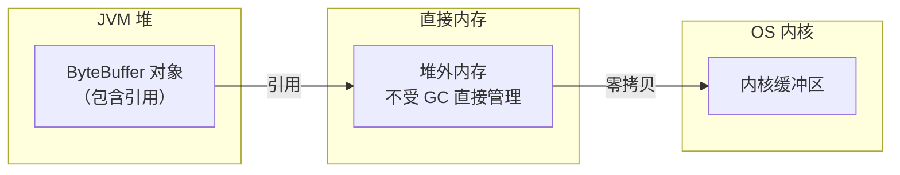
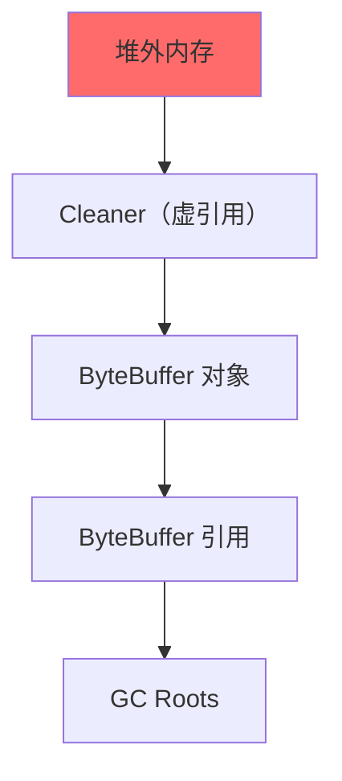

# 直接内存

JVM 堆内存和外存之间的数据交换需要通过内核缓冲区中转。直接内存（堆外内存）可以跳过这一步，减少一次数据复制，从而提升 I/O 性能。

## 堆内存 vs 直接内存

### 堆内存

```java
ByteBuffer buffer = ByteBuffer.allocate(1024);  // 堆内存
```

数据存储在 JVM 堆上，GC 管理生命周期：



### 直接内存

```java
ByteBuffer buffer = ByteBuffer.allocateDirect(1024);  // 直接内存
```

数据存储在堆外，由操作系统管理：



## 性能对比

| 操作 | 堆内存 | 直接内存 |
| --- | --- | --- |
| 分配速度 | 快（GC 分配） | 慢（系统调用） |
| I/O 读写 | 额外一次复制 | 直接读写 |
| GC 影响 | 受 GC 影响 | 不受 GC 影响 |
| 内存占用 | 受 `-Xmx` 限制 | 受 `-XX:MaxDirectMemorySize` 限制 |

```java title="性能测试"
public class DirectMemoryBenchmark {

    @Benchmark
    public void heapMemoryIO(Blackhole bh) throws Exception {
        ByteBuffer buffer = ByteBuffer.allocate(BUFFER_SIZE);
        FileChannel out = new FileOutputStream("/tmp/test").getChannel();

        for (int i = 0; i < ITERATIONS; i++) {
            buffer.clear();
            out.write(buffer);
        }
        out.close();
        bh.consume(buffer);
    }

    @Benchmark
    public void directMemoryIO(Blackhole bh) throws Exception {
        ByteBuffer buffer = ByteBuffer.allocateDirect(BUFFER_SIZE);
        FileChannel out = new FileOutputStream("/tmp/test").getChannel();

        for (int i = 0; i < ITERATIONS; i++) {
            buffer.clear();
            out.write(buffer);
        }
        out.close();
        bh.consume(buffer);
    }
}
```

测试结果显示：直接内存在文件 I/O 场景下有 10-30% 的性能提升。

## 直接内存的分配

### ByteBuffer.allocateDirect

```java
// 分配直接内存
ByteBuffer buffer = ByteBuffer.allocateDirect(1024);

// 检查是否直接内存
if (buffer.isDirect()) {
    System.out.println("这是直接内存");
}
```

### Netty 的内存池

Netty 使用池化的直接内存，减少分配开销：

```java
// 从池中分配
ByteBuf buf = ctx.alloc().directBuffer(1024);

try {
    // 使用
    buf.writeBytes(data);
} finally {
    // 释放回池
    buf.release();
}
```

## 直接内存的回收

### GC 的影响

直接内存不受 GC 直接管理，但 JVM 会跟踪直接内存的使用。当 GC 回收了 ByteBuffer 对象后，底层的堆外内存会被释放。



JVM 使用 `PhantomReference`（虚引用）来跟踪 ByteBuffer 对象。当对象被 GC 时，虚引用被加入引用队列，JVM 启动的守护线程会清理堆外内存。

### MaxDirectMemorySize

```bash
# 设置最大直接内存
java -XX:MaxDirectMemorySize=512m

# 默认值：与 -Xmx 相同
```

### 手动清理

```java
// 使用反射调用 Cleaner
ByteBuffer buffer = ByteBuffer.allocateDirect(1024);
Field cleanerField = buffer.getClass().getDeclaredField("cleaner");
cleanerField.setAccessible(true);
Cleaner cleaner = (Cleaner) cleanerField.get(buffer);
cleaner.clean();  // 立即清理
```

## 直接内存溢出

直接内存泄漏会导致 `OutOfMemoryError: Direct buffer memory`：

### 常见原因

```java title="泄漏场景：没有释放 ByteBuf"
public ByteBuffer allocateBuffer() {
    // 分配了但没有释放
    return ByteBuffer.allocateDirect(1024);
}

// 调用方
ByteBuffer buf = allocateBuffer();
// 如果没有其他地方引用 buf，且没有清理
// 堆外内存就会泄漏
```

### Netty 的泄漏检测

Netty 提供了内存泄漏检测：

```java title="Netty 泄漏检测"
ResourceLeakDetector<ByteBuf> detector =
    ResourceLeakDetectorFactory.instance()
        .newResourceLeakDetector(ByteBuf.class);

// 检测级别：DISABLED, SIMPLE, ADVANCED, PARANOID
// 在启动时设置
-Dio.netty.leakDetection.targetRecords=SIMPLE
```

```java title="处理泄漏"
public class LeakyHandler extends ChannelInboundHandlerAdapter {

    @Override
    public void channelRead(ChannelHandlerContext ctx, Object msg) {
        if (msg instanceof ByteBuf) {
            ByteBuf buf = (ByteBuf) msg;
            // 忘记 release 会触发泄漏警告
            // buf.release();  // 正确做法
        }
    }
}
```

## 直接内存调优

### JVM 参数

```bash
# 最大直接内存
java -XX:MaxDirectMemorySize=1g

# 堆大小（直接内存不占用堆）
java -Xmx2g -XX:MaxDirectMemorySize=1g

# G1 GC 配合直接内存
java -XX:+UseG1GC -XX:MaxDirectMemorySize=1g
```

### 监控

```bash
# 使用 JMX 监控直接内存
java -Dcom.sun.management.jmxremote.port=9010 \
     -Dcom.sun.management.jmxremote.authenticate=false \
     -Dcom.sun.management.jmxremote.ssl=false \
     -jar app.jar
```

通过 JConsole 或 JMX 查看 `java.nio.BufferPool.direct` 的使用情况。

## 直接内存使用场景

### 适合使用直接内存的场景

| 场景 | 原因 |
| --- | --- |
| 高性能网络框架（Netty） | 减少 I/O 复制 |
| 消息队列 | 高吞吐、低延迟 |
| 大文件处理 | 减少 GC 压力 |
| 长期运行的服务 | 避免 GC 导致的停顿 |

### 不适合使用直接内存的场景

| 场景 | 原因 |
| --- | --- |
| 短期批处理任务 | 直接内存分配开销更大 |
| 内存受限环境 | 直接内存不受 GC 管理，难以控制 |
| 小数据处理 | 直接内存优势不明显 |

## 本章小结

直接内存的核心要点：
- **存储位置**：堆外，不受 GC 直接管理
- **I/O 优势**：减少 JVM 堆到内核的复制
- **分配开销**：比堆内存慢，适合长期使用
- **回收机制**：依赖 GC + Cleaner 守护线程
- **监控指标**：通过 JMX 监控 `DirectByteBuffer` 数量

## 延伸思考

为什么 Netty 默认使用直接内存的池化 ByteBuf？

因为 Netty 的典型场景是：
1. **高吞吐**：每秒处理大量消息，需要池化复用
2. **低延迟**：每次消息都涉及 I/O，需要直接内存减少复制
3. **长连接**：连接长时间存在，直接内存可以提前分配并复用

直接内存 + 池化，是高性能网络框架的标配。
