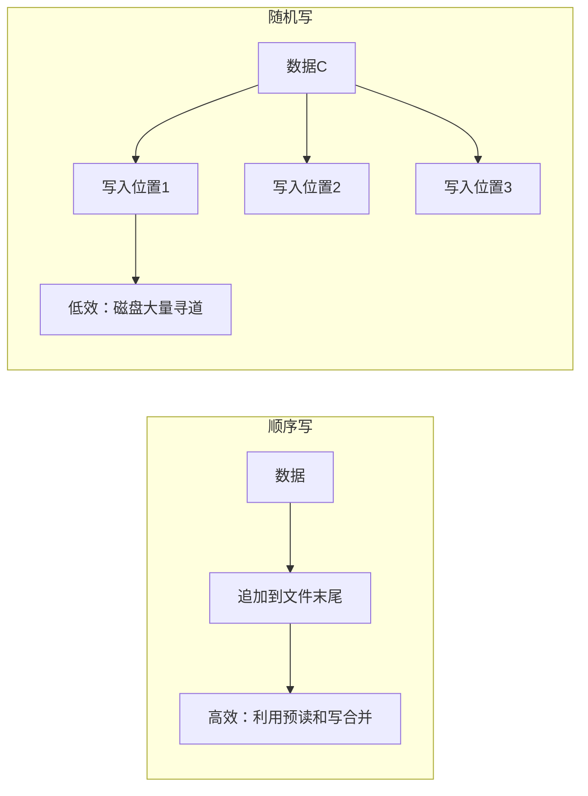
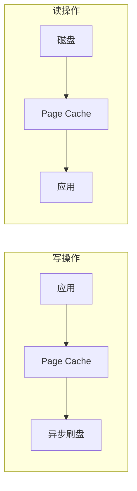
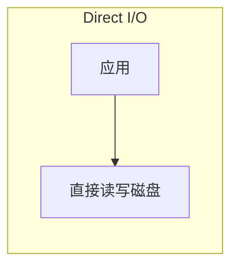

# 文件 I/O 优化

文件 I/O 是很多应用的核心操作。数据库、日志系统、消息队列，都离不开频繁的文件读写。优化文件 I/O，可以显著提升系统整体性能。

## 顺序写 vs 随机写

文件 I/O 的性能差异主要取决于读写模式：



### 性能差异

| 操作 | 顺序读写 | 随机读写 |
| --- | --- | --- |
| HDD 吞吐量 | 100-200 MB/s | 1-5 MB/s |
| SSD 吞吐量 | 500-3000 MB/s | 接近顺序读写 |
| 延迟 | 低 | 高 |

**优化策略**：
- 对于写入，尽量使用顺序追加（Append-only）
- 对于读取，尽量顺序读取，避免随机访问
- 无法避免随机访问时，考虑使用 SSD

## Buffered I/O vs Direct I/O

Linux 提供两种文件 I/O 模式：

### Buffered I/O（默认）

数据先写入 Page Cache，由操作系统异步刷盘：



**优势**：
- 利用 Page Cache，减少磁盘 I/O
- 写操作可以合并，提高效率
- 操作系统自动优化

**劣势**：
- 数据可能丢失（突然断电）
- 内存占用高（大文件会导致大量 Page Cache）

### Direct I/O

绕过 Page Cache，直接读写磁盘：



```java
// 使用 O_DIRECT（需要 JNI 或第三方库）
FileChannel channel = new RandomAccessFile(file, "r")
    .getChannel();

// 通过 JNI 设置 O_DIRECT 标志
setO_DIRECT(channel);
```

**优势**：
- 绕过 Page Cache，节省内存
- 数据一致性更好控制
- 减少一次内存复制

**劣势**：
- 失去 Page Cache 的优化
- 需要手动管理缓存
- 对齐要求严格（缓冲区、偏移量必须对齐到扇区大小）

### 适用场景对比

| 场景 | 推荐模式 | 原因 |
| --- | --- | --- |
| 数据库 | Direct I/O | 有自己的缓存，不需要 Page Cache |
| 文件服务器 | Buffered I/O | 利用 Page Cache 提高性能 |
| 日志系统 | Buffered I/O | 顺序追加，利用写合并 |
| 消息队列 | Buffered I/O | 利用 Page Cache 减少磁盘 I/O |

## O_DIRECT 使用详解

### 对齐要求

O_DIRECT 对缓冲区有严格的对齐要求：

```c
// 缓冲区地址必须对齐到 512 字节
// 读取长度必须对齐到 512 字节
// 文件偏移量必须对齐到 512 字节
```

Java 中使用 DirectByteBuffer 可以满足对齐要求：

```java title="O_DIRECT 示例（需要 JNI）"
public class ODirectFile {
    static {
        System.loadLibrary("odirect");
    }

    public native long open(String path, boolean readOnly);
    public native int read(long fd, ByteBuffer buffer, long offset);
    public native int write(long fd, ByteBuffer buffer, long offset);
    public native void close(long fd);

    public void readFile() {
        long fd = open("/data/file.bin", true);

        // DirectByteBuffer 满足对齐要求
        ByteBuffer buffer = ByteBuffer.allocateDirect(4096);

        int bytesRead = read(fd, buffer, 0);
        buffer.flip();
        // 处理数据...

        close(fd);
    }
}
```

## 文件 I/O 调优参数

### 内核参数

```bash
# 查看当前设置
cat /proc/sys/vm/dirty_ratio       # 内存中脏页的最大比例
cat /proc/sys/vm/dirty_background_ratio  # 后台刷盘阈值
cat /proc/sys/vm/dirty_expire_centisecs   # 脏页过期时间（1/100秒）

# 临时修改
echo 10 > /proc/sys/vm/dirty_background_ratio

# 永久修改（/etc/sysctl.conf）
vm.dirty_background_ratio = 10
vm.dirty_ratio = 20
```

### JVM 参数

```bash
# 堆外内存大小（影响文件 I/O）
java -XX:MaxDirectMemorySize=512m

# 使用 G1 减少 GC 暂停（间接提升 I/O 性能）
java -XX:+UseG1GC
```

### 文件系统参数

```bash
# 查看文件系统选项
mount | grep /data

# noatime：不更新访问时间（减少 I/O）
mount -o remount,noatime /data

# nodiratime：不更新目录访问时间
mount -o remount,noatime,nodiratime /data

# barrier=0：禁用写屏障（提升性能，但可能丢数据）
mount -o remount,barrier=0 /data
```

## 性能优化建议

### 批量写入

```java title="批量写入示例"
FileChannel channel = new RandomAccessFile("data.txt", "rw")
    .getChannel();

ByteBuffer buffer = ByteBuffer.allocate(8192);

// 批量写入，减少系统调用
for (int i = 0; i < 10000; i++) {
    buffer.clear();
    buffer.putInt(i);
    buffer.flip();
    channel.write(buffer);
}

// 强制刷盘
channel.force(true);
```

### MappedByteBuffer

对于需要频繁随机访问的大文件，mmap 可以提升性能：

```java title="mmap 随机访问"
FileChannel channel = new RandomAccessFile("bigfile.bin", "rw")
    .getChannel();

MappedByteBuffer buffer = channel.map(
    MapMode.READ_WRITE, 0, channel.size()
);

// 随机访问
for (int i = 0; i < 100; i++) {
    long pos = random.nextLong() * channel.size();
    int value = buffer.getInt((int) pos);
    // 处理...
}
```

### 异步 I/O

对于高并发写入，可以使用异步 I/O：

```java title="异步文件写入"
AsynchronousFileChannel channel = AsynchronousFileChannel.open(
    Paths.get("data.txt"),
    StandardOpenOption.WRITE
);

ByteBuffer buffer = ByteBuffer.wrap("Hello".getBytes());

Future<Integer> result = channel.write(buffer, 0);
int written = result.get();  // 阻塞等待

channel.close();
```

## 本章小结

文件 I/O 优化的核心要点：
- **顺序写优于随机写**：尽量使用追加模式
- **Buffered I/O 是默认选择**：利用 Page Cache 提升性能
- **Direct I/O 适用于数据库**：绕过 Page Cache，配合自己的缓存
- **批量操作减少系统调用**：减少上下文切换

## 延伸思考

为什么消息队列（如 Kafka）选择顺序写而不是随机写？

答案在于磁盘 I/O 的特性：
- **HDD**：顺序写利用磁盘的预读和写合并，可以达到接近内存的速度
- **SSD**：顺序写和随机写差距较小，但顺序写仍然更快

Kafka 使用追加写入（Append-only log），配合顺序 I/O，在普通 HDD 上就能达到每秒百万级消息的吞吐量。这就是"用顺序对抗随机"的经典案例。
