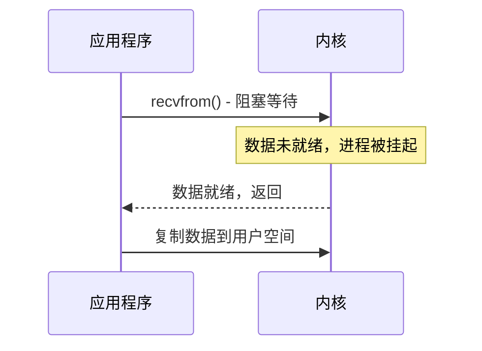
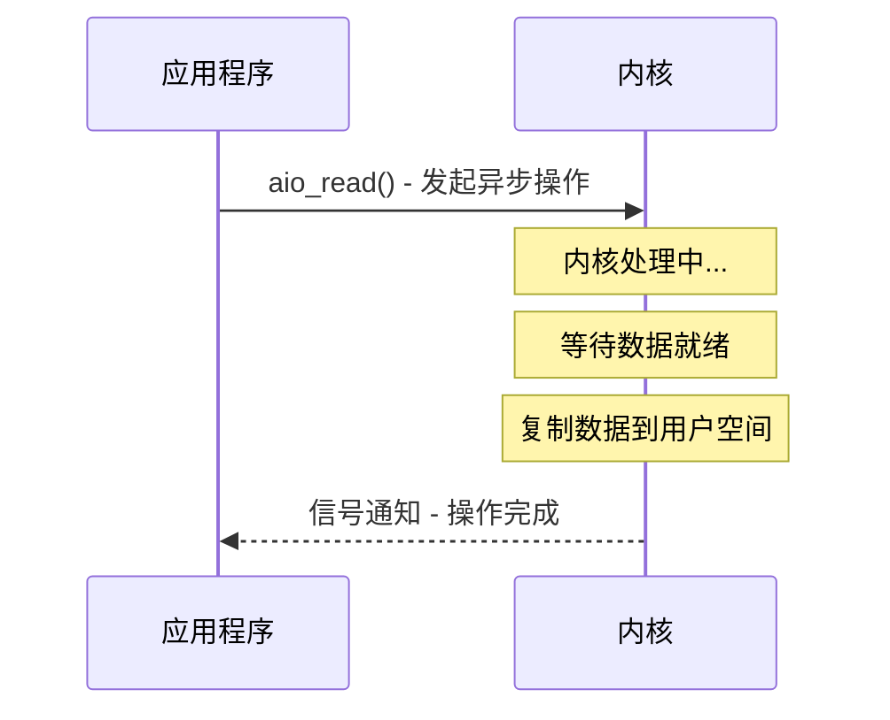
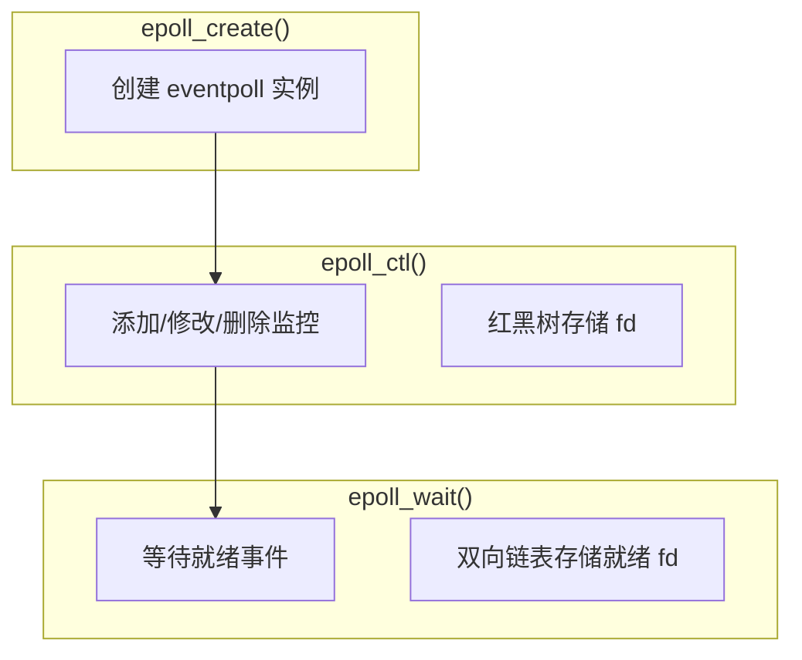
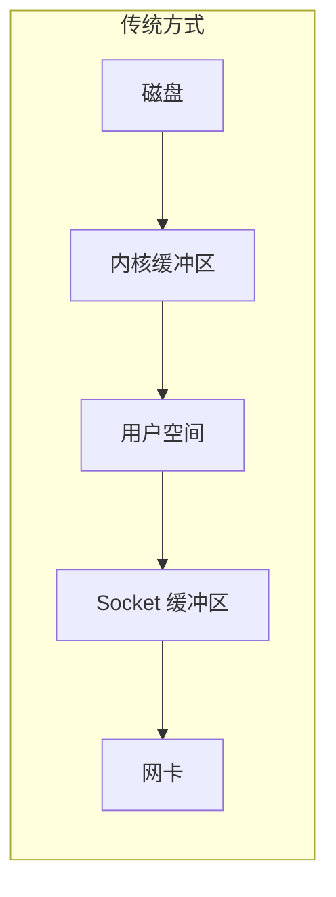
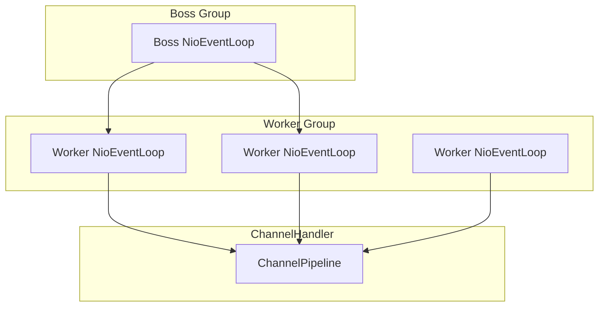

# I/O 模型

凌晨 3 点，监控系统报警声刺耳响起。你打开 Dashboard，发现 Tomcat 节点的线程池已经打满，500 个线程全部处于 `BLOCKED` 状态，平均响应时间从 50ms 飙升到 8 秒。业务方不断催促：接口怎么又超时了？你第一反应是数据库慢了，但 DBA 说数据库一切正常、CPU 也很低。

问题到底在哪？翻看线程 dump 后，你发现 500 个线程都在等待同一个 Socket 的数据可读。这不是数据库的问题，而是 I/O 模型的问题。

大多数 Java 开发者写 CRUD 业务时不会遇到这种场景，但如果系统需要处理高并发网络请求、频繁的文件读写，或者需要构建高性能中间件，I/O 模型就是绕不过去的核心技术。选对了，系统能以一敌十；选错了，堆再多机器也解决不了问题。

## 五种 I/O 模型

操作系统层面定义了五种 I/O 模型，理解它们是掌握高性能 I/O 的基础。

### 阻塞 I/O（BIO）

应用程序发起 `read` 系统调用后，必须等待数据就绪才能返回。在数据到达之前，进程被内核阻塞，CPU 转去执行其他任务。对于需要同时处理多个连接的服务器程序，这意味着每个连接需要一个独立线程。



BIO 的问题很明显：一个 1 万并发的聊天服务器，需要 1 万个线程。线程不是免费的，每个线程需要约 1MB 栈内存，1 万个线程就是 10GB 内存，再加上线程调度的 CPU 开销，系统还没被打垮，运维先崩溃了。

### 非阻塞 I/O（NIO）

应用程序发起 `recvfrom` 系统调用后，如果数据未就绪，内核立即返回 `EAGAIN`，而不是阻塞进程。应用程序需要不断轮询询问数据是否就绪。

这种方式避免了线程阻塞，但 CPU 大部分时间浪费在无效轮询上。如果轮询间隔太短，会打满 CPU；如果间隔太长，延迟会很高。这是一个用 CPU 换内存的方案，适用于连接数不多但不想阻塞的场景。

### I/O 多路复用

这是最核心的突破。应用程序不再自己轮询，而是委托一个"观察者"（Selector）来监听多个 socket 的状态变化。当某个 socket 可读或可写时，内核通知应用程序。单个线程可以同时管理成百上千个连接。

Linux 下有三种实现：`select`、`poll`、`epoll`。它们的核心区别在于效率和能力上限。

### 信号驱动 I/O（SIGIO）

应用程序先向内核注册一个信号处理函数，然后立即返回。当数据就绪时，内核发送 `SIGIO` 信号，应用程序在信号处理函数中调用 `recvfrom` 读取数据。

这种方式减少了无效的系统调用，但在高并发场景下信号处理变得复杂，而且信号是异步的，编程模型不够直观。在 Linux 网络编程中很少使用，但在某些特定场景（如热拔插设备通知）下有应用。

### 异步 I/O（AIO）

应用程序发起 `aio_read` 操作后立即返回，内核完成全部工作——等待数据就绪、复制数据到用户空间——然后才通知应用程序。应用程序在整个过程中完全不阻塞。



这是最理想的 I/O 模式，但实现复杂度高，Linux 的 AIO 支持也不够完善。Java NIO.2（Java 7 引入）在 Linux 上底层还是用的 epoll，并非真正的异步 I/O。

## 同步与异步：谁在等结果？

理解 I/O 模型的关键在于区分两组概念。

**同步与异步**描述的是"结果如何返回"：同步调用在数据就绪后才返回，调用方必须等待；异步调用立即返回，数据就绪后通过回调通知，调用方不必等待。

**阻塞与非阻塞**描述的是"等待期间发生什么"：阻塞调用在等待时让出 CPU，进程被挂起；非阻塞调用在等待时立即返回 `EAGAIN`，进程继续执行其他逻辑。

这两组概念可以组合出四种情况：

| | 同步 | 异步 |
| --- | --- | --- |
| **阻塞** | 阻塞 I/O（BIO） | 不存在（矛盾） |
| **非阻塞** | 非阻塞 I/O、I/O 多路复用 | 异步 I/O（AIO） |

为什么没有"异步阻塞"？因为"异步"的定义本身就是"调用立即返回"，不可能同时"阻塞"。这个组合在概念上就是矛盾的。

## I/O 多路复用：突破线程瓶颈

多路复用是现代高性能网络编程的基础。理解它，要从 `select` 的局限说起。

### select 的三大缺陷

`select` 最早出现在 BSD 系统，它允许一个进程同时监听多个文件描述符的就绪状态。但有三个致命问题：

第一，**监听数量受限**。Linux 上 `FD_SETSIZE` 通常是 1024，这意味着最多监听 1024 个连接。对于需要支持百万并发的现代系统，这是不可接受的硬限制。

第二，**每次调用都要完整传递监听集合**。应用程序需要把整个 fd_set 从用户空间复制到内核空间，开销与监听数量成正比。频繁调用 `select` 会导致大量数据拷贝。

第三，**返回后需要遍历全部文件描述符**。`select` 返回时只知道"有 N 个文件描述符就绪"，但不知道是哪几个。应用程序必须遍历全部 1024 个描述符，逐个检查状态，才能找到就绪的连接。这是 O(n) 的时间复杂度。

### poll 的改进

`poll` 用动态数组替代了固定大小的 `fd_set`，解决了连接数上限的问题。但其他两个缺陷依然存在：每次调用仍然需要复制整个数组，遍历时仍然需要 O(n) 复杂度。

### epoll 的设计哲学

2002 年，Linux 2.6 引入了 `epoll`，彻底解决了上述问题。



**优势一：只返回就绪的 fd**。`epoll_wait` 返回时，数组中只包含已就绪的文件描述符，不需要遍历全量。复杂度从 O(n) 降到 O(1)。

**优势二：无需重复传递 fd 集合**。应用程序调用 `epoll_ctl` 添加监控时，内核将 fd 关联到红黑树结构。下次调用 `epoll_wait` 时，不需要重新传递整个集合。

**优势三：无最大连接数限制**。理论上只受限于系统最大文件描述符数（ulimit -n），现代 Linux 默认即可支持数十万并发。

**优势四：支持边缘触发（ET）和水平触发（LT）**。水平触发模式下，只要条件满足就会不断通知；边缘触发只通知一次。边缘触发配合非阻塞 I/O，是高性能服务器的标准做法。

### kqueue 与 IOCP

macOS 和 FreeBSD 使用 `kqueue`，设计与 epoll 类似，但接口更灵活，支持更丰富的事件类型。

Windows 则使用 IOCP（I/O Completion Port）。IOCP 的独特之处在于：它是真正异步的，线程从池中取出完成通知即可处理结果，而不是主动轮询。Linux AIO 在 2.6 版本后引入，但成熟度和生态远不如 epoll。

## Java I/O 演进：从 BIO 到 NIO

Java 作为企业级开发的主力语言，其 I/O 演进史就是一部性能优化史。

### BIO：经典的阻塞时代

Java 1.0 就提供了 `java.io` 包，基于流（Stream）抽象。`Socket`、`ServerSocket`、`InputStream`、`OutputStream` 构成了早期网络编程的基石。

```java
ServerSocket serverSocket = new ServerSocket(8080);
while (true) {
    Socket client = serverSocket.accept(); // 阻塞
    new Thread(() -> {
        try {
            InputStream in = client.getInputStream();
            OutputStream out = client.getOutputStream();
            // 处理请求
        } finally {
            client.close();
        }
    }).start();
}
```

这段代码展示了典型的 BIO 服务器模式：`accept()` 阻塞等待连接，每来一个连接就新建一个线程处理。这种模式在连接数不多时简单有效，但在高并发下会因线程创建销毁开销、内存占用而崩溃。

### NIO：突破性的 Channel + Buffer + Selector

Java 1.4 引入 NIO（New I/O），核心抽象从"流"变成了"通道"（Channel）和"缓冲区"（Buffer）。

```java
ServerSocketChannel serverChannel = ServerSocketChannel.open();
serverChannel.socket().bind(new InetSocketAddress(8080));
serverChannel.configureBlocking(false); // 非阻塞模式

Selector selector = Selector.open();
serverChannel.register(selector, SelectionKey.OP_ACCEPT);

while (true) {
    selector.select(); // 阻塞，直到有事件就绪
    Set<SelectionKey> keys = selector.selectedKeys();
    for (SelectionKey key : keys) {
        if (key.isAcceptable()) {
            // 处理新连接
        } else if (key.isReadable()) {
            // 处理可读事件
        }
    }
    keys.clear();
}
```

单线程可以处理成千上万个连接，这就是 NIO 的威力。但代价是编程复杂度大幅上升：需要手动管理 ByteBuffer、处理半包问题、处理心跳逻辑。

### AIO：异步的未来

Java 7 引入了 NIO.2，提供了异步文件通道和异步 socket 通道。API 基于 `CompletionHandler` 回调：

```java
AsynchronousServerSocketChannel serverChannel =
    AsynchronousServerSocketChannel.open().bind(new InetSocketAddress(8080));

serverChannel.accept(null, new CompletionHandler<AsynchronousSocketChannel, Void>() {
    @Override
    public void completed(AsynchronousSocketChannel client, Void attachment) {
        serverChannel.accept(null, this); // 继续接收下一个连接
        ByteBuffer buffer = ByteBuffer.allocate(1024);
        client.read(buffer, buffer, new CompletionHandler<Integer, ByteBuffer>() {
            @Override
            public void completed(Integer result, ByteBuffer attachment) {
                // 数据读取完成
            }
        });
    }
});
```

但这里有个重要事实需要说明：Linux 上的 Java AIO 底层仍然使用 epoll，性能并不比 NIO 有显著优势。Java AIO 的真正价值在于提供了更友好的异步 API，以及在 Windows 上的 IOCP 支持。

## 零拷贝：消灭不必要的复制

传统文件传输需要 4 次数据复制：磁盘 → 内核缓冲区 → 用户空间 → socket 缓冲区 → 网卡。如果每秒传输 10GB 文件，光复制开销就吃掉大量 CPU。



零拷贝的目标是减少或消除这些复制操作。

### mmap：内存映射文件

`mmap` 将文件映射到进程的虚拟地址空间，读取文件时直接操作内存而不经过内核缓冲区。文件描述符在进程间共享时，内核只需维护一份物理页缓存。

```java title="mmap 文件读取"
FileChannel channel = new RandomAccessFile("data.txt", "r")
    .getChannel();
MappedByteBuffer buffer = channel.map(
    FileChannel.MapMode.READ_ONLY,
    0,
    channel.size()
);
```

适合大文件处理和需要频繁随机访问的场景。但不适合小文件，因为映射本身有开销。

### sendfile：内核直传

`sednfile` 是 Linux 2.2 引入的系统调用，它告诉内核：数据从哪里来（文件 fd）就直接发到哪里去（socket fd），全程在内核空间完成。

```java title="sendfile 文件传输"
FileChannel from = new FileInputStream("bigfile.zip")
    .getChannel();
FileChannel to = new FileOutputStream("/dev/null")
    .getChannel();

// 使用 transferTo 在底层调用 sendfile
long transferred = from.transferTo(0, from.size(), to);
```

从内核 2.4 开始，sendfile 还支持 DMA 收集（gather copy），网卡直接通过 DMA 从内核页缓存读取数据，进一步减少了 CPU 参与。实测中，1GB 文件传输的 CPU 开销可以从约 30% 降到约 4%。

### 零拷贝的收益

| 指标 | 传统方式 | 零拷贝 | 改善 |
| --- | --- | --- | --- |
| CPU 复制次数 | 4 次 | 0~1 次 | 减少 75%~100% |
| 内存带宽占用 | 高 | 低 | 节省 50%+ |
| 1GB 文件传输耗时 | ~200ms | ~60ms | 提升 3 倍 |
| CPU 占用率 | ~30% | ~4% | 降低 87% |

零拷贝是高性能中间件（Kafka、RocketMQ、Nginx）的标配技术。如果你的系统需要频繁在磁盘和网络间传输数据，零拷贝是必选项。

## Netty：高性能网络编程框架

原生 NIO 编程有三大痛点：ByteBuffer 使用繁琐、半包处理复杂、异常场景多。Netty 解决了这些问题，成为事实上的高性能网络编程标准。

### Reactor 线程模型

Netty 基于 Reactor 模式，将事件分发给对应的处理器。



Boss Group 负责处理连接建立（OP_ACCEPT），Worker Group 负责处理读写事件（OP_READ/OP_WRITE）。默认配置下，Boss Group 线程数等于服务器 CPU 核心数，Worker Group 线程数通常也是 CPU 核心数的 2 倍（考虑到网络 I/O 通常是计算密集型的 2~3 倍）。

### ByteBuf：超越 ByteBuffer

Netty 实现了自己的 `ByteBuf`，解决了 JDK `ByteBuffer` 的三个问题：

第一，**无需手动 flip**。ByteBuffer 需要 flip 才能从写模式切换到读模式，ByteBuf 维护独立的 readerIndex 和 writerIndex。

第二，**支持动态扩容**。ByteBuffer 容量固定，写入超过容量会抛异常；ByteBuf 可以自动扩容。

第三，**引用计数与池化**。通过引用计数管理内存，释放后返还池中复用，减少 GC 压力。

### Netty 零拷贝实现

Netty 的零拷贝不仅利用操作系统特性，还在框架层面做了优化：

- **CompositeByteBuf**：将多个 ByteBuf 合并为一个逻辑上的缓冲区，无需复制数据
- **slice()**：将一个 ByteBuf 切分成多个视图，共享底层数据
- **DirectBuffer**：使用堆外内存，避免 JVM 堆和内核之间的数据复制

## I/O 优化实战

理解了原理，最终要落在实践上。

### 直接内存：减少堆内外复制

JVM 堆内存和外存之间的数据交换需要通过内核缓冲区中转。直接内存（堆外内存）可以跳过这一步：

```java
// JDK NIO 默认使用直接内存
ByteBuffer buffer = ByteBuffer.allocateDirect(1024);
```

直接内存不受 GC 管理，适合长时间运行的高性能服务。但要注意：直接内存的分配和释放比堆内存慢，应该配合池化使用。Netty 默认就使用直接内存的池化 ByteBuf。

### 网络 I/O 优化：Nagle 与 TCP_NODELAY

TCP 默认启用 Nagle 算法：发送方会缓存小数据包，等积累到一定量再发送，减少小包数量以降低网络开销。但这会增加延迟，对于实时交互场景不利。

```java
// 禁用 Nagle 算法，降低延迟
socket.setTcpNoDelay(true);
```

RPC 调用、实时游戏、在线聊天等场景应该禁用 Nagle 算法；文件传输、大数据分析等场景可以保留。

### 文件 I/O 优化：O_DIRECT

Linux 的页缓存机制会缓存磁盘数据，提升读性能。但对于数据库等有自己缓存的系统，页缓存反而浪费内存。

O_DIRECT 标志绕过页缓存，数据直接进入用户空间：

```java
FileChannel channel = new RandomAccessFile(file, "r")
    .getChannel();
FileDescriptor fd = channel.socket().getChannel().getFD();
// 通过 JNI 设置 O_DIRECT
```

使用 O_DIRECT 需要对齐：缓冲区地址、读取长度都必须对齐到磁盘扇区大小（通常是 512 字节）。Oracle、MySQL 的 InnoDB 在高并发写入时会使用这种模式。

## BIO / NIO / AIO 对比

| 特性 | BIO | NIO | AIO |
| --- | --- | --- | --- |
| 引入版本 | Java 1.0 | Java 1.4 | Java 7 |
| 核心抽象 | Stream | Channel + Buffer + Selector | AsynchronousChannel |
| 同步/异步 | 同步阻塞 | 同步非阻塞 | 异步 |
| 线程模型 | 一连接一线程 | 单线程 + Selector | 回调/ Future |
| 并发能力 | 低（受线程数限制） | 高（单线程可管理万级连接） | 高 |
| API 复杂度 | 简单 | 较复杂 | 中等 |
| 适用场景 | 低并发、简单协议 | 高并发、快速响应 | 高并发、追求极致性能 |
| Linux 底层 | socket 阻塞 | epoll | epoll（实际是同步非阻塞） |
| 半包处理 | 无（流式无边界） | 需要手动处理 | 需要手动处理 |

**选型建议**：大多数业务系统用 NIO 即可，Netty 封装后的 API 足够易用。如果是极致性能追求（消息队列、RPC 框架），深入 Netty 底层调优。如果系统 I/O 压力不大，BIO 反而是最简单的选择——不要过度设计。

## 本章文章导读

I/O 模型是一个庞大的知识体系，本章将深入剖析每个核心主题。

从基础概念出发，先理解 [I/O 模型概述](./overview) 中同步/异步、阻塞/非阻塞的本质区别。然后分别讲解 [阻塞 I/O（BIO）](./bio) 的经典模式和 [非阻塞 I/O（NIO）](./nio) 的 Channel/Buffer 核心抽象。

[I/O 多路复用](./multiplexing) 是理解高性能网络的关键，需要深入理解 select/poll 的局限和 epoll/kqueue 的设计哲学。零拷贝章节涵盖 [零拷贝原理](./zero-copy)、[mmap 内存映射](./mmap) 和 [sendfile](./sendfile)，这是 Kafka 等中间件的核心技术。

Netty 章节从 [架构深度解析](./netty) 到 [Reactor 线程模型](./netty-thread-model) 再到 [零拷贝实现](./netty-zero-copy)，最后对比 [Java NIO 与 Netty 性能差异](./nio-vs-netty)，帮助你在实战中做出选择。

实战优化部分涵盖 [文件 I/O 优化](./file-io)、[网络 I/O 优化](./network-io)、[直接内存](./direct-memory) 以及 [I/O 性能监控与诊断](./monitoring)，让你不仅懂原理，更能在生产环境中落地。

如果你正在构建高性能网络应用、了解中间件底层原理、或者准备面试，这套知识体系会给你坚实的技术底气。
