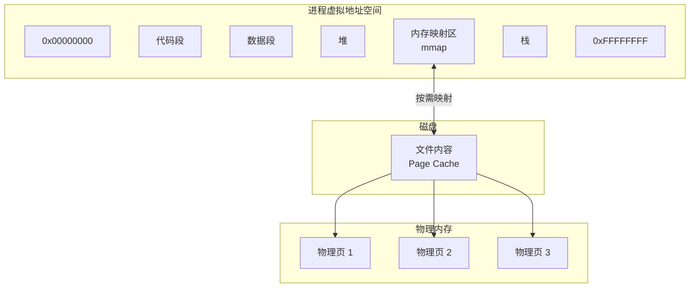
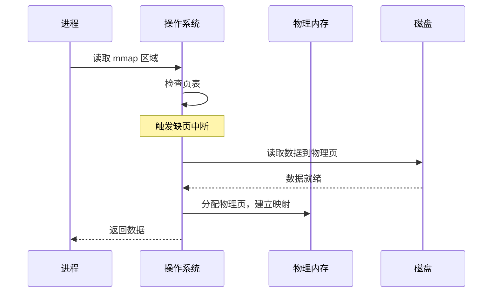

# mmap 内存映射文件

你打开一个 10GB 的日志文件，需要读取其中的部分内容。传统做法是把整个文件加载到内存，但 10GB 太大了，内存装不下。

有没有一种方法，可以像访问内存一样访问文件，但又不占用那么多内存？

答案就是 `mmap`——内存映射文件。

## mmap 的核心思想

`mmap` 把文件映射到进程的虚拟地址空间。映射后，访问文件就像访问内存一样简单，但操作系统只在需要时才加载实际的磁盘数据。



## mmap 的工作原理

当进程调用 `mmap` 时：

1. 操作系统在虚拟地址空间中分配一段区域
2. 建立虚拟地址到物理页的映射关系
3. 物理页一开始并不分配，等到访问时触发缺页中断才加载

```c
// mmap 系统调用
void *mmap(void *addr, size_t length, int prot, int flags, int fd, off_t offset);

// 示例
char *mapped = mmap(NULL,           // 让内核选择地址
                   4096,           // 映射大小
                   PROT_READ,       // 可读
                   MAP_PRIVATE,     // 私有映射
                   fd,             // 文件描述符
                   0);             // 偏移量
```

当进程读取映射区域时：



## Java 中的 mmap

Java 使用 `FileChannel.map()` 实现内存映射：

```java title="基本用法"
FileChannel channel = new RandomAccessFile("data.txt", "rw")
    .getChannel();

// 映射整个文件
MappedByteBuffer buffer = channel.map(
    FileChannel.MapMode.READ_WRITE,
    0,
    channel.size()
);

// 像访问数组一样访问文件
buffer.put(0, (byte) 'H');
buffer.put(1, (byte) 'i');

byte b = buffer.get(0);
```

### 三种映射模式

| 模式 | 说明 | 修改是否影响原文件 |
| --- | --- | --- |
| `READ_ONLY` | 只读映射 | 不影响 |
| `READ_WRITE` | 读写映射 | 会写回磁盘 |
| `PRIVATE` | 私有映射 | 写时复制，不影响原文件 |

```java
// 只读映射
MappedByteBuffer readOnly = channel.map(
    MapMode.READ_ONLY, 0, channel.size()
);

// 私有映射
MappedByteBuffer privateMap = channel.map(
    MapMode.PRIVATE, 0, channel.size()
);
```

## mmap 的优势

### 减少系统调用

传统 I/O 每次读取都需要系统调用：

```java title="传统 I/O：多次系统调用"
FileInputStream in = new FileInputStream("data.txt");
byte[] buffer = new byte[1024];

while (in.read(buffer) != -1) {
    // 处理数据
    process(buffer);
}
```

mmap 后，只需要一次映射，后续读写都是内存操作：

```java title="mmap：一次映射，多次内存访问"
FileChannel channel = new FileInputStream("data.txt").getChannel();
MappedByteBuffer buffer = channel.map(MapMode.READ_ONLY, 0, channel.size());

// 遍历文件内容，像访问数组一样
while (buffer.hasRemaining()) {
    byte b = buffer.get();
    process(b);
}
```

### 避免内核用户空间拷贝

传统 I/O 读取文件时，数据需要从内核缓冲区复制到用户空间：


mmap 映射后，进程直接访问 Page Cache，不存在这个复制：


### 方便数据共享

多个进程可以映射同一个文件，实现共享内存：

```java
// 进程 A
MappedByteBuffer bufferA = channel.map(MapMode.READ_WRITE, 0, size);

// 进程 B（通过文件锁协调）
MappedByteBuffer bufferB = channel.map(MapMode.READ_WRITE, 0, size);
```

## mmap 的劣势

### 页面抖动

如果映射的文件很大，而内存有限，频繁访问不同区域会导致频繁的页面换入换出：

```java
// 场景：随机访问大文件的各个位置
MappedByteBuffer buffer = channel.map(MapMode.READ_ONLY, 0, 10 * 1024 * 1024 * 1024L); // 10GB

// 随机访问
for (int i = 0; i < 10000; i++) {
    long pos = random.nextLong() * 10GB;
    byte b = buffer.get((int) pos);  // 可能触发大量换页
}
```

### 关闭文件延迟

`MappedByteBuffer` 持有的是文件的引用。即使调用 `channel.close()`，映射仍然有效，直到 buffer 被 GC 回收或显式调用 `unmap`。

```java
FileChannel channel = new RandomAccessFile("data.txt", "rw")
    .getChannel();
MappedByteBuffer buffer = channel.map(MapMode.READ_WRITE, 0, channel.size());

channel.close();  // 文件关闭

// buffer 仍然有效，直到 GC
buffer.put(0, (byte) 'A');
```

### 地址空间限制

在 32 位系统上，虚拟地址空间只有 4GB，减去系统占用，能用于 mmap 的空间更有限。64 位系统没有这个问题。

## RocketMQ 与 Kafka 的 mmap 使用

### RocketMQ 的 CommitLog

RocketMQ 使用 mmap 来提高消息写入性能：

```java
// RocketMQ 源码（简化）
public class MappedFile {
    private final MappedByteBuffer mappedByteBuffer;

    public MappedFile(String fileName, int fileSize) throws IOException {
        RandomAccessFile raf = new RandomAccessFile(fileName, "rw");
        FileChannel channel = raf.getChannel();
        this.mappedByteBuffer = channel.map(
            MapMode.READ_WRITE,
            0,
            fileSize
        );
    }

    public void appendMessage(byte[] data) {
        // 直接写入内存，操作系统异步刷盘
        this.mappedByteBuffer.put(writePosition, data);
        writePosition += data.length;
    }
}
```

RocketMQ 的 CommitLog 文件大小固定（默认 1GB），正好可以完全映射到内存。

### Kafka 的索引文件

Kafka 的索引文件也使用 mmap：

```java
// Kafka 源码（简化）
public class OffsetIndex {
    private final MappedByteBuffer buffer;

    public OffsetIndex(File file, int size) {
        RandomAccessFile raf = new RandomAccessFile(file, "rw");
        FileChannel channel = raf.getChannel();
        this.buffer = channel.map(MapMode.READ_WRITE, 0, size);
    }
}
```

## mmap vs sendfile

| 特性 | mmap | sendfile |
| --- | --- | --- |
| 适用场景 | 需要读取/修改文件内容 | 只传输文件内容 |
| 数据访问 | 可以随机访问 | 只能顺序读取 |
| 编程接口 | 更灵活 | 更简单 |
| 内核支持 | 所有 POSIX 系统 | Linux 特定 |
| 零拷贝 | 可以配合实现 | 原生支持 |

## 实战建议

**适合使用 mmap 的场景**：
- 大文件的随机读写（如数据库、日志分析）
- 进程间共享数据
- 需要频繁访问的文件

**不适合使用 mmap 的场景**：
- 小文件（映射开销可能大于读写开销）
- 频繁读写不同位置（页面抖动）
- 需要跨平台（sendfile 是 Linux 特有的）

## 本章小结

`mmap` 是 Linux 提供的一种高效文件访问方式：
- 将文件映射到进程的虚拟地址空间，访问如同访问内存
- 减少系统调用次数，避免内核到用户的拷贝
- 适合大文件访问和进程间共享

RocketMQ 和 Kafka 都使用 mmap 来提升 I/O 性能。理解 mmap 的原理，有助于理解这些高性能中间件的设计。

## 延伸思考

为什么 RocketMQ 选择 mmap 而不是 sendfile？

关键在于 RocketMQ 需要**读写**消息文件，而不仅仅是**传输**。mmap 提供了随机读写的能力，适合消息持久化和消费追踪。而 sendfile 只能顺序传输，不适合需要修改文件内容的场景。

技术选型永远取决于具体需求：只传输用 sendfile，需要读写用 mmap。
