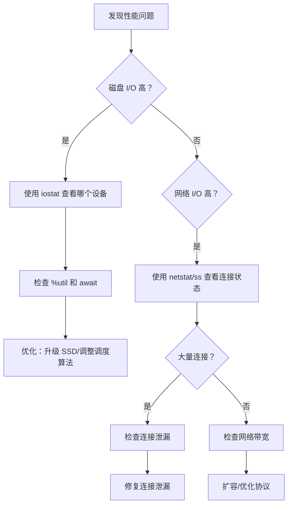

# I/O 性能监控与诊断

I/O 性能问题往往比较隐蔽：CPU 不高、内存正常、GC 正常，但系统就是慢。这时候需要专门的 I/O 诊断工具来找出瓶颈。

## Linux I/O 监控命令

### iostat：磁盘 I/O 统计

```bash
# 安装
# Ubuntu: apt install sysstat
# CentOS: yum install sysstat

# 基本使用
iostat -x 1

# 输出
Device  r/s    w/s    rkB/s   wkB/s  await  %util
sda     12.00  45.00  512.00 1843.20  2.35   8.45
```

关键指标：
- **r/s, w/s**：每秒读写次数
- **rkB/s, wkB/s**：每秒读写 KB 数
- **await**：I/O 等待时间（毫秒）
- **%util**：设备利用率，> 80% 表示饱和

### vmstat：虚拟内存统计

```bash
# 每秒采样
vmstat 1

# 输出
procs -----------memory---------- ---swap-- -----io---- -system-- ------cpu-----
 r  b swpd   free   buff  cache   si   so    bi    bo   in   cs us sy id wa st
 1  0    0 2048000 123456 789012    0    0    50   120  500  800 10  5 85  0  0
```

关键指标：
- **bi, bo**：每秒读写块数
- **wa**：I/O 等待时间占比，> 20% 表示 I/O 是瓶颈

### netstat：网络统计

```bash
# 查看连接状态
netstat -an | awk '/^tcp/ {print $6}' | sort | uniq -c

# 查看端口监听
netstat -tlnp

# 查看网络错误
netstat -s | grep -i error

# 查看 TCP 状态统计
netstat -st
```

### ss：Socket 统计

```bash
# 查看所有连接
ss -s

# 查看具体端口
ss -tlnp | grep 8080

# 查看连接状态
ss -ant | awk '{print $1}' | sort | uniq -c
```

## Java I/O 监控

### JMX 监控

```java title="启用 JMX"
java -Dcom.sun.management.jmxremote.port=9010 \
     -Dcom.sun.management.jmxremote.authenticate=false \
     -Dcom.sun.management.jmxremote.ssl=false \
     -Dcom.sun.management.jmxremote.local.only=false \
     -jar app.jar
```

```java title="JMX MBean 示例"
MBeanServer mbs = ManagementFactory.getPlatformMBeanServer();

// 注册自定义 MBean
mbs.registerMBean(new IOMonitor(), new ObjectName("IOMonitor:name=FileIO"));

// IOMonitor 实现
public class IOMonitor implements IOMonitorMBean {
    private long readBytes;
    private long writeBytes;

    public long getReadBytes() { return readBytes; }
    public long getWriteBytes() { return writeBytes; }

    public void recordRead(int bytes) { readBytes += bytes; }
    public void recordWrite(int bytes) { writeBytes += bytes; }
}
```

### Micrometer 指标

```java title="添加 Micrometer 依赖"
<dependency>
    <groupId>io.micrometer</groupId>
    <artifactId>micrometer-core</artifactId>
</dependency>
```

```java title="记录 I/O 指标"
MeterRegistry registry = new PrometheusMeterRegistry(PrometheusConfig.DEFAULT);

// 文件读取计时
Timer fileReadTimer = Timer.builder("file.read.duration")
    .description("文件读取耗时")
    .register(registry);

// 记录
fileReadTimer.record(() -> {
    Files.readAllBytes(path);
});

// Counter 记录次数
Counter readCounter = Counter.builder("file.read.count")
    .description("文件读取次数")
    .register(registry);
```

## 网络 I/O 延迟分析

### TCP 连接延迟

```bash
# 测量 TCP 连接延迟
time nc -zv host 80

# 使用 curl 测量
curl -w "@curl-format.txt" -o /dev/null -s http://host/api

# curl-format.txt 内容
time_namelookup: %{time_namelookup}\n
time_connect: %{time_connect}\n
time_appconnect: %{time_appconnect}\n
time_pretransfer: %{time_pretransfer}\n
time_starttransfer: %{time_starttransfer}\n
time_total: %{time_total}\n
```

### 延迟分布分析

```java title="延迟分布采样"
public class LatencySampler {
    private final AtomicLongArray latencies = new AtomicLongArray(100000);
    private volatile int index = 0;

    public void record(long latencyNs) {
        latencies.set(index, latencyNs);
        index = (index + 1) % latencies.length();
    }

    public void report() {
        long[] snapshot = new long[latencies.length()];
        for (int i = 0; i < snapshot.length; i++) {
            snapshot[i] = latencies.get(i);
        }

        Arrays.sort(snapshot);

        System.out.println("P50: " + snapshot[snapshot.length / 2] / 1000 + "us");
        System.out.println("P95: " + snapshot[(int)(snapshot.length * 0.95)] / 1000 + "us");
        System.out.println("P99: " + snapshot[(int)(snapshot.length * 0.99)] / 1000 + "us");
    }
}
```

## 文件 I/O 延迟分析

### strace：系统调用跟踪

```bash
# 跟踪文件操作
strace -e trace=openat,read,write,close -p PID

# 跟踪并统计
strace -e trace=read,write -c -p PID

# 输出
% time     seconds  usecs/call     calls    errors syscall
------ ----------- ----------- --------- --------- -------
 45.23    0.001234          123        10           write
 32.15    0.000876            45        20           read
```

### Java Flight Recorder

```bash
# 启动 JFR
java -XX:+UnlockCommercialFeatures \
     -XX:+FlightRecorder \
     -XX:StartFlightRecording=filename=recording.jfr \
     -jar app.jar

# 或运行时启动
jcmd <pid> JFR.start
jcmd <pid> JFR.dump filename=recording.jfr
```

JFR 可以记录：
- 文件 I/O 读取/写入大小和耗时
- Socket 发送/接收大小和耗时
- I/O 等待时间

## 诊断流程

### 快速定位 I/O 问题



### 常见 I/O 问题模式

| 问题 | 症状 | 原因 | 解决方案 |
| --- | --- | --- | --- |
| 磁盘饱和 | iostat %util > 80% | 磁盘成为瓶颈 | 升级 SSD/增加磁盘 |
| I/O 等待高 | vmstat wa > 20% | CPU 等待 I/O | 优化读写模式 |
| 小文件多 | iostat w/s 高 | 随机写过多 | 合并写入/使用 SSD |
| 网络延迟高 | curl time 高 | 网络/服务器慢 | 检查网络/优化服务器 |

## 监控 Dashboard

### Grafana + Prometheus

```yaml title="prometheus.yml"
scrape_configs:
  - job_name: 'java-app'
    static_configs:
      - targets: ['localhost:9010']
```

```sql title="Grafana 查询"
# I/O 操作计数
rate(io_operations_total[5m])

# 平均 I/O 延迟
rate(io_latency_seconds_sum[5m]) / rate(io_latency_seconds_count[5m])

# 文件描述符使用
jvm_memory_used_bytes{area="nonheap",id="Direct"}
```

## 本章小结

I/O 监控的核心工具：
- **iostat**：磁盘 I/O 统计，关注 %util 和 await
- **vmstat**：虚拟内存统计，关注 wa 列
- **netstat/ss**：网络连接统计
- **strace**：系统调用跟踪
- **JFR**：Java 飞行记录，I/O 事件分析
- **JMX/Micrometer**：应用层 I/O 指标

监控不是目的，定位问题并优化才是目标。

## 延伸思考

什么时候应该放弃监控，直接上 profiler？

监控擅长发现"谁在慢"，profiler 擅长发现"慢在哪里"。如果已经确定是 I/O 瓶颈但不知道是哪个操作，profiler（如 async-profiler）可以给出调用栈级别的分析。但如果完全不知道问题在哪，先用监控快速定位方向。
