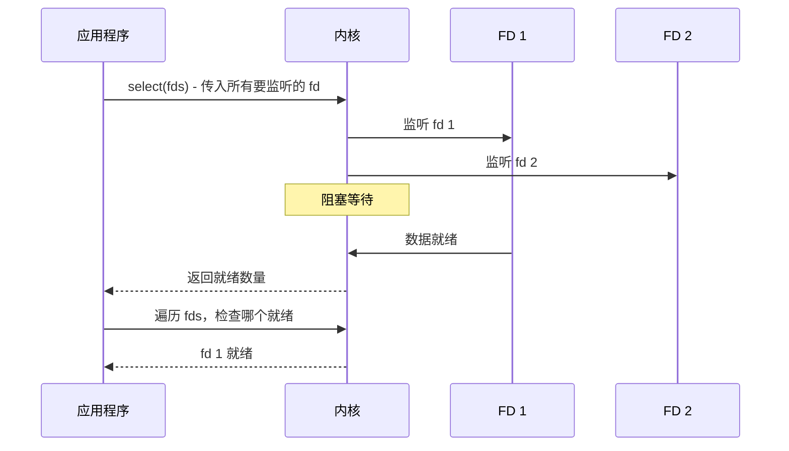
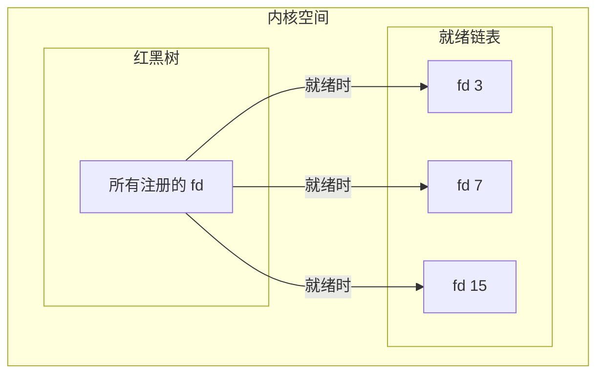

# I/O 多路复用

I/O 多路复用是高性能网络编程的核心技术。它允许单个线程同时管理多个 I/O 连接，避免了"一个连接一个线程"的瓶颈。

理解 I/O 多路复用，要从它的历史演进说起。

## 为什么需要多路复用？

假设你在运营一个聊天服务器：

**BIO 的做法**：每来一个连接，分配一个线程。1 万个在线用户 = 1 万个线程。每个线程占 1MB 内存，光线程栈就需要 10GB。这还没算线程调度的 CPU 开销。

**轮询的做法**：用一个线程轮询所有连接，看哪个有数据。但 CPU 99% 的时间都在问"有没有数据、有没有数据、有没有数据"——大部分查询都是无效的。

**多路复用的做法**：告诉操作系统"帮我盯着这些连接，有数据了通知我"。线程可以安心等待，CPU 不浪费，数据来了立即处理。

## select：多路复用的鼻祖

`select()` 最早出现在 BSD 系统（1983 年），是第一个实现 I/O 多路复用的系统调用。

### select 的工作原理

```c
int select(int nfds,           // 要监听的最大 fd + 1
           fd_set *readfds,     // 读事件监听集合
           fd_set *writefds,   // 写事件监听集合
           fd_set *exceptfds,  // 异常事件监听集合
           struct timeval *timeout);  // 超时时间
```

应用程序把要监听的 fd 集合（fd_set）传给内核，然后阻塞。当有 fd 就绪时，select 返回。



### select 的三大缺陷

**缺陷一：监听数量受限**。Linux 上 `FD_SETSIZE` 通常是 1024，这是编译时硬编码的，无法改变。对于需要支持百万并发的现代系统，这是不可接受的。

**缺陷二：每次调用都要完整传递监听集合**。应用程序需要把整个 fd_set 从用户空间复制到内核空间，开销与监听数量成正比。

```c
// 每次 select 调用都要执行这个复制操作
copy_from_user(readfds, user_readfds, sizeof(fd_set));
```

**缺陷三：返回后需要遍历全部文件描述符**。select 返回时只知道"有 N 个 fd 就绪"，但不知道是哪几个。应用程序必须遍历全部 max_fd 个描述符，逐个检查状态。

```c
// 这是一个 O(n) 的操作
for (int i = 0; i < max_fd; i++) {
    if (FD_ISSET(i, &readfds)) {
        // 处理就绪的 fd i
    }
}
```

## poll：select 的改进

`poll()` 是 select 的改进版本，用动态数组替代了固定大小的 fd_set。

```c
int poll(struct pollfd *fds,     // pollfd 数组
         nfds_t nfds,            // 数组长度
         int timeout);           // 超时时间(ms)

struct pollfd {
    int fd;        // 文件描述符
    short events;  // 感兴趣的事件
    short revents; // 返回时，就绪的事件
};
```

```c title="poll 示例"
struct pollfd fds[2];
fds[0].fd = STDIN_FILENO;
fds[0].events = POLLIN;  // 监听输入

fds[1].fd = socket_fd;
fds[1].events = POLLIN;  // 监听 socket

poll(fds, 2, -1);  // 阻塞直到有事件

if (fds[0].revents & POLLIN) {
    // stdin 可读
}
if (fds[1].revents & POLLIN) {
    // socket 可读
}
```

**改进**：没有最大 fd 数量限制，可以监听任意数量的连接。

**仍存在的问题**：每次调用仍需要复制整个数组，遍历时仍需要 O(n) 复杂度。

## epoll：Linux 的终极方案

2002 年，Linux 2.6 引入了 `epoll`，彻底解决了 select/poll 的问题。

### epoll 的三个系统调用

```c
// 1. 创建 eventpoll 实例
int epfd = epoll_create1(0);

// 2. 添加/修改/删除要监听的文件描述符
struct epoll_event ev;
ev.events = EPOLLIN;      // 监听读事件
ev.data.fd = sock_fd;     // 关联的文件描述符
epoll_ctl(epfd, EPOLL_CTL_ADD, sock_fd, &ev);

// 3. 等待事件就绪
struct epoll_event events[10];
int nfds = epoll_wait(epfd, events, 10, -1);
for (int i = 0; i < nfds; i++) {
    // 处理 events[i]
}
```

### epoll 的三大优势

**优势一：只返回就绪的 fd**。`epoll_wait` 返回时，数组中只包含已就绪的文件描述符，不需要遍历全量。

```c
// epoll 效率：O(就绪 fd 数)
for (int i = 0; i < nfds; i++) {
    // nfds 是就绪数量，通常很小
    handle(events[i].data.fd);
}
```

**优势二：无需重复传递 fd 集合**。应用程序调用 `epoll_ctl` 添加监控时，内核将 fd 关联到红黑树结构。下次调用 `epoll_wait` 时，不需要重新传递整个集合。



**优势三：无最大连接数限制**。理论上只受限于系统最大文件描述符数（`ulimit -n`），现代 Linux 默认即可支持数十万并发。

### 边缘触发 vs 水平触发

epoll 支持两种触发模式：

| 模式 | 说明 | 行为 |
| --- | --- | --- |
| 水平触发（LT） | 默认模式 | 只要条件满足就会不断通知 |
| 边缘触发（ET） | 高性能模式 | 只通知一次，必须一次性处理所有数据 |

```c
// 水平触发（默认）
ev.events = EPOLLIN;

// 边缘触发
ev.events = EPOLLIN | EPOLLET;
```

**实战经验**：边缘触发配合非阻塞 I/O，是高性能服务器的标准做法。这样做的好处是：减少系统调用次数，但代价是必须一次性处理所有就绪数据，否则会漏掉。

## kqueue：BSD/macOS 的方案

macOS 和 FreeBSD 使用 `kqueue`，设计与 epoll 类似，但接口更灵活。

```c
// 创建 kqueue
int kq = kqueue();

// 设置要监听的事件
struct kevent change;
EV_SET(&change, fd, EVFILT_READ, EV_ADD, 0, 0, NULL);
kevent(kq, &change, 1, NULL, 0, NULL);

// 等待事件
struct kevent event;
kevent(kq, NULL, 0, &event, 1, NULL);
```

kqueue 的优势在于支持更多类型的事件：文件 I/O、进程状态、信号、定时器等。

## IOCP：Windows 的方案

Windows 使用 IOCP（I/O Completion Port），这是最接近"真正异步"的实现。

```c
// 创建 IOCP
HANDLE completionPort = CreateIoCompletionPort(INVALID_HANDLE_VALUE, NULL, 0, 0);

// 关联 socket 到 IOCP
CreateIoCompletionPort((HANDLE)socket, completionPort, 0, 0);

// 投递异步读操作
ReadFile(socket, buffer, size, &bytes, &overlapped);

// 等待完成通知（线程池）
GetQueuedCompletionStatus(completionPort, &bytes, &key, &overlapped, INFINITE);
```

IOCP 的独特之处在于：**线程从池中取出完成通知即可处理结果**，而不是主动轮询。

## 对比总结

| 特性 | select | poll | epoll | kqueue | IOCP |
| --- | --- | --- | --- | --- | --- |
| 平台 | 全平台 | 全平台 | Linux | BSD/macOS | Windows |
| 最大 fd | 1024 | 无限制 | 无限制 | 无限制 | 无限制 |
| 时间复杂度 | O(n) | O(n) | O(1) | O(1) | O(1) |
| FD 集合传递 | 每次传递 | 每次传递 | 不传递 | 不传递 | 不传递 |
| 触发模式 | 水平触发 | 水平触发 | 水平/边缘 | 水平/边缘 | 完成通知 |
| 异步 | 否 | 否 | 否 | 否 | 是 |

## Java NIO 与底层实现

Java NIO 的 Selector 在不同平台使用不同的底层实现：

```java
// Linux: epoll（Java 9+ 使用 epoll 代替 poll）
// macOS: kqueue
// Windows: select（Windows 没有原生 epoll/kqueue）
```

```java title="查看 Java 使用的 Selector 实现"
SelectorProvider provider = SelectorProvider.provider();
System.out.println(provider.getClass().getName());
// Linux: sun.nio.ch.EPollSelectorProvider
// macOS: sun.nio.ch.KQueueSelectorProvider
```

这意味着 Java NIO 在 Linux 上实际上就是 epoll，享有 epoll 的性能优势。

## 本章小结

I/O 多路复用经历了从 select 到 poll 到 epoll 的演进：
- **select**：固定 fd 数量限制，O(n) 遍历，每次调用都要传递整个 fd 集合
- **poll**：解决了 fd 数量问题，但仍需要传递和遍历
- **epoll**：O(1) 通知，不重复传递，无连接数限制，是 Linux 高性能网络编程的标准
- **kqueue**：BSD/macOS 的方案，与 epoll 类似但更灵活
- **IOCP**：Windows 的方案，最接近真正的异步 I/O

下一章我们将学习 Java NIO.2 的 AIO 实现，看看 Java 如何封装这些底层机制。

## 延伸思考

为什么 epoll 在 Linux 上能实现 O(1) 的时间复杂度？

关键在于两个数据结构的组合：
1. **红黑树**：存储所有注册的 fd，插入/删除/查找都是 O(log n)，但树中节点数量（所有 fd）通常很大
2. **就绪链表**：只存储已就绪的 fd，数量通常很小

epoll_wait 返回时，只需要遍历就绪链表——而这个链表长度通常远小于总 fd 数。这就是 O(1) 的秘密。
