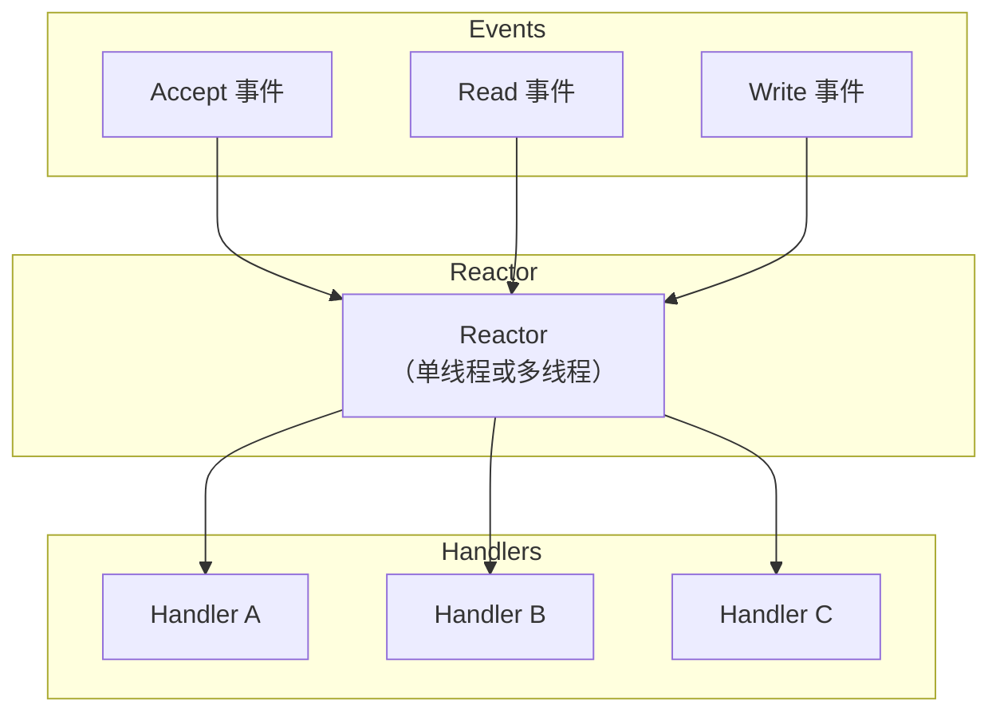
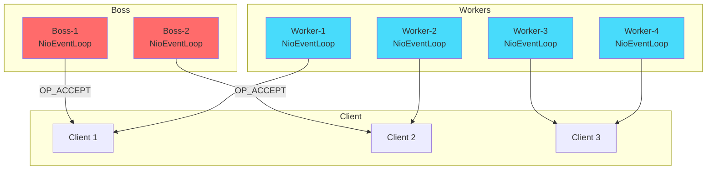
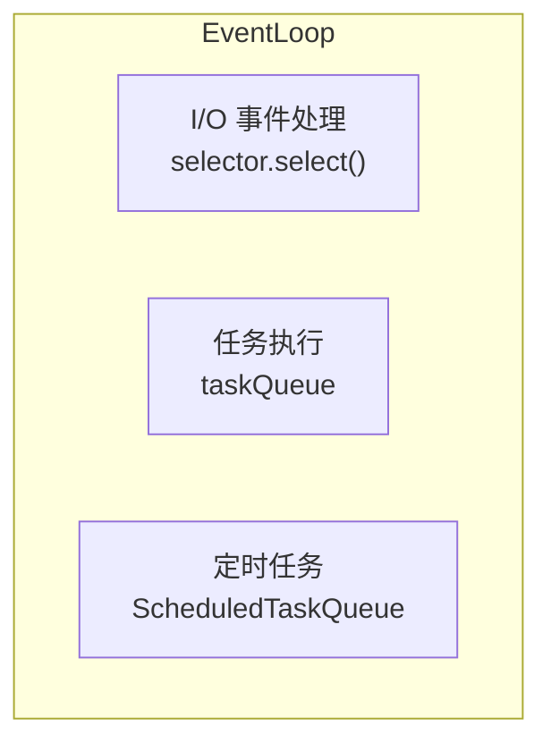
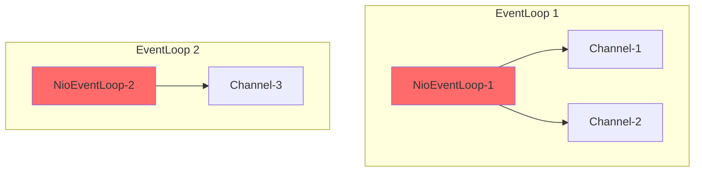
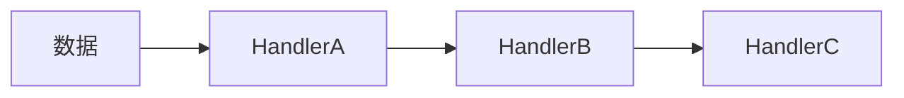
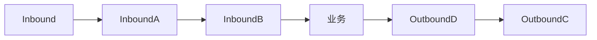

# Netty 线程模型

Netty 的高性能，很大程度上来自它的线程模型。理解 Netty 的线程模型，是正确使用 Netty 的前提——也是避免常见坑的关键。

## Reactor 模式回顾

Reactor 模式是一种事件驱动架构，核心思想是：**将 I/O 事件分发给对应的处理器**。



Netty 实现了三种 Reactor 模型：
- **单线程 Reactor**：所有操作在一个线程（已废弃）
- **多线程 Reactor**：accept 在主线程，read/write 在线程池
- **主从 Reactor**：accept 和 read/write 分别用不同的线程组

## Netty 的主从 Reactor 模型

Netty 默认使用主从 Reactor 模型：



**Boss Group**：负责处理 OP_ACCEPT 事件，接收客户端连接。通常只需要 1 个线程（`new NioEventLoopGroup(1)`）。

**Worker Group**：负责处理 OP_READ/OP_WRITE 事件，执行 ChannelPipeline 中的 Handler。线程数默认等于 CPU 核心数的 2 倍。

## EventLoop：事件循环的核心

EventLoop 是 Netty 线程模型的核心。每个 EventLoop 绑定一个 Java 线程，不断循环执行：

```java title="EventLoop 伪代码"
class NioEventLoop implements Runnable {
    private final Selector selector;
    private final Queue<Runnable> taskQueue;

    public void run() {
        while (!isShutdown()) {
            // 1. 监听 I/O 事件（阻塞等待）
            int ready = select();

            // 2. 处理 I/O 事件
            processSelectedKeys(ready);

            // 3. 执行异步任务（定时任务等）
            runAllTasks();
        }
    }

    private void processSelectedKeys(int ready) {
        for (SelectionKey key : selectedKeys) {
            // 处理事件
            if (key.isAcceptable()) {
                // 处理 accept
            }
            if (key.isReadable()) {
                // 处理 read
            }
            if (key.isWritable()) {
                // 处理 write
            }
        }
    }
}
```

### EventLoop 的三大职责



**I/O 事件处理**：轮询 Selector，获取就绪的 I/O 事件并处理。

**普通任务**：用户通过 `eventLoop.execute(runnable)` 提交的任务。

**定时任务**：用户通过 `eventLoop.scheduleAtFixedRate(...)` 提交的定时任务。

## 线程分配策略

### Boss Group 的线程数

```java
// 推荐：1 个 Boss 线程
EventLoopGroup bossGroup = new NioEventLoopGroup(1);
```

为什么只需要 1 个？因为 accept 操作非常快，大部分时间花在 `selector.select()` 阻塞上。一个线程足以处理所有新连接。

### Worker Group 的线程数

```java
// 默认：CPU 核心数 × 2
EventLoopGroup workerGroup = new NioEventLoopGroup();

// 显式指定
EventLoopGroup workerGroup = new NioEventLoopGroup(8);
```

为什么是 2 倍？因为网络 I/O 通常是 I/O 密集型任务（等待网络），不是 CPU 密集型任务。一个 CPU 核心可以管理多个 I/O 通道。

### 线程数设置建议

| 场景 | Boss 线程数 | Worker 线程数 |
| --- | --- | --- |
| 普通服务器 | 1 | CPU × 2 |
| 高并发服务器 | 1 | CPU × 2 |
| 计算密集型服务 | 1 | CPU 或更少 |
| 低配机器 | 1 | 1 或 2 |

## Channel 与 EventLoop 的绑定

Channel 注册到 EventLoop 后，它们的关系是固定的：



**关键点**：一个 Channel 只绑定一个 EventLoop，但一个 EventLoop 可以绑定多个 Channel。

这带来一个重要结论：**同一个 TCP 连接的所有事件都在同一个线程中处理**，不需要同步！

## ChannelHandler 执行顺序

ChannelPipeline 中的 Handler 按添加顺序执行：

```java
ch.pipeline().addLast(new HandlerA());
ch.pipeline().addLast(new HandlerB());
ch.pipeline().addLast(new HandlerC());
```



Inbound 和 Outbound 的执行顺序不同：

```java
// Inbound 按顺序执行
ch.pipeline().addLast(new InboundA());  // 1
ch.pipeline().addLast(new InboundB());  // 2

// Outbound 按逆序执行
ch.pipeline().addLast(new OutboundC()); // 3
ch.pipeline().addLast(new OutboundD());  // 4
```



## EventLoop 与业务代码

### 原则：不要阻塞 EventLoop

EventLoop 是宝贵的资源。阻塞 EventLoop 会导致该 EventLoop 管理的所有 Channel 都无法响应。

```java title="错误示例：阻塞 EventLoop"
public class BadHandler extends ChannelInboundHandlerAdapter {
    @Override
    public void channelRead(ChannelHandlerContext ctx, Object msg) {
        // 错误：在 EventLoop 中执行耗时操作
        String result = doHeavyCalculation();  // 阻塞！
        ctx.writeAndFlush(result);
    }
}
```

### 正确做法：使用业务线程池

```java title="正确示例：业务线程池"
public class GoodHandler extends ChannelInboundHandlerAdapter {
    private final ExecutorService executor = Executors.newFixedThreadPool(10);

    @Override
    public void channelRead(ChannelHandlerContext ctx, Object msg) {
        // 正确：把耗时操作提交到线程池
        executor.execute(() -> {
            String result = doHeavyCalculation();
            // 写回客户端需要在 EventLoop 中执行
            ctx.channel().eventLoop().execute(() -> {
                ctx.writeAndFlush(result);
            });
        });
    }
}
```

### 最佳实践：区分 I/O 线程和业务线程

```java title="推荐模式：业务线程池"
public class RecommendedHandler extends ChannelInboundHandlerAdapter {

    // 业务线程池
    private final EventExecutorGroup executorGroup = new DefaultEventExecutorGroup(16);

    @Override
    public void channelRead(ChannelHandlerContext ctx, Object msg) {
        // 使用特殊的 addLast 指定业务线程池
        ctx.pipeline().addLast(executorGroup, new BusinessHandler(msg));
    }
}
```

## 优雅关闭

```java title="优雅关闭"
public class Server {
    public static void main(String[] args) throws InterruptedException {
        EventLoopGroup bossGroup = new NioEventLoopGroup(1);
        EventLoopGroup workerGroup = new NioEventLoopGroup();

        ServerBootstrap bootstrap = new ServerBootstrap();
        bootstrap.group(bossGroup, workerGroup)
            // ... 配置 ...

        ChannelFuture f = bootstrap.bind(8080).sync();

        // 等待服务器关闭
        f.channel().closeFuture().sync();

        // 优雅关闭：等待现有任务完成后再关闭
        bossGroup.shutdownGracefully().await();
        workerGroup.shutdownGracefully().await();
    }
}
```

`shutdownGracefully()` 会：
1. 停止接受新任务
2. 等待现有任务完成
3. 关闭 EventLoop

## 本章小结

Netty 的线程模型基于主从 Reactor：
- **Boss Group**：处理 OP_ACCEPT，通常 1 个线程
- **Worker Group**：处理 OP_READ/OP_WRITE，默认 CPU×2 线程
- **EventLoop**：同时负责 I/O 事件和任务执行

关键原则：
1. 不要阻塞 EventLoop
2. 耗时操作应提交到业务线程池
3. 使用 `shutdownGracefully()` 优雅关闭

## 延伸思考

为什么 Netty 默认使用 CPU 核心数的 2 倍作为 Worker 线程数？

这个数字来源于实践经验。对于网络 I/O 密集型任务：
- 大部分时间花在等待 I/O 上
- CPU 主要用于处理中断和协议栈
- 一个 CPU 核心可以高效管理多个 I/O 通道

2 倍是经验值，实际场景可以通过压测调整。如果是计算密集型服务（编解码、加密等），可以减少线程数；如果是纯 I/O 等待，可以增加线程数。
