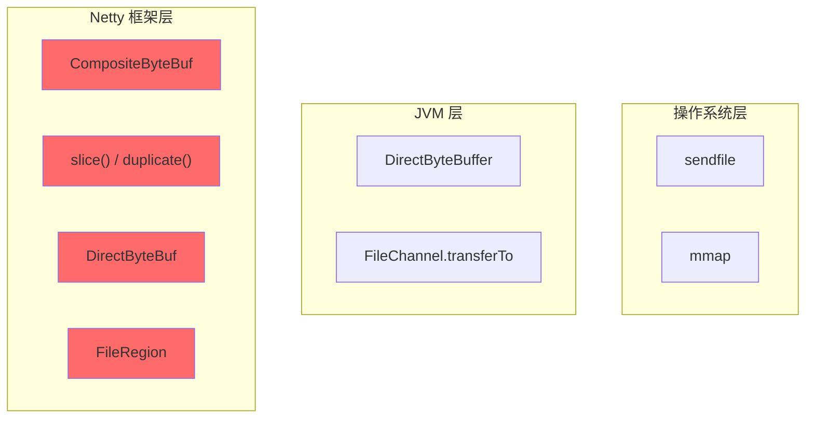
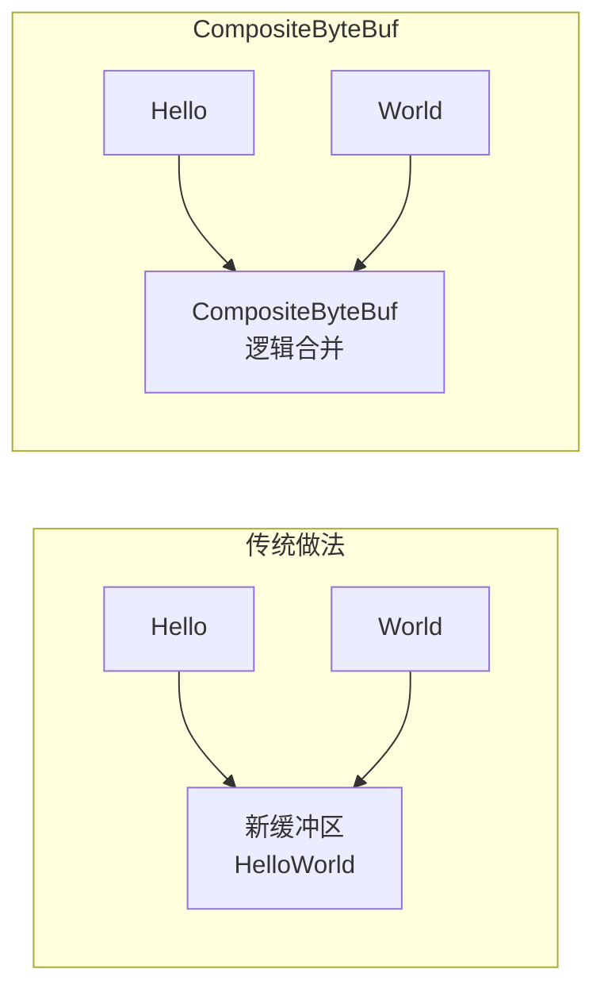
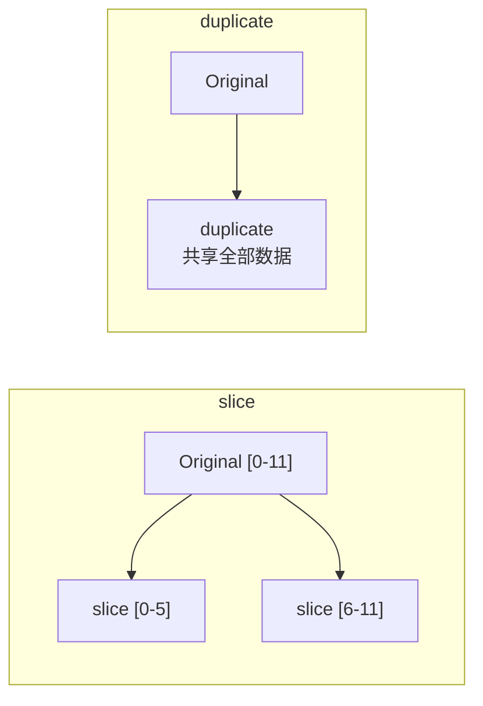
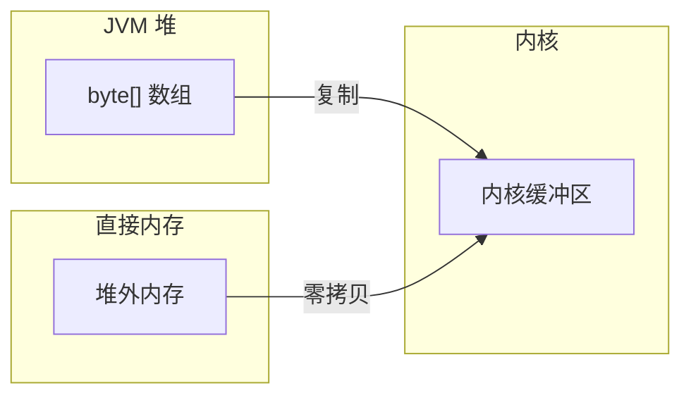
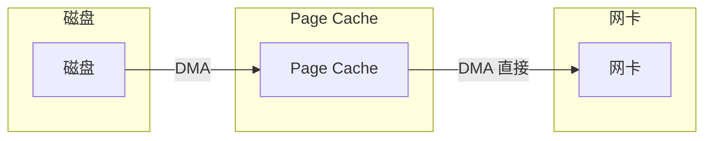

# Netty 零拷贝实现

零拷贝是高性能网络框架的核心技术之一。Netty 不仅利用操作系统的零拷贝特性，还在框架层面实现了自己的零拷贝优化。

理解 Netty 的零拷贝实现，有助于在实战中更好地使用它。

## 零拷贝的层次

Netty 的零拷贝技术分为三个层次：



## CompositeByteBuf：合并多个缓冲区

当需要发送的数据来自多个来源时，传统做法是先把它们复制到一个缓冲区：

```java title="传统做法：复制"
ByteBuf buf1 = Unpooled.buffer(10);
buf1.writeBytes("Hello".getBytes());

ByteBuf buf2 = Unpooled.buffer(10);
buf2.writeBytes("World".getBytes());

// 需要复制到新缓冲区
ByteBuf combined = Unpooled.buffer(20);
combined.writeBytes(buf1);
combined.writeBytes(buf2);
```

CompositeByteBuf 可以逻辑上合并多个缓冲区，不需要复制：

```java title="CompositeByteBuf：逻辑合并"
CompositeByteBuf composite = Unpooled.compositeBuffer();

// 添加多个缓冲区，不复制数据
composite.addComponents(buf1, buf2);

// 或使用 builder 模式
CompositeByteBuf composite = Unpooled.compositeBuffer()
    .addComponents(true, buf1, buf2);
```



## slice() 与 duplicate()：共享底层数据

Netty 的 ByteBuf 支持切片和复制视图，底层数据共享，不复制：

```java title="slice：获取只读视图"
ByteBuf original = Unpooled.buffer(1024);
original.writeBytes("Hello World".getBytes());

// 获取前 5 个字节的切片
ByteBuf slice = original.slice(0, 5);

// slice 和 original 共享底层数据
System.out.println(slice.toString());  // "Hello"
```

```java title="duplicate：获取完整副本视图"
ByteBuf original = Unpooled.buffer(1024);

// 获取完整副本视图
ByteBuf duplicate = original.duplicate();

// 修改 duplicate 会影响 original（共享数据）
duplicate.setByte(0, 'h');
```



## DirectByteBuf：堆外内存

Netty 默认使用堆外内存（DirectByteBuffer），避免 JVM 堆和内核之间的数据复制：

```java
// 堆内存缓冲区
ByteBuf heapBuf = Unpooled.buffer(1024);

// 直接内存缓冲区（默认）
ByteBuf directBuf = Unpooled.directBuffer(1024);

// PooledByteBuf（推荐）
ByteBuf pooledBuf = ctx.alloc().directBuffer(1024);
```



**实战经验**：Netty 默认使用堆外内存的池化 ByteBuf，这是因为：
1. 网络 I/O 需要与内核交换数据
2. 堆外内存避免了一次 JVM 堆到内核的复制
3. 内存池减少 GC 压力

## FileRegion：文件传输零拷贝

Netty 使用 FileRegion 实现文件到网络的零拷贝传输：

```java title="文件传输示例"
FileInputStream in = new FileInputStream("bigfile.zip");
FileChannel fileChannel = in.getChannel();

// 使用 DefaultFileRegion，底层调用 sendfile
DefaultFileRegion region = new DefaultFileRegion(
    fileChannel, 0, fileChannel.size()
);

// 直接发送到 Channel
ctx.writeAndFlush(region);
```



FileRegion 利用操作系统的 sendfile 系统调用，数据完全在内核空间传输，不需要进入用户空间。

### 支持零拷贝的文件类型

FileRegion 的零拷贝能力取决于文件系统：

| 文件系统 | 零拷贝 | 说明 |
| --- | --- | --- |
| 本地文件系统（ext4/xfs） | 支持 | 直接使用 sendfile |
| NFS | 部分支持 | 可能需要复制到内核缓冲区 |
| CIFS/SMB | 不支持 | 总是需要复制 |

## chunk()：大文件分块传输

对于超大文件，Netty 支持分块传输：

```java title="分块传输"
FileInputStream in = new FileInputStream("hugefile.zip");
FileChannel fileChannel = in.getChannel();
long fileSize = fileChannel.size();
long position = 0;

while (position < fileSize) {
    long chunkSize = Math.min(DEFAULT_CHUNK_SIZE, fileSize - position);

    // 每个 Chunk 都使用零拷贝
    DefaultFileRegion region = new DefaultFileRegion(
        fileChannel, position, chunkSize
    );

    ctx.writeAndFlush(region);

    position += chunkSize;
}
```

## Netty 零拷贝最佳实践

### 避免不必要的复制

```java title="错误示例"
ByteBuf buf = Unpooled.buffer();
for (byte b : data) {
    buf.writeByte(b);  // 逐字节写入，可能触发多次扩容复制
}
```

```java title="正确示例"
ByteBuf buf = Unpooled.buffer(data.length);
buf.writeBytes(data);  // 一次性写入，减少复制
```

### 使用合适的缓冲区类型

```java title="推荐配置"
EventLoopGroup group = new NioEventLoopGroup();

Bootstrap bootstrap = new Bootstrap();
bootstrap.group(group)
    .option(ChannelOption.ALLOCATOR, PooledByteBufAllocator.DEFAULT)  // 池化
    .option(ChannelOption.TCP_NODELAY, true)  // 禁用 Nagle
    .option(ChannelOption.SO_KEEPALIVE, true);  // TCP 保活
```

### 正确释放 ByteBuf

```java title="释放 ByteBuf"
@Override
public void channelRead(ChannelHandlerContext ctx, Object msg) {
    if (msg instanceof ByteBuf) {
        ByteBuf buf = (ByteBuf) msg;
        try {
            // 处理数据
            process(buf);
        } finally {
            buf.release();  // 必须释放！
        }
    }
}
```

## 零拷贝的性能收益

| 操作 | 传统做法 | Netty 零拷贝 | 收益 |
| --- | --- | --- | --- |
| 合并缓冲区 | 2次拷贝 | 0次拷贝 | 减少 100% 拷贝 |
| 文件传输 | 4次拷贝 | 2次拷贝 | 减少 50% 拷贝 |
| 内存池 | 每次 new | 复用 | 减少 GC |

## 本章小结

Netty 在框架层面实现了多种零拷贝优化：
- **CompositeByteBuf**：逻辑合并多个缓冲区，无需复制
- **slice()/duplicate()**：共享底层数据，创建视图
- **DirectByteBuf**：堆外内存，减少 JVM 堆到内核的复制
- **FileRegion**：利用 sendfile，文件到网卡零拷贝

正确使用 Netty 的零拷贝特性，可以显著提升网络传输性能。

## 延伸思考

既然零拷贝这么好，为什么不把所有数据都放在堆外内存？

堆外内存有几个问题：
1. **分配成本高**：需要调用系统函数，比 JVM 堆分配慢
2. **释放成本高**：不能靠 GC，必须手动释放或等 DirectByteBuffer 被 GC
3. **调试困难**：堆外内存不在 JVM 的管理范围内

Netty 的解决方案是**池化**：分配后不释放，而是放回池中复用。这既保留了零拷贝的优势，又避免了频繁分配释放的开销。
