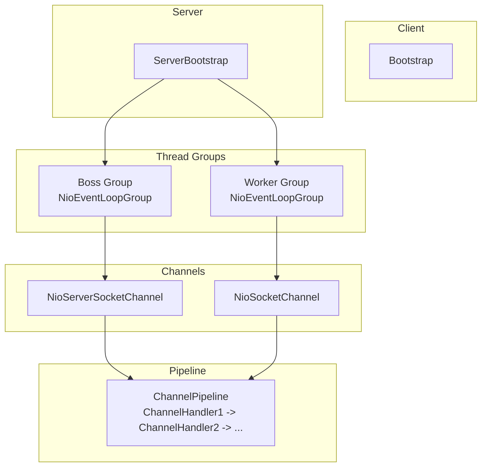
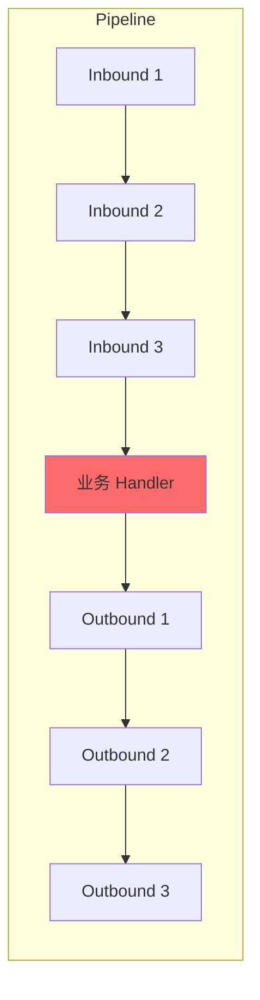
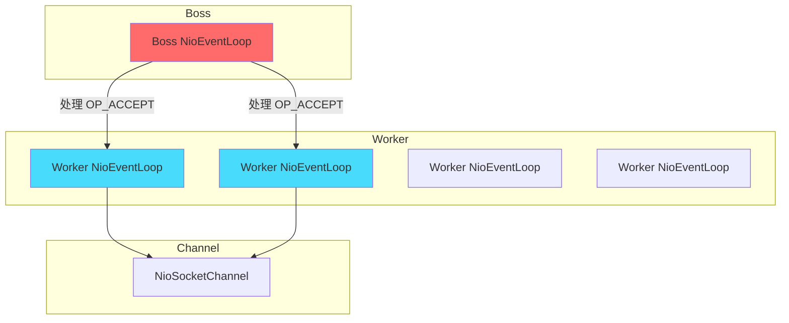

# Netty 架构深度解析

JDK NIO 很好，但直接使用它有几个明显的问题：
- `ByteBuffer` 使用繁琐，需要手动管理 flip、clear
- 半包、粘包问题需要自己处理
- 异常场景多，代码容易出 bug
- Selector 的空轮询 bug 在某些 JDK 版本上存在

Netty 在 NIO 基础上做了大量封装，提供了更易用的 API、更可靠的行为、更高的性能。它是高性能网络编程的事实标准。

## Netty 的核心优势

Netty 能成为行业标准，靠的不只是"封装 NIO"这么简单：

**零拷贝**。支持 CompositeByteBuf、DirectBuffer、FileRegion，最大化利用操作系统的零拷贝能力。

**内存池**。PooledByteBuf 基于jemalloc 实现的高效内存池，减少 GC 压力。

**统一的异步 API**。所有 I/O 操作都是异步的，即使底层使用同步 I/O。

**丰富的编解码器**。内置 HTTP/Redis/MySQL/Protobuf 等协议编解码器，开箱即用。

**事件驱动**。基于 ChannelPipeline 和 ChannelHandler 的事件处理模型，职责清晰，易于扩展。

## Netty 架构总览



### Boss Group vs Worker Group

- **Boss Group**：负责处理连接建立（OP_ACCEPT）。通常只需要 1 个线程。
- **Worker Group**：负责处理读写事件（OP_READ/OP_WRITE）。线程数通常等于 CPU 核心数的 2 倍。

```java title="服务端启动"
EventLoopGroup bossGroup = new NioEventLoopGroup(1);  // 1 个 Boss 线程
EventLoopGroup workerGroup = new NioEventLoopGroup();  // 默认 CPU×2

ServerBootstrap bootstrap = new ServerBootstrap();
bootstrap.group(bossGroup, workerGroup)  // 设置线程组
    .channel(NioServerSocketChannel.class)  // 使用 NIO
    .childHandler(new ChannelInitializer<SocketChannel>() {
        @Override
        protected void initChannel(SocketChannel ch) {
            ch.pipeline().addLast(
                new HttpServerCodec(),
                new HttpObjectAggregator(65536),
                new BusinessHandler()
            );
        }
    });

ChannelFuture f = bootstrap.bind(8080).sync();
System.out.println("服务器启动，监听端口 8080");
```

## ChannelPipeline：责任链模式

ChannelPipeline 是 Netty 处理消息的核心组件，采用责任链模式：



- **Inbound Handler**：处理入站事件（数据接收、连接建立等），从头部向尾部传播
- **Outbound Handler**：处理出站事件（数据发送、连接关闭等），从尾部向头部传播

```java title="自定义 Handler"
public class MyServerHandler extends ChannelInboundHandlerAdapter {

    @Override
    public void channelRead(ChannelHandlerContext ctx, Object msg) {
        ByteBuf in = (ByteBuf) msg;
        System.out.println("收到: " + in.toString(StandardCharsets.UTF_8));

        // 响应客户端
        ByteBuf out = ctx.alloc().buffer();
        out.writeBytes("Hello Client".getBytes());
        ctx.writeAndFlush(out);
    }

    @Override
    public void exceptionCaught(ChannelHandlerContext ctx, Throwable cause) {
        cause.printStackTrace();
        ctx.close();
    }
}
```

## ByteBuf：超越 ByteBuffer

Netty 实现了自己的 ByteBuf，解决了 JDK ByteBuffer 的三个问题：

### 问题一：无需手动 flip

```java title="JDK ByteBuffer"
ByteBuffer buffer = ByteBuffer.allocate(1024);
buffer.put(data);  // 写入
buffer.flip();     // 必须 flip 才能读
buffer.get();      // 读取
```

```java title="Netty ByteBuf"
ByteBuf buffer = Unpooled.buffer(1024);
buffer.writeBytes(data);  // 写入
buffer.readableBytes();   // 有多少数据可读
buffer.readByte();        // 读取
```

### 问题二：支持动态扩容

```java
ByteBuf buffer = Unpooled.buffer(16);
buffer.writeBytes(largeData);  // 自动扩容
```

### 问题三：引用计数与池化

```java
ByteBuf buffer = ctx.alloc().buffer();
try {
    // 使用 buffer
} finally {
    buffer.release();  // 释放回池
}
```

Netty 的 ByteBuf 支持引用计数：
- `retain()`：增加引用计数
- `release()`：减少引用计数
- 计数为 0 时归还内存池

### Pooled vs Unpooled

```java
// 池化（推荐用于高频场景）
ByteBuf pooled = ctx.alloc().buffer(1024);  // 从池中获取

// 非池化（每次创建新对象）
ByteBuf unpooled = Unpooled.buffer(1024);  // 每次 new
```

## ChannelHandler：编解码与业务处理

Netty 提供了丰富的内置 Handler：

### 编解码器

```java title="HTTP 编解码"
ch.pipeline().addLast(
    new HttpServerCodec(),        // HTTP 编解码
    new HttpObjectAggregator(65536),  // 聚合 HTTP 消息
    new HttpServerHandler()       // 业务处理
);
```

### 协议编解码

```java title="Protobuf 编解码"
ch.pipeline().addLast(
    new ProtobufEncoder(),        // Protobuf 编码
    new ProtobufDecoder(...),     // Protobuf 解码
    new BusinessHandler()         // 业务处理
);
```

### 心跳检测

```java title="心跳 Handler"
ch.pipeline().addLast("heartbeat", new IdleStateHandler(
    60,  // 读空闲 60 秒
    45,  // 写空闲 45 秒
    30   // 读写空闲 30 秒
));

ch.pipeline().addLast("heartbeatHandler", new HeartbeatHandler());
```

## Netty 的线程模型

Netty 基于 Reactor 模式实现：



**Boss NioEventLoop**：
- 监听端口，接收新连接
- 把新连接注册到 Worker

**Worker NioEventLoop**：
- 处理连接的读写事件
- 执行 ChannelPipeline 中的 Handler

### NioEventLoop 的职责

```java
class NioEventLoop implements Runnable {
    Selector selector;
    Queue<Runnable> taskQueue;

    public void run() {
        while (!terminated) {
            // 1. 监听 I/O 事件
            int ready = selector.select();

            // 2. 处理 I/O 事件
            processSelectedKeys();

            // 3. 处理异步任务
            runAllTasks();
        }
    }
}
```

NioEventLoop 同时负责：
- I/O 事件处理
- 异步任务执行（定时任务、用户提交的任务）

## Netty 启动流程

```java title="完整示例"
public class NettyServer {

    public static void main(String[] args) throws Exception {
        // 1. 创建线程组
        EventLoopGroup bossGroup = new NioEventLoopGroup(1);
        EventLoopGroup workerGroup = new NioEventLoopGroup();

        try {
            // 2. 创建启动器
            ServerBootstrap bootstrap = new ServerBootstrap();
            bootstrap.group(bossGroup, workerGroup)
                .channel(NioServerSocketChannel.class)
                .option(ChannelOption.SO_BACKLOG, 1024)           // 连接队列大小
                .childOption(ChannelOption.SO_KEEPALIVE, true)     // TCP 保活
                .childOption(ChannelOption.TCP_NODELAY, true)      // 禁用 Nagle
                .childHandler(new ChannelInitializer<SocketChannel>() {
                    @Override
                    protected void initChannel(SocketChannel ch) {
                        ch.pipeline().addLast(
                            new LineBasedFrameDecoder(1024),  // 按行分割
                            new StringDecoder(StandardCharsets.UTF_8),
                            new BusinessHandler()
                        );
                    }
                });

            // 3. 绑定端口
            ChannelFuture f = bootstrap.bind(8080).sync();
            System.out.println("服务器启动，监听端口 8080");

            // 4. 等待服务器关闭
            f.channel().closeFuture().sync();
        } finally {
            // 5. 优雅关闭
            bossGroup.shutdownGracefully();
            workerGroup.shutdownGracefully();
        }
    }
}
```

## 本章小结

Netty 是高性能网络编程的首选框架：
- **ByteBuf**：池化、动态扩容、引用计数的缓冲区
- **ChannelPipeline**：责任链模式的事件处理
- **Reactor 线程模型**：Boss Group + Worker Group
- **丰富内置组件**：编解码器、心跳、协议支持

下一章我们将深入学习 Netty 的线程模型，理解 EventLoop 的工作原理。

## 延伸思考

为什么 Netty 的 ByteBuf 要设计引用计数？

根本原因是为了**精确管理内存释放**。在高性能场景下，GC 是最大的敌人之一。通过引用计数，可以：
1. 精确控制内存释放时机
2. 避免过早释放导致的 use-after-free
3. 配合内存池实现高效复用

这与 C/C++ 的智能指针（如 `shared_ptr`）是同样的思想。
