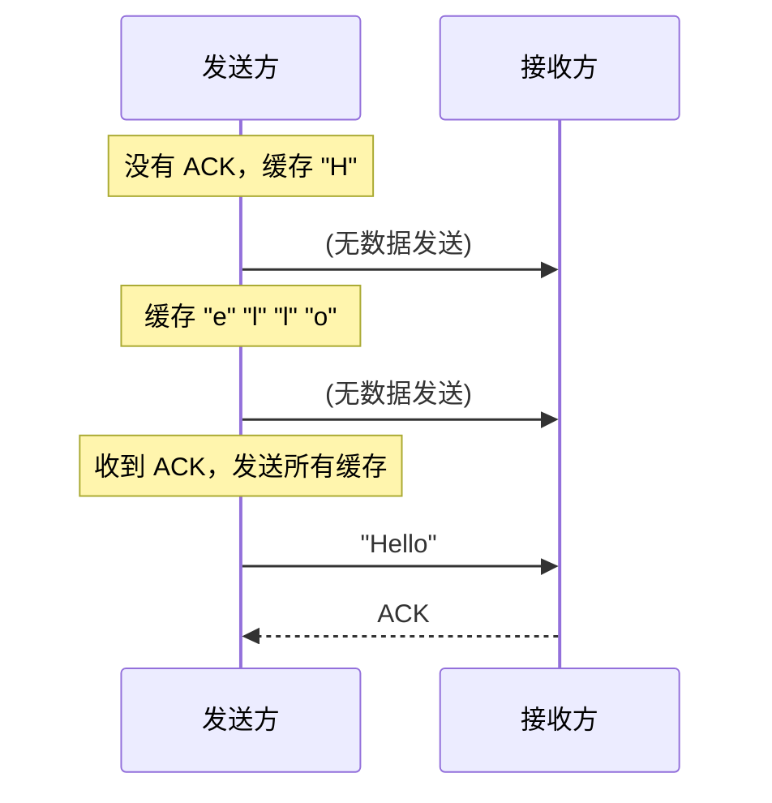
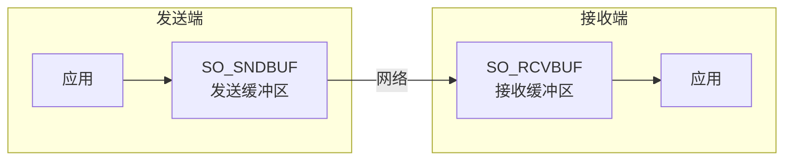
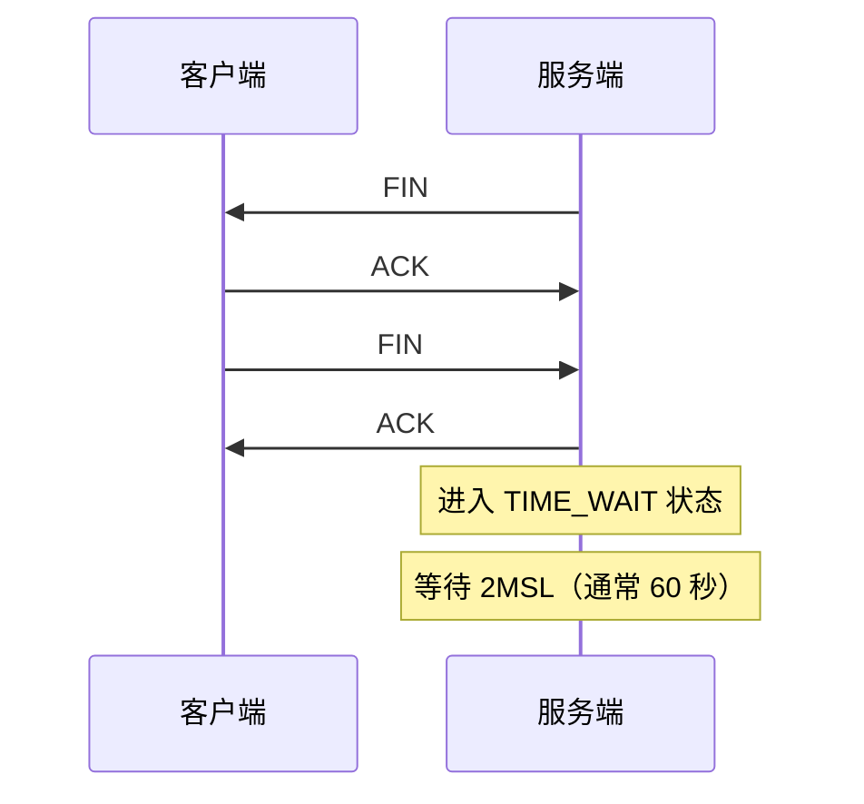
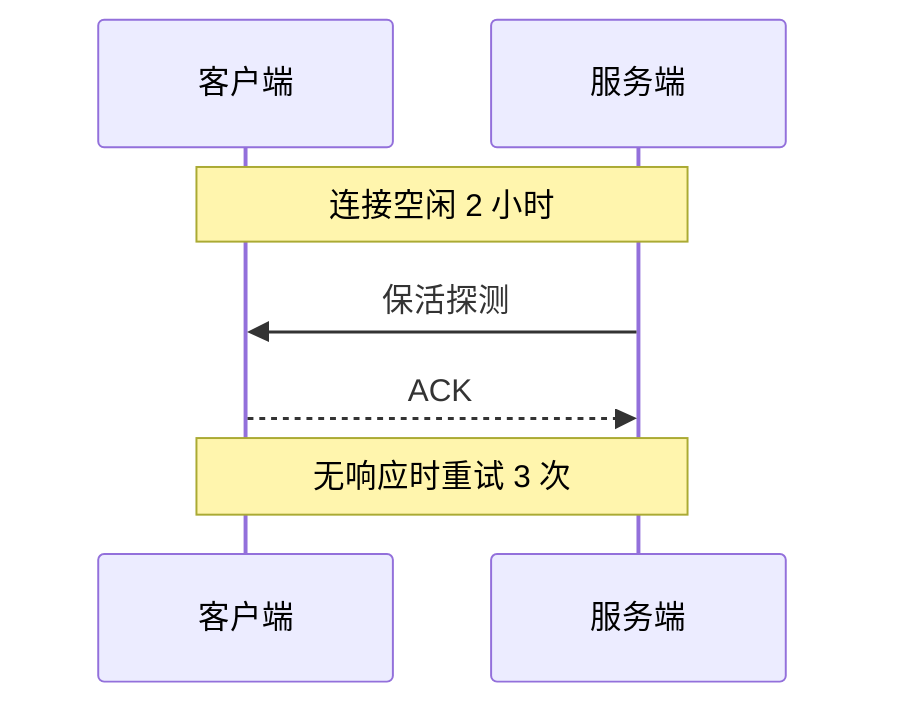
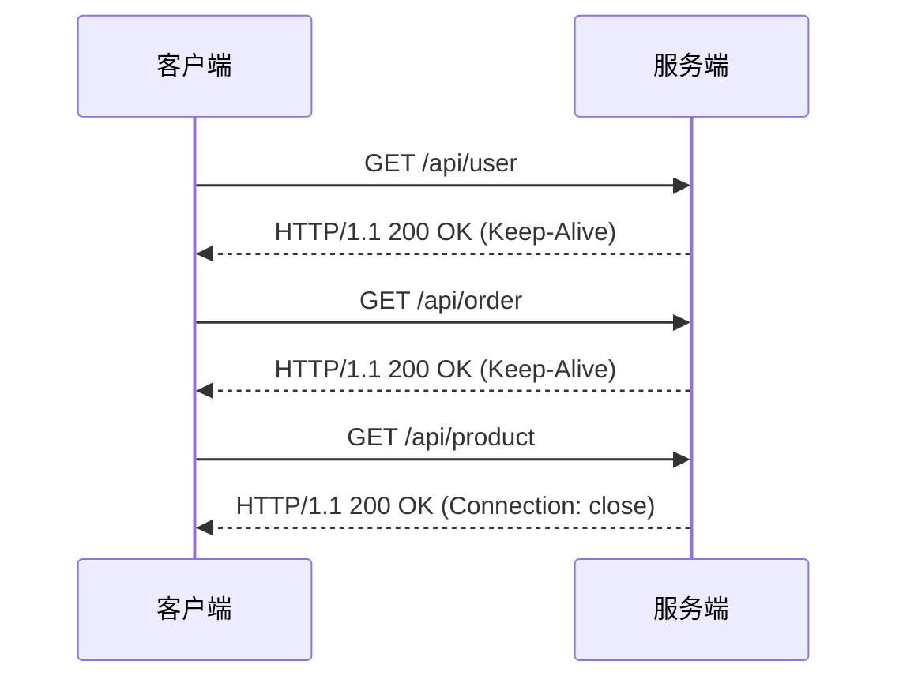

# 网络 I/O 优化

网络 I/O 是分布式系统的生命线。一次网络请求可能涉及多次往返、数据包组装、拥塞控制等环节。理解并优化网络 I/O，是提升系统性能的关键。

## Nagle 算法

Nagle 算法是 TCP 协议的一个特性，目的是减少小包数量，提高网络效率。

### 算法原理

Nagle 算法会缓存小数据包，直到收到 ACK 或缓冲区满了才发送：



**问题**：对于低延迟应用（如 RPC），等待 ACK 会增加延迟。

### 禁用 Nagle

```java
Socket socket = new Socket();

// 禁用 Nagle 算法，降低延迟
socket.setTcpNoDelay(true);
```

```java title="Netty 中的配置"
bootstrap.option(ChannelOption.TCP_NODELAY, true);
```

### 适用场景

| 场景 | 建议 | 原因 |
| --- | --- | --- |
| RPC 调用 | 禁用 Nagle | 低延迟优先 |
| 实时游戏 | 禁用 Nagle | 低延迟优先 |
| Web 页面 | 启用 Nagle | 吞吐量优先 |
| 文件传输 | 启用 Nagle | 吞吐量优先 |

## TCP_NODELAY 与延迟

启用 Nagle 算法后，TCP 会等待数据积累到一定量再发送：

```
# Nagle 启用：等待数据积累
小数据包1 -> [等待] -> 小数据包2 -> [等待] -> 发送

# Nagle 禁用（TCP_NODELAY）：立即发送
小数据包1 -> 立即发送
小数据包2 -> 立即发送
```

对于需要低延迟的场景：

```java
// 禁用 Nagle
socket.setTcpNoDelay(true);
```

## SO_SNDBUF 与 SO_RCVBUF

TCP 套接字有发送缓冲区和接收缓冲区：



### 缓冲区大小调优

```java title="设置缓冲区大小"
Socket socket = new Socket();

// 增大发送缓冲区
socket.setSendBufferSize(64 * 1024);

// 增大接收缓冲区
socket.setReceiveBufferSize(64 * 1024);

// 查询实际值
int sendBufSize = socket.getSendBufferSize();
int recvBufSize = socket.getReceiveBufferSize();
```

### 适用场景

| 场景 | 缓冲区建议 | 原因 |
| --- | --- | --- |
| 大文件传输 | 大缓冲区 | 减少系统调用 |
| 高并发短连接 | 小缓冲区 | 节省内存 |
| 实时交互 | 中等缓冲区 | 平衡延迟和吞吐 |

### 系统限制

```bash
# 查看系统最大缓冲区大小
cat /proc/sys/net/core/rmem_max
cat /proc/sys/net/core/wmem_max

# 临时修改
echo 26214400 > /proc/sys/net/core/rmem_max
```

## SO_REUSEADDR：地址复用

TIME_WAIT 状态下，端口无法立即重用：



```java title="启用地址复用"
ServerSocket serverSocket = new ServerSocket();
serverSocket.setReuseAddress(true);
serverSocket.bind(new InetSocketAddress(8080));
```

```java title="Netty 中的配置"
bootstrap.option(ChannelOption.SO_REUSEADDR, true);
```

**场景**：服务器重启时，如果端口还在 TIME_WAIT 状态，可以立即重新绑定。

## TCP 保活（SO_KEEPALIVE）

TCP 保活用于检测连接是否还存活：



```java title="启用 TCP 保活"
Socket socket = new Socket();
socket.setKeepAlive(true);
```

### 保活参数

```bash
# 查看参数
cat /proc/sys/net/ipv4/tcp_keepalive_time   # 空闲多久开始探测（秒）
cat /proc/sys/net/ipv4/tcp_keepalive_intvl  # 探测间隔（秒）
cat /proc/sys/net/ipv4/tcp_keepalive_probes # 探测次数

# 修改（/etc/sysctl.conf）
net.ipv4.tcp_keepalive_time = 60
net.ipv4.tcp_keepalive_intvl = 10
net.ipv4.tcp_keepalive_probes = 5
```

## 连接复用（HTTP/1.1 Keep-Alive）

HTTP/1.1 默认启用 Keep-Alive，一个 TCP 连接可以发送多个请求：



### 连接复用与 HTTP/2

HTTP/2 通过多路复用，在一个连接上并行处理多个请求：

```
HTTP/1.1: 3个请求 = 3个连接 或 串行处理
HTTP/2: 3个请求 = 1个连接 + 并行处理
```

## 网络 I/O 调优检查清单

### JVM 参数

```bash
# 堆外内存（用于 NIO 直接缓冲区）
java -XX:MaxDirectMemorySize=1g

# G1 垃圾回收器
java -XX:+UseG1GC
```

### TCP 参数

```bash
# /etc/sysctl.conf 优化
net.ipv4.tcp_tw_reuse = 1              # 复用 TIME_WAIT 连接
net.ipv4.tcp_fin_timeout = 30          # 减少 FIN 超时
net.ipv4.tcp_slow_start_after_idle = 0 # 禁用空闲后的拥塞窗口收缩
net.core.somaxconn = 65535             # 最大连接队列
net.ipv4.tcp_max_syn_backlog = 65535   # SYN 队列大小
```

### 文件描述符

```bash
# 查看当前限制
ulimit -n

# 临时修改
ulimit -n 65535

# 永久修改（/etc/security/limits.conf）
* soft nofile 65535
* hard nofile 65535
```

## 本章小结

网络 I/O 优化的核心要点：
- **Nagle 算法**：低延迟场景禁用，高吞吐场景启用
- **缓冲区大小**：大文件传输用大缓冲区，高并发用小缓冲区
- **地址复用**：服务器重启场景启用 SO_REUSEADDR
- **TCP 保活**：检测空闲连接，及时清理

## 延伸思考

为什么现代 RPC 框架（如 gRPC）默认禁用 Nagle？

因为 RPC 的特点是：
- 请求频繁但数据量小
- 延迟敏感（每次 RPC 都在等待）
- 吞吐量要求高

在这些场景下，Nagle 的"合并小包"反而会增加不必要的延迟。禁用 Nagle 可以让每个 RPC 请求立即发送，虽然会发送更多小包，但换来了更低的延迟。
