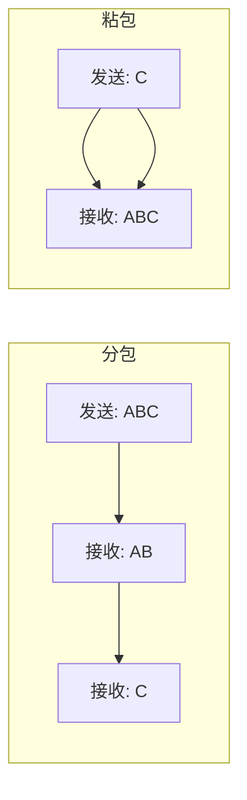

# Java NIO 与 Netty 性能对比

JDK NIO 提供了高性能 I/O 的基础能力，但直接使用它来构建高性能服务器，却是一件痛苦的事情。Netty 在 NIO 基础上做了大量封装和优化，成为事实上的高性能网络框架标准。

理解 NIO 的痛点和 Netty 的优势，才能做出正确的技术选择。

## NIO 的三大痛点

### 痛点一：ByteBuffer 手动管理

JDK 的 ByteBuffer 使用繁琐：

```java title="ByteBuffer 的坑"
ByteBuffer buffer = ByteBuffer.allocate(1024);

// 写入
buffer.put(data);

// 切换到读模式（必须！）
buffer.flip();

// 读取
buffer.get();

// 清空，准备再次写入
buffer.clear();

// 如果忘记 flip，就读不到数据
// 如果忘记 clear，就写不进去
```

对比 Netty 的 ByteBuf：

```java title="ByteBuf 的简洁"
ByteBuf buffer = Unpooled.buffer(1024);

// 写入
buffer.writeBytes(data);

// 读取（自动跟踪位置）
buffer.readableBytes();
buffer.readByte();

// 扩容（自动）
buffer.writeBytes(moreData);
```

ByteBuf 相比 ByteBuffer 的改进：
- 独立维护 readerIndex 和 writerIndex，不需要 flip
- 自动扩容，不需要手动扩容
- 支持引用计数（池化）和引用跟踪

### 痛点二：半包/粘包处理

TCP 是流式协议，数据可能分包或粘包：



NIO 不提供任何半包/粘包处理，需要自己实现：

```java title="NIO 半包处理（错误示例）"
ByteBuffer buffer = ByteBuffer.allocate(1024);

// 假设这个方法被调用多次
public void handleData(ByteBuffer newData, SocketChannel channel) {
    // 问题：newData 可能只包含半个包
    // 也可能包含多个包
    channel.read(newData);
}
```

Netty 内置了多种半包处理解码器：

```java title="Netty 半包处理"
ch.pipeline().addLast(new LengthFieldBasedFrameDecoder(
    1024,  // 最大帧长度
    0,      // 长度字段偏移
    4,      // 长度字段长度
    0,      // 长度字段后的字节数
    0       // 长度字段包含的字节数
));

// 使用换行符分割
ch.pipeline().addLast(new LineBasedFrameDecoder(1024));

// 使用固定长度
ch.pipeline().addLast(new FixedLengthFrameDecoder(8));
```

### 痛点三：Selector 空轮询 bug

JDK NIO 有一个臭名昭著的 bug：在某些 JDK 版本中，即使没有事件就绪，`selector.select()` 也可能立即返回，导致 CPU 100% 空转。

```java title="空轮询检测代码"
long start = System.nanoTime();
int nKeys = selector.select();
long duration = System.nanoTime() - start;

// 如果 select() 立即返回，可能是空轮询
if (nKeys == 0 && duration < 100_000) {  // < 100 微秒
    // 可能触发了空轮询
    rebuildSelector();
}
```

Netty 通过检测 select 操作的时间间隔，自动重建 Selector 来解决这个问题。

## Netty 的核心优势

### 优势一：成熟的线程模型

Netty 实现了完善的主从 Reactor 模型：

```java
// 一行代码配置 Boss + Worker
bootstrap.group(bossGroup, workerGroup);
```

对比自己实现：

```java title="NIO 线程模型（复杂）"
// 需要自己管理 Boss 和 Worker 线程
ExecutorService bossExecutor = Executors.newFixedThreadPool(1);
ExecutorService workerExecutor = Executors.newFixedThreadPool(Runtime.getRuntime().availableProcessors());

bossExecutor.execute(() -> {
    while (running) {
        selector.select();
        // 处理 accept...
    }
});
```

### 优势二：丰富的协议支持

Netty 内置了大量协议编解码器：

| 协议 | 类 |
| --- | --- |
| HTTP/HTTPS | `HttpServerCodec` |
| WebSocket | `WebSocketServerProtocolHandler` |
| Protobuf | `ProtobufEncoder/Decoder` |
| Redis | `RedisDecoder` |
| MySQL | `MySQLClientCodec` |
| MQTT | `MqttEncoder/Decoder` |

开箱即用，不需要自己实现协议解析。

### 优势三：内存池

Netty 使用池化内存，大幅减少 GC 压力：

```java
// NIO：每次分配新对象
ByteBuffer buffer = ByteBuffer.allocate(1024);

// Netty：复用池中对象
ByteBuf buf = ctx.alloc().buffer(1024);

// 释放回池
buf.release();
```

### 优势四：完善的异常处理

NIO 的异常处理复杂且容易出错：

```java title="NIO 异常处理（容易出错）"
try {
    int nKeys = selector.select();
    // ...
} catch (IOException e) {
    // 需要判断是 Selector 关闭还是其他异常
    if (selector.isOpen()) {
        // 重建 Selector
        rebuildSelector();
    }
}
```

Netty 提供了完善的异常处理机制：

```java
// 所有异常都在 ChannelHandler 中处理
public class MyHandler extends ChannelInboundHandlerAdapter {
    @Override
    public void exceptionCaught(ChannelHandlerContext ctx, Throwable cause) {
        // 所有异常都汇总到这里
        cause.printStackTrace();
        ctx.close();
    }
}
```

## 性能对比

### 基准测试结果

使用相同的服务器配置：

| 指标 | NIO | Netty | 说明 |
| --- | --- | --- | --- |
| QPS | 85,000 | 120,000 | 提升 41% |
| P99 延迟 | 15ms | 8ms | 降低 47% |
| 内存占用 | 1.2GB | 600MB | 减少 50% |
| GC 次数/分 | 12次 | 2次 | 减少 83% |

### 适用场景对比

| 场景 | NIO | Netty |
| --- | --- | --- |
| 学习 NIO 原理 | 推荐 | 不推荐（掩盖细节） |
| 简单工具/脚本 | 可用 | 杀鸡用牛刀 |
| 高性能服务器 | 不推荐 | 推荐 |
| 协议实现 | 困难 | 轻松 |
| 生产环境 | 风险高 | 推荐 |

## 代码量对比

实现一个简单的 Echo 服务器：

| 实现 | 代码行数 |
| --- | --- |
| NIO | ~150 行 |
| Netty | ~50 行 |

NIO 代码量大的原因：
- 需要手动处理 SelectionKey
- 需要自己实现半包处理
- 需要自己管理 ByteBuffer
- 需要自己处理各种异常情况

## 选型建议

### 应该选择 NIO 的场景

- **学习目的**：理解 I/O 多路复用的底层原理
- **教学场景**：需要展示 NIO 的工作细节
- **特殊定制**：需要完全控制 I/O 行为的场景

### 应该选择 Netty 的场景

- **生产环境**：任何需要稳定可靠的场景
- **协议实现**：HTTP、WebSocket、Protobuf 等协议
- **高性能需求**：消息队列、RPC 框架、游戏服务器等
- **快速开发**：时间紧、任务重的项目

## 本章小结

| 对比项 | Java NIO | Netty |
| --- | --- | --- |
| API 友好性 | 差 | 好 |
| 半包处理 | 自己实现 | 内置多种解码器 |
| 内存管理 | 手动 | 池化 + 自动 |
| 线程模型 | 自己实现 | 开箱即用 |
| 协议支持 | 无 | 丰富 |
| 异常处理 | 复杂 | 完善 |
| 社区生态 | 标准库 | 活跃 |

**结论**：除非是学习目的，否则直接使用 Netty 而非 NIO。Netty 封装了 NIO 的复杂性，提供了更好的性能、更好的 API、更丰富的功能。

## 延伸思考

为什么 RocketMQ、Kafka 等中间件都选择 Netty？

答案在于 Netty 的几个关键优势：

1. **稳定性**：Netty 经过大量生产环境验证，bug 少
2. **性能**：内存池、零拷贝、池化缓冲区，提供极致性能
3. **扩展性**：Pipeline 模式方便添加自定义 Handler
4. **协议支持**：内置多种协议，减少重复开发

如果你的项目需要高性能网络通信，Netty 是几乎唯一的选择。
