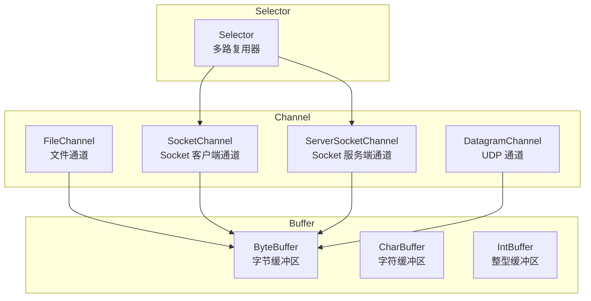
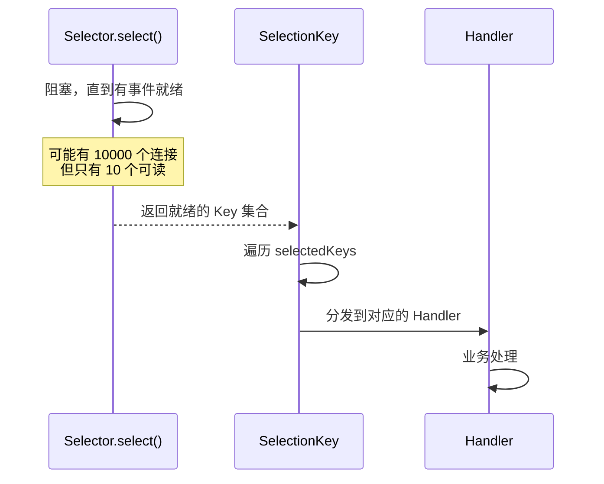

# 非阻塞 I/O（NIO）

BIO 的问题是：每个连接需要一个线程，线程是重量级资源。有没有办法让一个线程管理多个连接？

答案是 I/O 多路复用。但 Java 1.4 引入的 NIO，并不仅仅是"多路复用"，而是一整套全新的 I/O 抽象。它的核心思想是：**基于事件驱动，使用更少的线程处理更多的连接**。

## NIO 核心组件

NIO 有三个核心组件：Channel（通道）、Buffer（缓冲区）、Selector（选择器）。



### Channel：数据流动的双向通道

BIO 中的 Stream 是单向的：InputStream 只读，OutputStream 只写。NIO 的 Channel 是双向的，既可以读也可以写。

```java
// 创建 ServerSocketChannel
ServerSocketChannel serverChannel = ServerSocketChannel.open();

// 绑定端口
serverChannel.socket().bind(new InetSocketAddress(8080));

// 设置为非阻塞模式（关键！）
serverChannel.configureBlocking(false);

// 创建 Selector
Selector selector = Selector.open();

// 注册 Channel，监听 OP_ACCEPT 事件
serverChannel.register(selector, SelectionKey.OP_ACCEPT);
```

注意 `configureBlocking(false)` 这行代码。设置为非阻塞模式后，`accept()` 和 `read()` 方法会立即返回，而不是一直等待。

### Buffer：数据的读写缓冲区

Buffer 是在内存中开辟的一块连续空间，用于临时存放读写的数据。与 BIO 的 Stream 不同，Buffer 可以双向读写（通过切换模式）。

```java
// 创建一个 ByteBuffer，容量为 1024 字节
ByteBuffer buffer = ByteBuffer.allocate(1024);

// 写入数据到 Buffer
buffer.put("Hello".getBytes());

// 切换到读模式
buffer.flip();

// 从 Buffer 读取数据
while (buffer.hasRemaining()) {
    byte b = buffer.get();
    System.out.print((char) b);
}

// 清空 Buffer，可以再次写入
buffer.clear();
```

## NIO 服务器完整示例

```java title="NioServer.java"
public class NioServer {
    public static void main(String[] args) throws IOException {
        // 1. 打开 ServerSocketChannel
        ServerSocketChannel serverChannel = ServerSocketChannel.open();
        serverChannel.socket().bind(new InetSocketAddress(8080));

        // 2. 设置为非阻塞模式
        serverChannel.configureBlocking(false);

        // 3. 创建 Selector
        Selector selector = Selector.open();

        // 4. 将 Channel 注册到 Selector，监听 accept 事件
        serverChannel.register(selector, SelectionKey.OP_ACCEPT);
        System.out.println("服务器启动，监听端口 8080...");

        // 5. 事件循环
        while (true) {
            // 阻塞等待就绪的事件
            int readyChannels = selector.select();
            if (readyChannels == 0) continue;

            // 获取所有就绪的 SelectionKey
            Set<SelectionKey> selectedKeys = selector.selectedKeys();
            Iterator<SelectionKey> keyIterator = selectedKeys.iterator();

            while (keyIterator.hasNext()) {
                SelectionKey key = keyIterator.next();

                if (key.isAcceptable()) {
                    // 处理新连接
                    handleAccept(key);
                } else if (key.isReadable()) {
                    // 处理可读事件
                    handleRead(key);
                }

                // 处理完成后移除，避免重复处理
                keyIterator.remove();
            }
        }
    }

    private static void handleAccept(SelectionKey key) throws IOException {
        ServerSocketChannel server = (ServerSocketChannel) key.channel();
        SocketChannel client = server.accept();
        client.configureBlocking(false);

        // 注册客户端 Channel，监听可读事件
        client.register(key.selector(), SelectionKey.OP_READ);

        System.out.println("新连接: " + client.getRemoteAddress());
    }

    private static void handleRead(SelectionKey key) throws IOException {
        SocketChannel client = (SocketChannel) key.channel();
        ByteBuffer buffer = ByteBuffer.allocate(1024);

        int read = client.read(buffer);
        if (read == -1) {
            // 客户端关闭连接
            client.close();
            System.out.println("连接关闭: " + client.getRemoteAddress());
            return;
        }

        buffer.flip();
        String message = new String(buffer.array(), 0, buffer.limit());
        System.out.println("收到消息: " + message);

        // 响应客户端
        ByteBuffer response = ByteBuffer.wrap(("响应: " + message).getBytes());
        client.write(response);
    }
}
```

## NIO 的工作流程



Selector 的核心优势：**一个线程同时管理多个连接**。当有连接可读或可写时，Selector 会通知应用程序，应用程序再处理这些事件。

## NIO vs BIO

| 特性 | BIO | NIO |
| --- | --- | --- |
| 线程模型 | 一连接一线程 | 单线程 + Selector |
| 阻塞模式 | 全程阻塞 | 非阻塞（select 除外） |
| 并发能力 | 受线程数限制 | 单线程可管理万级连接 |
| API 设计 | 面向流（Stream） | 面向缓冲区（Buffer） |
| 编程复杂度 | 简单直观 | 需要处理半包、状态机 |
| 适用场景 | 低并发 | 高并发 |

## NIO 的三大核心优势

**非阻塞 I/O**。`accept()`、`read()`、`write()` 都不会阻塞调用线程。如果操作无法立即完成，它们会返回特殊值（`null` 或 0），而不是挂起线程。

**选择器（Selector）**。一个 Selector 可以同时监听多个 Channel 的就绪状态。应用程序只需要一个线程来轮询 Selector，而不是为每个连接创建一个线程。

**缓冲区（Buffer）**。数据先写入 Buffer，再从 Buffer 读取。这种设计允许随机访问数据，而不像 Stream 只能顺序读取。

## NIO 的挑战

NIO 并非完美无缺。掌握 NIO 需要克服以下挑战：

**ByteBuffer 手动管理**。不像 BIO 的 Stream 那样简单，需要手动管理 flip、clear 等操作。

**半包问题**。TCP 是流式协议，数据可能分包或粘包。一次 `read()` 可能只读到半个数据包，也可能读到多个数据包拼在一起。

**状态机管理**。与 BIO 每个连接一个线程不同，NIO 需要应用程序自己维护每个连接的状态。这增加了编程复杂度。

这些问题催生了 Netty 这样的高性能框架。Netty 在 NIO 基础上封装了更友好的 API、半包处理、编解码等功能，大大降低了 NIO 的使用门槛。

## 本章小结

NIO 的核心思想是**基于事件驱动的 I/O 多路复用**：通过 Selector 单线程管理多个连接，避免了 BIO 的线程开销问题。

NIO 三大组件的关系：
- Channel 是数据流动的通道
- Buffer 是数据暂存的缓冲区
- Selector 是监听多个 Channel 事件的观察者

下一章我们将深入学习 Selector 的工作原理，以及 epoll/kqueue 等底层实现。

## 延伸思考

NIO 的单线程模型看起来很美好，但单线程处理所有事件，会不会成为新的瓶颈？

答案是肯定的。如果业务处理耗时较长（如数据库查询、外部 API 调用），单线程会被阻塞，其他连接只能等待。解决方案是：在业务处理时将耗时操作交给线程池，业务完成后再回到 Selector 线程继续处理。这正是 Netty 的 Reactor + Worker 线程模型。
