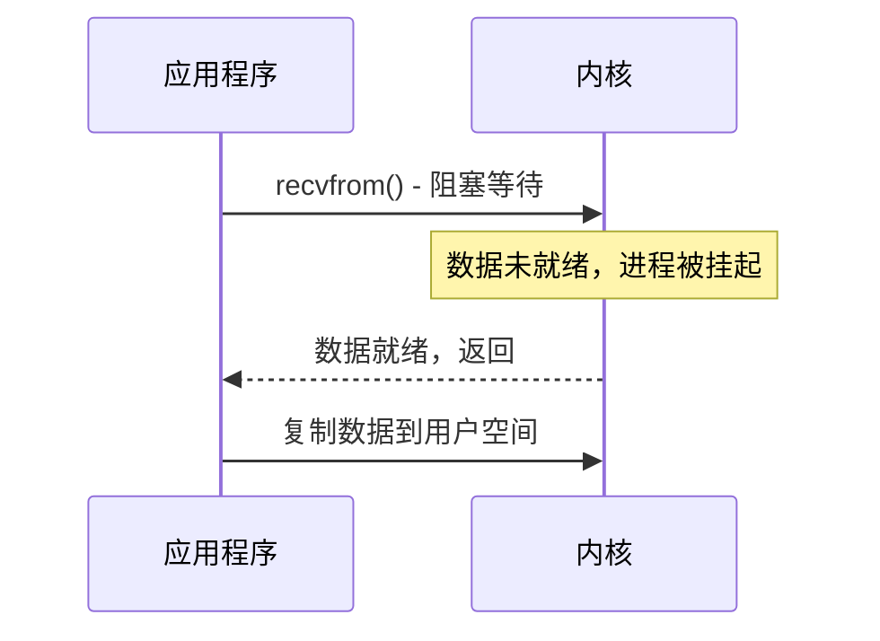
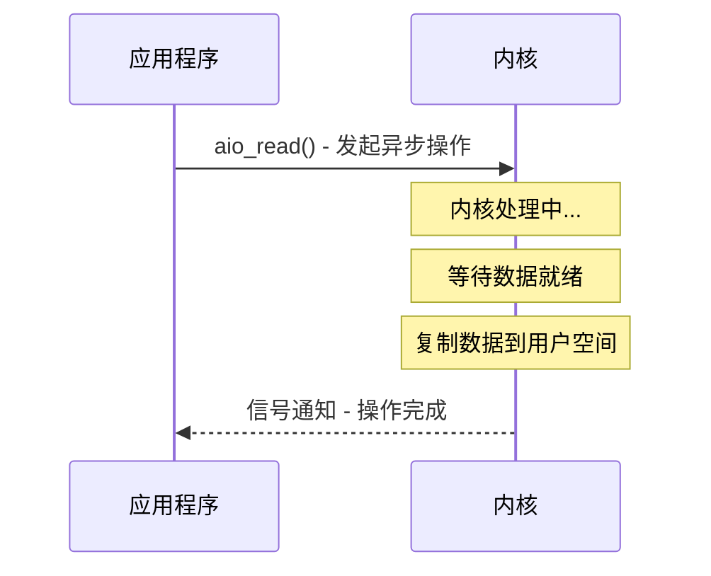

# I/O 模型概述

凌晨 3 点，你打开监控 Dashboard，发现 Tomcat 节点的线程池已经打满，500 个线程全部处于 `BLOCKED` 状态，平均响应时间从 50ms 飙升至 8 秒。业务方不断催促：接口怎么又超时了？你第一反应是数据库慢了，但 DBA 说数据库一切正常、CPU 也很低。

问题到底在哪？翻看线程 dump 后，你发现 500 个线程都在等待同一个 Socket 的数据可读。这不是数据库的问题，而是 I/O 模型的问题。

理解 I/O 模型，是构建高性能系统的必经之路。

## 五种 I/O 模型的定义

操作系统层面定义了五种 I/O 模型，理解它们是掌握高性能 I/O 的基础。

### 阻塞 I/O（BIO）

应用程序发起 `read` 系统调用后，必须等待数据就绪才能返回。在数据到达之前，进程被内核阻塞，CPU 转去执行其他任务。

BIO 的问题：一个 1 万并发的聊天服务器，需要 1 万个线程。线程不是免费的，每个线程需要约 1MB 栈内存，1 万个线程就是 10GB 内存。

### 非阻塞 I/O（NIO）

应用程序发起 `recvfrom` 系统调用后，如果数据未就绪，内核立即返回 `EAGAIN`，而不是阻塞进程。应用程序需要不断轮询询问数据是否就绪。

这种方式避免了线程阻塞，但 CPU 大部分时间浪费在无效轮询上。这是一种用 CPU 换内存的方案，适用于连接数不多但不想阻塞的场景。

### I/O 多路复用

应用程序不再自己轮询，而是委托一个"观察者"（Selector）来监听多个 socket 的状态变化。当某个 socket 可读或可写时，内核通知应用程序。单个线程可以同时管理成百上千个连接。

Linux 下有三种实现：`select`、`poll`、`epoll`。

### 信号驱动 I/O（SIGIO）

应用程序先向内核注册一个信号处理函数，然后立即返回。当数据就绪时，内核发送 `SIGIO` 信号，应用程序在信号处理函数中调用 `recvfrom` 读取数据。

这种方式减少了无效的系统调用，但在高并发场景下信号处理变得复杂。在 Linux 网络编程中很少使用，但在某些特定场景（如热拔插设备通知）下有应用。

### 异步 I/O（AIO）

应用程序发起 `aio_read` 操作后立即返回，内核完成全部工作——等待数据就绪、复制数据到用户空间——然后才通知应用程序。

这是最理想的 I/O 模式，但 Linux 的 AIO 支持不够完善。Java NIO.2 在 Linux 上底层还是用的 epoll，并非真正的异步 I/O。

## 同步与异步：谁在等结果？

理解 I/O 模型的关键在于区分两组概念。

**同步与异步**描述的是"结果如何返回"：同步调用在数据就绪后才返回，调用方必须等待；异步调用立即返回，数据就绪后通过回调通知。

**阻塞与非阻塞**描述的是"等待期间发生什么"：阻塞调用在等待时让出 CPU，进程被挂起；非阻塞调用在等待时立即返回 `EAGAIN`，进程继续执行其他逻辑。

| | 同步 | 异步 |
| --- | --- | --- |
| **阻塞** | 阻塞 I/O（BIO） | 不存在（矛盾） |
| **非阻塞** | 非阻塞 I/O、I/O 多路复用 | 异步 I/O（AIO） |

为什么没有"异步阻塞"？因为"异步"的定义本身就是"调用立即返回"，不可能同时"阻塞"。

## 阻塞与非阻塞：CPU 在等待期间做什么？

阻塞模式下，线程被挂起，CPU 可以去执行其他任务。看起来很美好，但问题是：如果有 1 万个连接都在等待数据，操作系统需要创建 1 万个线程来管理它们。

非阻塞模式下，线程不会等待，每次调用都立即返回结果（可能是"数据未就绪"）。这意味着线程需要不断轮询，CPU 消耗在"检查是否有数据"上。

多路复用是第三条路：单个线程管理多个连接，CPU 不会被浪费在无效轮询上。这就是 epoll/kqueue 的设计哲学。

## 本章文章导读

本章将深入讲解 I/O 模型的每一个细节：[BIO](./bio) 的经典模式、[NIO](./nio) 的 Channel/Buffer 核心抽象、[Selector](./selector) 多路复用器的原理、[I/O 多路复用](./multiplexing) 的实现差异，以及 [AIO](./aio) 的异步编程模型。

最后通过 [BIO/NIO/AIO 对比](./comparison) 帮助你在实战中做出选择。

## 延伸思考

为什么现代高性能网络编程几乎都选择 I/O 多路复用，而不是 AIO？

答案在于：Linux 的 AIO 并不是真正的异步 I/O，底层仍然依赖 epoll。而且 AIO 的编程模型（回调）比 epoll 的事件循环更复杂，更难调试。对于大多数场景，epoll 的同步非阻塞模型已经足够高效。
