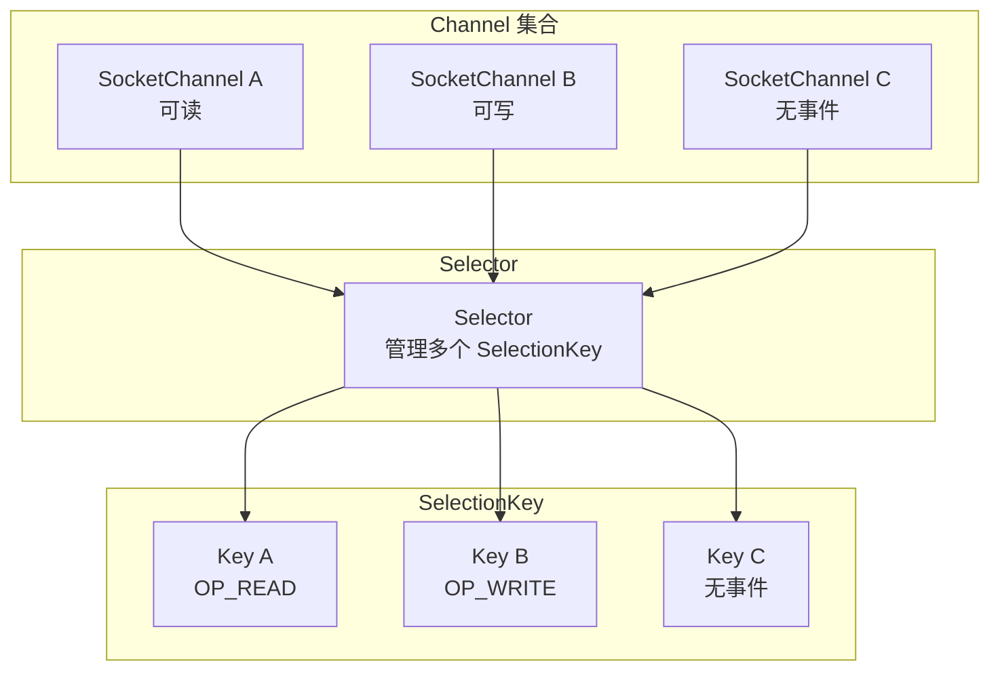
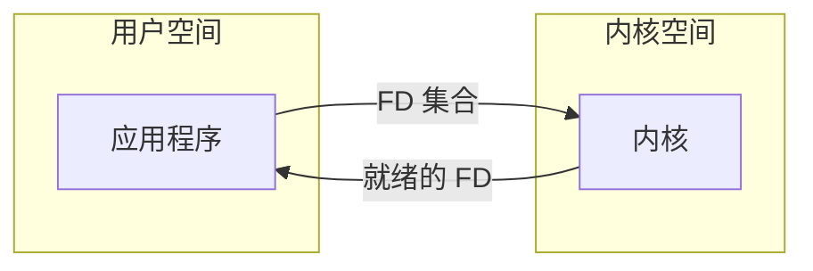
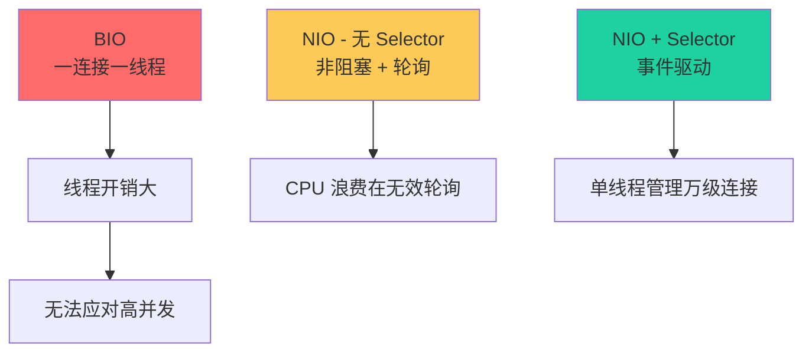

# Selector 多路复用器

Selector 是 NIO 实现单线程管理多连接的关键。它像一个观察者，同时盯着多个 Channel，一旦某个 Channel 准备好读写，就通知应用程序。

想象一个图书馆管理员：他不需要为每本书安排一个管理员，而是坐在前台，等待有人来借书或还书。当某个读者需要服务时，管理员才去处理，处理完继续等待。这个管理员就是 Selector。

## Selector 的工作原理



应用程序通过 Selector 监听多个 Channel 的就绪状态。当调用 `select()` 时，如果没有任何 Channel 就绪，当前线程会阻塞；有 Channel 就绪后，select 返回，应用程序遍历就绪的 Channel 进行处理。

## SelectionKey：Channel 与 Selector 的绑定

当 Channel 注册到 Selector 时，会创建一个 SelectionKey。SelectionKey 包含了 Channel 和 Selector 的关联信息，以及感兴趣的事件类型。

```java title="Channel 注册"
ServerSocketChannel serverChannel = ServerSocketChannel.open();
serverChannel.socket().bind(new InetSocketAddress(8080));
serverChannel.configureBlocking(false);

Selector selector = Selector.open();

// 注册 Channel，返回 SelectionKey
SelectionKey key = serverChannel.register(selector, SelectionKey.OP_ACCEPT);

System.out.println("key.interestOps() = " + key.interestOps());
// 输出: key.interestOps() = 16 (OP_ACCEPT)
```

### 事件类型

SelectionKey 定义了四种事件类型：

| 事件类型 | 值 | 说明 |
| --- | --- | --- |
| `OP_READ` | 1 | Channel 可读（有数据到达） |
| `OP_WRITE` | 4 | Channel 可写（写缓冲区有空余） |
| `OP_CONNECT` | 8 | TCP 连接完成（客户端） |
| `OP_ACCEPT` | 16 | 有新连接（服务端） |

可以组合多个事件：

```java
// 同时监听可读和可写
int interestSet = SelectionKey.OP_READ | SelectionKey.OP_WRITE;
channel.register(selector, interestSet);
```

### SelectionKey 的常用方法

```java
// 获取关联的 Channel
SocketChannel channel = (SocketChannel) key.channel();

// 获取关联的 Selector
Selector selector = key.selector();

// 检查事件类型
if (key.isReadable()) {
    // 处理可读事件
}
if (key.isWritable()) {
    // 处理可写事件
}
if (key.isAcceptable()) {
    // 处理可接受事件
}
if (key.isConnectable()) {
    // 处理连接完成事件
}

// 附加对象（可用于存储业务数据）
key.attach(new Object());
Object obj = key.attachment();

// 或在注册时附加
SelectionKey key = channel.register(selector, ops, new Object());
```

## 选择操作：select / selectNow / select(timeout)

Selector 提供了三种选择操作：

### select()：阻塞等待

```java
int count = selector.select();  // 阻塞，直到至少有一个 Channel 就绪
```

最常用的方法。如果没有 Channel 就绪，调用线程会一直阻塞。可以被 `wakeup()` 中断。

### selectNow()：非阻塞

```java
int count = selector.selectNow();  // 立即返回，不阻塞
```

立即返回当前就绪的 Channel 数量。如果没有任何 Channel 就绪，返回 0。

### select(timeout)：超时等待

```java
int count = selector.select(1000);  // 阻塞最多 1 秒
```

指定超时时间后阻塞。如果超时时间内有 Channel 就绪，返回就绪数量；如果超时，返回 0。

## Selector 的完整使用流程

```java title="Selector 使用流程"
public class SelectorDemo {
    public static void main(String[] args) throws IOException {
        // 1. 打开 Selector
        Selector selector = Selector.open();

        // 2. 打开 ServerSocketChannel 并注册
        ServerSocketChannel serverChannel = ServerSocketChannel.open();
        serverChannel.socket().bind(new InetSocketAddress(8080));
        serverChannel.configureBlocking(false);
        serverChannel.register(selector, SelectionKey.OP_ACCEPT);

        System.out.println("服务器启动，监听端口 8080...");

        // 3. 事件循环
        while (true) {
            // 阻塞等待就绪事件
            selector.select();

            // 获取所有就绪的 SelectionKey
            Set<SelectionKey> selectedKeys = selector.selectedKeys();
            Iterator<SelectionKey> iterator = selectedKeys.iterator();

            while (iterator.hasNext()) {
                SelectionKey key = iterator.next();

                if (key.isAcceptable()) {
                    // 处理新连接
                    ServerSocketChannel server = (ServerSocketChannel) key.channel();
                    SocketChannel client = server.accept();
                    client.configureBlocking(false);
                    client.register(selector, SelectionKey.OP_READ);
                    System.out.println("新连接: " + client.getRemoteAddress());
                }

                if (key.isReadable()) {
                    // 处理可读事件
                    SocketChannel client = (SocketChannel) key.channel();
                    ByteBuffer buffer = ByteBuffer.allocate(1024);
                    int read = client.read(buffer);

                    if (read > 0) {
                        buffer.flip();
                        System.out.println("收到数据: " + new String(buffer.array(), 0, buffer.limit()));
                        // 响应
                        buffer.clear();
                        buffer.put("ACK".getBytes());
                        buffer.flip();
                        client.write(buffer);
                    } else if (read == -1) {
                        client.close();
                    }
                }

                // 重要：处理完后移除
                iterator.remove();
            }
        }
    }
}
```

## Selector 的三大缺陷

虽然 Selector 解决了 BIO 的线程开销问题，但它本身也有一些局限性：

### 缺陷一：最大文件描述符限制

在某些系统上，Selector 底层使用的 `select()` 系统调用有最大 fd 数量限制（Linux 上默认 1024）。虽然 `epoll` 没有这个限制，但 Java NIO 在某些场景下可能退化到 select。

### 缺陷二：遍历开销（针对 select/poll）

如果使用 `select()` 或 `poll()` 实现，Selector 返回就绪集合后，应用程序需要遍历所有注册的 Channel 来确认哪些就绪。这是 O(n) 的时间复杂度。

### 缺陷三：内核/用户空间数据拷贝

无论 `select()` 还是 `poll()`，都需要将文件描述符集合从用户空间拷贝到内核空间，再拷贝回来。这是额外的开销。



epoll 通过红黑树和就绪链表解决了这些问题，但这是底层实现，Java NIO 对上层应用透明。

## Selector 的性能调优

### wakeup()：强制唤醒

`selector.wakeup()` 可以强制让阻塞的 `select()` 方法立即返回。这在需要从其他线程关闭 Selector 时很有用。

```java title="从其他线程唤醒 Selector"
Selector selector = Selector.open();
// ...

// 在另一个线程中
new Thread(() -> {
    // 做些准备工作
    selector.wakeup();  // 唤醒阻塞的 select()
}).start();

int count = selector.select();  // 如果上面线程没准备好，这里就会被打断
```

### close()：关闭 Selector

关闭 Selector 会取消所有注册的 Channel 的注册关系。

```java
selector.close();
// 所有注册的 SelectionKey 都失效
```

### keys() vs selectedKeys()

```java
// keys(): 所有注册的 Channel，包括未就绪的
Set<SelectionKey> allKeys = selector.keys();

// selectedKeys(): 只有就绪的 Channel
Set<SelectionKey> readyKeys = selector.selectedKeys();
```

通常只使用 `selectedKeys()`，因为只有就绪的 Channel 才需要处理。

## Selector 与 NIO 的关系

Selector 是 NIO 实现高性能 I/O 的核心。没有 Selector，NIO 就退化为"非阻塞 I/O + 轮询"，反而比 BIO 更差。



## 本章小结

Selector 是 NIO 实现 I/O 多路复用的核心组件：
- SelectionKey 关联 Channel 与 Selector，包含感兴趣的事件类型
- `select()` 阻塞等待，直到有 Channel 就绪
- `selectNow()` 非阻塞，立即返回
- Selector 解决了 BIO 的线程开销问题，但 select/poll 本身有 O(n) 的遍历开销

下一章我们将深入学习 I/O 多路复用的底层实现，理解 select/poll/epoll/kqueue 的设计差异。

## 延伸思考

为什么 Selector 要设计 `keys.remove()` 或 `iterator.remove()` 这个步骤？

因为 selectedKeys 是一个 Set，不是 List。每次 select 返回后，应用程序处理完一个 key，必须显式移除，否则下次循环会重复处理。

这是一个常见的问题源：如果忘记移除，代码可能在单个事件上执行多次。Netty 等框架在更高层次封装了这个逻辑，避免了这个问题。
