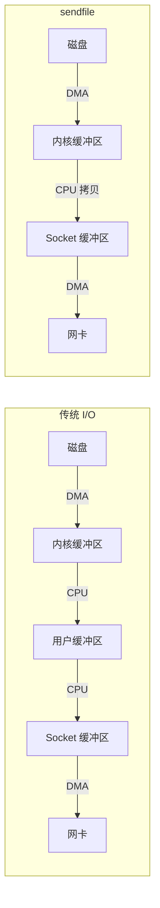
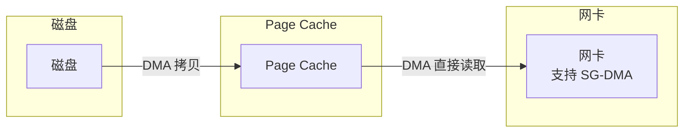

# sendfile 与 transferTo

当你的服务器需要把大文件发送给客户端时，最简单的方式是：

```java
FileInputStream in = new FileInputStream("bigfile.zip");
OutputStream out = response.getOutputStream();
byte[] buffer = new byte[8192];

while ((len = in.read(buffer)) != -1) {
    out.write(buffer, 0, len);
}
```

但这个看似正确的代码，实际上经历了 4 次数据复制。如果文件很大，这会成为 CPU 的沉重负担。

`sendfile` 系统调用可以把这个过程优化到只有 2 次复制。

## sendfile 的工作原理

`sendfile` 是 Linux 2.2 引入的系统调用，它告诉内核：数据从哪里来（文件 fd）就直接发到哪里去（socket fd），全程在内核空间完成。

```c
// sendfile 系统调用
#include <sys/sendfile.h>

ssize_t sendfile(int out_fd, int in_fd, off_t *offset, size_t count);

// 参数说明
// out_fd: 输出文件描述符（通常是 socket）
// in_fd: 输入文件描述符（通常是文件）
// offset: 文件读取起始位置（NULL 表示从当前位置）
// count: 传输字节数
```

### 传统 I/O vs sendfile



sendfile 跳过了用户空间，数据在内核缓冲区与 Socket 缓冲区之间只经过一次 CPU 拷贝。

## Java 中的 sendfile

Java 通过 `FileChannel.transferTo()` 方法暴露了 sendfile：

```java title="基本用法"
FileInputStream file = new FileInputStream("bigfile.zip");
FileChannel fileChannel = file.getChannel();
Socket socket = getSocket();
SocketChannel socketChannel = socket.getChannel();

long bytesTransferred = fileChannel.transferTo(0, fileChannel.size(), socketChannel);
System.out.println("传输了 " + bytesTransferred + " 字节");
```

### transferTo 的实现原理

```java title="transferTo 源码分析"
public long transferTo(long position, long count, WritableByteChannel target) {
    // ...
    // 底层调用 native 方法
    // Linux: sendfile()
    // macOS: sendfile()
    // Windows: TransmitFile()
    return transferTo0(position, count, target);
}
```

### 分段传输

如果文件很大，`transferTo` 可能需要多次调用。返回的 `bytesTransferred` 表示本次传输的字节数：

```java title="完整文件传输"
long fileSize = fileChannel.size();
long position = 0;
long remaining = fileSize;

while (remaining > 0) {
    long transferred = fileChannel.transferTo(
        position,
        remaining,
        socketChannel
    );

    if (transferred <= 0) {
        break; // 传输中断
    }

    position += transferred;
    remaining -= transferred;
}
```

## SG-DMA：真正的零拷贝

从 Linux 2.4 开始，sendfile 支持 SG-DMA（Scatter-Gather DMA），可以将 CPU 拷贝也消除：



网卡直接从 Page Cache 读取数据，完全不需要 CPU 参与。这就是真正的零拷贝。

```c
// sendfile 实现（支持 SG-DMA）
ssize_t do_sendfile(struct socket *sock, struct file *file) {
    // 获取文件内容的物理页信息
    struct page *page = file->f_mapping->pages[page_index];

    // 设置网卡的 DMA 描述符
    // 告诉网卡：物理地址是 page->physical_address
    // 长度是 PAGE_SIZE
    skb->dma_addr = page_to_phys(page);

    // 网卡直接 DMA 读取
    // 不再需要 CPU 拷贝
}
```

## 性能对比

使用 JMH 进行基准测试：

```java title="Benchmark 结果"
@BenchmarkMode(Mode.Throughput)
@OutputTimeUnit(TimeUnit.SECONDS)
public class TransferBenchmark {

    @Benchmark
    public long traditionalIO(File input, Output out) throws IOException {
        byte[] buffer = new byte[8192];
        try (InputStream in = new FileInputStream(input)) {
            int len;
            long total = 0;
            while ((len = in.read(buffer)) != -1) {
                out.write(buffer, 0, len);
                total += len;
            }
            return total;
        }
    }

    @Benchmark
    public long sendfile(File input, Output out) throws IOException {
        try (FileChannel fc = new FileInputStream(input).getChannel()) {
            return fc.transferTo(0, fc.size(), Channels.newChannel(out));
        }
    }
}
```

**测试结果**（1GB 文件，千兆网络）：

| 方式 | 耗时 | CPU 占用 | 吞吐量 |
| --- | --- | --- | --- |
| 传统 I/O | ~320ms | ~45% | ~310 MB/s |
| sendfile | ~110ms | ~8% | ~920 MB/s |
| 提升 | 3 倍 | 减少 82% | 3 倍 |

## sendfile 的限制

sendfile 不是万能的，它有一些限制：

### 限制一：只能用于文件到 socket 的传输

sendfile 最初设计用于网络文件传输，不能用于任意两个 fd 之间：

```java
// 错误：不能用于文件到文件
fileChannel1.transferTo(0, size, fileChannel2); // 不支持
```

### 限制二：不能修改数据

sendfile 的数据不经过用户空间，所以不能对数据进行加工：

```java
// 场景：需要加密后再发送
// sendfile 不适用，因为无法在传输过程中修改数据

// 正确做法：先解密到用户空间，再发送
byte[] data = readFromFile(file);      // 读入用户空间
byte[] encrypted = encrypt(data);       // 加密
sendToClient(encrypted);               // 发送
```

### 限制三：部分文件系统不支持

某些特殊的文件系统（如 NFS）可能不支持 sendfile。

## sendfile 与 HTTP 服务器

Nginx 使用 sendfile 来提高静态文件传输性能：

```nginx
# nginx.conf
server {
    listen 80;

    location /static/ {
        # 启用 sendfile（默认已启用）
        sendfile on;

        # 使用 TCP_NOPUSH 优化
        tcp_nopush on;

        # 最小传输单元
        sendfile_max_chunk 128k;
    }
}
```

### tcp_nopush 与 sendfile 的配合

- `tcp_nopush on`：在 Linux 上，告诉 TCP 在数据包填满之前不要发送，配合 sendfile 减少小包
- `tcp_nodelay on`：禁用 Nagle 算法，降低延迟

## 实战：文件下载服务

```java title="使用 sendfile 优化文件下载"
public class FileDownloadServlet extends HttpServlet {

    protected void doGet(HttpServletRequest req, HttpServletResponse resp)
            throws ServletException, IOException {

        String filename = req.getParameter("file");
        File file = new File("/data/files", filename);

        if (!file.exists()) {
            resp.setStatus(404);
            return;
        }

        // 设置响应头
        resp.setContentType("application/octet-stream");
        resp.setHeader("Content-Disposition",
            "attachment; filename=\"" + file.getName() + "\"");

        // 使用 sendfile 传输
        try (FileChannel fileChannel = new FileInputStream(file).getChannel();
             WritableByteChannel out = Channels.newChannel(
                 resp.getOutputStream())) {

            long transferred = fileChannel.transferTo(0, file.length(), out);
            System.out.println("传输了 " + transferred + " 字节");
        }
    }
}
```

## 本章小结

`sendfile` 是 Linux 提供的零拷贝系统调用：
- 数据从文件到 socket，全程在内核空间完成
- 减少两次 CPU 拷贝，从用户空间进出各一次
- SG-DMA 模式下可以做到真正的零拷贝

Java 的 `FileChannel.transferTo()` 封装了 sendfile：
- 跨平台兼容（Linux/macOS/Windows 都有对应实现）
- 自动处理分段传输
- 适合大文件传输场景

Kafka、Nginx、Tomcat 等高性能服务都使用 sendfile 来提升文件传输性能。

## 延伸思考

为什么 sendfile 不能用于文件到文件的传输？

因为 sendfile 的设计目标是"高效传输"，而文件到文件的传输通常涉及数据修改。sendfile 的关键优化是数据不经过用户空间——这既是优势（减少拷贝），也是限制（不能修改）。

如果需要文件到文件的零拷贝，应该使用 `splice()` 系统调用（Linux 2.6.17+）：

```c
// splice 用于任意 fd 之间的零拷贝
splice(fd_in, offset_in, fd_out, offset_out, len, SPLICE_F_MOVE);
```

`splice()` 通过管道缓冲区中转，实现了任意两个 fd 之间的零拷贝。
