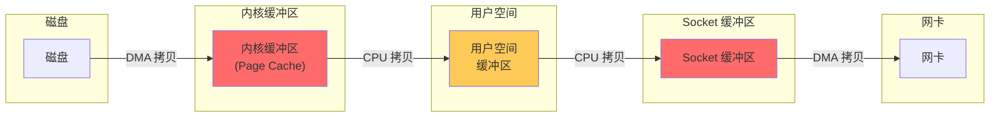
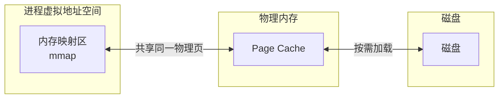
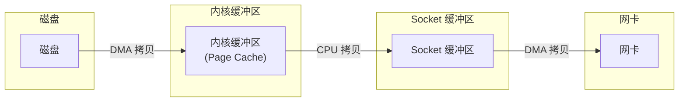
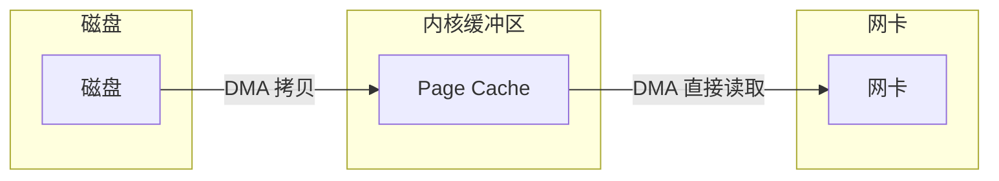
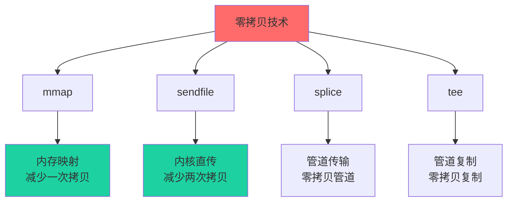

# 零拷贝原理

假设你需要把一个 1GB 的文件从磁盘发送到网络。一台普通服务器完成这个任务需要多长时间？

如果你认为答案是"取决于网络带宽"，那你可能忽略了 I/O 过程中的一个关键瓶颈：**数据复制**。

传统 I/O 过程中，数据需要经过多次复制。如果不消除这些不必要的复制，即使网络带宽再高，系统也可能被 CPU 拖慢。

## 传统 I/O 的四次拷贝

当应用程序需要将文件发送到网络时，数据需要经过四次拷贝：



### 详细过程

1. **磁盘 → 内核缓冲区**：DMA（Direct Memory Access）拷贝，CPU 不参与
2. **内核缓冲区 → 用户空间**：CPU 拷贝，数据从内核区复制到用户区
3. **用户空间 → Socket 缓冲区**：CPU 拷贝，数据从用户区复制回内核区
4. **Socket 缓冲区 → 网卡**：DMA 拷贝，CPU 不参与

### 为什么需要这些拷贝？

**第一次拷贝**（磁盘 → 内核缓冲区）：这是硬件操作，DMA 控制器直接访问内存，CPU 不参与。这是必要的。

**第二次拷贝**（内核缓冲区 → 用户空间）：应用程序需要访问数据，必须把数据放到用户空间。这是必要的。

**第三次拷贝**（用户空间 → Socket 缓冲区）：发送数据需要把数据放到网络协议栈，这是必要的。

**第四次拷贝**（Socket 缓冲区 → 网卡）：硬件操作，DMA 拷贝。这是必要的。

**问题在哪？**

第二和第三次拷贝是"为了传递数据而复制"，而不是"为了使用数据而复制"。应用程序并不需要修改或查看数据，它只是想发送数据。这些复制是多余的。

## 零拷贝的目标

零拷贝（Zero-Copy）技术旨在减少甚至消除这些不必要的数据复制。

| 技术 | 拷贝次数 | 说明 |
| --- | --- | --- |
| 传统 I/O | 4 次 | 两次 CPU 拷贝，两次 DMA 拷贝 |
| mmap | 3 次 | 一次 CPU 拷贝（写时），两次 DMA 拷贝 |
| sendfile | 2 次 | 一次 CPU 拷贝，两次 DMA 拷贝 |
| SG-DMA | 1 次 | 一次 DMA 拷贝 |

## mmap：内存映射

`mmap` 将文件映射到进程的虚拟地址空间：



读取文件时，数据直接来自 Page Cache，而不是复制到用户空间。写文件时，修改也在 Page Cache 中进行，后台异步刷新到磁盘。

```java title="mmap 文件读取"
FileChannel channel = new RandomAccessFile("data.txt", "rw")
    .getChannel();

// 将文件映射到内存
MappedByteBuffer buffer = channel.map(
    FileChannel.MapMode.READ_WRITE,
    0,
    channel.size()
);

// 直接读取内存
byte[] data = new byte[buffer.remaining()];
buffer.get(data);
```

### mmap 的优势

- **减少一次拷贝**：数据不需要从内核缓冲区复制到用户空间
- **按需加载**：操作系统只加载需要的页面，不是整个文件
- **共享内存**：多个进程可以共享同一个映射

### mmap 的劣势

- **页面抖动**：大文件映射可能导致频繁的页面换入换出
- **关闭延迟**：文件关闭后，修改可能还没有刷盘
- **地址空间限制**：32 位系统无法映射大文件

## sendfile：内核直传

`sendfile` 是 Linux 2.2 引入的系统调用，它告诉内核：数据从哪里来就直接发到哪里去，全程在内核空间完成。

```c
// sendfile 系统调用
ssize_t sendfile(int out_fd, int in_fd, off_t *offset, size_t count);
```



数据只经过两次 DMA 拷贝，不再经过用户空间。

### Java 中的 sendfile

Java 的 `FileChannel.transferTo()` 方法封装了 sendfile：

```java title="sendfile 文件传输"
FileChannel from = new FileInputStream("bigfile.zip")
    .getChannel();
FileChannel to = Channels.newChannel(socket.getOutputStream());

long bytesTransferred = from.transferTo(0, from.size(), to);
System.out.println("传输了 " + bytesTransferred + " 字节");
```

### SG-DMA：真正的零拷贝

Linux 2.4+ 的 sendfile 支持 SG-DMA（Scatter-Gather DMA），进一步减少了一次 CPU 拷贝：



网卡直接从 Page Cache 读取数据，完全不需要 CPU 参与。这就是真正的零拷贝。

## 零拷贝的收益

| 指标 | 传统 I/O | sendfile (2.4+) | 改善 |
| --- | --- | --- | --- |
| CPU 拷贝次数 | 2 次 | 0 次 | 减少 100% |
| DMA 拷贝次数 | 2 次 | 2 次 | 不变 |
| 上下文切换 | 4 次 | 2 次 | 减少 50% |
| 1GB 文件传输耗时 | ~200ms | ~60ms | 提升 3 倍 |
| CPU 占用率 | ~30% | ~4% | 降低 87% |

## 零拷贝的适用场景

零拷贝最适合的场景：**数据只需要传输，不需要加工**。

| 场景 | 适用性 | 说明 |
| --- | --- | --- |
| 文件下载 | 非常适合 | 服务器直接把文件发给客户端 |
| 消息队列 | 非常适合 | Kafka、RocketMQ 使用零拷贝 |
| Web 服务器 | 非常适合 | Nginx 使用零拷贝发送静态文件 |
| 数据库备份 | 适合 | 大文件传输 |
| 数据处理（需要修改） | 不适合 | 数据需要加工时，零拷贝帮助不大 |

## 零拷贝不适合的场景

如果应用程序需要修改数据，零拷贝可能不适用：

```java
// 场景：需要在发送前加密数据
FileInputStream in = new FileInputStream("data.txt");
FileOutputStream out = new FileOutputStream("encrypted.txt");

byte[] buffer = new byte[1024];
while ((len = in.read(buffer)) != -1) {
    byte[] encrypted = encrypt(buffer);  // 数据必须加载到用户空间
    out.write(encrypted);
}
```

这个场景中，数据必须加载到用户空间才能加密，所以无法使用零拷贝。

## 零拷贝技术总结



## 本章小结

零拷贝的核心思想是：**减少不必要的数据复制**。

传统 I/O 需要 4 次拷贝（2 次 CPU 拷贝，2 次 DMA 拷贝），零拷贝技术可以将其减少到 2 次甚至 1 次。

不同零拷贝技术的对比：
- **mmap**：适合需要读取文件内容的场景，内存映射避免了内核到用户的拷贝
- **sendfile**：适合纯传输场景，数据不需要在用户空间处理
- **SG-DMA**：真正的零拷贝，网卡直接从 Page Cache 读取

Kafka、RocketMQ、Nginx 等高性能中间件都大量使用零拷贝技术。理解零拷贝，是理解这些系统性能优势的关键。

## 延伸思考

为什么 Kafka 能达到每秒百万级消息的吞吐量？

答案就在零拷贝 + 顺序写。

1. **顺序写**：Kafka 追加写入日志文件，充分利用磁盘顺序 I/O 的高性能
2. **零拷贝**：使用 sendfile 直接从 Page Cache 发送到网卡，避免用户空间复制
3. **页缓存**：Linux 的 Page Cache 自动缓存热点数据，读取时命中缓存

这三个技术组合在一起，成就了 Kafka 的高吞吐量神话。
