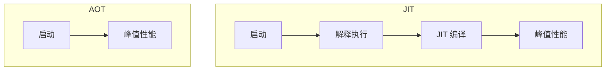
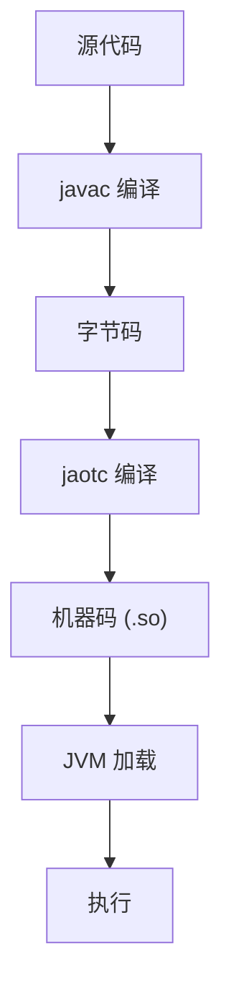
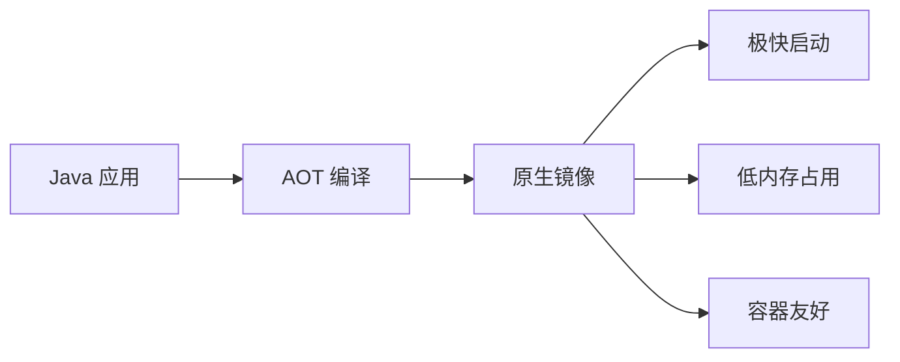

# AOT 编译（Ahead-of-Time）

理解 AOT 编译，是理解 JVM 启动优化的关键。

## 为什么需要 AOT

JIT 编译的问题：

| 问题 | 说明 |
| --- | --- |
| 预热时间 | 需要运行一段时间才能达到峰值性能 |
| 编译开销 | 运行时编译消耗 CPU 资源 |
| 代码缓存 | 编译后的代码占用内存 |

AOT 编译解决这些问题：



## AOT vs JIT

| 特性 | AOT | JIT |
| --- | --- | --- |
| 编译时机 | 运行前 | 运行时 |
| 启动时间 | 快 | 慢 |
| 峰值性能 | 中等 | 高 |
| 编译开销 | 无（构建时） | 有（运行时） |
| 优化信息 | 静态分析 | 运行时 profile |
| 二进制大小 | 大 | 小 |

## jaotc 工具

### 基本用法

```bash
# 编译单个类
jaotc --output lib.so MyClass.class

# 编译整个 JAR
jaotc --output lib.so --jar myapp.jar

# 编译多个类
jaotc --output lib.so com.example.* com.other.*
```

### 常用参数

| 参数 | 说明 | 示例 |
| --- | --- | --- |
| `--output` | 输出文件 | `--output lib.so` |
| `--jar` | 要编译的 JAR | `--jar app.jar` |
| `--class-name` | 要编译的类 | `--class-name com.example.*` |
| `--compile-commands` | 编译命令文件 | `--compile-commands commands.txt` |

## AOT 编译流程



## 使用 AOT 编译

### 步骤一：编写代码

```java
public class Hello {
    public static void main(String[] args) {
        System.out.println("Hello, AOT!");
    }
}
```

### 步骤二：编译源代码

```bash
javac Hello.java
```

### 步骤三：AOT 编译

```bash
# 使用 jaotc 编译
jaotc --output hello.so Hello.class
```

### 步骤四：运行

```bash
# 加载 AOT 编译的代码
java -XX:AOTLibrary=./hello.so Hello
```

## AOT 编译的限制

### 1. 优化受限

AOT 编译无法利用运行时信息：

```java
// AOT 无法知道运行时类型
public void process(Object obj) {
    obj.method();  // 静态分析受限
}
```

### 2. 类加载问题

动态类加载可能导致问题：

```java
// 动态加载的类无法 AOT 编译
public void loadClass() {
    Class.forName("com.example.DynamicClass");  // 动态加载
}
```

### 3. 反射和动态代理

```java
// 反射无法静态分析
public void useReflection() {
    Method m = Class.forName("...").getMethod("...");
    m.invoke(obj);  // 无法 AOT 编译
}
```

## GraalVM AOT

GraalVM Native Image 是更强大的 AOT 解决方案：

```bash
# 使用 GraalVM native-image
native-image --jar myapp.jar myapp

# 输出原生可执行文件
./myapp
```

### GraalVM AOT 的优势

| 特性 | jaotc | GraalVM Native Image |
| --- | --- | --- |
| 启动时间 | 快 | 极快 |
| 二进制大小 | 中 | 小 |
| 峰值性能 | 中 | 中高 |
| 反射支持 | 部分 | 需要配置 |
| 生态 | JDK 内置 | 独立项目 |

## AOT 的应用场景

### 1. 容器化部署

```dockerfile
# Dockerfile
FROM ubuntu:20.04
COPY myapp /app/myapp
COPY lib.so /app/lib.so
CMD ["java", "-XX:AOTLibrary=./lib.so", "-jar", "/app/myapp.jar"]
```

### 2. Serverless 函数

```yaml
# serverless.yml
functions:
  hello:
    handler: hello
    runtime: java11
    layers:
      - arn:aws:lambda:us-east-1:123:layer:aot-lib:1
```

### 3. 短生命周期进程

```bash
# CLI 工具
java -XX:AOTLibrary=./cli.so -jar cli.jar "$@"
```

## AOT 编译的注意事项

### 1. 部分 AOT

可以只 AOT 编译热点方法：

```bash
# 指定要编译的类
jaotc --class-name com.example.hot.* --output hot.so --jar app.jar
```

### 2. AOT 与 JIT 共存

AOT 编译的代码和 JIT 编译的代码可以共存：

```bash
# 使用 AOT 预编译 + JIT 继续优化
java -XX:AOTLibrary=./hot.so -jar app.jar
```

### 3. 性能调优

AOT 编译后可以通过 JIT 继续优化：

```java
// AOT 提供快速启动
// JIT 在运行时继续优化
```

## 未来发展

### Project Leyden

Project Leyden 是 OpenJDK 的 AOT 编译项目：

- **目标**：减少 Java 应用的启动时间和峰值内存占用
- **方法**：引入静态镜像概念
- **状态**：开发中

### 云原生 Java

AOT 编译是云原生 Java 的重要组成部分：


