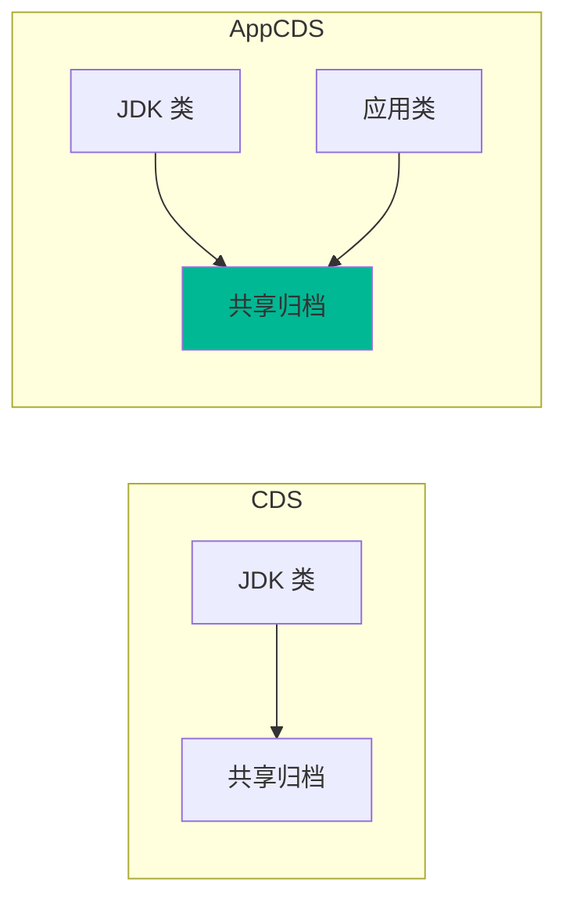
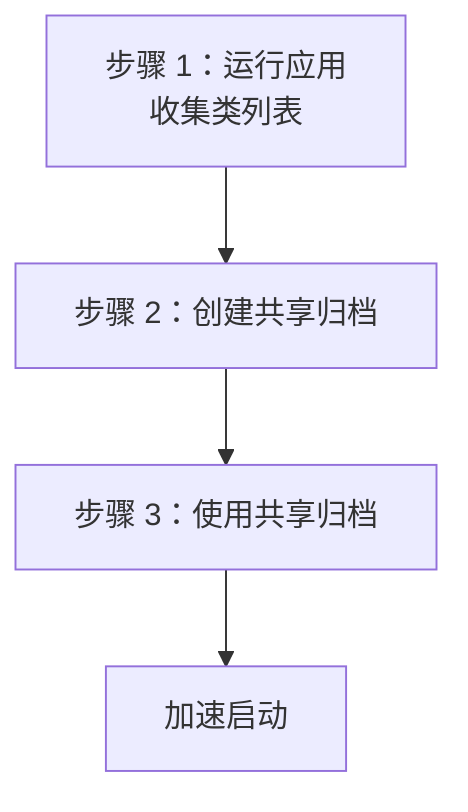

# AppCDS 应用类数据共享

AppCDS（Application Class Data Sharing）是 CDS 的扩展，它不仅共享 JDK 类，还允许共享应用类数据。AppCDS 可以进一步减少启动时间和内存占用。

理解 AppCDS，是实现云原生 Java 优化的重要技能。

## AppCDS vs CDS



| 特性 | CDS | AppCDS |
| --- | --- | --- |
| 共享 JDK 类 | 是 | 是 |
| 共享应用类 | 否 | 是 |
| 共享第三方库 | 否 | 是 |
| 归档创建 | 自动 | 需要手动创建 |

## AppCDS 工作流程



### 步骤一：收集类列表

```bash
# 收集应用运行时的类
java -XX:+UseAppCDS \
     -XX:DumpLoadedClassList=classes.lst \
     -cp myapp.jar \
     -jar myapp.jar
```

### 步骤二：创建共享归档

```bash
# 创建包含应用类的共享归档
java -XX:+UseAppCDS \
     -XX:SharedClassListFile=classes.lst \
     -XX:SharedArchiveFile=app.jsa \
     -cp myapp.jar \
     -jar myapp.jar
```

### 步骤三：使用共享归档

```bash
# 运行应用，使用共享归档
java -XX:+UseAppCDS \
     -XX:SharedArchiveFile=app.jsa \
     -cp myapp.jar \
     -jar myapp.jar
```

## AppCDS 参数

### 核心参数

| 参数 | 说明 |
| --- | --- |
| `-XX:+UseAppCDS` | 启用 AppCDS（JDK 9+ 默认） |
| `-XX:DumpLoadedClassList` | 导出类列表文件 |
| `-XX:SharedClassListFile` | 指定类列表文件 |
| `-XX:SharedArchiveFile` | 指定共享归档文件 |

### 归档控制

| 参数 | 说明 |
| --- | --- |
| `-XX:ArchiveClassesAtExit` | 应用退出时创建归档 |
| `-XX:IncludeAllAppCDS` | 包含所有类 |

## 完整示例

### 示例一：Spring Boot 应用

```bash
# 1. 运行应用，收集类
java -XX:+UseAppCDS \
     -XX:DumpLoadedClassList=spring.lst \
     -jar myapp.jar

# 2. 创建归档
java -XX:+UseAppCDS \
     -XX:SharedClassListFile=spring.lst \
     -XX:SharedArchiveFile=spring.jsa \
     -jar myapp.jar

# 3. 使用归档启动
java -XX:+UseAppCDS \
     -XX:SharedArchiveFile=spring.jsa \
     -jar myapp.jar
```

### 示例二：多模块应用

```bash
# 1. 收集所有模块的类
java -XX:+UseAppCDS \
     -XX:DumpLoadedClassList=all.lst \
     -cp "module1.jar:module2.jar:module3.jar" \
     com.example.MainClass

# 2. 创建归档
java -XX:+UseAppCDS \
     -XX:SharedClassListFile=all.lst \
     -XX:SharedArchiveFile=modules.jsa \
     -cp "module1.jar:module2.jar:module3.jar" \
     com.example.MainClass

# 3. 使用归档
java -XX:+UseAppCDS \
     -XX:SharedArchiveFile=modules.jsa \
     -cp "module1.jar:module2.jar:module3.jar" \
     com.example.MainClass
```

## AppCDS 与 Gradle

### build.gradle 配置

```groovy
// build.gradle
plugins {
    id 'java'
    id 'application'
}

application {
    mainClass = 'com.example.MyApp'
}

task createAppCDS(type: JavaExec) {
    // 创建归档
    args '-XX:+UseAppCDS',
         '-XX:DumpLoadedClassList=classes.lst',
         '-cp', sourceSets.main.runtimeClasspath.asPath,
         application.mainClass
}
```

## AppCDS 与 Maven

### pom.xml 配置

```xml
<plugin>
    <groupId>org.apache.maven.plugins</groupId>
    <artifactId>maven-antrun-plugin</artifactId>
    <executions>
        <execution>
            <id>create-appcds</id>
            <phase>package</phase>
            <configuration>
                <target>
                    <!-- 收集类 -->
                    <exec executable="java">
                        <arg value="-XX:+UseAppCDS"/>
                        <arg value="-XX:DumpLoadedClassList=classes.lst"/>
                        <arg value="-jar">${project.build.directory}/${project.build.finalName}.jar</arg>
                    </exec>
                </target>
            </configuration>
        </execution>
    </executions>
</plugin>
```

## Docker 中的 AppCDS

### Dockerfile 示例

```dockerfile
# 多阶段构建

# 构建阶段
FROM eclipse-temurin:17 AS builder
COPY myapp.jar /app/
WORKDIR /app

# 创建 AppCDS 归档
RUN java -XX:+UseAppCDS \
         -XX:DumpLoadedClassList=classes.lst \
         -jar myapp.jar && \
    java -XX:+UseAppCDS \
         -XX:SharedClassListFile=classes.lst \
         -XX:SharedArchiveFile=app.jsa \
         -jar myapp.jar

# 运行阶段
FROM eclipse-temurin:17-jre-alpine
COPY --from=builder /app/app.jsa /app/
COPY --from=builder /app/myapp.jar /app/
WORKDIR /app

CMD ["java", "-XX:+UseAppCDS", \
     "-XX:SharedArchiveFile=/app/app.jsa", \
     "-jar", "/app/myapp.jar"]
```

## 动态类加载

### 问题

AppCDS 只共享启动时加载的类，动态加载的类无法共享。

### 解决方案

```bash
# 使用 -XX:+IncludeAllAppCDS
java -XX:+UseAppCDS \
     -XX:+IncludeAllAppCDS \
     -XX:SharedArchiveFile=app.jsa \
     -cp myapp.jar \
     -jar myapp.jar
```

## 性能对比

### 启动时间对比

| 场景 | 无 AppCDS | 有 AppCDS | 提升 |
| --- | --- | --- | --- |
| Spring Boot | 3.5 秒 | 1.5 秒 | 57% |
| 微服务 | 2.0 秒 | 0.8 秒 | 60% |
| CLI 工具 | 0.5 秒 | 0.2 秒 | 60% |

### 内存占用对比

| JVM 实例 | 无 AppCDS | 有 AppCDS |
| --- | --- | --- |
| 1 | 100MB | 40MB |
| 2 | 100MB | 40MB |
| 3 | 100MB | 40MB |

## AppCDS 的限制

### 1. 类加载器限制

AppCDS 只支持默认类加载器。

### 2. 动态类加载

动态加载的类需要特殊处理。

### 3. 归档大小

归档太大会影响性能。

## 最佳实践

### 1. 定期更新归档

```bash
# 应用更新后重新创建归档
java -XX:+UseAppCDS \
     -XX:DumpLoadedClassList=classes.lst \
     -jar myapp-new.jar && \
java -XX:+UseAppCDS \
     -XX:SharedClassListFile=classes.lst \
     -XX:SharedArchiveFile=app-new.jsa \
     -jar myapp-new.jar
```

### 2. 排除不必要的类

```bash
# 只包含必要的类
java -XX:+UseAppCDS \
     -XX:DumpLoadedClassList=classes.lst \
     -cp myapp.jar \
     -jar myapp.jar

# 编辑类列表，移除不需要的类
# vi classes.lst
```

### 3. 验证归档

```bash
# 验证归档是否被使用
java -Xlog:class+load=info \
     -XX:+UseAppCDS \
     -XX:SharedArchiveFile=app.jsa \
     -jar myapp.jar 2>&1 | grep "shared"
```

## AppCDS 与 GraalVM

AppCDS 和 GraalVM 是互补的技术：

| 特性 | AppCDS | GraalVM |
| --- | --- | --- |
| 启动时间 | 减少 50-60% | 减少 90%+ |
| 峰值性能 | 不影响 | 可能略低 |
| 二进制大小 | 不变 | 显著增大 |
| 兼容性 | 完全兼容 | 需要适配 |

## 未来发展

### Project Leyden

Project Leyden 将进一步改进类数据共享：

- 更好的归档压缩
- 更智能的类选择
- 与 AOT 编译集成
