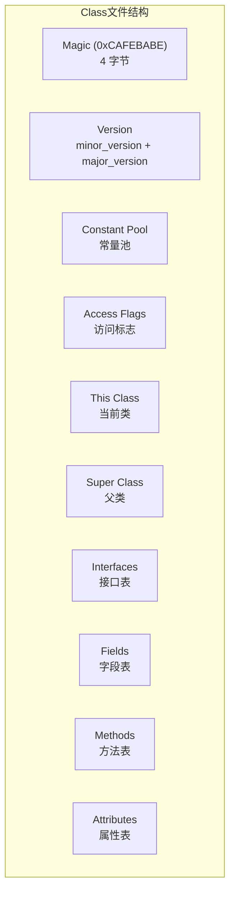
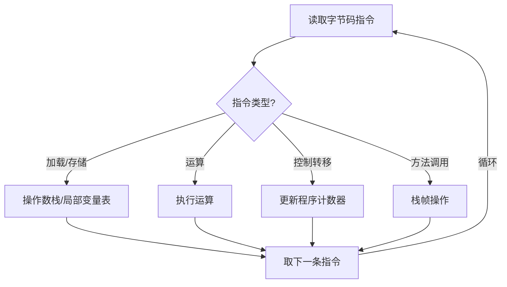

# 字节码与解释执行

理解字节码，是深入理解 JIT 编译器工作的基础。

## Class 文件结构

一个 Class 文件是一个二进制流，由以下部分组成：



### 重要字段说明

| 字段 | 说明 |
| --- | --- |
| Magic | 固定为 `0xCAFEBABE`，用于识别 Class 文件 |
| Version | Class 文件版本号，如 52.0 表示 Java 8 |
| Constant Pool | 存储所有字面量和符号引用 |
| Access Flags | public、final、super 等标志 |

## 字节码指令集

字节码指令分为以下几类：

| 类型 | 示例指令 | 说明 |
| --- | --- | --- |
| 加载/存储 | `iload`, `istore` | 在局部变量和操作数栈之间移动数据 |
| 运算 | `iadd`, `isub` | 整数算术运算 |
| 类型转换 | `i2l`, `i2d` | 整数转长整数、浮点数 |
| 控制转移 | `ifeq`, `goto` | 条件跳转和无条件跳转 |
| 方法调用 | `invokevirtual`, `invokespecial` | 调用方法 |
| 返回 | `ireturn`, `areturn` | 方法返回 |

## 使用 javap 查看字节码

### 基本用法

```bash
# 查看类的字节码
javap -c MyClass.class

# 查看详细信息
javap -verbose MyClass.class
```

### 字节码示例

```java
// Java 源码
public class Calculator {
    public int add(int a, int b) {
        return a + b;
    }
}
```

```java
// 使用 javap 查看字节码
javap -c Calculator.class

// 输出
Compiled from "Calculator.java"
public class Calculator {
  public Calculator();
    descriptor: ()V
    Code:
       0: aload_0
       1: invokespecial #1                  // Method java/lang/Object."<init>":()V
       4: return

  public int add(int, int);
    descriptor: (II)I
    Code:
       0: iload_1           // 将局部变量 1（参数 a）压入栈
       1: iload_2           // 将局部变量 2（参数 b）压入栈
       2: iadd              // 弹出栈顶两元素，相加后压回栈
       3: ireturn           // 返回结果
}
```

## 操作数栈与局部变量表

### 操作数栈（Operand Stack）

操作数栈是后进先出（LIFO）的栈，用于字节码执行时的临时存储：

```java
// 源码
int a = 1;
int b = 2;
int c = a + b;
```

```java
// 对应字节码
iconst_1       // 将常量 1 压入栈
istore_1       // 弹出栈顶，存入局部变量 1（a）
iconst_2       // 将常量 2 压入栈
istore_2       // 弹出栈顶，存入局部变量 2（b）
iload_1        // 将 a 压入栈
iload_2        // 将 b 压入栈
iadd           // 弹出两元素，相加后压回栈
istore_3       // 弹出栈顶，存入局部变量 3（c）
```

### 局部变量表（Local Variable Table）

局部变量表存储方法参数和局部变量：

```java
// 方法的局部变量表
public int calculate(int a, int b) {  // a = local 1, b = local 2
    int c = a + b;                     // c = local 3
    return c;                           // 使用 local 3
}
// local 0 是 this 引用
```

## 常见字节码指令详解

### 方法调用指令

| 指令 | 说明 | 使用场景 |
| --- | --- | --- |
| `invokevirtual` | 调用虚方法 | 普通方法调用 |
| `invokespecial` | 调用构造器、私有方法、父类方法 | 构造方法、private、方法 |
| `invokestatic` | 调用静态方法 | 静态方法调用 |
| `invokeinterface` | 调用接口方法 | 接口方法调用 |

```java
// invokevirtual 示例
public class Example {
    public void sayHello() {
        System.out.println("Hello");
    }
}

// 对应字节码
public void sayHello();
  0: getstatic     #2    // Field java/lang/System.out:Ljava/io/PrintStream;
  3: ldc           #3    // String Hello
  5: invokevirtual #4    // Method java/io/PrintStream.println:(Ljava/lang/String;)V
  8: return
```

### 控制转移指令

```java
// if-else 的字节码
public int max(int a, int b) {
    if (a > b) {
        return a;
    } else {
        return b;
    }
}

// 对应字节码
public int max(int, int);
  0: iload_1           // 加载 a
  1: iload_2           // 加载 b
  2: if_icmple 7       // 如果 a <= b，跳转到 7
  3: iload_1           // 加载 a
  4: istore_3          // 存入局部变量
  5: iload_3           // 加载返回值
  6: ireturn           // 返回
  7: iload_2           // 加载 b
  8: ireturn           // 返回
```

### 循环的字节码

```java
// for 循环
public int sum(int n) {
    int sum = 0;
    for (int i = 0; i < n; i++) {
        sum += i;
    }
    return sum;
}

// 对应字节码
public int sum(int);
  0: iconst_0          // sum = 0
  1: istore_2
  2: iconst_0          // i = 0
  3: istore_3
  4: iload_3            // if i < n
  5: iload_1
  6: if_icmpge 16      // if i >= n, goto 16
  7: iload_2            // sum += i
  8: iload_3
  9: iadd
 10: istore_2
 11: iinc 3, 1          // i++
 14: goto 4             // 继续循环
 16: iload_2            // return sum
 17: ireturn
```

## 同步（synchronized）的字节码

```java
// synchronized 方法
public synchronized void doSomething() {
    // 同步代码
}

// 对应字节码
public synchronized void doSomething();
  0: ...                // 方法体
  5: return

// synchronized 代码块
public void doSomething() {
    synchronized (this) {
        // 同步代码
    }
}

// 对应字节码
public void doSomething();
  0: aload_0
  1: dup
  2: astore_1
  3: monitorenter       // 进入监视器
  4: ...                // 方法体
  7: aload_1
  8: monitorexit        // 退出监视器
  9: goto 17
 12: astore_2
 13: aload_1
 14: monitorexit
 15: aload_2
 16: athrow
 17: return
```

## 解释执行的过程



解释执行的特点：

1. **逐条执行**：每条指令都需要解释
2. **无优化**：不进行任何优化
3. **启动快**：无需等待编译
4. **运行慢**：重复执行相同代码也需要重复解释
