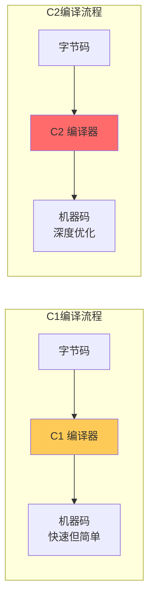
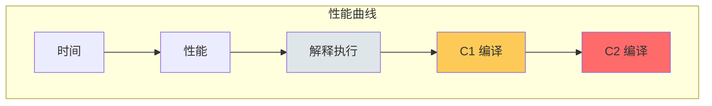
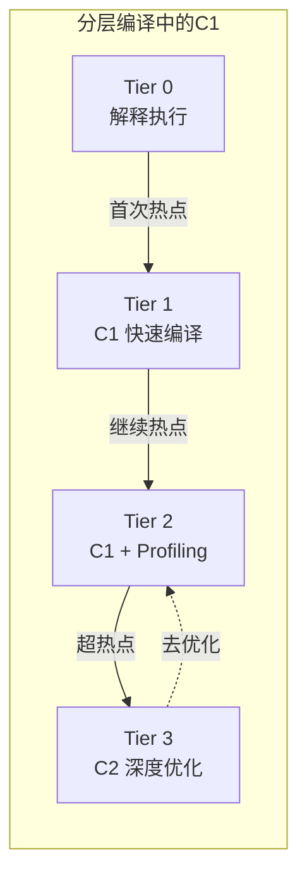

# C1 编译器（Client Compiler）

理解 C1 编译器，是理解 JVM 分层编译策略的基础。

## C1 编译器概述

C1 编译器有以下特点：

| 特性 | 说明 |
| --- | --- |
| 编译速度 | 快，适合快速编译 |
| 优化程度 | 低~中，基础优化 |
| 适用场景 | 客户端应用、短期运行 |
| 代码质量 | 比解释执行快，但不如 C2 |



## C1 编译器架构

C1 编译器分为多个阶段：


### 阶段一：HIR 生成

将字节码转换为高级中间表示（HIR）：

```java
// 字节码
iload_1
iload_2
iadd
istore_3

// HIR 表示
Block 0:
  t1 = LoadLocal(int, local[1])
  t2 = LoadLocal(int, local[2])
  t3 = Add(t1, t2)
  StoreLocal(local[3], t3)
```

### 阶段二：HIR 优化

在 HIR 层面进行基础优化：

- 常量折叠
- 代数简化
- 公共子表达式消除

### 阶段三：LIR 生成

将 HIR 转换为低级中间表示（LIR）：

```java
// LIR 表示（更接近机器码）
mov eax, [ebp+8]     // 加载 local[1]
mov ebx, [ebp+12]    // 加载 local[2]
add eax, ebx          // 相加
mov [ebp+16], eax     // 存储到 local[3]
```

### 阶段四：LIR 优化

在 LIR 层面进行低层次优化：

- 寄存器分配
- 指令调度
- 基本块重排序

## C1 与 C2 的区别

| 特性 | C1 | C2 |
| --- | --- | --- |
| 编译速度 | 快 | 慢 |
| 优化程度 | 低 | 高 |
| 适用场景 | 客户端 | 服务端 |
| 编译阈值 | 较低 | 较高 |
| 代码质量 | 较好 | 最优 |



## C1 编译器参数

| 参数 | 说明 | 默认值 |
| --- | --- | --- |
| `-XX:TieredCompilation` | 启用分层编译 | JDK 8+ 默认开启 |
| `-XX:Tier3InvocationThreshold` | Tier 3 触发阈值 | 200 |
| `-XX:Tier3MinInvocationThreshold` | Tier 3 最小调用阈值 | 100 |
| `-XX:Tier3BackEdgeThreshold` | Tier 3 回边阈值 | 100000 |

## C1 的优化策略

C1 编译器主要进行以下优化：

### 1. 基本块重排序

```java
// 重排序前
if (condition) {
    doA();
    doB();
} else {
    doC();
}

// 重排序后（优化跳转）
// 将热路径放在前面，减少跳转
```

### 2. 窥孔优化

```java
// 窥孔优化示例
// 优化前
i = i + 0;        // 无意义操作
x = x * 1;        // 无意义操作

// 优化后
// 删除无意义操作
```

### 3. 冗余加载消除

```java
// 冗余加载消除
// 优化前
a = load(x);      // 第一次加载
b = a + 1;
c = load(x);      // 冗余加载
d = c + 2;

// 优化后
a = load(x);
b = a + 1;
c = a;            // 复用之前的加载结果
d = c + 2;
```

### 4. 简单内联

C1 会进行简单的内联优化：

```java
// 内联前
public int add(int a, int b) {
    return a + b;
}

public int calculate() {
    return add(1, 2);  // 热点调用
}

// 内联后
public int calculate() {
    return 1 + 2;     // 内联展开
}
```

## C1 的使用场景

C1 编译器适合以下场景：

1. **短生命周期应用**：命令行工具、一次性脚本
2. **对启动时间敏感**：GUI 应用、服务启动
3. **不需要极致性能**：辅助工具、调试程序

## 禁用 C1

在某些情况下，可能需要禁用 C1：

```bash
# 禁用 C1，只使用 C2
java -XX:TieredCompilation \
     -XX:TieredStopAtLevel=3 \
     -jar application.jar

# 禁用分层编译
java -XX:-TieredCompilation \
     -jar application.jar
```

## 性能监控

### 观察 C1 编译

```bash
# 开启编译日志
java -XX:+UnlockDiagnosticVMOptions \
     -XX:+LogCompilation \
     -XX:LogFile=/tmp/jit.log \
     -jar application.jar

# 观察 C1 编译的日志
grep "compiler='C1'" /tmp/jit.log
```

### 编译计数器

```bash
# 使用 jstat 查看编译统计
jstat -printcompilation <pid> 1000
```

## C1 与分层编译

在分层编译模式下，C1 的角色：



C1 在分层编译中的价值：

- 提供快速的首层编译
- 采集 profiling 数据
- 快速响应热点代码
