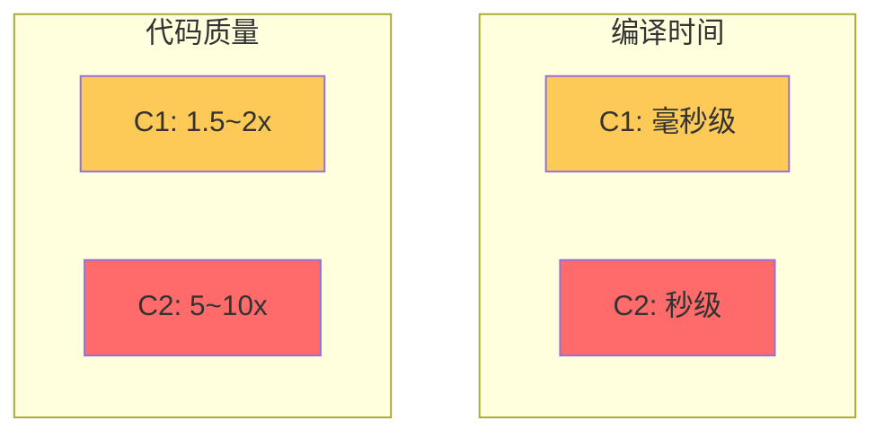
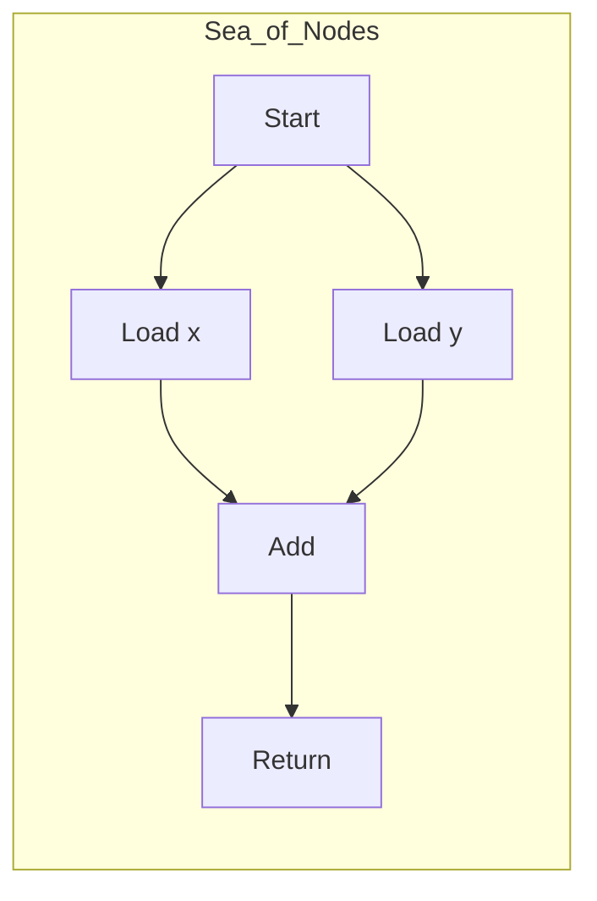
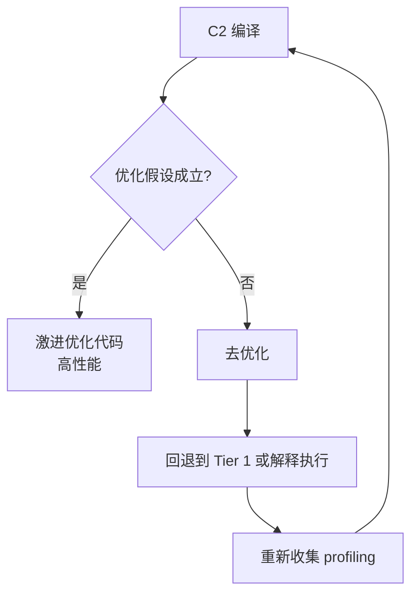
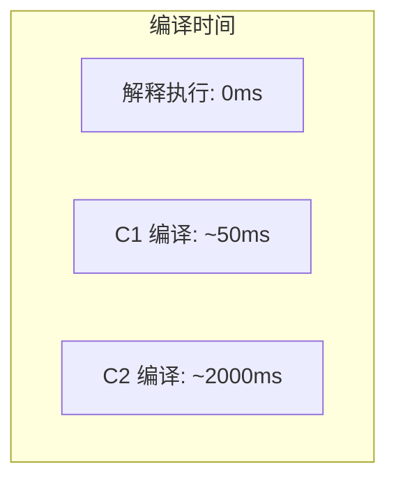

# C2 编译器（Server Compiler）

C2 编译器是 HotSpot VM 的服务端编译器，也称为 Server Compiler 或 Opto Compiler。它的设计目标是**峰值性能**，会进行深度的激进优化。

C2 编译器是 Java 达到接近 C++ 性能的关键。

## C2 编译器概述

C2 编译器有以下特点：

| 特性 | 说明 |
| --- | --- |
| 编译速度 | 慢，可能需要数秒 |
| 优化程度 | 高，激进优化 |
| 适用场景 | 服务端、长期运行 |
| 代码质量 | 最优，接近 native |



## C2 编译器架构

C2 使用图表示（Sea of Nodes）来表示程序：



### C2 的核心优化

#### 1. 虚方法内联

C2 能对虚方法进行深度内联：

```java
// 虚方法调用
interface Animal {
    void speak();
}

class Dog implements Animal {
    public void speak() {
        System.out.println("Woof");
    }
}

class Cat implements Animal {
    public void speak() {
        System.out.println("Meow");
    }
}

// 假设运行时 99% 是 Dog
// C2 可能优化为：
if (obj instanceof Dog) {
    ((Dog)obj).speak();  // 内联后直接调用
} else {
    obj.speak();  // 其他情况走虚调用
}
```

#### 2. 类型推测

C2 根据运行时信息推测类型：

```java
// 类型推测示例
public int sum(List<Integer> list) {
    int sum = 0;
    for (Integer n : list) {
        sum += n;  // C2 可能推测 n 永远不为 null
    }
    return sum;
}
```

#### 3. 逃逸分析

C2 进行深度的逃逸分析：

```java
// 逃逸分析优化
public Point createPoint() {
    Point p = new Point(1, 2);
    // 如果 p 不逃逸
    return p;  // C2 可能进行标量替换
}

// 优化后
public Point createPoint() {
    // 直接返回字段值，不需要对象头
    return new Point(1, 2);
}
```

#### 4. 激进优化与去优化

C2 会基于 profiling 数据进行激进优化，但假设失败时会去优化：



### 去优化的触发条件

| 条件 | 说明 |
| --- | --- |
| 类加载 | 新类加载改变了假设 |
| 逆优化计数 | 逆优化次数过多 |
| 栈上调用 | OSR 时的栈不匹配 |

## C2 的高级优化

### 1. 锁 coarsening 和锁消除

```java
// 锁粗化
// 优化前
synchronized (lock1) {
    doSomething();
}
synchronized (lock1) {
    doOther();
}

// 优化后
synchronized (lock1) {
    doSomething();
    doOther();
}

// 锁消除
// 假设 lock 只在当前线程使用
public void method() {
    Object lock = new Object();  // 不逃逸
    synchronized (lock) {
        // 锁可被消除
    }
}
```

### 2. 循环优化

```java
// 循环展开
// 优化前
for (int i = 0; i < 100; i++) {
    sum += arr[i];
}

// 优化后（展开 4 次）
for (int i = 0; i < 100; i += 4) {
    sum += arr[i];
    sum += arr[i+1];
    sum += arr[i+2];
    sum += arr[i+3];
}
```

### 3. 条件传播

```java
// 条件传播
// 优化前
if (obj != null) {
    obj.method();  // obj 非空
    obj.toString();
}

// 优化后
if (obj != null) {
    obj.method();
    obj.toString();  // 已确认 obj 非空
}
```

## C2 参数配置

| 参数 | 说明 | 默认值 |
| --- | --- | --- |
| `-XX:MaxInlineLevel` | 最大内联深度 | 9 |
| `-XX:MaxRecursiveInlineLevel` | 最大递归内联深度 | 1 |
| `-XX:FreqInlineSize` | 热点方法的 size 上限 | 325 |
| `-XX:InlineSmallCode` | 小方法的 size 上限 | 1000 |

## 观察 C2 编译

### JIT 编译日志

```bash
# 开启编译日志
java -XX:+UnlockDiagnosticVMOptions \
     -XX:+LogCompilation \
     -XX:LogFile=/tmp/jit.log \
     -jar application.jar

# 观察 C2 编译
grep "compiler='C2'" /tmp/jit.log | head -100
```

### 日志字段说明

```java
// JIT 日志示例
<nmethod compile_id='10' 
         compiler='C2' 
         method='com/example/MyClass.calculate ()I' 
         bytes='150' 
         count='25432' 
         backedge_count='1000'
         ...>

// 字段说明
// compiler: 编译器类型
// method: 编译的方法
// bytes: 方法字节码大小
// count: 方法调用次数
// backedge_count: 回边执行次数
```

## C2 的局限性

### 编译时间过长

C2 的深度优化需要大量计算：



### 代码膨胀

优化后的代码可能比原始代码大得多：

| 方法 | 原始大小 | C2 优化后 |
| --- | --- | --- |
| 简单方法 | 50 bytes | 200 bytes |
| 内联方法 | +30 bytes | +500 bytes |

### 去优化开销

去优化会带来性能回退：

```java
// 去优化场景
public int calculate() {
    if (rareCondition) {
        // 很少执行的分支
        // C2 假设这个分支不会被执行
    }
    return fastPath();  // C2 优化的快速路径
}
```

## C2 优化实战

### 观察热点方法

```bash
# 使用 -XX:+PrintCompilation
java -XX:+PrintCompilation \
     -XX:+UnlockDiagnosticVMOptions \
     -jar application.jar

# 输出示例
10 234 % !   com.example.MyClass::calculate @ 5 <compiled>
```

### 常用诊断工具

| 工具 | 说明 |
| --- | --- |
| `-XX:+PrintCompilation` | 打印编译日志 |
| `-XX:+PrintInlining` | 打印内联决策 |
| `-XX:+TraceDeoptimization` | 跟踪去优化 |
| JITWatch | 可视化 JIT 日志分析 |
