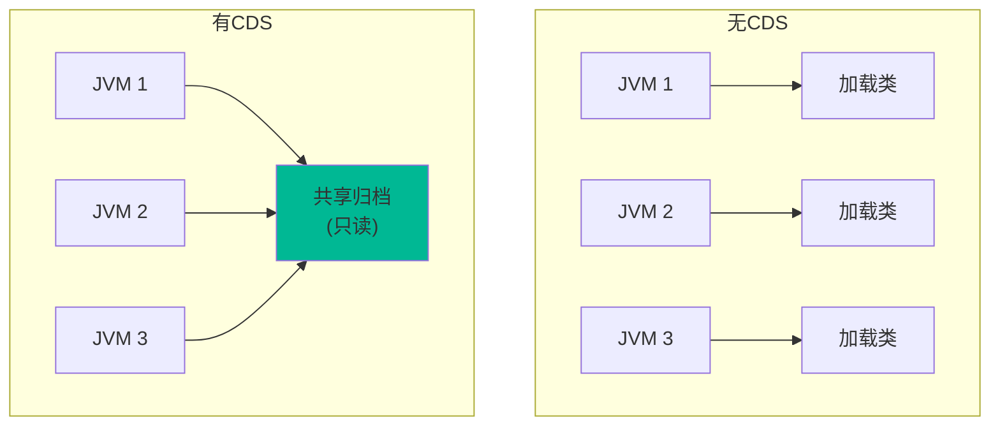
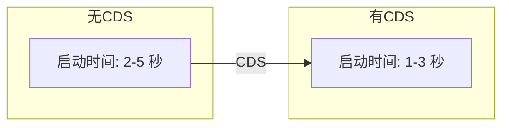

# CDS（Class Data Sharing）

理解 CDS，是理解 JVM 启动优化的重要基础。

## CDS 原理

### 工作原理



### 共享内容

CDS 主要共享以下内容：

| 内容 | 说明 |
| --- | --- |
| 类元数据 | 类的结构信息 |
| 方法字节码 | 已验证的字节码 |
| 内部数据结构 | JIT 编译相关数据 |
| 符号表 | 字符串常量 |

## 启用 CDS

### 基本用法

```bash
# 启用 CDS
java -Xshare:on -jar myapp.jar

# 或者
java -Xshare:auto -jar myapp.jar  # 默认行为

# 禁用 CDS
java -Xshare:off -jar myapp.jar
```

### 检查 CDS 状态

```bash
# 查看 CDS 状态
java -Xshare:on -version

# 输出示例
Java HotSpot(TM) 64-Bit Server VM (build 17+35-b272)...
opened shared archive /usr/lib/jvm/java-17-openjdk/lib/server/classes.jsa
```

## CDS 归档文件

### 归档位置

CDS 使用 `classes.jsa` 文件：

```bash
# 归档位置
$JAVA_HOME/lib/server/classes.jsa

# 自定义位置
java -Xshare:on \
     -XX:SharedArchiveFile=/path/to/archive.jsa \
     -jar myapp.jar
```

### 归档大小

| JDK 版本 | 归档大小 |
| --- | --- |
| JDK 8 | ~50MB |
| JDK 11 | ~100MB |
| JDK 17 | ~150MB |

## CDS 的优势

### 1. 启动时间

CDS 可以将启动时间减少 20-50%：



### 2. 内存占用

CDS 减少内存占用的方式：

| JVM 实例 | 无 CDS | 有 CDS |
| --- | --- | --- |
| JVM 1 | 100MB 元数据 | 共享 10MB |
| JVM 2 | 100MB 元数据 | 共享 10MB |
| JVM 3 | 100MB 元数据 | 共享 10MB |
| 总计 | 300MB | 30MB + 堆内存 |

### 3. I/O 优化

CDS 减少磁盘 I/O：

```bash
# 无 CDS：每次都从磁盘读取 class 文件
# 有 CDS：共享归档在内存映射，读取一次即可
```

## 使用 CDS

### 方式一：自动使用

```bash
# JDK 自动使用已存在的归档
java -Xshare:auto -jar myapp.jar
```

### 方式二：手动指定

```bash
# 指定归档文件
java -Xshare:on \
     -XX:SharedArchiveFile=/custom/archive.jsa \
     -jar myapp.jar
```

## AppCDS（Application Class Data Sharing）

AppCDS 是 CDS 的扩展，允许共享应用类数据。

### 创建应用类归档

```bash
# 步骤 1：创建类列表
java -XX:+UseAppCDS \
     -XX:DumpLoadedClassList=classes.lst \
     -cp myapp.jar \
     -jar myapp.jar

# 步骤 2：创建共享归档
java -XX:+UseAppCDS \
     -XX:SharedClassListFile=classes.lst \
     -XX:SharedArchiveFile=app.jsa \
     -cp myapp.jar \
     -jar myapp.jar

# 步骤 3：使用共享归档
java -XX:+UseAppCDS \
     -XX:SharedArchiveFile=app.jsa \
     -cp myapp.jar \
     -jar myapp.jar
```

### 完整示例

```bash
# 1. 列出要共享的类
java -XX:+UseAppCDS \
     -XX:DumpLoadedClassList=app.lst \
     -cp myapp.jar \
     -jar myapp.jar

# 2. 创建归档
java -XX:+UseAppCDS \
     -XX:SharedClassListFile=app.lst \
     -XX:SharedArchiveFile=app.jsa \
     -cp myapp.jar \
     -jar myapp.jar

# 3. 运行
java -XX:+UseAppCDS \
     -XX:SharedArchiveFile=app.jsa \
     -cp myapp.jar \
     -jar myapp.jar
```

## CDS 参数

### 常用参数

| 参数 | 说明 |
| --- | --- |
| `-Xshare:on` | 启用 CDS，共享归档不存在则报错 |
| `-Xshare:auto` | 启用 CDS，共享归档不存在则静默回退 |
| `-Xshare:off` | 禁用 CDS |
| `-XX:SharedArchiveFile` | 指定共享归档路径 |
| `-XX:DumpLoadedClassList` | 导出类列表 |

### 诊断参数

| 参数 | 说明 |
| --- | --- |
| `-Xlog:class+load=info` | 打印类加载日志 |
| `-Xlog:cds` | 打印 CDS 相关日志 |

## Docker 中的 CDS

### Dockerfile 示例

```dockerfile
FROM eclipse-temurin:17-jre-alpine

# 创建 CDS 归档
RUN /opt/java/openjdk/bin/java \
    -Xshare:auto \
    -jar myapp.jar && \
    cp /opt/java/openjdk/lib/server/classes.jsa /app/

# 使用 CDS 归档
CMD ["/opt/java/openjdk/bin/java", \
     "-Xshare:on", \
     "-XX:SharedArchiveFile=/app/classes.jsa", \
     "-jar", "/app/myapp.jar"]
```

### 多阶段构建

```dockerfile
# 构建阶段
FROM eclipse-temurin:17 AS builder
COPY myapp.jar /app/
RUN java -Xshare:auto -jar /app/myapp.jar

# 运行阶段
FROM eclipse-temurin:17-jre-alpine
COPY --from=builder /opt/java/openjdk/lib/server/classes.jsa /app/
COPY myapp.jar /app/
CMD ["java", "-Xshare:on", "-XX:SharedArchiveFile=/app/classes.jsa", "-jar", "/app/myapp.jar"]
```

## CDS 的限制

### 1. JDK 版本

| 版本 | CDS 支持 |
| --- | --- |
| JDK 8 | 是 |
| JDK 9-16 | AppCDS |
| JDK 17+ | AppCDS（更完善） |

### 2. 类加载器

CDS 只共享默认类加载器加载的类。

### 3. 动态类加载

动态加载的类无法共享。

## 性能测试

### 启动时间对比

```bash
# 无 CDS
time java -Xshare:off -jar myapp.jar
# 启动时间: 3.5 秒

# 有 CDS
time java -Xshare:on -jar myapp.jar
# 启动时间: 1.8 秒

# 提升: 50%
```

### 内存占用对比

```bash
# 无 CDS
jcmd <pid> VM.native_memory summary
# Total: reserved=200MB, committed=200MB

# 有 CDS
jcmd <pid> VM.native_memory summary
# Total: reserved=150MB, committed=150MB

# 节省: 50MB
```

## 最佳实践

### 1. 在构建时创建归档

```dockerfile
# 构建时创建归档
RUN java -Xshare:auto -jar myapp.jar
```

### 2. 使用 `-Xshare:auto`

```bash
# 推荐：自动使用 CDS
java -Xshare:auto -jar myapp.jar
```

### 3. 验证 CDS 状态

```bash
# 验证 CDS 启用
java -Xlog:class+load=info -Xshare:on -jar myapp.jar 2>&1 | grep "shared"
```

## CDS 与 GraalVM

CDS 和 GraalVM 是不同的优化策略：

| 特性 | CDS | GraalVM 原生镜像 |
| --- | --- | --- |
| 原理 | 共享类元数据 | AOT 编译 |
| 启动时间 | 减少 20-50% | 减少 90%+ |
| 峰值性能 | 不影响 | 可能略低 |
| 内存占用 | 减少 | 显著减少 |
