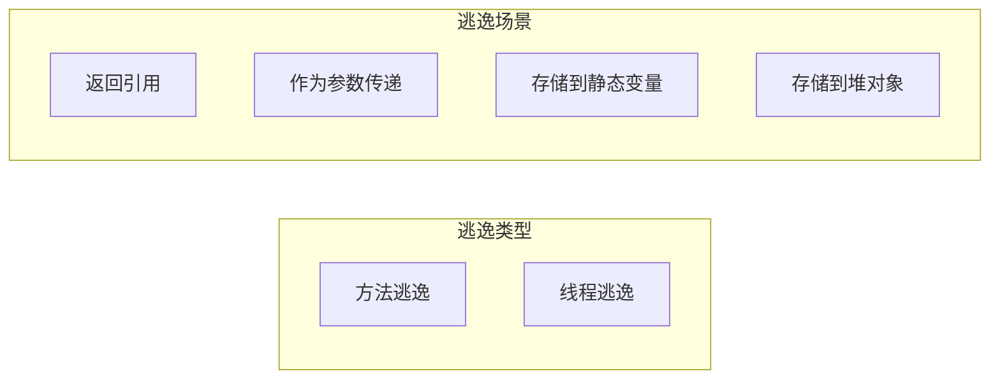
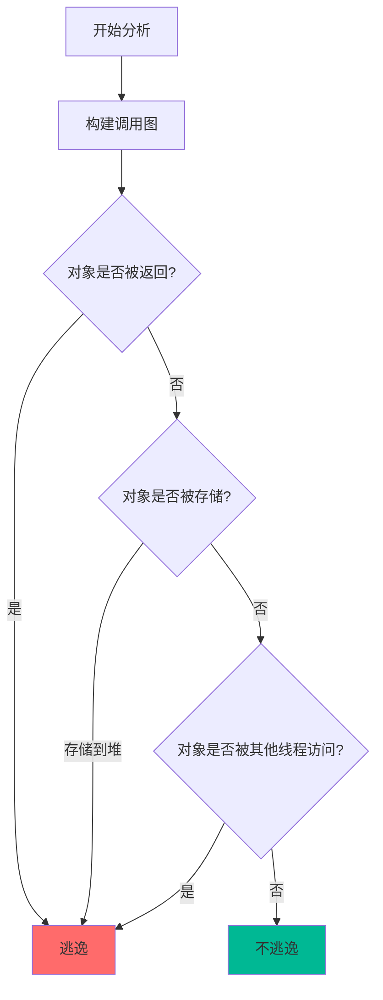
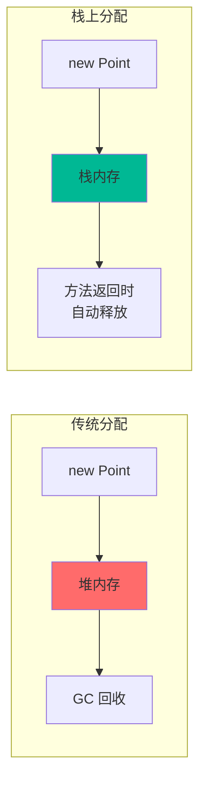
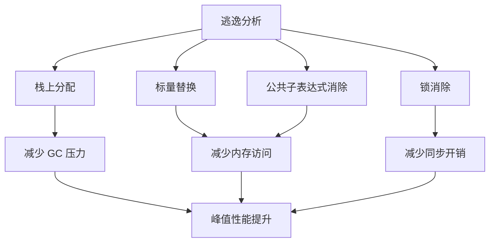

# 逃逸分析（Escape Analysis）

基于逃逸分析的结果，JIT 可以进行栈上分配、标量替换、锁消除等优化，大幅提升性能。

## 什么是逃逸

逃逸指对象的引用超出了其创建范围：



### 方法逃逸

```java
// 方法逃逸示例
public class EscapeExample {
    private static Object staticRef;  // 静态变量
    
    public Object methodEscape() {
        Object obj = new Object();
        return obj;  // 逃逸：作为返回值
    }
    
    public void argEscape(Object obj) {
        // obj 作为参数传入
        // 如果保存引用，obj 逃逸
    }
    
    public void staticEscape() {
        staticRef = new Object();  // 逃逸：存储到静态变量
    }
}
```

### 线程逃逸

```java
// 线程逃逸示例
public class ThreadEscape {
    public Object field;  // 实例字段
    
    public void threadEscape() {
        Object obj = new Object();
        new Thread(() -> {
            System.out.println(obj);  // 逃逸：被其他线程访问
        }).start();
    }
}
```

## 逃逸分析算法

### 分析过程



### 编译时分析

逃逸分析在 JIT 编译时进行：

```java
// JIT 编译时进行逃逸分析
public void process() {
    Point p = new Point(1, 2);  // JIT 分析 p 的作用域
    
    // 如果 p 不逃逸
    int sum = p.x + p.y;
    // 可以优化
}
```

## 逃逸分析的结果

逃逸分析将对象分为三类：

| 类型 | 说明 | JIT 优化 |
| --- | --- | --- |
| 不逃逸（NoEscape） | 对象在方法内使用 | 栈上分配、标量替换、锁消除 |
| 参数逃逸（ArgEscape） | 作为参数传递给其他方法 | 部分优化 |
| 全局逃逸（GlobalEscape） | 逃逸到方法或线程之外 | 无优化 |

## 逃逸分析的应用

### 1. 栈上分配

不逃逸的对象可以直接在栈上分配：

```java
// 栈上分配示例
public void process() {
    Point p = new Point(1, 2);  // JIT 判断不逃逸
    int sum = p.x + p.y;       // 在栈上分配
}  // 方法返回时自动释放，无需 GC
```



### 2. 标量替换

不逃逸对象的字段可以替换为独立的局部变量：

```java
// 标量替换前
public int calculate() {
    Point p = new Point(1, 2);  // 对象
    return p.x + p.y;
}

// 标量替换后
public int calculate() {
    int x = 1;  // 标量替换
    int y = 2;  // 标量替换
    return x + y;
}
```

### 3. 锁消除

不逃逸的对象的 synchronized 可以被消除：

```java
// 锁消除前
public void process() {
    Object obj = new Object();
    synchronized (obj) {
        // 同步代码
    }
}

// 锁消除后（obj 不逃逸）
public void process() {
    Object obj = new Object();
    // synchronized 被消除
}
```

## 逃逸分析参数

### 启用逃逸分析

逃逸分析默认启用：

```bash
# 显式启用
java -XX:+DoEscapeAnalysis -jar application.jar

# 禁用
java -XX:-DoEscapeAnalysis -jar application.jar
```

### 逃逸分析选项

```bash
# 逃逸分析相关参数（诊断用）
-XX:+PrintEscapeAnalysis   # 打印逃逸分析结果
-XX:+PrintEliminateLocks   # 打印锁消除信息
-XX:+PrintInline           # 打印内联信息
```

## 逃逸分析的限制

### 1. 分析复杂度

逃逸分析是跨方法的，复杂度较高：

```java
// 跨方法的逃逸分析
public void method1() {
    Object obj = new Object();
    method2(obj);  // 需要分析 method2
}

public void method2(Object obj) {
    // obj 传入
    // 需要分析 obj 的使用
}
```

### 2. 保守策略

JIT 编译器倾向于保守分析：

```java
// JIT 可能保守估计
public void process() {
    Object obj = new Object();
    if (complexCondition()) {
        return obj;  // JIT 可能认为 obj 逃逸
    }
    return null;
}
```

### 3. 虚方法调用

虚方法调用使逃逸分析更复杂：

```java
// 虚方法调用
public void process() {
    Object obj = new Object();
    ((Comparable)obj).compareTo(obj);  // 复杂调用链
}
```

## 逃逸分析实战

### 观察逃逸分析

```bash
# 打印逃逸分析结果
java -XX:+PrintEscapeAnalysis \
     -XX:+UnlockDiagnosticVMOptions \
     -jar application.jar

# 输出示例
[Escape Analysis] ESCAPE: method 'process' Point 'p' does not escape
[Escape Analysis] STACK ALLOC: method 'process' Point 'p'
```

### 性能影响

逃逸分析的优化效果：

| 优化 | 性能提升 | 说明 |
| --- | --- | --- |
| 栈上分配 | 10%~30% | 减少 GC 压力 |
| 标量替换 | 5%~15% | 减少内存访问 |
| 锁消除 | 3%~10% | 减少同步开销 |

### 代码模式

#### 有利于逃逸分析的代码模式

```java
// 推荐：局部使用对象
public int calculate() {
    Point p = new Point(1, 2);  // 局部使用
    return p.x + p.y;
}

// 推荐：流式 API
list.stream()
    .map(Point::new)
    .filter(p -> p.x > 0)
    .collect(Collectors.toList());
```

#### 不利于逃逸分析的代码模式

```java
// 不推荐：存储到集合
public void store(Point p) {
    cache.add(p);  // p 可能逃逸
}

// 不推荐：作为返回值
public Point create() {
    return new Point(1, 2);  // 逃逸
}
```

## 逃逸分析与性能

逃逸分析是 JIT 优化的重要基础：



逃逸分析让 Java 的性能可以接近 C++，是 JVM 的核心优化技术之一。
