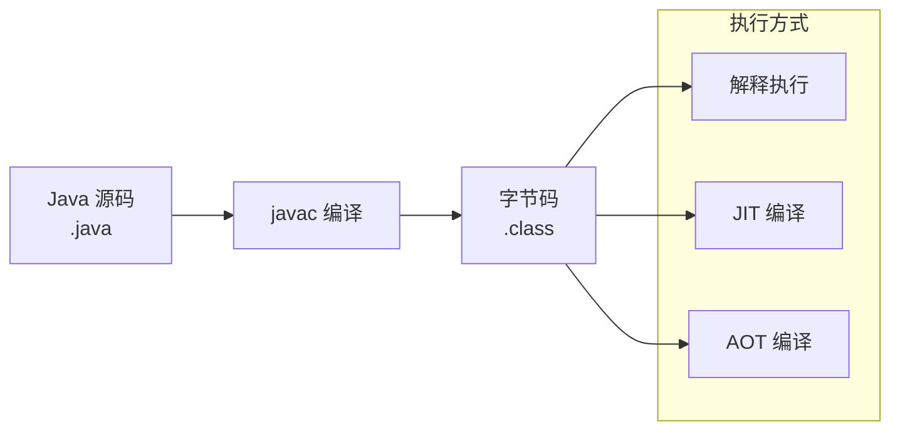
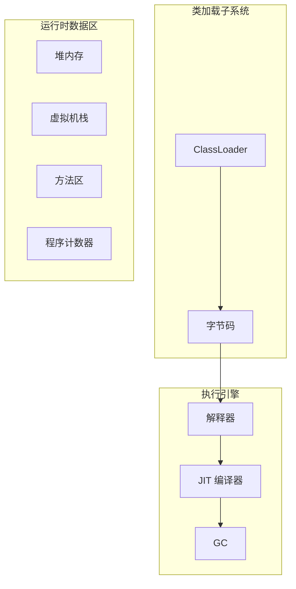
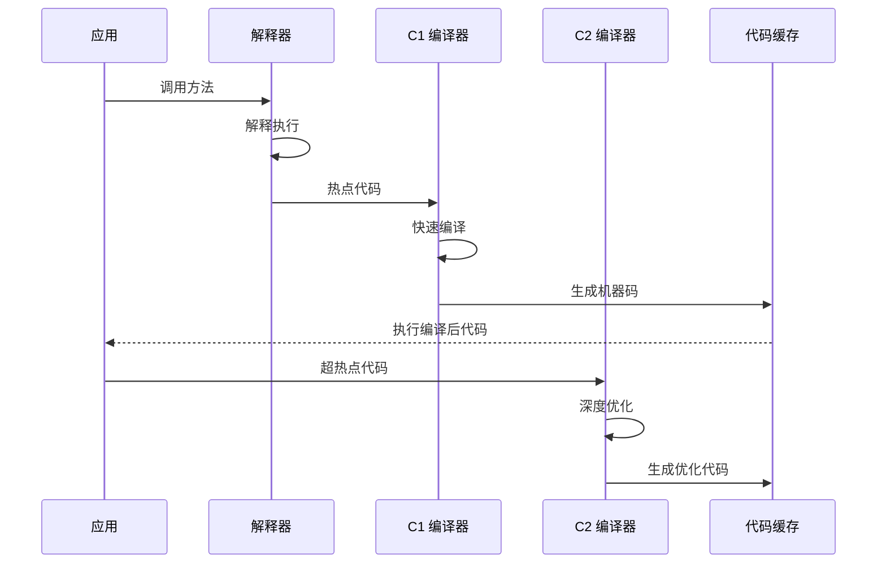

# JVM 执行引擎架构

JVM 执行引擎是 Java 程序运行的核心。它负责将字节码转换为机器码并执行，是 Java「一次编写，到处运行」的关键。

理解执行引擎的架构，是深入理解 JIT 编译的基础。

## 执行方式

Java 代码有多种执行方式：



### 解释执行

解释执行逐条读取字节码指令并翻译成机器码执行：

- **优点**：启动快，无需等待编译
- **缺点**：执行速度慢，每次调用都需要解释

### JIT 编译

JIT（Just-In-Time）编译器在运行时将热点字节码编译成机器码：

- **优点**：编译后的代码执行速度快
- **缺点**：需要预热时间，编译本身消耗资源

### AOT 编译

AOT（Ahead-of-Time）编译在程序运行前将字节码编译成机器码：

- **优点**：无需预热，启动快
- **缺点**：无法利用运行时信息做激进优化

## HotSpot VM 架构

HotSpot VM 是目前最主流的 JVM 实现：



### 解释器

解释器逐条执行字节码指令：

```java
// 解释器执行循环
public void interpret() {
    while (!terminated) {
        // 获取下一条字节码指令
        Bytecodes code = fetch();
        
        // 分发到对应的执行逻辑
        switch (code) {
            case ILOAD:
                pushLocalInt();
                break;
            case IADD:
                int b = popInt();
                int a = popInt();
                pushInt(a + b);
                break;
            // ... 更多指令
        }
    }
}
```

### JIT 编译器

HotSpot VM 包含两个 JIT 编译器：

| 编译器 | 名称 | 特点 |
| --- | --- | --- |
| C1 | Client Compiler | 快速编译，优化激进程度低 |
| C2 | Server Compiler | 深度优化，编译耗时长 |


## 分层编译

现代 JVM 采用分层编译策略：

| 层级 | 编译器 | 编译速度 | 优化程度 |
| --- | --- | --- | --- |
| 0 | 解释执行 | - | - |
| 1 | C1 编译 | 快 | 低 |
| 2 | C1 + Profiling | 中 | 中 |
| 3 | C2 编译 | 慢 | 高 |

```java
// 热点代码探测
public class HotSpotDetector {
    // 方法调用计数器
    private int methodCallCount = 0;
    private static final int COMPILE_THRESHOLD = 10000;
    
    public void execute() {
        methodCallCount++;
        
        // 超过阈值，触发编译
        if (methodCallCount >= COMPILE_THRESHOLD) {
            triggerJITCompilation();
        }
    }
}
```

## 执行引擎的协作



## JIT 编译器的作用

JIT 编译器的主要作用：

1. **提升执行速度**：编译后的机器码比解释执行快 10~100 倍
2. **激进优化**：利用运行时信息进行深度优化
3. **去优化**：在优化假设不成立时回退到解释执行

## 代码缓存

编译后的机器码存储在代码缓存（Code Cache）中：

| 参数 | 说明 | 默认值 |
| --- | --- | --- |
| `-XX:InitialCodeCacheSize` | 代码缓存初始大小 | 160KB |
| `-XX:ReservedCodeCacheSize` | 代码缓存最大大小 | 48MB |
| `-XX:CodeCacheExpansionSize` | 扩展大小 | 32KB |

如果代码缓存满了，JIT 编译器会停止工作：

```java
// 代码缓存耗尽时的日志
Java HotSpot(TM) 64-Bit Server VM warning: 
    code cache is full. 
    Compiler has been disabled.
```

## 性能影响

不同执行方式的性能对比：

| 执行方式 | 启动时间 | 峰值性能 | 适用场景 |
| --- | --- | --- | --- |
| 纯解释 | 最快 | 最差 | 短生命周期程序 |
| 分层编译 | 中等 | 最优 | 长时运行服务 |
| AOT | 最快 | 中等 | Serverless、容器 |
