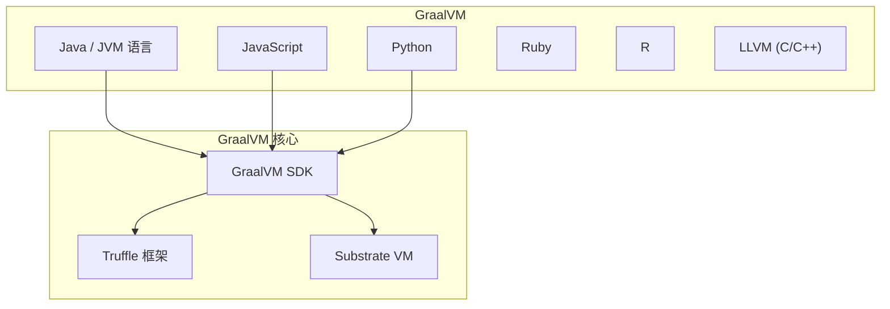
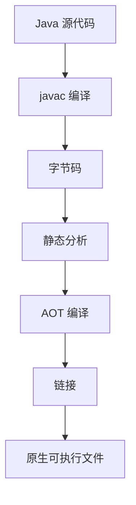
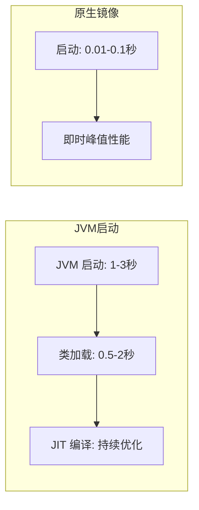

# GraalVM 原生镜像

理解 GraalVM 原生镜像，是理解云原生 Java 和 Serverless 场景的关键。

## GraalVM 简介

GraalVM 是一个通用的虚拟机，支持多种语言：



## GraalVM 架构

### Truffle 语言实现框架

Truffle 允许用 Java 编写语言解释器：

```java
// Truffle 语言解释器示例
public class SimpleLanguage extends TruffleLanguage<Context> {
    @Override
    protected Context createContext(Env env) {
        return new Context();
    }
    
    @Override
    protected Object eval(Source source, Node context, String... argumentNames) {
        return interpret(source.getCode());
    }
}
```

### Substrate VM

Substrate VM 是 GraalVM 原生镜像的运行时：

| 组件 | 说明 |
| --- | --- |
| 垃圾回收器 | 优化的 GC 实现 |
| 线程管理 | 原生线程支持 |
| 反射处理 | 配置化的反射支持 |
| 动态加载 | 有限的类加载 |

## 原生镜像编译过程

### 编译流程



### 分析阶段

```bash
# 原生镜像编译
native-image --jar myapp.jar myapp

# 详细日志
native-image --jar myapp.jar myapp --verbose
```

## 原生镜像的优势

### 启动时间



### 内存占用

| 指标 | JVM | 原生镜像 |
| --- | --- | --- |
| 启动内存 | 100-200MB | 10-50MB |
| RSS 内存 | 200-500MB | 50-150MB |

### 性能对比

| 场景 | JVM | 原生镜像 |
| --- | --- | --- |
| 启动时间 | 2-5 秒 | 0.01-0.1 秒 |
| 内存占用 | 200MB+ | 50MB+ |
| 峰值性能 | 最优 | 接近最优 |

## 原生镜像的限制

### 1. 反射支持

反射需要配置：

```java
// 反射配置
// reflect-config.json
[
  {
    "name": "com.example.MyClass",
    "fields": [
      {"name": "field1", "type": "int"}
    ],
    "methods": [
      {"name": "method1", "parameterTypes": []}
    ]
  }
]
```

### 2. 动态类加载

```java
// 动态加载需要配置
// serialized-config.json
[
  {
    "name": "com.example.DynamicClass",
    "allDeclaredClasses": true,
    "allPublicMethods": true
  }
]
```

### 3. 动态代理

```java
// 动态代理需要配置
// proxy-config.json
[
  {
    "interfaces": ["com.example.MyInterface"]
  }
]
```

## Spring Native

### Spring Native 简介

Spring Native 是 Spring 框架的原生镜像支持：

```xml
<!-- pom.xml -->
<dependencies>
    <dependency>
        <groupId>org.springframework.experimental</groupId>
        <artifactId>spring-native</artifactId>
        <version>0.10.0</version>
    </dependency>
</dependencies>

<build>
    <plugins>
        <plugin>
            <groupId>org.springframework.experimental</groupId>
            <artifactId>spring-aot-maven-plugin</artifactId>
        </plugin>
    </plugins>
</build>
```

### 使用 Spring Native

```bash
# 构建原生镜像
./mvnw spring-native:compile

# 运行
./target/myapp
```

## 性能优化

### 1. 减少镜像大小

```bash
# 移除调试信息
native-image --strip-debug-info myapp

# 使用更小的 GC
native-image --gc=epsilon myapp
```

### 2. 优化启动性能

```bash
# 启用预初始化
native-image --initialize-at-run-time=com.example.InitClass myapp
```

### 3. 内存优化

```bash
# 减少堆大小
native-image -R:MaxHeapSize=128m myapp
```

## 监控和调试

### 调试原生镜像

```bash
# 启用调试信息
native-image -g myapp

# 使用 GDB 调试
gdb ./myapp
```

### 性能分析

```bash
# 使用 async-profiler
async-profiler record -e alloc -o svg -f profile.svg ./myapp
```

## 适用场景

### 1. Serverless 函数

```yaml
# AWS Lambda
AWSTemplateFormatVersion: '2010-09-09'
Resources:
  MyFunction:
    Type: AWS::Serverless::Function
    Properties:
      Runtime: provided
      CodeUri: ./target/myapp
      Handler: myapp
```

### 2. 容器化部署

```dockerfile
FROM ubuntu:20.04
COPY myapp /app/myapp
CMD ["/app/myapp"]
```

### 3. 命令行工具

```bash
# 分发 CLI 工具
./myapp --help
```

## 与传统 JVM 的对比

| 特性 | JVM | GraalVM 原生镜像 |
| --- | --- | --- |
| 启动时间 | 1-5 秒 | 0.01-0.1 秒 |
| 内存占用 | 100-500MB | 10-100MB |
| 峰值性能 | 最优 | 接近最优 |
| 二进制大小 | 小（class） | 大（native） |
| GC 灵活性 | 高 | 中 |
| 反射支持 | 原生 | 需要配置 |

## 未来发展

### GraalVM 社区

- 持续改进性能
- 增加更多库支持
- 更好的工具链

### 云原生 Java

- 更快的启动
- 更低的内存
- 更好的容器集成
