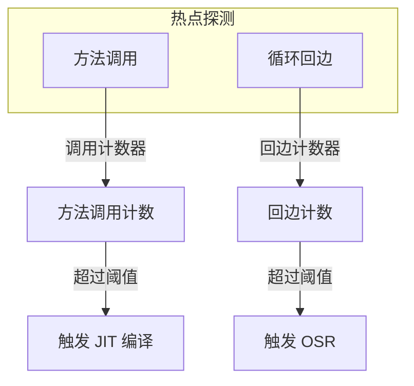
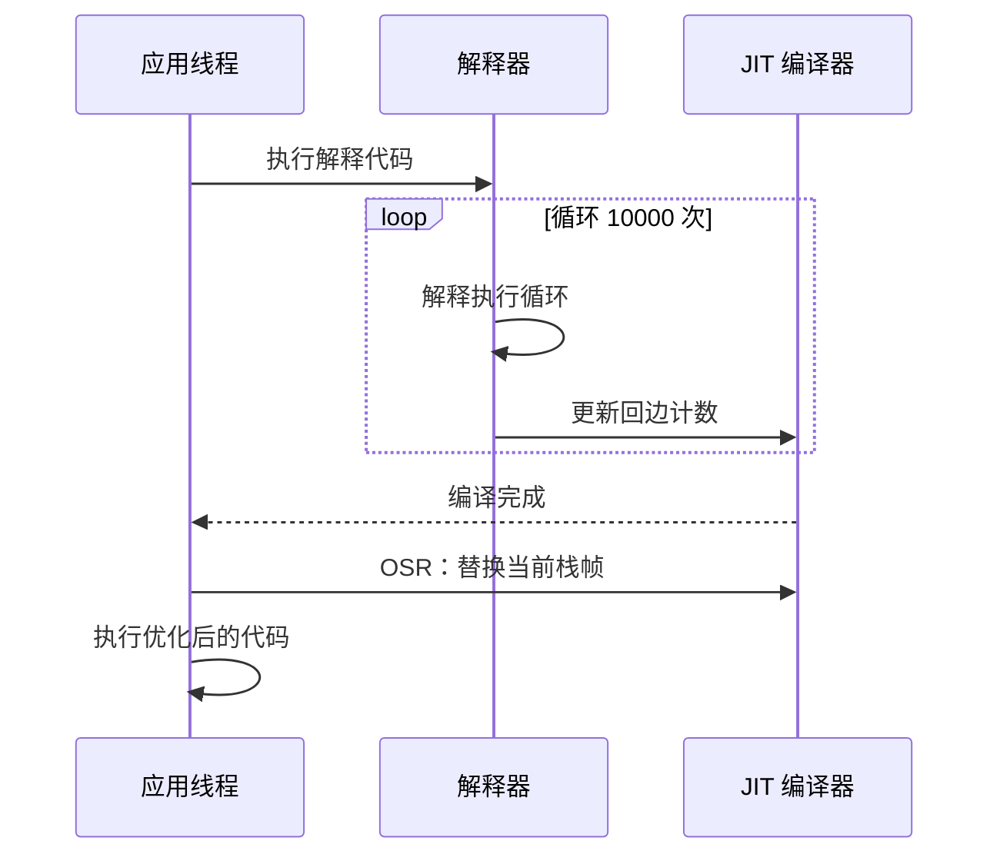

# 热点代码探测（HotSpot Detection）

理解热点探测机制，是理解 JIT 编译工作原理的基础。

## 为什么要探测热点

如果 JIT 编译器编译所有代码，会有以下问题：

| 问题 | 说明 |
| --- | --- |
| 编译时间过长 | 编译本身需要时间 |
| 代码缓存爆炸 | 编译后的代码占用大量内存 |
| 优化效果差 | 不常执行的代码不值得深度优化 |

只有频繁执行的代码才值得 JIT 编译：

```java
// 热点代码示例
public class HotSpotExample {
    public void process() {
        // 这个方法可能被调用 100000 次
        for (int i = 0; i < 100000; i++) {
            calculate(i);  // 热点
        }
    }
    
    public int calculate(int n) {
        return n * n;  // 超热点
    }
}
```

## 热点探测方法

JVM 使用两种计数器来探测热点：



## 方法调用计数器

### 工作原理

方法调用计数器记录每个方法被调用的次数：

```java
// 方法调用计数器示意
public class MethodInvocationCounter {
    private int invocationCount = 0;
    private static final int THRESHOLD = 10000;
    
    public void onMethodInvoke() {
        invocationCount++;
        
        if (invocationCount >= THRESHOLD) {
            triggerJITCompilation();  // 触发编译
        }
    }
}
```

### 计数器衰减

为防止方法调用计数器无限增长，JIT 编译器会定期衰减计数器：

```java
// 计数器衰减机制
public void onCompilation() {
    // 编译完成后，计数器归零或衰减
    // 防止计数器无限增长导致误判
    invocationCount = invocationCount / 2;
}
```

### 触发条件

```bash
# 默认阈值：10000 次调用
-XX:CompileThreshold=10000

# 降低阈值（更快编译）
-XX:CompileThreshold=1000

# 升高阈值（延迟编译）
-XX:CompileThreshold=50000
```

## 回边计数器

### 工作原理

回边计数器记录循环回边的执行次数：

```java
// 回边计数器示意
public class BackEdgeCounter {
    private int backEdgeCount = 0;
    private static final int THRESHOLD = 10000;
    
    public void onLoopBackEdge() {
        backEdgeCount++;
        
        if (backEdgeCount >= THRESHOLD) {
            triggerOSR();  // 触发栈上替换
        }
    }
}
```

### OSR（On-Stack Replacement）

OSR 允许在运行时将正在执行的解释代码或低版本编译代码替换为高版本编译代码：



## 热点阈值

### 默认阈值

| 参数 | 默认值 | 说明 |
| --- | --- | --- |
| `-XX:CompileThreshold` | 10000 | 方法调用阈值 |
| `-XX:OnStackReplacePercentage` | 140 | 回边阈值系数 |
| `-XX:BackEdgeThreshold` | 同 CompileThreshold | 回边阈值 |

### 回边阈值计算

```
回边阈值 = CompileThreshold * OnStackReplacePercentage / 100
         = 10000 * 140 / 100
         = 14000
```

### 分层编译的阈值

分层编译模式下，阈值会动态调整：

| 层级 | 触发条件 |
| --- | --- |
| Tier 0 | 解释执行 |
| Tier 1 | 调用计数 >= CompileThreshold |
| Tier 2 | 调用计数 >= Tier3InvocationThreshold |
| Tier 3 | 调用计数 >= Tier3BackEdgeThreshold |

## 热点探测参数

### 基础参数

```bash
# 方法调用阈值
java -XX:CompileThreshold=10000 -jar application.jar

# 回边阈值
java -XX:OnStackReplacePercentage=140 -jar application.jar
```

### 分层编译参数

```bash
# Tier 3 触发阈值
java -XX:Tier3InvocationThreshold=20000 -jar application.jar

# Tier 3 回边阈值
java -XX:Tier3BackEdgeThreshold=200000 -jar application.jar

# Tier 3 最小调用阈值
java -XX:Tier3MinInvocationThreshold=1000 -jar application.jar
```

## 热点探测的监控

### PrintCompilation

```bash
# 开启编译日志
java -XX:+PrintCompilation \
     -XX:+UnlockDiagnosticVMOptions \
     -jar application.jar

# 输出示例
1    234 %  !   com.example.MyClass::hotMethod @ 5 <compiled>
2    567    n   java.lang.System::arraycopy <native>
```

### 日志解读

```java
// 日志格式说明
[timestamp] [method_id] [flags] [type] [method_name] [@ bc_pos] [compile_info]

// 示例解读
1    234 %  !   com.example.MyClass::hotMethod @ 5 <compiled>
|    |     |    |                              |    |     |
|    |     |    |                              |    |     编译完成
|    |     |    |                              |    字节码位置
|    |     |    |                              方法名
|    |     |    标记：% = OSR, ! = 有异常处理
|    方法ID
时间戳
```

### 使用 JMX 监控

```java
// 通过 JMX 获取编译信息
MBeanServer mbs = ManagementFactory.getPlatformMBeanServer();
ObjectName name = new ObjectName("com.sun.management:type=HotSpotDiagnostic");
Object result = mbs.invoke(name, "dumpCompileSnapshot", null, null);
```

## 热点探测的影响因素

### 代码大小

JIT 编译器偏向编译小的热点方法：

```java
// 小方法更容易被编译
public int add(int a, int b) {
    return a + b;  // 编译热点
}

// 大方法可能被忽略
public void hugeMethod() {
    // 1000 行代码
    // 可能不会被 JIT 编译
}
```

### 调用频率

调用频率是决定热点的主要因素：

```java
// 高频调用 - 编译热点
public void process() {
    for (int i = 0; i < 1000000; i++) {
        calculate(i);  // 1000000 次调用
    }
}

// 低频调用 - 可能不编译
public void init() {
    calculateOnce();  // 只调用 1 次
}
```

### 循环复杂度

复杂循环更容易成为热点：

```java
// 简单循环 - 快速编译
for (int i = 0; i < n; i++) {
    sum += i;
}

// 复杂循环 - 延迟编译
for (int i = 0; i < n; i++) {
    for (int j = 0; j < m; j++) {
        if (condition(i, j)) {
            process(i, j);
        }
    }
}
```

## 优化热点探测

### 1. 减少小方法

```java
// 优化前
public int getValue() {
    return value;  // 频繁调用但太小
}

// 优化后：内联到调用方
public void process() {
    int v = value;  // 直接访问
}
```

### 2. 减少不必要的方法调用

```java
// 优化前
public int calculate(int n) {
    return doSomething(n);  // 额外调用
}

// 优化后：合并方法
public int calculate(int n) {
    return n * n + 1;  // 内联逻辑
}
```

### 3. 使用 final 和 static

```java
// 优化提示
public final class Calculator {  // final 类提示内联
    public static int add(int a, int b) {  // static 提示优化
        return a + b;
    }
}
```
