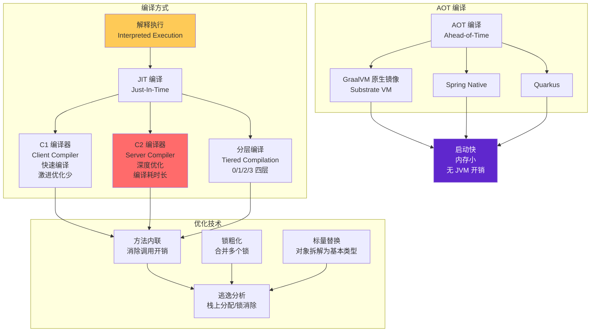
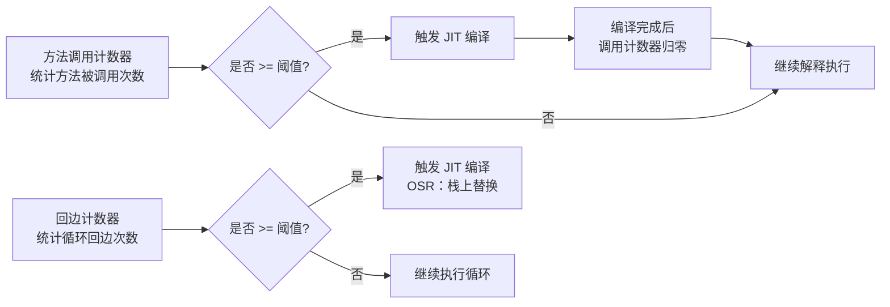
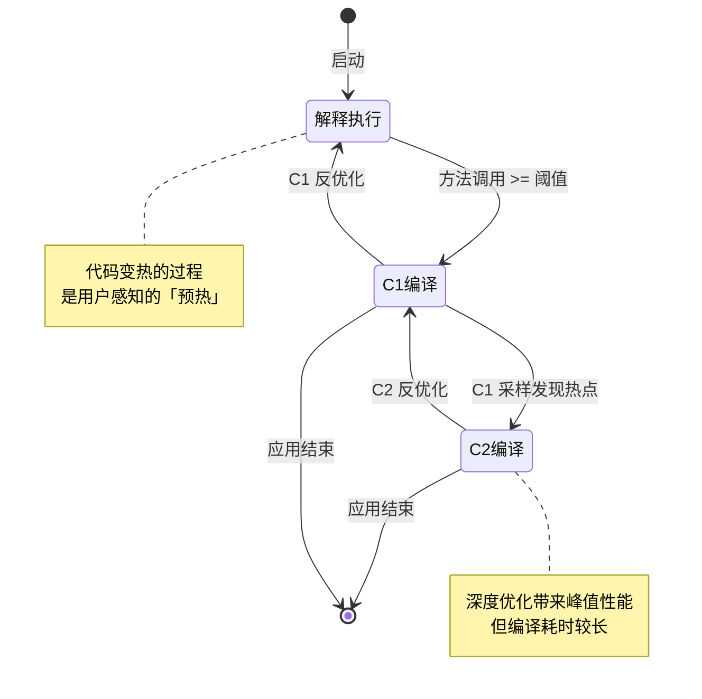
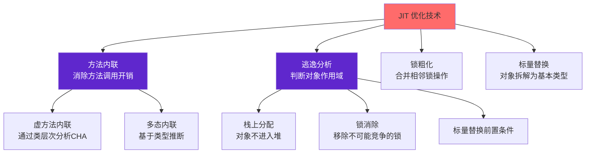

# JIT 编译与 AOT

凌晨 3 点，你刚完成一次微服务发布。监控系统显示：应用启动花了整整 45 秒。运维群里开始刷屏：「服务不可用」「健康检查失败」「K8s 在疯狂重启 Pod」。你的第一反应是——是不是代码哪里出问题了？但更可能的原因是：**Java 应用根本没有「热」起来。**

JVM 在启动阶段需要先解释执行字节码，随着代码运行，热点代码才会被 JIT 编译器编译成机器码。这个过程叫「预热」。如果你的应用刚启动就遇到流量高峰，而 JIT 还没完成编译，轻则延迟飙升，重则超时崩溃。

另一边，有人已经在用 GraalVM 原生镜像启动 Java 应用——**0.01 秒**，不是 0.01 秒的百分之一，是真正的 0.01 秒。这背后是 AOT 编译的力量：在运行前就把代码编译好，彻底告别 JVM 启动慢的问题。

**JIT 和 AOT，代表了两种截然不同的性能哲学：前者用运行时信息换最优代码，后者用启动时间换即时响应。** 理解它们，是深入 JVM 性能优化的必经之路。

本模块将系统讲解 JIT 编译的完整体系：从热点探测到分层编译，从方法内联到逃逸分析，再到 AOT 编译的崛起与 GraalVM 原生镜像的实战应用。

## 模块结构

本模块按主题分为 8 个子模块：

| 子模块 | 核心问题 | 典型场景 |
| --- | --- | --- |
| JVM 执行引擎架构 | 解释执行 vs 编译执行，字节码如何被处理 | 理解 JIT 工作的前提 |
| JIT 编译器概述 | C1/C2/分层编译体系 | 热点代码何时被编译 |
| JIT 优化技术 | 方法内联、逃逸分析、锁粗化、标量替换 | 为什么 JIT 代码更快 |
| JIT 日志解读 | `-XX:PrintCompilation` 如何读 | 生产调优与问题排查 |
| AOT 编译 | GraalVM、Spring Native、Quarkus | 云原生与 Serverless 场景 |
| JIT vs AOT | 启动性能 vs 峰值性能的权衡 | 技术选型依据 |
| JVM 启动优化技术 | AppCDS、惰性加载 | 缩短启动时间 |
| CDS 与 AppCDS | 类数据共享原理与实战 | 大规模部署场景 |

## JVM 编译体系全景

## 热点代码探测机制

JIT 编译器不会一上来就编译所有代码——它需要数据支撑。HotSpot JVM 通过两个计数器来判断代码是否「热」：

**方法调用计数器**用于统计方法被调用的次数，**回边计数器**用于统计循环体的回边次数。当计数器超过阈值时，JIT 编译器就会介入。

阈值默认是多少？`-XX:CompileThreshold=10000`。这意味着一个方法被调用 10000 次后，或者一个循环执行了 10000 次回边后，就会触发编译。但分层编译模式下，这个阈值是动态调整的。

## 分层编译的四层境界

分层编译（Tiered Compilation）是现代 JVM 的默认策略，它解决了「编译耗时 vs 执行效率」之间的矛盾：

| 层级 | 编译器 | 编译速度 | 优化程度 | 使用场景 |
| --- | --- | --- | --- | --- |
| 0 | 解释执行 | - | - | 刚启动，代码还没热起来 |
| 1 | C1 编译器 | 快 | 低 | 快速编译热点代码 |
| 2 | C1 + 配置 profiling | 中 | 中 | 带调用计数的 C1 编译 |
| 3 | C2 编译器 | 慢 | 高 | 深度优化，峰值性能 |

**为什么分层编译能加速启动？** 因为 JVM 不需要等待 C2 完成编译才让代码运行——先用 C1 快速编译一个「够用」的版本，等 C2 编译好再替换。这就是为什么分层编译模式下，你会在 JIT 日志中看到同一个方法被编译多次。

## 核心优化技术图谱

JIT 编译器之所以能让 Java 代码跑得比肩 C++，靠的是一系列深度优化：

**方法内联**是最重要的优化——它为其他所有优化提供了前提。如果一个方法被内联，它的代码就变成了调用方的代码，后续的逃逸分析、锁优化、冗余消除都可以跨方法边界生效。

**逃逸分析**是 JIT 的「智能大脑」——它分析一个对象的引用是否会逃出当前作用域。如果不逃逸，就可以做栈上分配（对象直接在栈上分配，不需要 GC）、锁消除（如果对象只在一个线程中使用，就不需要加锁）。

## JIT vs AOT：两种性能哲学

| 维度 | JIT 编译 | AOT 编译 |
| --- | --- | --- |
| **编译时机** | 运行时 | 运行前（构建时） |
| **启动性能** | 慢（需要预热） | 快（无需预热） |
| **峰值性能** | 高（基于运行时 profile 做激进优化） | 中等（编译时信息有限） |
| **内存占用** | JVM + 元数据，较大 | 无 JVM，内存占用小 |
| **二进制大小** | 小（Class 文件） | 大（机器码） |
| **适配运行时** | 能感知 CPU 类型、运行时数据 | 受限于编译时信息 |
| **适用场景** | 长时运行服务、峰值性能敏感 | Serverless、容器化、短生命周期进程 |

**JIT 的优势**：基于运行时信息（profiling data）可以做非常激进的优化。例如，如果一个虚方法调用在运行时 99% 的情况下都是同一个实现，JIT 可以把它变成直接调用。

**AOT 的优势**：启动时间几乎为零，内存占用大幅降低。在 Serverless 场景下，冷启动时间直接影响函数计费——AOT 是最优解。

## 常见认知误区

| 误区 | 真相 |
| --- | --- |
| JIT 编译会让代码变慢 | JIT 编译本身不慢，真正慢的是「还没编译好」的执行 |
| C2 比 C1 一定好 | C2 优化深度更大，但编译耗时更长，峰值性能未必更优 |
| GraalVM 原生镜像一定比 JVM 快 | 原生镜像启动快，但峰值性能可能不如 JIT，且有平台限制 |
| 关闭分层编译可以加速启动 | 关闭分层编译后，C2 直接编译反而更慢，启动时间可能更长 |
| JIT 日志越详细越好 | JIT 日志有性能开销，生产环境应谨慎开启 |

## 学习建议

1. **从问题出发**：不要一开始就背概念，想清楚「这个优化解决什么问题」
2. **理解权衡**：每种优化都有代价，JIT 不是银弹，AOT 也不是万能
3. **动手验证**：开启 JIT 日志，观察真实编译过程，比任何理论都直观
4. **关注边界**：线上问题往往发生在预热阶段、边界条件下，而不是稳定状态

准备好开始了吗？让我们从 JVM 执行引擎架构开始，深入理解字节码是如何被解释和编译的。
