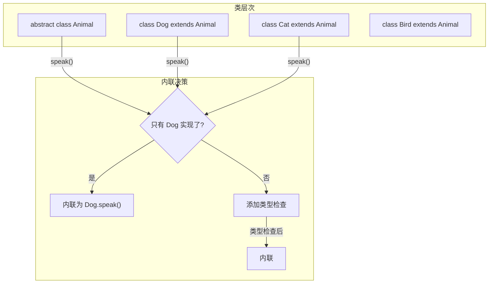
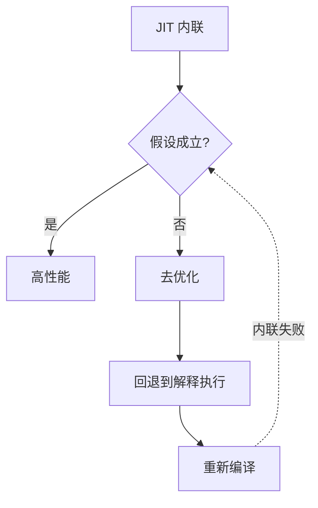
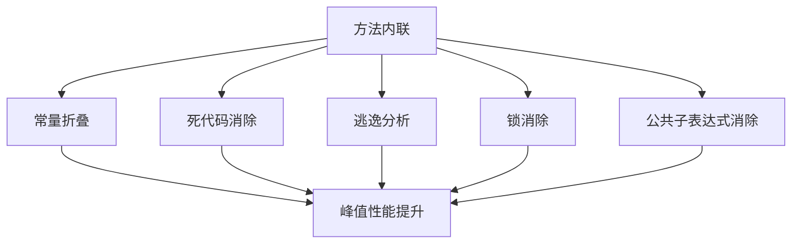

# 方法内联（Method Inlining）

理解方法内联，是理解 JIT 性能优化的关键。

## 为什么方法内联重要

### 方法调用的开销

方法调用有以下开销：

| 开销 | 说明 |
| --- | --- |
| 参数压栈 | 将参数传递到栈上 |
| 保存寄存器 | 保存调用前的寄存器状态 |
| 跳转指令 | 跳转到被调用方法 |
| 返回地址 | 保存返回地址 |
| 栈帧创建 | 创建新的栈帧 |

```java
// 方法调用开销示例
public int calculate() {
    int a = getValue();     // 调用开销
    int b = getValue();     // 调用开销
    return a + b;
}

public int getValue() {
    return 42;  // 很小，但调用开销可能比方法体更大
}
```

### 内联后的效果

```java
// 内联后
public int calculate() {
    int a = 42;  // 直接替换，无调用开销
    int b = 42;  // 直接替换，无调用开销
    return a + b;
}
```

## 内联的条件

JIT 编译器判断一个方法是否值得内联：

### 1. 热点方法

方法必须是热点代码（调用次数足够多）。

### 2. 方法不太大

方法字节码大小不能超过阈值：

```bash
# 方法内联的字节码大小阈值
-XX:FreqInlineSize=325   # 热点方法的 size 上限
-XX:InlineSmallCode=1000 # 小方法的 size 上限
```

### 3. 虚方法内联

虚方法调用（多态）的内联需要特殊处理。

## 虚方法内联

### CHA（Class Hierarchy Analysis）

CHA 分析类的继承层次，判断方法的可能实现：



### 单态内联

如果分析发现只有一个实现类：

```java
// 单态内联
public void process() {
    Dog dog = getDog();
    dog.speak();  // 编译时已知只有 Dog
}

// 内联后
public void process() {
    Dog dog = getDog();
    dog.speak();  // 直接内联为 Woof!
}
```

### 多态内联

如果存在多个实现类，JIT 会生成守卫代码：

```java
// 多态调用
public void process() {
    Animal animal = getAnimal();  // 可能是 Dog 或 Cat
    animal.speak();  // 运行时才知道具体类型
}

// 内联后（添加类型检查）
public void process() {
    Animal animal = getAnimal();
    if (animal instanceof Dog) {
        ((Dog)animal).speak();  // 内联 Dog.speak()
    } else {
        animal.speak();  // 其他情况走虚调用
    }
}
```

## 内联层级

### 最大内联深度

```bash
# 最大内联深度
-XX:MaxInlineLevel=9

# 最大递归内联深度
-XX:MaxRecursiveInlineLevel=1
```

### 递归内联

JIT 对递归内联有特殊处理：

```java
// 递归方法
public int factorial(int n) {
    if (n <= 1) return 1;
    return n * factorial(n - 1);  // 递归调用
}

// JIT 可能内联部分递归
// 但过深的递归可能导致栈溢出
```

## 内联的副作用

### 1. 代码膨胀

内联会增加编译后的代码大小：

```java
// 内联前
public void process() {
    method1();
    method2();
}

// 内联后（代码膨胀）
public void process() {
    // method1 的代码
    ...
    // method2 的代码
    ...
}
```

### 2. 编译时间增加

内联尝试越多，编译时间越长。

### 3. 去优化膨胀

过度内联可能导致大量去优化：



## 内联优化参数

### 阈值参数

```bash
# 热点方法内联阈值
-XX:CompileThreshold=10000

# 小方法字节码大小阈值
-XX:InlineSmallCode=1000

# 热点方法字节码大小阈值
-XX:FreqInlineSize=325
```

### 内联级别

```bash
# 最大内联深度
-XX:MaxInlineLevel=9

# 递归内联深度
-XX:MaxRecursiveInlineLevel=1
```

## 观察内联决策

### PrintInlining

```bash
# 打印内联决策
java -XX:+PrintCompilation \
     -XX:+UnlockDiagnosticVMOptions \
     -XX:+PrintInlining \
     -jar application.jar

# 输出示例
@ 5   com.example.MyClass::innerMethod   inline (hot)
@ 10  com.example.MyClass::privateMethod inline (hot)
@ 15  com.example.MyClass::bigMethod    too big (325 bytes)
```

### 日志解读

| 日志 | 说明 |
| --- | --- |
| `inline (hot)` | 已内联 |
| `too big` | 方法太大 |
| `callee is too large` | 被调用者太大 |
| `recursive call` | 递归调用 |
| `unresolved` | 无法解析 |

## 内联的最佳实践

### 1. 使用 final 方法

```java
// 推荐
public final class Calculator {
    public final int add(int a, int b) {  // 提示 JIT 可安全内联
        return a + b;
    }
}

// 不推荐
public class Calculator {
    public int add(int a, int b) {  // JIT 需要分析后才能内联
        return a + b;
    }
}
```

### 2. 避免过大方法

```java
// 不推荐：方法太大，难以内联
public void processAll() {
    // 1000 行代码
}

// 推荐：拆分为小方法
public void processAll() {
    processPhase1();
    processPhase2();
    processPhase3();
}
```

### 3. 使用 static 方法

```java
// 推荐：static 方法更易内联
public static int add(int a, int b) {
    return a + b;
}

// JIT 无需担心被子类重写，可以直接内联
```

## 内联与其他优化的关系

内联是其他优化的基础：



### 与逃逸分析的关系

```java
// 内联后才能进行逃逸分析
public Object create() {
    return new Point(1, 2);  // 内联后才能判断是否逃逸
}

// 内联后
public Object create() {
    // 对象可能不逃逸，可以栈上分配
}
```

### 与锁消除的关系

```java
// 内联后才能判断锁是否可以消除
public synchronized void process() {
    // 内联后，如果对象不逃逸，锁可以被消除
}

// 内联后
public void process() {
    // synchronized 被消除
}
```
