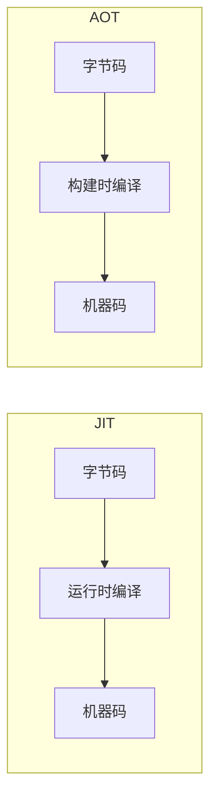
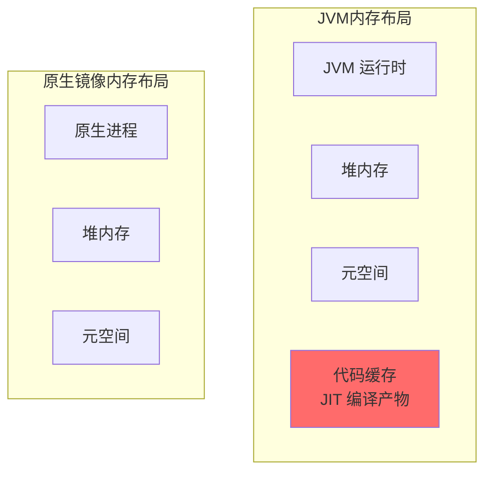
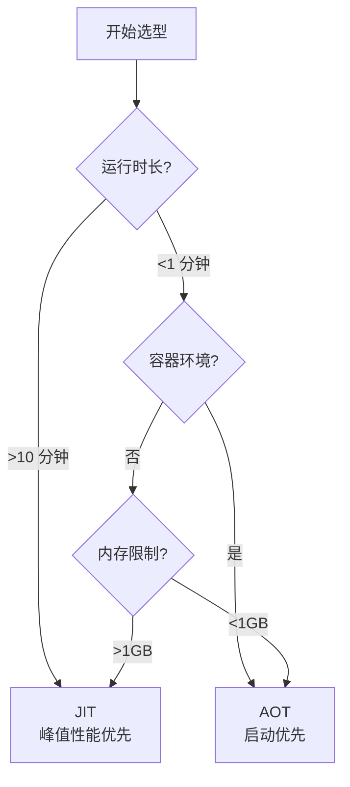

# JIT vs AOT 对比

## 编译策略对比



## 核心指标对比

| 指标 | JIT | AOT |
| --- | --- | --- |
| 编译时机 | 运行时 | 构建时 |
| 启动时间 | 慢 | 快 |
| 峰值性能 | 高 | 中等 |
| 内存占用 | 大 | 小 |
| 二进制大小 | 小 | 大 |

## 启动性能对比


## 峰值性能对比

### JIT 的优势

JIT 编译可以利用运行时信息进行激进优化：

| 优化 | JIT | AOT |
| --- | --- | --- |
| 类型推测 | 运行时 profiling | 静态分析 |
| 虚方法内联 | 深度 CHA + 运行时 | 基础 CHA |
| 去优化 | 支持 | 不支持 |

### AOT 的优势

AOT 编译有更长的编译时间，可以进行更深入的优化：

| 优化 | AOT | JIT |
| --- | --- | --- |
| 全程序分析 | 是 | 否 |
| 内联预算 | 大 | 小（编译时间限制） |
| 优化遍数 | 多 | 少 |

## 内存占用对比

| 组件 | JIT | AOT |
| --- | --- | --- |
| JVM 本身 | 50-100MB | 0（无 JVM） |
| 代码缓存 | 32-256MB | 0 |
| 元空间 | 依赖 | 依赖 |
| 堆内存 | 相同 | 相同 |



## 适用场景对比

### JIT 适用场景

1. **长时运行服务**：启动时间不是主要矛盾，峰值性能更重要
2. **服务器应用**：需要 JIT 的激进优化
3. **复杂业务逻辑**：需要运行时 profiling 指导优化

```bash
# 典型服务器配置
java -server \
     -XX:+UseG1GC \
     -XX:MaxGCPauseMillis=200 \
     -jar application.jar
```

### AOT 适用场景

1. **Serverless 函数**：冷启动影响成本
2. **容器化部署**：内存和启动时间受限
3. **命令行工具**：快速响应用户

```bash
# Serverless 函数配置
native-image --jar function.jar function
./function
```

## 混合策略

### 方案一：AOT 快速启动 + JIT 优化

```bash
# 使用 AOT 预编译热点
jaotc --jar app.jar --output app.so

# 运行时继续 JIT 优化
java -XX:AOTLibrary=./app.so -jar app.jar
```

### 方案二：分层编译

```bash
# 快速预热到 C1，然后 JIT 优化到 C2
java -XX:+TieredCompilation \
     -XX:Tier3InvocationThreshold=1000 \
     -jar application.jar
```

## 技术选型决策树



## 性能数据对比

### 启动时间

| 应用类型 | JVM | GraalVM | 提升 |
| --- | --- | --- | --- |
| Spring Boot | 2-5 秒 | 0.1-0.3 秒 | 10-50x |
| Quarkus | 1-2 秒 | 0.01-0.05 秒 | 20-200x |
| Micronaut | 1-2 秒 | 0.01-0.05 秒 | 20-200x |

### 内存占用

| 应用类型 | JVM | GraalVM | 降低 |
| --- | --- | --- | --- |
| Spring Boot | 200-400MB | 50-100MB | 4-5x |
| Quarkus | 100-200MB | 30-60MB | 3-5x |
| Micronaut | 50-100MB | 20-40MB | 2-3x |

### 吞吐量

| 应用类型 | JVM | GraalVM | 差异 |
| --- | --- | --- | --- |
| CPU 密集型 | 100% | 95-100% | ~5% |
| IO 密集型 | 100% | 98-100% | ~2% |

## 框架支持

### JIT 友好框架

- Spring Boot（传统模式）
- JavaEE / Jakarta EE
- 标准 Servlet 应用

### AOT 友好框架

- Quarkus
- Micronaut
- Helidon
- Spring Native

## 未来趋势

### 1. Leyden 项目

OpenJDK 的 Leyden 项目旨在改进 Java 的启动性能：

- 静态镜像
- 提前类初始化
- 更快的 JIT 预热

### 2. Cloud Native Java

云原生 Java 的发展趋势：

- 更快的启动
- 更低的内存
- 更好的容器集成

### 3. 混合部署

未来的 Java 部署可能同时使用 JIT 和 AOT：

- AOT 提供快速启动
- JIT 提供持续优化
