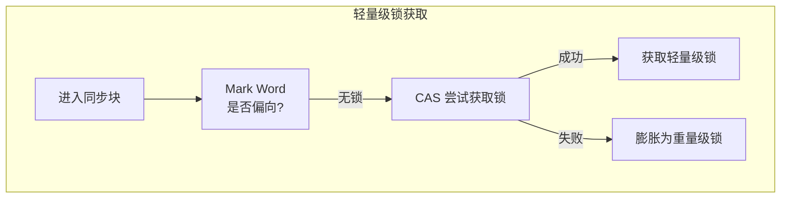
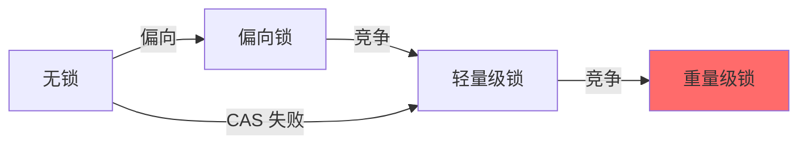

# 锁消除（Lock Elision）与锁粗化

锁消除和锁粗化是 JIT 编译器对 synchronized 代码的重要优化。它们能够消除不必要的同步开销，提升程序性能。

理解这些优化，是理解 Java 并发性能的关键。

## 锁消除（Lock Elision）

### 原理

锁消除基于逃逸分析。如果 JIT 编译器通过逃逸分析判断一个对象的锁不可能被其他线程获取，就会消除这个锁。

```java
// 锁消除前
public void process() {
    Object lock = new Object();  // 只在方法内使用
    synchronized (lock) {
        count++;
    }
}

// 锁消除后
public void process() {
    Object lock = new Object();
    count++;  // synchronized 被消除
}
```

### 触发条件

锁消除需要满足以下条件：

```mermaid
flowchart TD
    A["synchronized 代码"] --> B{"锁对象是否逃逸?"}
    B -->|"否"| C["锁是否只被当前线程持有?"}
    C -->|"是"| D["锁消除"]
    C -->|"否"| E["保留锁"]
    B -->|"是"| E
```

### 示例

```java
// 示例 1：局部对象锁
public void append(StringBuilder sb) {
    synchronized (sb) {  // sb 逃逸？不逃逸
        sb.append("text");
    }
}

// JIT 可能消除锁，因为 sb 只在方法内使用

// 示例 2：逃逸对象锁
public void store(Object obj) {
    synchronized (obj) {  // obj 可能逃逸
        cache.add(obj);
    }
}
// JIT 不会消除锁，因为 obj 可能被其他线程访问
```

## 锁粗化（Lock Coarsening）

### 原理

锁粗化将多个相邻的 synchronized 块合并为一个，减少锁的获取和释放次数。

```java
// 锁粗化前
public void process() {
    synchronized (lock) {
        doSomething();
    }
    // 其他代码
    synchronized (lock) {
        doOther();
    }
}

// 锁粗化后
public void process() {
    synchronized (lock) {
        doSomething();
        // 其他代码
        doOther();
    }
}
```

### 触发条件

锁粗化发生在以下情况：

| 条件 | 说明 |
| --- | --- |
| 相邻同步块 | 使用同一个锁 |
| 中间代码简单 | 中间代码不释放锁 |
| 性能收益 | 合并后收益大于开销 |

### 示例

```java
// 锁粗化前
public void update(Point p) {
    synchronized (this) {
        p.x = 1;
    }
    synchronized (this) {  // 可以合并
        p.y = 2;
    }
}

// 锁粗化后
public void update(Point p) {
    synchronized (this) {
        p.x = 1;
        p.y = 2;  // 合并
    }
}
```

## 轻量级锁

### 原理

轻量级锁是另一种锁优化，它使用 CAS 操作避免线程阻塞：



### 锁升级



### 偏向锁

偏向锁将锁偏向第一个获取它的线程：

```java
// 偏向锁原理
public class BiasedLock {
    synchronized void process() {
        // 第一次获取偏向锁
        // 后续进入只需要检查是否是同一个线程
    }
}
```

## 锁优化参数

### 偏向锁参数

```bash
# 启用偏向锁（默认）
java -XX:+UseBiasedLocking

# 禁用偏向锁
java -XX:-UseBiasedLocking

# 偏向延迟
java -XX:BiasedLockingStartupDelay=0
```

### 锁消除参数

```bash
# 启用锁消除（默认）
java -XX:+DoEscapeAnalysis

# 打印锁消除信息
java -XX:+PrintEliminateLocks
```

## 观察锁优化

### 打印锁消除信息

```bash
# 打印锁消除信息
java -XX:+PrintEliminateLocks \
     -XX:+UnlockDiagnosticVMOptions \
     -jar application.jar

# 输出示例
Eliminated locks: [0,1,0]  // 消除的锁数量
```

### 打印偏向锁信息

```bash
# 打印偏向锁信息
java -XX:+PrintBiasedLockingStatistics \
     -XX:+UnlockDiagnosticVMOptions \
     -jar application.jar
```

## 锁优化对性能的影响

### 性能测试

```java
// 锁优化性能对比
public class LockOptimizationTest {
    private int counter = 0;
    
    // 无锁
    public void noLock() {
        counter++;  // 模拟无锁
    }
    
    // 消除锁后
    public void eliminatedLock() {
        // JIT 消除 synchronized
        synchronized (this) {
            counter++;
        }
    }
}
```

### 性能提升

| 优化类型 | 性能提升 | 说明 |
| --- | --- | --- |
| 偏向锁 | 10%~30% | 单线程无竞争 |
| 轻量级锁 | 0%~10% | 少量竞争 |
| 锁消除 | 5%~15% | 对象不逃逸 |
| 锁粗化 | 3%~10% | 减少锁操作 |

## 最佳实践

### 1. 缩小同步范围

```java
// 不推荐
public void process() {
    synchronized (this) {
        // 大量不相关的代码
        doA();
        doB();
        doC();
    }
}

// 推荐
public void process() {
    doA();
    synchronized (this) {
        counter++;
    }
    doB();
    doC();
}
```

### 2. 减少锁持有时间

```java
// 不推荐
public void process() {
    synchronized (this) {
        prepare();  // 不需要同步的操作
        calculate();  // 需要同步
        format();  // 不需要同步的操作
    }
}

// 推荐
public void process() {
    prepare();
    synchronized (this) {
        calculate();
    }
    format();
}
```

### 3. 使用局部变量

```java
// 有利于锁消除
public void process() {
    Object lock = new Object();  // 局部对象
    synchronized (lock) {
        // JIT 可能消除锁
    }
}

// 不利于锁消除
public void process() {
    synchronized (this) {  // this 可能逃逸
        // 锁无法消除
    }
}
```

### 4. 考虑无锁数据结构

```java
// 无锁计数器
public class LockFreeCounter {
    private AtomicInteger counter = new AtomicInteger();
    
    public void increment() {
        counter.incrementAndGet();  // CAS 操作
    }
}
```

## 注意事项

### 锁升级不可逆

一旦偏向锁或轻量级锁升级为重量级锁，就无法回退。

### 高竞争场景

在高竞争场景下，锁消除可能适得其反：

```java
// 高竞争场景
public void process() {
    synchronized (lock) {  // 高竞争
        counter++;
    }
}
```

在这种情况下，使用 `java.util.concurrent.atomic` 或无锁数据结构可能更好。
