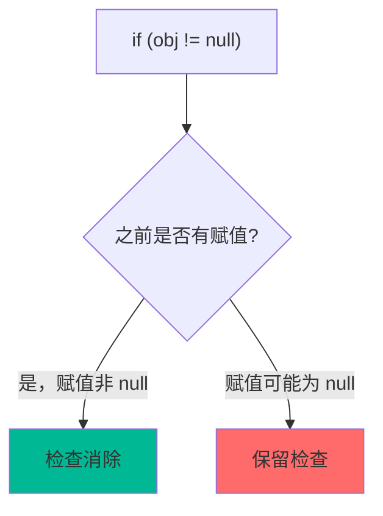
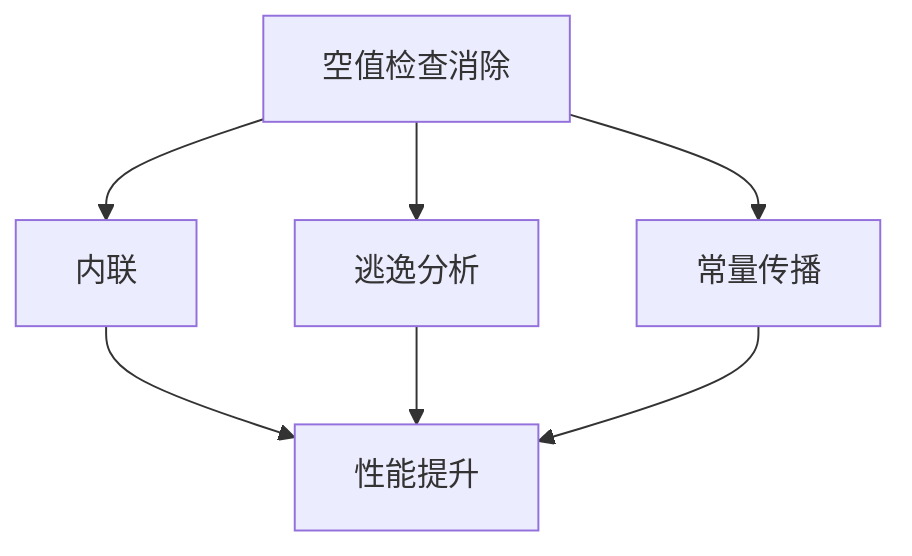

# 空值检查消除

理解空值检查消除，是理解 JIT 如何优化代码的关键。

## 为什么需要空值检查

Java 要求对空引用进行检查：

```java
// 可能抛出 NullPointerException
public int length(String s) {
    return s.length();  // 需要检查 s 是否为 null
}

// 如果 s 为 null，会抛出 NullPointerException
```

### 空值检查的开销

```java
// 空值检查的字节码
public int length(java.lang.String);
  0: aload_1           // 加载 s
  1: ifnonnull 4      // if s != null, goto 4
  2: aconst_null      // 加载 null
  3: athrow           // 抛出 NullPointerException
  4: aload_1           // 实际执行
  5: invokevirtual #2  // 调用 length()
  6: ireturn
```

## 空值检查消除的原理

### 路径消亡分析（PUBA）

PUBA（Path Unreachable After Uncheck）分析空值检查是否必要：



### 优化示例

```java
// 优化前
public void process(String s) {
    if (s != null) {  // 检查
        s.length();    // 使用
    }
}

// 优化后
public void process(String s) {
    // JIT 判断 s 在之前已赋值非 null
    s.length();  // 检查消除
}
```

## 空值检查消除的类型

### 1. 条件检查消除

```java
// 条件检查消除
public void process(Object obj) {
    if (obj != null) {  // 条件检查
        obj.toString();
    }
}

// JIT 判断 obj 已知非 null
public void process(Object obj) {
    obj.toString();  // 检查消除
}
```

### 2. 提前检查消除

```java
// 提前检查消除
public void process(Object obj) {
    if (obj == null) {
        throw new IllegalArgumentException();
    }
    obj.toString();  // 已知非 null
}

// 优化后
public void process(Object obj) {
    if (obj == null) {
        throw new IllegalArgumentException();
    }
    // else 分支已知 obj 非 null
    obj.toString();  // 检查消除
}
```

### 3. 循环检查消除

```java
// 循环检查消除
public void process(String[] arr) {
    for (String s : arr) {
        s.hashCode();  // 已知非 null
    }
}

// JIT 判断 arr 元素不可能为 null
public void process(String[] arr) {
    for (String s : arr) {
        s.hashCode();  // 检查消除
    }
}
```

## 空值检查消除的条件

### 1. 明确的非 null 赋值

```java
// 明确非 null - 可以消除检查
public void process() {
    Object obj = new Object();
    obj.toString();  // 检查消除
}

// 可能为 null - 保留检查
public void process() {
    Object obj = getObject();  // 未知
    obj.toString();  // 保留检查
}
```

### 2. 参数检查

```java
// 参数检查后
public void process(@NonNull Object obj) {
    // 注解提示 JIT obj 非 null
    obj.toString();
}

// 但 JIT 主要基于实际分析，不依赖注解
```

### 3. 逃逸分析

```java
// 逃逸分析辅助空值检查消除
public void process() {
    Object obj = new Object();
    // obj 可能在内部使用
    use(obj);
    // JIT 可能判断 obj 不逃逸
    // 即使逃逸，null 检查仍然需要
}
```

## 空值检查消除的效果

### 性能对比

```java
// 优化前后对比
public int calculate(String s) {
    return s.length();  // 需要空值检查
}

// 优化后
public int calculate(String s) {
    // 如果 JIT 判断 s 已知非 null
    return s.length();  // 无空值检查
}
```

### 字节码对比

```java
// 优化前
public int calculate(java.lang.String);
  0: aload_1
  1: ifnonnull 4
  2: aconst_null
  3: athrow
  4: aload_1
  5: invokevirtual #2
  8: ireturn

// 优化后（假设 s 已知非 null）
public int calculate(java.lang.String);
  0: aload_1
  1: invokevirtual #2
  4: ireturn
```

## 观察空值检查消除

### PrintCompilation

```bash
# 观察编译优化
java -XX:+PrintCompilation \
     -XX:+UnlockDiagnosticVMOptions \
     -jar application.jar
```

### JIT 日志

```java
// JIT 日志中可能看到空值检查消除
// 但通常不单独显示
```

## 空值检查消除的限制

### 1. 外部输入

```java
// 无法消除
public void process(String s) {
    // s 来自外部输入
    s.length();  // 必须检查
}
```

### 2. 动态类型

```java
// 无法消除
public void process(Object obj) {
    // obj 可能是任何类型
    obj.toString();  // 必须检查
}
```

### 3. 多态调用

```java
// 无法消除
public void process(Comparable c) {
    // c 可能是任何实现类
    c.compareTo(null);  // 必须检查
}
```

## 最佳实践

### 1. 使用 @NonNull 注解

```java
// 使用 @NonNull 注解提示
import javax.annotation.Nonnull;

public void process(@Nonnull String s) {
    s.length();  // JIT 可能利用这个信息
}
```

### 2. 避免不必要检查

```java
// 不推荐：检查后立即使用
public void process(Object obj) {
    if (obj != null) {
        obj.toString();
    }
}

// 推荐：JIT 会自动优化
public void process(Object obj) {
    obj.toString();  // JIT 判断是否需要检查
}
```

### 3. 合理使用断言

```java
// 断言不会消除运行时检查
public void process(Object obj) {
    assert obj != null;  // 检查保留
    obj.toString();
}
```

## 空值检查消除与其他优化

空值检查消除与其他 JIT 优化密切相关：



### 与内联的关系

```java
// 内联后可能触发空值检查消除
public int length(String s) {
    return s.length();
}

public void process() {
    String s = getNonNullString();  // 已知非 null
    length(s);  // 内联后，s 已知非 null
}
```

### 与逃逸分析的关系

```java
// 逃逸分析可能辅助空值检查消除
public void process() {
    String s = "hello";  // 常量，不逃逸
    s.length();  // 检查消除
}
```
