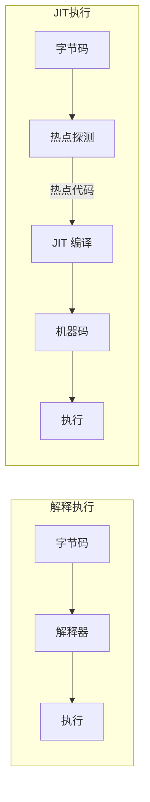
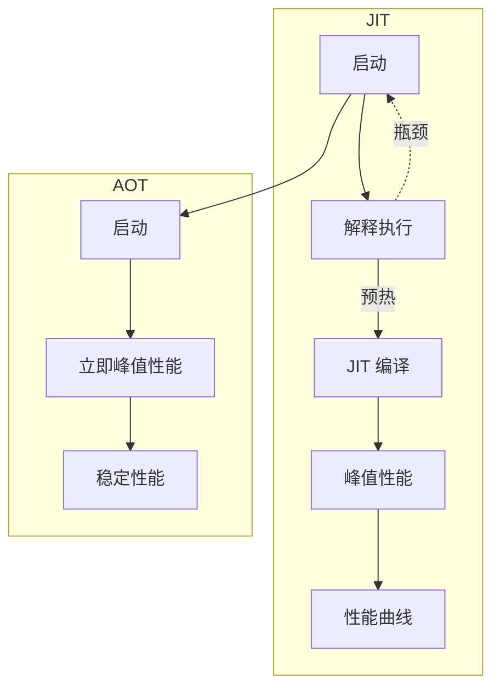
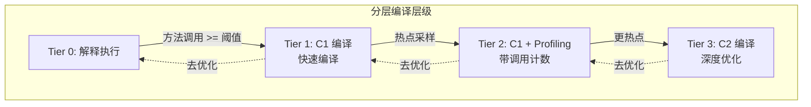
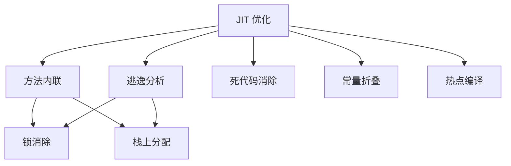

# JIT 编译器概述

JIT（Just-In-Time）编译器是 JVM 的核心组件，它在运行时将字节码编译成机器码，大幅提升 Java 程序的执行速度。

理解 JIT 编译器的工作原理，是进行 JVM 性能优化的基础。

## 为什么需要 JIT

### 解释执行的瓶颈

纯解释执行存在严重的性能问题：

| 问题 | 说明 |
| --- | --- |
| 重复解释 | 同一个方法被调用 10000 次，需要解释 10000 次 |
| 无优化 | 解释器不进行任何代码优化 |
| 类型推断 | 每行字节码都需要动态类型检查 |

```java
// 解释执行的代价
public int sum(int[] arr) {
    int sum = 0;
    for (int i = 0; i < arr.length; i++) {
        sum += arr[i];  // 每次都需要检查数组边界和类型
    }
    return sum;
}

// 循环执行 10000 次
// 解释执行：边界检查 10000 * N 次
// JIT 编译后：边界检查 N 次 + 编译优化
```

### JIT 的解决方案

JIT 编译器通过以下方式解决解释执行的性能问题：



## JIT vs AOT

JIT 和 AOT 是两种不同的编译策略：

| 特性 | JIT | AOT |
| --- | --- | --- |
| 编译时机 | 运行时 | 运行前（构建时） |
| 优化信息 | 基于运行时 profile | 基于静态分析 |
| 启动时间 | 慢（需要预热） | 快 |
| 峰值性能 | 高 | 中等 |
| 内存占用 | JVM + 代码缓存 | 无 JVM |



## JIT 编译时机

JIT 编译器不会一上来就编译所有代码，而是只编译「热点代码」。

### 热点代码探测

JVM 通过两个计数器来探测热点代码：

| 计数器 | 说明 | 触发条件 |
| --- | --- | --- |
| 方法调用计数器 | 统计方法被调用次数 | 超过阈值（默认 10000） |
| 回边计数器 | 统计循环回边次数 | 超过阈值 |

```java
// 热点探测示意
public class HotSpotDetector {
    private int invocationCount = 0;
    private int backEdgeCount = 0;
    private static final int THRESHOLD = 10000;
    
    public void onMethodInvoke() {
        invocationCount++;
        if (invocationCount >= THRESHOLD) {
            triggerCompilation();  // 触发 JIT 编译
        }
    }
    
    public void onLoopBackEdge() {
        backEdgeCount++;
        if (backEdgeCount >= THRESHOLD) {
            triggerOSR();  // 触发栈上替换
        }
    }
}
```

### 编译阈值

编译阈值可以通过参数调整：

| 参数 | 说明 | 默认值 |
| --- | --- | --- |
| `-XX:CompileThreshold` | 方法调用阈值 | 10000 |
| `-XX:BackEdgeThreshold` | 回边阈值 | 同 CompileThreshold |

## 分层编译

现代 JVM 采用分层编译策略，平衡编译速度和优化程度：



### 各层职责

| 层级 | 编译器 | 编译速度 | 优化程度 | 适用场景 |
| --- | --- | --- | --- | --- |
| 0 | 解释器 | - | - | 刚启动 |
| 1 | C1 | 快 | 低 | 快速编译热点 |
| 2 | C1+Profiling | 中 | 中 | 采集 profile 数据 |
| 3 | C2 | 慢 | 高 | 峰值性能 |

## JIT 编译器类型

### C1 编译器（Client Compiler）

C1 编译器特点：

- 编译速度快
- 优化激进程度低
- 适合客户端应用

```bash
# 启用 C1 编译器
java -client -XX:+TieredCompilation
```

### C2 编译器（Server Compiler）

C2 编译器特点：

- 编译速度慢
- 优化激进程度高
- 适合服务端应用

```bash
# 启用 C2 编译器
java -server -XX:+TieredCompilation
```

## JIT 优化概述

JIT 编译器会进行多种优化：



### 常见优化

| 优化类型 | 说明 |
| --- | --- |
| 方法内联 | 将方法调用替换为方法体，消除调用开销 |
| 逃逸分析 | 分析对象是否逃逸，触发栈上分配 |
| 常量折叠 | 编译期计算常量表达式 |
| 死代码消除 | 移除永远不会执行的代码 |

## JIT 日志

### 开启 JIT 日志

```bash
# 开启编译日志
java -XX:+UnlockDiagnosticVMOptions \
     -XX:+LogCompilation \
     -XX:LogFile=/tmp/jit.log \
     -jar application.jar
```

### JIT 日志格式

```java
// JIT 日志示例
<task_queued compile_id='1' method='java/lang/String.hashCode' osr='0' level='4' ...

<nmethod compile_id='1' compiler='C2' method='java/lang/String.hashCode' ...
```

### 分析 JIT 日志

```bash
# 使用 JITWatch 分析
# https://github.com/AdoptOpenJDK/jitwatch
```

## JIT 的限制

JIT 编译器不是万能的：

1. **预热时间**：需要运行一段时间才能达到峰值性能
2. **编译开销**：编译本身消耗 CPU 和内存
3. **代码缓存**：编译后的代码占用 Code Cache
4. **去优化**：假设不成立时需要回退
