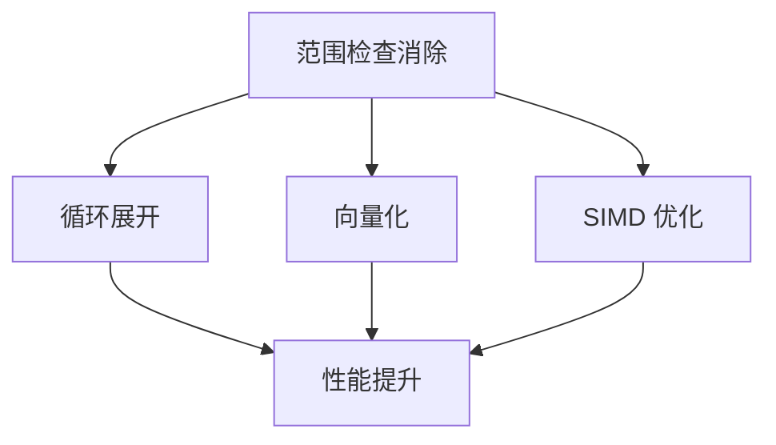

# 范围检查消除

范围检查消除（Range Check Elimination）是 JIT 编译器进行的重要优化。它消除不必要的数组边界检查，减少运行时开销。

理解范围检查消除，是理解 JIT 如何优化数组访问的关键。

## 为什么需要数组边界检查

Java 要求对数组访问进行边界检查：

```java
// 可能抛出 ArrayIndexOutOfBoundsException
public int getElement(int[] arr, int index) {
    return arr[index];  // 需要检查 index 是否在范围内
}
```

### 边界检查的字节码

```java
// 边界检查的字节码
public int getElement(int[], int);
  0: aload_1           // 加载数组
  1: iload_2           // 加载索引
  2: aload_1           // 加载数组
  3: arraylength       // 获取数组长度
  4: if_icmpge 9       // if index >= length, throw
  5: aload_1           // 加载数组
  6: iload_2           // 加载索引
  7: iaload            // 访问元素
  8: ireturn
  9: new ArrayIndexOutOfBoundsException
  // ...
```

## 范围检查消除的原理

### 循环不变检查外提

如果边界检查在循环中且不变量，可以外提：

```java
// 优化前
public int sum(int[] arr) {
    int sum = 0;
    for (int i = 0; i < arr.length; i++) {
        // arr[i] - 每次迭代都检查
    }
}

// 优化后
public int sum(int[] arr) {
    int sum = 0;
    int length = arr.length;  // 外提
    for (int i = 0; i < length; i++) {
        // arr[i] - 无需检查
    }
}
```

### 索引范围已知

如果索引范围已知，可以消除检查：

```java
// 索引范围已知
public int getFirst(int[] arr) {
    return arr[0];  // 已知 0 在范围内
}

public int getLast(int[] arr) {
    return arr[arr.length - 1];  // 已知在范围内
}
```

## 范围检查消除的类型

### 1. 循环不变检查外提

```java
// 优化前
for (int i = 0; i < n; i++) {
    arr[i] = i;  // 每次检查
}

// 优化后
int len = arr.length;  // 外提检查
for (int i = 0; i < n && i < len; i++) {
    arr[i] = i;  // 减少检查
}
```

### 2. 索引已知在范围内

```java
// 优化前
public int process(int[] arr) {
    return arr[0] + arr[1] + arr[2];
}

// 优化后
// JIT 判断 0, 1, 2 都在范围内
public int process(int[] arr) {
    // 无边界检查
    return arr[0] + arr[1] + arr[2];
}
```

### 3. 依赖关系的检查消除

```java
// 优化前
for (int i = 1; i < arr.length; i++) {
    arr[i] = arr[i] + arr[i-1];  // 两个边界检查
}

// 优化后
// 依赖关系已知，减少检查
for (int i = 1; i < arr.length; i++) {
    // 只需检查一次
    arr[i] = arr[i] + arr[i-1];
}
```

## 范围检查消除的条件

### 1. 索引范围可确定

```java
// 可确定
for (int i = 0; i < arr.length; i++) {
    arr[i] = i;  // i < arr.length 已知
}

// 不可确定
for (int i = 0; i < n; i++) {
    if (i >= arr.length) break;  // 复杂条件
}
```

### 2. 数组长度可确定

```java
// 可确定
int[] arr = new int[10];
arr[5] = 1;  // 已知 5 < 10

// 不可确定
int[] arr = getArray();
arr[5] = 1;  // 长度未知
```

### 3. 循环变量单调

```java
// 单调递增
for (int i = 0; i < arr.length; i++) {
    arr[i] = i;  // i 单调递增
}

// 复杂变化
for (int i = 0; i < arr.length; i++) {
    i = someFunction(i);  // i 可能跳跃
}
```

## 范围检查消除的效果

### 性能对比

```java
// 性能测试
public class RangeCheckTest {
    
    // 无优化
    public long baseline(int[] arr) {
        long sum = 0;
        for (int i = 0; i < arr.length; i++) {
            sum += arr[i];  // 每次边界检查
        }
        return sum;
    }
    
    // 优化后
    public long optimized(int[] arr) {
        long sum = 0;
        int len = arr.length;  // 外提
        for (int i = 0; i < len; i++) {
            sum += arr[i];  // 边界检查减少
        }
        return sum;
    }
}
```

### 性能提升

| 场景 | 性能提升 |
| --- | --- |
| 简单循环访问 | 5%~15% |
| 嵌套循环访问 | 10%~30% |
| 复杂索引计算 | 0%~5% |

## 观察范围检查消除

### PrintCompilation

```bash
# 观察编译优化
java -XX:+PrintCompilation \
     -XX:+UnlockDiagnosticVMOptions \
     -jar application.jar
```

### JIT 日志

```java
// JIT 日志中可能看到范围检查消除
// 但通常作为编译优化的一部分
```

## 范围检查消除的限制

### 1. 动态索引

```java
// 无法消除
public int get(int[] arr, int index) {
    return arr[index];  // index 动态
}
```

### 2. 外部输入

```java
// 无法消除
public int get(int[] arr, int index) {
    return arr[index];  // index 来自用户输入
}
```

### 3. 复杂条件

```java
// 可能无法完全消除
public void process(int[] arr, int start, int end) {
    for (int i = start; i < end; i++) {
        if (i >= arr.length) break;  // 复杂条件
    }
}
```

## 最佳实践

### 1. 使用简单索引

```java
// 推荐
for (int i = 0; i < arr.length; i++) {
    arr[i] = compute(i);
}

// 不推荐
for (int i = 0; i < arr.length; i++) {
    int idx = computeIndex(i);  // 复杂索引
    arr[idx] = compute(i);
}
```

### 2. 使用 for-each

```java
// for-each 可能帮助 JIT
for (int element : arr) {
    // 使用 element 而不是 arr[i]
}
```

### 3. 避免边界检查在循环内

```java
// 推荐
int len = arr.length;
for (int i = 0; i < len; i++) {
    arr[i] = i;
}

// 不推荐
for (int i = 0; i < arr.length; i++) {
    arr[i] = i;
}
```

## 范围检查消除与其他优化

范围检查消除与其他 JIT 优化密切相关：



### 与循环展开的关系

```java
// 循环展开后
for (int i = 0; i < arr.length; i += 4) {
    arr[i] = i;       // 检查 i
    arr[i+1] = i+1;  // 可能检查 i+1
    arr[i+2] = i+2;  // 可能检查 i+2
    arr[i+3] = i+3;  // 可能检查 i+3
}
```

### 与 SIMD 的关系

SIMD（Single Instruction Multiple Data）利用 CPU 的向量指令：

```java
// SIMD 优化后
for (int i = 0; i < arr.length; i += 8) {
    // 一次加载 8 个元素
    // 无需每次检查
}
```
