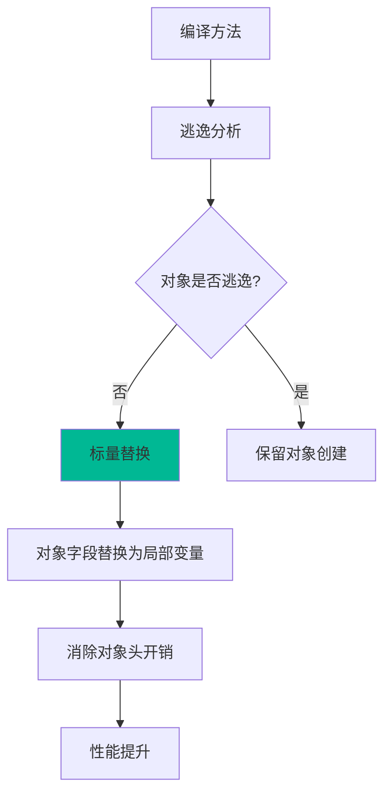
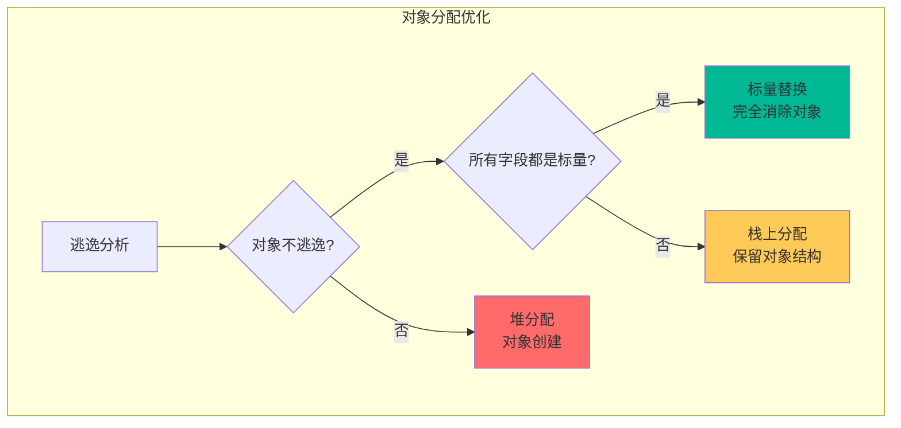
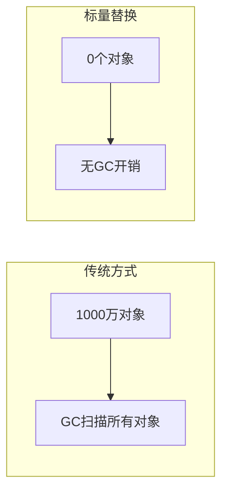

# 标量替换（Scalar Replacement）

标量替换是 JIT 编译器基于逃逸分析的重要优化。它将不逃逸对象的字段替换为独立的局部变量，从而完全消除对象创建。

理解标量替换，是理解 JIT 如何让 Java 达到接近 C++ 性能的关键。

## 基本概念

### 标量 vs 聚合量

| 类型 | 说明 | 示例 |
| --- | --- | --- |
| 标量（Scalar） | 基本类型，不可拆分 | `int`、`long`、`double` |
| 聚合量（Aggregate） | 对象类型，可包含多个字段 | `Point`、`String` |

### 标量替换原理

```java
// 标量替换前
public int calculate() {
    Point p = new Point(1, 2);  // 创建对象
    return p.x + p.y;
}

// 标量替换后
public int calculate() {
    int x = 1;  // 对象字段替换为局部变量
    int y = 2;
    return x + y;  // 无需对象创建
}
```

## 标量替换的工作流程



## 标量替换的条件

### 1. 对象不逃逸

```java
// 不逃逸 - 可以标量替换
public void process() {
    Point p = new Point(1, 2);  // 只在方法内使用
    return p.x + p.y;
}

// 逃逸 - 不能标量替换
public void store(Point p) {
    cache.add(p);  // p 逃逸到堆
}
```

### 2. 对象使用简单

```java
// 简单使用 - 可以标量替换
public int calculate() {
    Point p = new Point(1, 2);
    return p.x * p.y;
}

// 复杂使用 - 可能无法完全替换
public int calculate() {
    Point p = new Point(1, 2);
    return calculateWithPoint(p);  // 作为参数传递
}
```

### 3. 嵌套对象

```java
// 嵌套对象也可以替换
public class Rectangle {
    Point origin;
    int width, height;
}

public int area() {
    Rectangle r = new Rectangle();
    r.origin = new Point(0, 0);
    r.width = 10;
    r.height = 20;
    return r.width * r.height;
}

// 标量替换后
public int area() {
    int r_origin_x = 0;
    int r_origin_y = 0;
    int r_width = 10;
    int r_height = 20;
    return r_width * r_height;
}
```

## 标量替换的效果

### 减少对象创建

| 操作 | 传统方式 | 标量替换后 |
| --- | --- | --- |
| 对象头 | 12~16 bytes | 0 bytes |
| 字段 | 实际大小 | 实际大小 |
| GC 开销 | 需要扫描 | 无 |

### 性能提升

```java
// 性能对比
public class ScalarReplacementTest {
    
    // 原始方式
    public long processWithObject() {
        long start = System.nanoTime();
        long sum = 0;
        for (int i = 0; i < 10000000; i++) {
            Point p = new Point(i, i);
            sum += p.x + p.y;
        }
        return System.nanoTime() - start;
    }
    
    // 标量替换后（实际执行效果）
    public long processScalarReplaced() {
        long start = System.nanoTime();
        long sum = 0;
        for (int i = 0; i < 10000000; i++) {
            int x = i;  // 标量替换
            int y = i;
            sum += x + y;
        }
        return System.nanoTime() - start;
    }
}
```

## 标量替换与栈上分配

标量替换是栈上分配的基础：



## 观察标量替换

### 打印标量替换信息

```bash
# 打印标量替换信息
java -XX:+PrintCompilation \
     -XX:+UnlockDiagnosticVMOptions \
     -XX:+PrintEliminateLocks \
     -jar application.jar

# 输出示例
Eliminated locks and scalars: [5, 10, 3]
// [消除的锁数量, 消除的对象数量, 消除的数组元素数量]
```

### GC 日志

```bash
# 观察堆使用情况
java -Xms256m -Xmx256m \
     -XX:+UseSerialGC \
     -XX:+PrintGC \
     -jar application.jar

# 如果大量标量替换，堆使用会显著降低
```

## 标量替换的限制

### 1. 对象地址传递

```java
// 无法标量替换
public void process() {
    Point p = new Point(1, 2);
    // 对象地址被使用
    System.out.println(p);  // 需要对象引用
}
```

### 2. 同步代码

```java
// synchronized 块可能阻止标量替换
public synchronized void process() {
    Point p = new Point(1, 2);  // 如果 this 逃逸，无法替换
}
```

### 3. 异常处理

```java
// 异常处理可能阻止标量替换
public void process() {
    Point p = new Point(1, 2);
    try {
        riskyOperation(p);
    } catch (Exception e) {
        throw new RuntimeException(p.toString());  // 需要对象
    }
}
```

## 最佳实践

### 1. 使用局部变量

```java
// 推荐：有利于标量替换
public int calculate() {
    Point p = new Point(1, 2);  // 局部使用
    return p.x + p.y;
}

// 不推荐：对象逃逸
public Point create() {
    return new Point(1, 2);  // 逃逸
}
```

### 2. 避免对象逃逸

```java
// 不推荐
public void store(Object obj) {
    cache.add(obj);  // obj 逃逸
}

// 推荐
public Object compute() {
    Point p = new Point(1, 2);  // 不逃逸
    return p.x + p.y;  // 返回基本类型
}
```

### 3. 使用不可变对象

```java
// 不可变对象更适合标量替换
public final class Point {
    public final int x;
    public final int y;
    
    public Point(int x, int y) {
        this.x = x;
        this.y = y;
    }
}
```

## 标量替换的性能影响

### 内存占用

标量替换后，内存占用显著降低：

| 场景 | 传统方式 | 标量替换后 |
| --- | --- | --- |
| 1000 万个 Point | ~160MB | ~0MB |
| GC 压力 | 高 | 无 |

### GC 性能

标量替换减少 GC 的扫描对象数量：



### CPU 性能

标量替换减少内存访问：

```java
// 对象访问（需要解引用）
Point p = new Point(1, 2);
sum = p.x + p.y;  // 需要访问对象头 + 字段

// 标量替换（直接访问寄存器）
int x = 1;
int y = 2;
sum = x + y;  // 直接使用寄存器
```

## 标量替换与 JIT 优化层级

标量替换通常在 C2 编译阶段（Tier 3）进行：

| 层级 | 编译器 | 标量替换 |
| --- | --- | --- |
| Tier 0 | 解释器 | 否 |
| Tier 1 | C1 | 部分 |
| Tier 2 | C1+Profiling | 部分 |
| Tier 3 | C2 | 是 |
