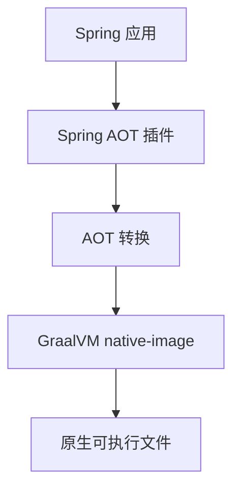
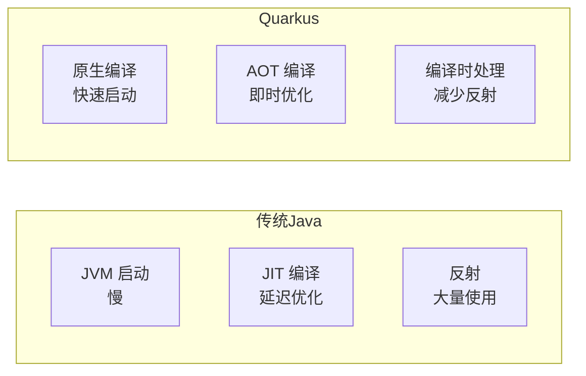
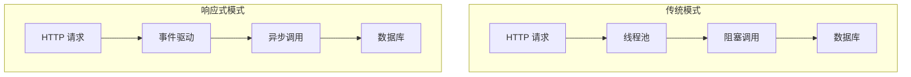
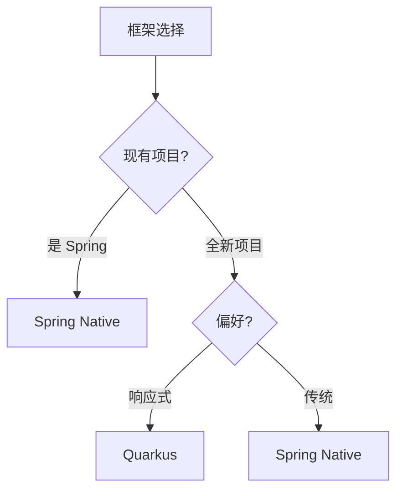
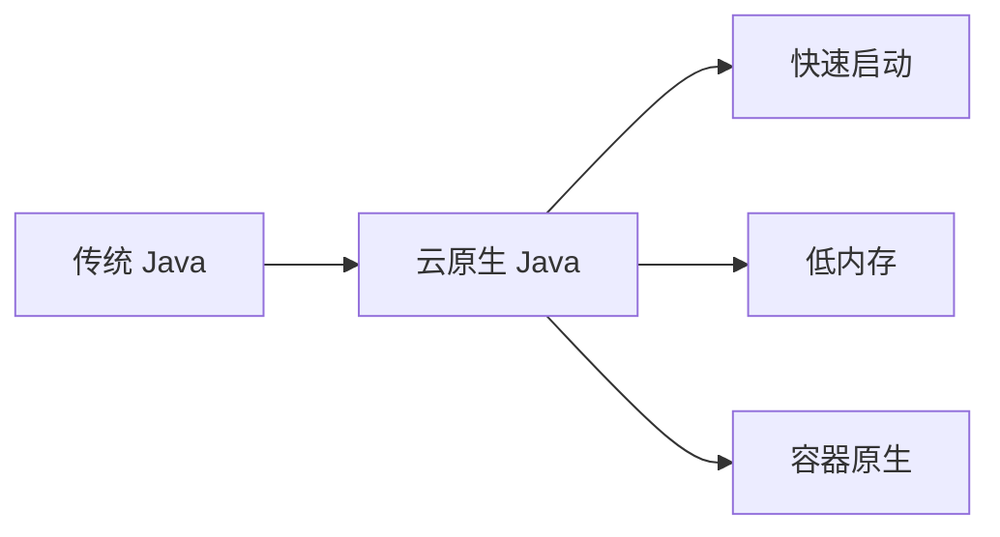

# Spring Native 与 Quarkus

理解这两个框架，是理解现代云原生 Java 的关键。

## Spring Native

### 简介

Spring Native 是 Spring 框架的原生镜像支持，通过 GraalVM 原生镜像实现快速启动。

```xml
<!-- pom.xml -->
<dependencies>
    <dependency>
        <groupId>org.springframework.experimental</groupId>
        <artifactId>spring-native</artifactId>
        <version>0.12.0</version>
    </dependency>
</dependencies>
```

### 核心特性

| 特性 | 说明 |
| --- | --- |
| AOT 编译 | 编译为原生可执行文件 |
| 启动时间 | 毫秒级启动 |
| 内存占用 | 显著降低 |
| Spring 生态 | 完整的 Spring 支持 |

### Spring Native 架构



### 使用 Spring Native

```bash
# 添加依赖
<dependency>
    <groupId>org.springframework.experimental</groupId>
    <artifactId>spring-native</artifactId>
</dependency>

# 构建原生镜像
./mvnw spring-native:compile

# 运行
./target/myapp
```

## Quarkus

### 简介

Quarkus 是 Red Hat 推出的云原生 Java 框架，设计理念是「Supersonic Subatomic Java」。

```xml
<!-- pom.xml -->
<dependencies>
    <dependency>
        <groupId>io.quarkus</groupId>
        <artifactId>quarkus-resteasy-reactive</artifactId>
    </dependency>
</dependencies>
```

### 设计理念

Quarkus 的核心设计理念：



### 核心特性

| 特性 | 说明 |
| --- | --- |
| 编译时处理 | 反射、类加载在编译时处理 |
| 统一命令 | `mvn quarkus:dev` 和 `mvn quarkus:build` |
| 响应式支持 | 响应式编程原生支持 |
| Kubernetes 原生 | 内置 K8s 集成 |

### Quarkus 响应式架构



## 对比 Spring Native vs Quarkus

### 核心对比

| 特性 | Spring Native | Quarkus |
| --- | --- | --- |
| 生态 | Spring 生态 | 独立生态 |
| 开发模式 | Spring 风格 | 响应式优先 |
| AOT | GraalVM | 自有编译器 |
| 学习曲线 | 低（Spring 开发者） | 中（需要适应） |
| 社区 | Spring 社区 | Red Hat + 开源 |

### 性能对比

| 指标 | Spring Boot JVM | Spring Native | Quarkus JVM | Quarkus 原生 |
| --- | --- | --- | --- | --- |
| 启动时间 | 2-5 秒 | 0.1-0.3 秒 | 1-2 秒 | 0.01-0.05 秒 |
| 内存占用 | 200-400MB | 50-100MB | 100-200MB | 30-60MB |

### 选择建议



## Quarkus 深入

### 开发模式

```bash
# 创建 Quarkus 项目
./mvnw io.quarkus:quarkus-maven-plugin:create \
    -DprojectGroupId=com.example \
    -DprojectArtifactId=myapp

# 开发模式
./mvnw quarkus:dev

# 生产构建
./mvnw quarkus:build
```

### 扩展

Quarkus 提供丰富的扩展：

| 扩展 | 说明 |
| --- | --- |
| quarkus-resteasy-reactive | REST 框架 |
| quarkus-hibernate-orm-panache | ORM |
| quarkus-mongodb-panache | MongoDB |
| quarkus-kubernetes | K8s 部署 |
| quarkus-smallrye-health | 健康检查 |

### Kubernetes 集成

```yaml
# Quarkus 自动生成 Kubernetes 资源
quarkus:
  kubernetes:
    service: myapp-service
    deployment:
      replicas: 3
```

## Spring Native 深入

### 限制

Spring Native 相比 Quarkus 有一些限制：

| 限制 | 说明 |
| --- | --- |
| 反射配置 | 需要手动配置 |
| 启动时间 | 略慢于 Quarkus |
| 内存占用 | 略高于 Quarkus |

### 优化建议

```java
// 使用构造器注入（有利于 AOT）
@Service
public class MyService {
    private final MyRepository repository;
    
    // 构造器注入
    public MyService(MyRepository repository) {
        this.repository = repository;
    }
}
```

## 性能调优

### JVM 模式调优

```bash
# Quarkus JVM 模式
java -XX:+UseG1GC \
     -XX:MaxGCPauseMillis=100 \
     -jar quarkus-app/quarkus-run.jar
```

### 原生模式调优

```bash
# Quarkus 原生模式
# native-image.properties 自动应用优化
# 手动调整
native-image --initialize-at-run-time=... \
             --static-build \
             myapp
```

## 未来发展

### Spring Native

- 更完善的 AOT 支持
- 更快的构建速度
- 更广泛的库支持

### Quarkus

- 更多的云原生扩展
- 更好的性能
- 响应式生态扩展

### 云原生 Java


