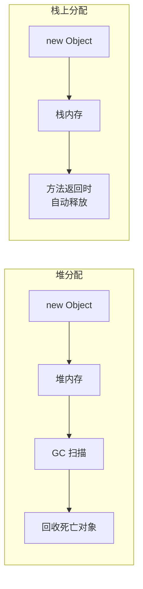
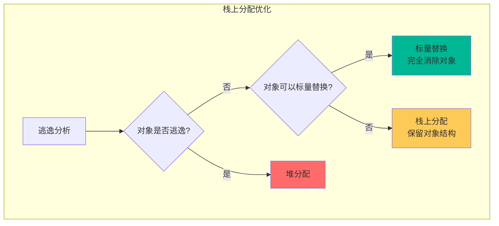
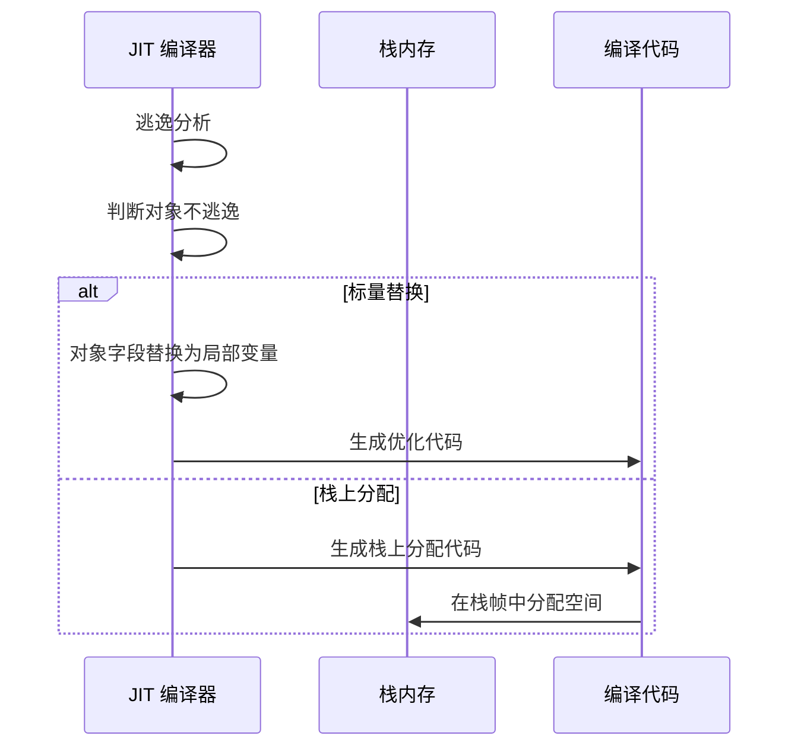
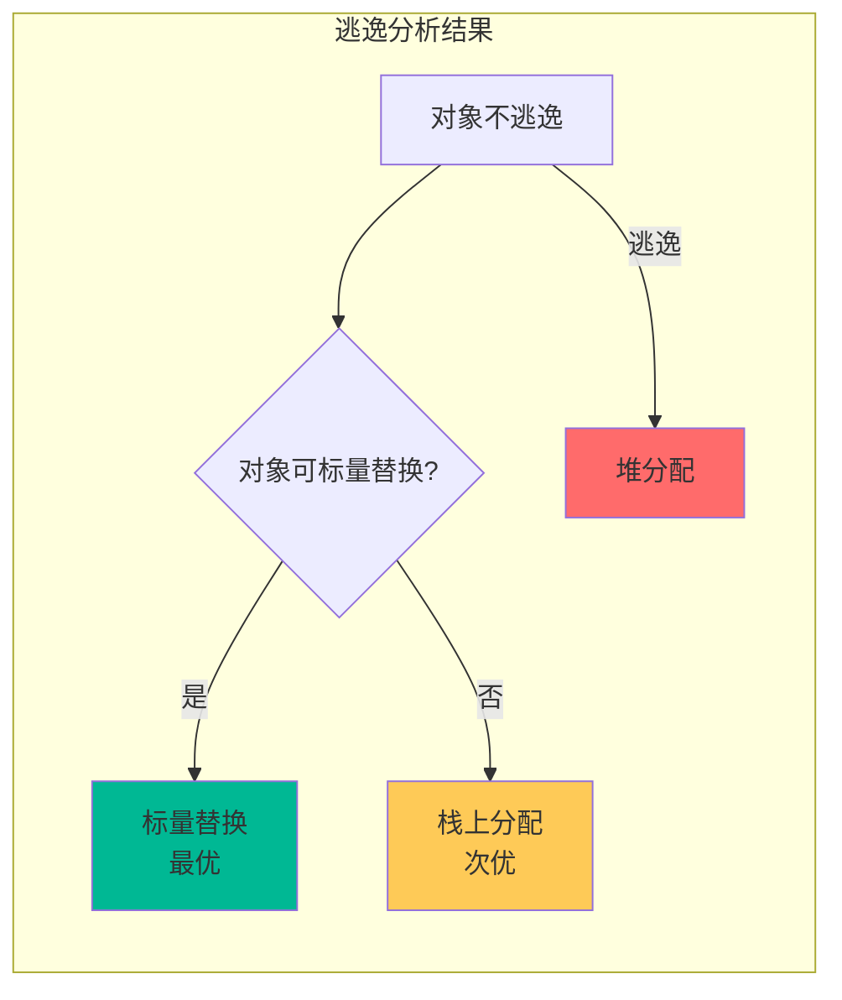

# 栈上分配（Stack Allocation）

栈上分配是 JIT 编译器基于逃逸分析的重要优化。它将不逃逸的对象分配在栈上而不是堆上，从而避免 GC 回收这些对象。

理解栈上分配，是理解 JVM 如何通过逃逸分析减少 GC 压力的关键。

## 为什么需要栈上分配

### 堆分配的问题

传统对象分配在堆上进行：



### 堆分配的代价

| 操作 | 堆分配 | 栈分配 |
| --- | --- | --- |
| 分配速度 | 较慢（需要 GC） | 极快（移动指针） |
| 回收方式 | GC 扫描 | 自动释放 |
| GC 压力 | 高 | 无 |
| 内存占用 | 需要空闲空间 | 栈帧内 |

## 栈上分配的原理

### 逃逸分析触发栈上分配

```java
// 栈上分配示例
public void process() {
    Point p = new Point(1, 2);  // JIT 判断不逃逸
    
    // 可以在栈上分配
    return p.x + p.y;
}

// 实际执行时
public void process() {
    // p 的 x 和 y 作为局部变量分配在栈上
    int p_x = 1;
    int p_y = 2;
    
    return p_x + p_y;
}  // 方法返回时自动释放
```

### 栈上分配 vs 标量替换



## 栈上分配的实现

### HotSpot 的栈上分配

HotSpot JVM 实现栈上分配有两种方式：

| 方式 | 说明 | 触发条件 |
| --- | --- | --- |
| 标量替换 | 对象字段替换为局部变量 | 对象不逃逸且可替换 |
| 本地逃逸分析 | 整个对象分配在栈上 | 对象不逃逸 |

### 分配过程



## 栈上分配的条件

### 1. 对象不逃逸

```java
// 不逃逸 - 可以栈上分配
public void process() {
    Point p = new Point(1, 2);  // 只在方法内使用
    // JIT 判断不逃逸，栈上分配
}

// 逃逸 - 堆分配
public Point create() {
    return new Point(1, 2);  // 返回引用，逃逸
}
```

### 2. 对象使用简单

```java
// 简单使用 - 可以栈上分配
public int calculate() {
    Point p = new Point(1, 2);
    return p.x + p.y;  // 直接访问字段
}

// 复杂使用 - 不能栈上分配
public int calculate() {
    Point p = new Point(1, 2);
    Point q = p;  // 对象被复制
    return p.x + q.x;
}
```

### 3. 对象不太大

栈空间有限，过大的对象不适合栈上分配。

## 栈上分配的效果

### GC 压力降低

```java
// 场景：处理 1000 万个 Point 对象
public void process() {
    for (int i = 0; i < 10000000; i++) {
        Point p = new Point(i, i);  // 不逃逸，栈上分配
        sum += p.x + p.y;
    }
}
```

### 性能对比

| 方式 | GC 次数 | 内存占用 | CPU 开销 |
| --- | --- | --- | --- |
| 堆分配 | 频繁 | ~160MB | 高 |
| 栈上分配 | 0 | ~0 | 低 |

## 观察栈上分配

### 打印逃逸分析

```bash
# 打印逃逸分析结果
java -XX:+PrintEscapeAnalysis \
     -XX:+UnlockDiagnosticVMOptions \
     -jar application.jar

# 输出示例
[Escape Analysis] STACK ALLOC: method 'process' Point 'p'
[Escape Analysis] ESCAPE: method 'create' Point 'p' does escape
```

### 对比 GC 日志

```bash
# 传统方式
java -Xms256m -Xmx256m -XX:+UseSerialGC -XX:+PrintGC -jar app.jar
# GC 频繁

# 栈上分配
java -Xms256m -Xmx256m -XX:+UseSerialGC -XX:+PrintGC -jar app.jar
# GC 减少
```

## 栈上分配的限制

### 1. 线程私有要求

栈上分配的对象只能被当前线程访问。

### 2. 栈空间限制

```bash
# 栈大小限制
# -Xss 参数设置栈大小
java -Xss512k -jar application.jar

# 栈空间有限，不适合大对象
public void process() {
    // 1MB 对象 - 不适合栈上分配
    byte[] buffer = new byte[1024 * 1024];
}
```

### 3. 对象被外部引用

```java
// 对象被保存
public class Container {
    public Object obj;  // 外部引用
}

public void process() {
    Point p = new Point(1, 2);
    container.obj = p;  // 对象逃逸
}
```

## 栈上分配与标量替换的关系

栈上分配和标量替换是互补的优化：



### 标量替换更优的原因

| 方面 | 栈上分配 | 标量替换 |
| --- | --- | --- |
| 对象头 | 需要 | 不需要 |
| 内存访问 | 需要访问对象 | 直接使用寄存器 |
| 内存布局 | 对象结构 | 平面化 |

## 最佳实践

### 1. 避免对象逃逸

```java
// 推荐
public int calculate() {
    Point p = new Point(1, 2);  // 不逃逸
    return p.x + p.y;
}

// 不推荐
public int calculate() {
    Point p = new Point(1, 2);
    return calculatePoint(p);  // 对象作为参数传递，可能逃逸
}
```

### 2. 使用局部变量

```java
// 推荐：有利于栈上分配
public void process() {
    Point p = new Point(1, 2);
    use(p);  // 可能在堆上分配
    return p.x + p.y;  // p 仍然不逃逸
}

// 不推荐
public Point store() {
    Point p = new Point(1, 2);
    cache.add(p);  // p 逃逸
    return p;
}
```

### 3. 使用不可变对象

```java
// 不可变对象更适合栈上分配
public final class Point {
    public final int x;
    public final int y;
    
    public Point(int x, int y) {
        this.x = x;
        this.y = y;
    }
}
```

## 栈上分配的性能影响

### CPU 性能

栈上分配减少内存访问：

```java
// 堆分配：需要访问堆内存
Point p = heap.allocate();  // 访问堆
int sum = p.x + p.y;        // 解引用访问字段

// 栈上分配：直接访问栈
int p_x = stack.allocate();  // 访问栈
int p_y = stack.allocate();  // 访问栈
int sum = p_x + p_y;         // 直接使用
```

### GC 性能

栈上分配显著减少 GC 压力：

| 场景 | 堆分配 | 栈上分配 |
| --- | --- | --- |
| 1000 万对象 | GC 频繁 | 无 GC |
| 对象头开销 | 12~16 bytes/对象 | 0 |
| 扫描时间 | 长 | 0 |

### 总体性能

栈上分配带来的性能提升：

- GC 停顿时间减少
- 吞吐量提升 5%~15%
- 内存占用降低
