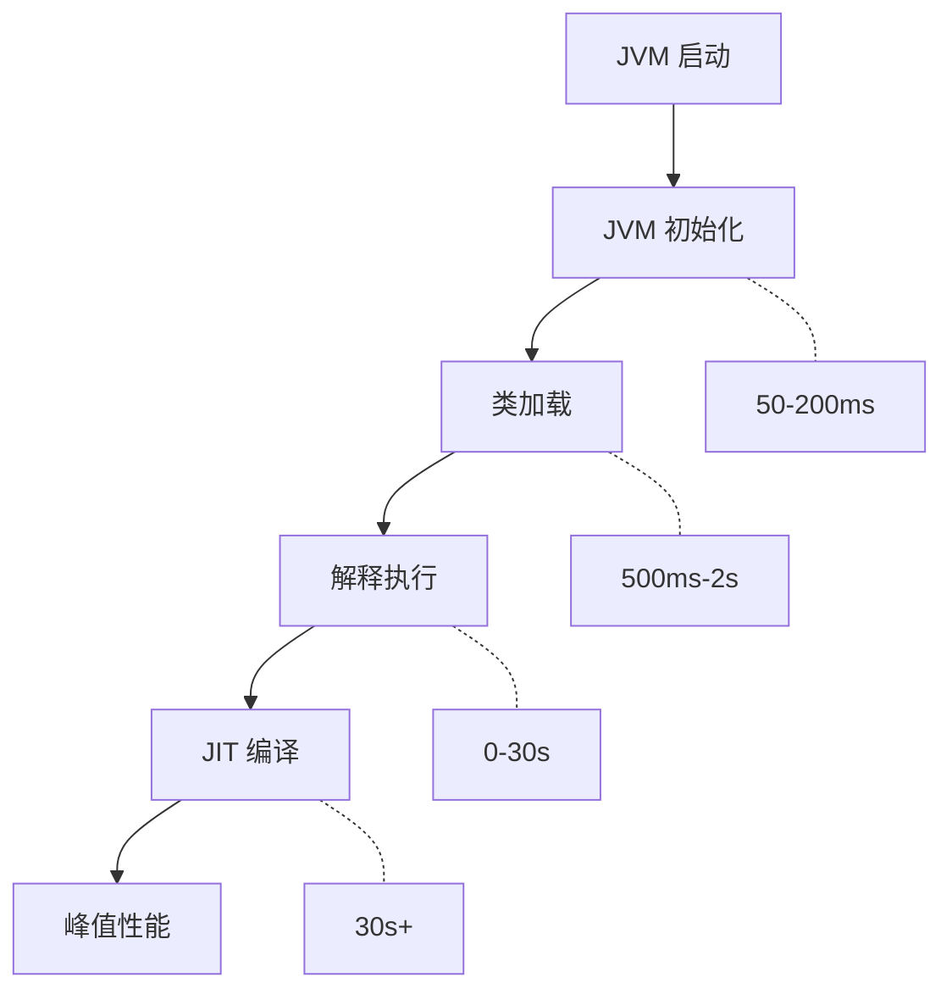
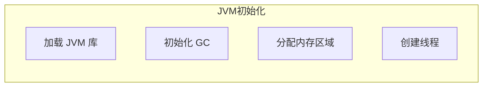
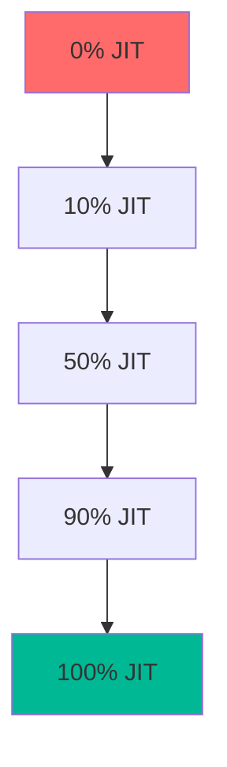

# JVM 启动优化技术

理解 JVM 启动优化，是实现云原生 Java 的基础。

## JVM 启动过程



## 启动时间瓶颈

### 1. JVM 初始化



### 2. 类加载

类加载是启动时间的主要瓶颈：

| 操作 | 时间占比 |
| --- | --- |
| 读取 class 文件 | 30% |
| 验证字节码 | 25% |
| 解析常量池 | 20% |
| 链接 | 15% |
| 初始化 | 10% |

### 3. JIT 编译

JIT 编译需要预热：



## 启动优化技术

### 1. AOT 编译

```bash
# 使用 GraalVM native-image
native-image --jar myapp.jar myapp

# 启动时间从 2-5 秒降到 0.01-0.1 秒
```

### 2. 类数据共享（CDS）

```bash
# 启用 CDS
java -Xshare:on -jar myapp.jar

# 启动时间减少 20-30%
```

### 3. AppCDS

```bash
# 创建应用类共享归档
java -XX:ArchiveClassesAtExit=app.jsa \
     -cp myapp.jar \
     -jar myapp.jar

# 使用共享归档
java -XX:SharedClassListFile=app.classlist \
     -XX:SharedArchiveFile=app.jsa \
     -cp myapp.jar \
     -jar myapp.jar
```

### 4. 分层编译

```bash
# 启用分层编译
java -XX:+TieredCompilation \
     -XX:TieredStopAtLevel=1 \
     -jar myapp.jar

# 快速预热到 C1 级别
```

## JIT 预热问题

### 预热的特点


### 预热配置

```bash
# 降低编译阈值
java -XX:CompileThreshold=1000 \
     -jar myapp.jar

# 增加编译线程
java -XX:CICompilerCount=8 \
     -jar myapp.jar
```

## 类加载优化

### 延迟加载

```java
// 延迟加载示例
public class LazyService {
    private static volatile HeavyService instance;
    
    public static HeavyService getInstance() {
        if (instance == null) {
            synchronized (LazyService.class) {
                if (instance == null) {
                    instance = new HeavyService();  // 首次使用时加载
                }
            }
        }
        return instance;
    }
}
```

### 预加载

```java
// 启动时预加载
public class Application {
    public static void main(String[] args) {
        // 预加载关键类
        preloadClasses();
        
        // 启动应用
        startApplication();
    }
}
```

## 云原生 Java 优化

### 容器环境优化

```dockerfile
# Dockerfile
FROM ubuntu:20.04

# 使用较小的 JDK 镜像
FROM eclipse-temurin:17-jre-alpine

COPY myapp.jar /app/
WORKDIR /app

# 启用 CDS
RUN java -Xshare:on -jar myapp.jar || true

CMD ["java", "-jar", "myapp.jar"]
```

### Kubernetes 探针

```yaml
apiVersion: v1
kind: Pod
metadata:
  name: myapp
spec:
  containers:
  - name: myapp
    image: myapp:latest
    readinessProbe:
      httpGet:
        path: /health
        port: 8080
      initialDelaySeconds: 5
      periodSeconds: 5
    livenessProbe:
      httpGet:
        path: /health
        port: 8080
      initialDelaySeconds: 15
      periodSeconds: 10
```

## 预热策略

### 1. 影子生产流量

```bash
# 使用影子流量预热
kubectl run load-generator \
    --image=busybox \
    -- /bin/sh -c \
    "while true; do wget -q -O- http://myapp/health; done"
```

### 2. 预热脚本

```bash
#!/bin/bash
# warmup.sh

ENDPOINT="http://myapp:8080"
REQUESTS=100

for i in $(seq 1 $REQUESTS); do
    curl -s "$ENDPOINT/api/endpoint1" > /dev/null
    curl -s "$ENDPOINT/api/endpoint2" > /dev/null
done
```

### 3. 金丝雀发布

```yaml
apiVersion: argoproj.io/v1alpha1
kind: Rollout
metadata:
  name: myapp
spec:
  strategy:
    canary:
      steps:
      - setWeight: 5
      - pause: {}
      - setWeight: 20
      - pause: {}
```

## 性能监控

### 启动时间监控

```java
// 记录启动时间
public class Application {
    private static final long START_TIME = System.currentTimeMillis();
    
    public static void main(String[] args) {
        System.out.println("启动时间: " + 
            (System.currentTimeMillis() - START_TIME) + "ms");
        
        startApplication();
    }
}
```

### GC 开销监控

```bash
# 监控 GC
java -Xlog:gc*:file=gc.log \
     -jar myapp.jar

# 分析 GC 日志
jstat -gcutil <pid> 1000
```

## 最佳实践

### 1. 减少镜像大小

```dockerfile
# 使用 Alpine 镜像
FROM eclipse-temurin:17-jre-alpine

# 或者使用 GraalVM 原生镜像
FROM ghcr.io/graalvm/native-image:22
```

### 2. 使用分层镜像

```dockerfile
# JRE 层
FROM eclipse-temurin:17-jre AS jre

# 应用层
FROM alpine:3.18
COPY --from=jre /opt/java/openjdk /opt/java/openjdk
COPY app.jar /app/
CMD ["/opt/java/openjdk/bin/java", "-jar", "/app/app.jar"]
```

### 3. 启用优化参数

```bash
# 推荐参数
java -XX:+UseG1GC \
     -XX:+TieredCompilation \
     -XX:TieredStopAtLevel=1 \
     -Xshare:on \
     -jar myapp.jar
```

## 未来展望

### Project Leyden

Project Leyden 是 OpenJDK 的启动优化项目：

- 静态镜像
- 类数据共享改进
- 更快的 JIT 预热

### 云原生运行时

未来的 Java 运行时可能：

- 原生集成到容器
- 更小的镜像
- 更快的启动
