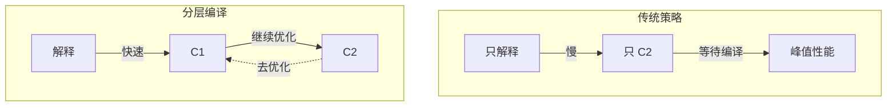
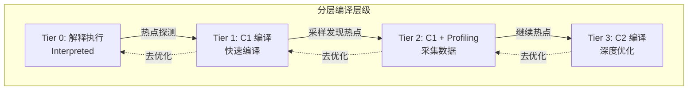
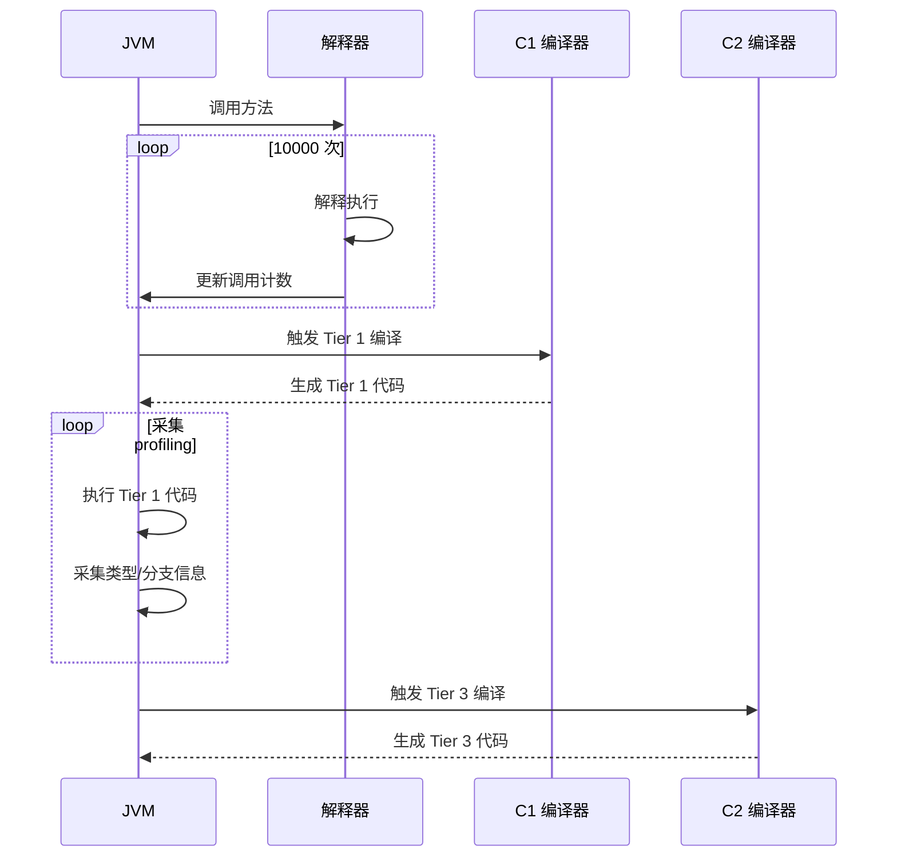
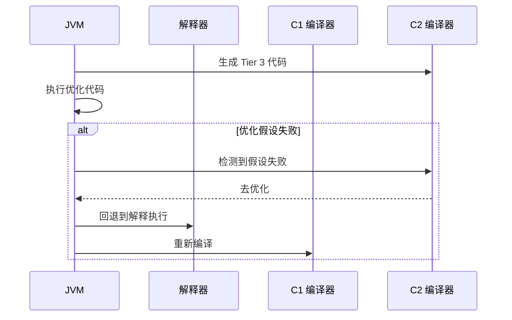
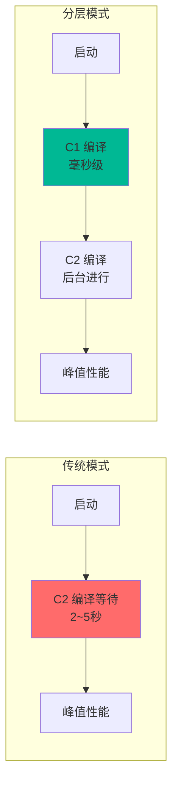

# 分层编译（Tiered Compilation）

理解分层编译，是理解 JVM 如何在不同阶段选择不同优化策略的基础。

## 为什么需要分层编译

传统的 JVM 面临一个权衡：

| 选择 | 优点 | 缺点 |
| --- | --- | --- |
| 只用 C1 | 启动快 | 峰值性能差 |
| 只用 C2 | 峰值性能好 | 启动慢 |

分层编译解决了这个矛盾：



## 分层编译的四个层次



### 各层详解

| 层级 | 编译器 | 编译速度 | 优化程度 | 说明 |
| --- | --- | --- | --- | --- |
| 0 | 解释器 | - | - | 初始状态 |
| 1 | C1 | 快 | 低 | 快速响应热点 |
| 2 | C1+Profiling | 中 | 中 | 采集运行数据 |
| 3 | C2 | 慢 | 高 | 深度优化 |

### Tier 0：解释执行

- 字节码直接被解释执行
- 统计方法调用次数和回边次数
- 不生成任何编译代码

### Tier 1：C1 快速编译

- 方法调用次数超过阈值后触发
- 使用 C1 编译器快速生成代码
- 不进行深度优化

### Tier 2：C1 + Profiling

- C1 编译后继续统计 profiling 数据
- 采集类型信息、分支信息等
- 为 C2 编译提供数据

### Tier 3：C2 深度优化

- 基于 profiling 数据进行激进优化
- 生成高质量机器码
- 可能进行去优化

## 分层编译的配置

### 启用分层编译

分层编译在 JDK 8+ 默认启用：

```bash
# 显式启用
java -XX:+TieredCompilation -jar application.jar

# 禁用分层编译
java -XX:-TieredCompilation -jar application.jar
```

### 编译阈值参数

| 参数 | 说明 | 默认值 |
| --- | --- | --- |
| `-XX:CompileThreshold` | Tier 1 触发阈值 | 10000 |
| `-XX:Tier3InvocationThreshold` | Tier 3 触发阈值 | 20000 |
| `-XX:Tier3BackEdgeThreshold` | Tier 3 回边阈值 | 200000 |
| `-XX:Tier3MinInvocationThreshold` | Tier 3 最小调用阈值 | 1000 |

### 编译线程数

| 参数 | 说明 | 默认值 |
| --- | --- | --- |
| `-XX:CICompilerCount` | C1+C2 编译线程总数 | CPU 核数 |
| `-XX:CICompilerCountPerCPU` | 每个 CPU 的编译线程数 | 0.25 |

## 分层编译的工作流程

### 正常编译路径



### 去优化路径



## 分层编译的优势

### 1. 快速启动



### 2. 更快的预热

分层编译让应用更快达到峰值性能：

| 阶段 | 传统模式 | 分层编译 |
| --- | --- | --- |
| 0~100ms | 解释执行 | 解释执行 |
| 100ms~1s | C2 编译中 | C1 已生效 |
| 1s~10s | 逐步优化 | C2 逐步生效 |

### 3. 适应不同负载

分层编译能适应不同的热点分布：

- **启动期**：主要是 Tier 0 和 Tier 1
- **预热期**：Tier 2 采集数据
- **稳定期**：Tier 3 达到峰值性能

## 分层编译的监控

### JIT 日志

```bash
# 开启编译日志
java -XX:+UnlockDiagnosticVMOptions \
     -XX:+LogCompilation \
     -XX:LogFile=/tmp/jit.log \
     -jar application.jar

# 分析日志
# tier='1' 表示 C1 编译
# tier='2' 表示 C1 + Profiling
# tier='3' 表示 C2 编译
grep "tier='3'" /tmp/jit.log | head -20
```

### PrintCompilation

```bash
# 使用 -XX:+PrintCompilation
java -XX:+PrintCompilation \
     -XX:+UnlockDiagnosticVMOptions \
     -jar application.jar

# 输出示例
10  234 %  !   com.example.MyClass::method @ 5 <compiled>
20  567    n   java.lang.System::arraycopy <native>
30  890 %  @    com.example.MyClass::loop @ 10 <made not entrant>
```

### 日志符号说明

| 符号 | 说明 |
| --- | --- |
| `%` | OSR（栈上替换）编译 |
| `!` | 有异常处理的编译方法 |
| `n` | native 方法 |
| `@` | 指定热点位置 |

## 分层编译的注意事项

### 1. 代码缓存

分层编译会生成多层代码，需要更大的代码缓存：

```bash
# 增加代码缓存
java -XX:ReservedCodeCacheSize=100m \
     -XX:+UseCodeCacheFlushing \
     -jar application.jar
```

### 2. 编译线程

编译线程数影响编译速度：

```bash
# 减少编译线程（如果 CPU 紧张）
java -XX:CICompilerCount=2 \
     -jar application.jar

# 增加编译线程（加快预热）
java -XX:CICompilerCount=8 \
     -jar application.jar
```

### 3. 内存开销

分层编译需要额外的 profiling 数据：

```java
// profiling 数据存储
// 每个编译方法都需要存储：
// - 类型信息
// - 分支统计
// - 调用计数
```

## 适用场景

分层编译适合几乎所有场景，特别是：

1. **服务应用**：需要快速启动并达到峰值性能
2. **微服务**：启动时间直接影响资源利用
3. **容器化部署**：启动快意味着更快的弹性伸缩
4. **长时间运行**：预热后达到最优性能
