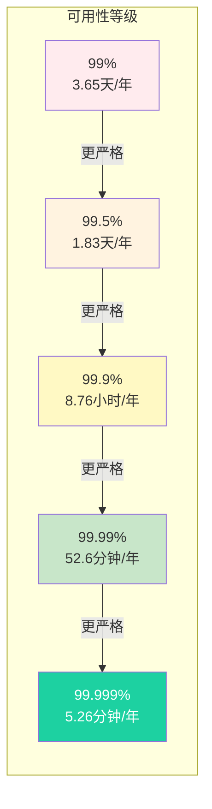
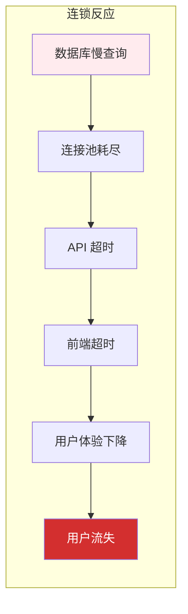

# 可用性与性能的关系

「系统可用性 99.9%」——这句话背后隐藏着巨大的信息量。一年有 525600 分钟，99.9% 意味着全年可以容忍约 525 分钟（约 8.7 小时）的不可用时间。但这 525 分钟是连续的还是分散的？是白天还是深夜？是计划内还是计划外的？理解这些，才能真正理解可用性的本质。

## 可用性的定义与计算

### 可用性计算公式

可用性的基础计算公式是：

```
可用性 = uptime ÷ (uptime + downtime) × 100%
```

但这个公式有两种解读方式：

| 计算方式 | 公式 | 适用场景 |
| --- | --- | --- |
| 基于请求 | 成功请求数 ÷ 总请求数 | 面向用户体验 |
| 基于时间 | 正常时间 ÷ 总时间 | 面向业务风险 |

### 基于请求的可用性

假设系统一天内处理了 1000 万次请求，其中 1 万次失败：

```
可用性 = (10000000 - 10000) ÷ 10000000 × 100% = 99.9%
```

这种计算方式的优点是**面向用户体验**：用户关心的是自己的请求是否成功，不关心系统在凌晨是否宕机。

### 基于时间的可用性

假设系统一天内：
- 正常工作：23 小时 55 分钟
- 故障时间：5 分钟（凌晨 3:00-3:05）

```
可用性 = (23 × 60 + 55) ÷ (24 × 60) × 100% = 99.65%
```

这种计算方式的优点是**面向业务风险**：业务关心的是系统在关键时段是否可用，不关心有多少请求失败。

### 两种计算方式的差异

一个系统在一天内有 1 分钟完全不可用（错误率 100%），其余时间完全正常（错误率 0%）：

- 基于请求：假设故障时段有 0 请求，可用性 = 100%
- 基于时间：可用性 = (1439 ÷ 1440) × 100% = 99.93%

**选择哪种计算方式，取决于业务场景和利益相关者关注点。**

## 可用性等级与时间对照



### 各等级的代价

可用性每提升一个 9，成本可能增加数倍：

| 等级 | 典型场景 | 成本倍数 | 技术要求 |
| --- | --- | --- | --- |
| 99% | 内部系统、测试环境 | 1x | 基础监控 |
| 99.5% | 内部工具、后台系统 | 1.5x | 自动恢复 |
| 99.9% | 面向用户的标准服务 | 2x | 多 AZ 部署 |
| 99.99% | 金融交易、企业服务 | 5x | 异地多活 |
| 99.999% | 核心支付、电信级 | 10x+ | 全球分布式 |

## 可用性与性能的关系

### 性能退化导致可用性下降

性能问题和可用性问题往往相互影响。当系统性能退化时，可用性也会受到影响：


### 性能指标与可用性

某些性能指标的恶化可以直接转化为可用性问题：

```mermaid
graph LR
    A["TP99 延迟"] --> |"> 5s| B["超时率 > 10%"]
    A --> |"> 30s| C["可用性 < 99%"]
    D["错误率"] --> |"> 1%| E["可用性 < 99%"]
```

### 降级与熔断

为了保证核心功能的可用性，通常会采用降级和熔断策略：

```java
// 降级示例
public String getUserInfo(Long userId) {
    try {
        // 尝试获取完整信息
        return userService.getFullInfo(userId);
    } catch (TimeoutException e) {
        // 超时降级：返回基本信息
        return userService.getBasicInfo(userId);
    }
}

// 熔断示例
@CircuitBreaker(name = "userService", fallbackMethod = "getUserInfoFallback")
public String getUserInfo(Long userId) {
    return userService.getFullInfo(userId);
}

public String getUserInfoFallback(Long userId, Exception e) {
    return "服务暂时不可用，请稍后再试";
}
```

## 性能退化的可用性影响

### 资源饱和导致不可用

当资源使用率达到极限时，系统可能表现为「可用但很慢」或直接不可用：

| 资源 | 饱和后果 | 可用性影响 |
| --- | --- | --- |
| CPU | 请求排队、超时 | 部分请求失败 |
| 内存 | OOM、频繁 GC | 服务重启 |
| 磁盘 | I/O 等待 | 响应缓慢 |
| 连接池 | 连接等待、超时 | 请求堆积 |

### 连锁反应

一个组件的性能问题可能导致整个系统的可用性问题：



### 案例：双十一零点雪崩

某电商平台双十一零点：

- 瞬时流量是平时的 100 倍
- 数据库连接池耗尽
- API 超时率飙升到 50%
- 下单成功率从 99.5% 跌到 30%
- 持续 5 分钟后触发熔断，系统恢复

根因分析：**流量预估不足 + 缺少限流 + 数据库成为瓶颈**。

## 可用性保障策略

### 容量规划

基于性能测试的容量规划：


### 限流保护

限流是保护系统可用性的重要手段：

```java
// 基于令牌桶的限流
RateLimiter limiter = RateLimiter.create(10000); // 每秒 10000 个令牌

public void handleRequest(Request request) {
    if (limiter.tryAcquire()) {
        // 处理请求
        process(request);
    } else {
        // 限流拒绝
        throw new RateLimitException("请求过于频繁");
    }
}
```

### 降级策略

降级策略确保核心功能可用：

| 降级级别 | 触发条件 | 降级行为 |
| --- | --- | --- |
| L1 | 响应时间 > 500ms | 返回缓存数据 |
| L2 | 响应时间 > 2s | 返回静态数据 |
| L3 | 服务不可用 | 返回默认数据 |
| L4 | 系统过载 | 拒绝部分请求 |

### 熔断机制

熔断器防止故障蔓延：

```java
// Resilience4j 熔断器配置
CircuitBreakerConfig config = CircuitBreakerConfig.custom()
    .failureRateThreshold(50) // 50% 失败率触发熔断
    .slowCallRateThreshold(80) // 80% 慢调用触发熔断
    .slowCallDurationThreshold(Duration.ofSeconds(2))
    .waitDurationInOpenState(Duration.ofSeconds(30))
    .permittedNumberOfCallsInHalfOpenState(10)
    .build();
```

## 可用性监控指标

### 黄金指标

可用性监控的核心指标：

- **错误率**：5xx 错误占比
- **延迟**：TP99/TP999 延迟
- **吞吐量**：QPS/RPS

### 告警设置

基于可用性的告警：

```yaml
# 可用性告警规则
alerts:
  - name: error_rate_high
    condition: error_rate > 0.1%  # 错误率 > 0.1%
    duration: 5m
    severity: warning

  - name: error_rate_critical
    condition: error_rate > 1%  # 错误率 > 1%
    duration: 1m
    severity: critical

  - name: latency_p99_high
    condition: tp99_latency > 1000ms  # TP99 > 1s
    duration: 5m
    severity: warning
```

## 本章总结

**核心要点**：

1. **可用性 = uptime ÷ (uptime + downtime)**：两种计算方式，面向不同场景
2. **每提升一个 9，成本可能增加数倍**：可用性是有代价的
3. **性能退化导致可用性下降**：超时、错误率上升
4. **连锁反应**：一个组件的问题可能影响整个系统
5. **降级、限流、熔断**：保障可用性的三板斧

理解可用性与性能的关系，是设计高可用系统的关键。下一节我们将讲解性能基准测试方法论。