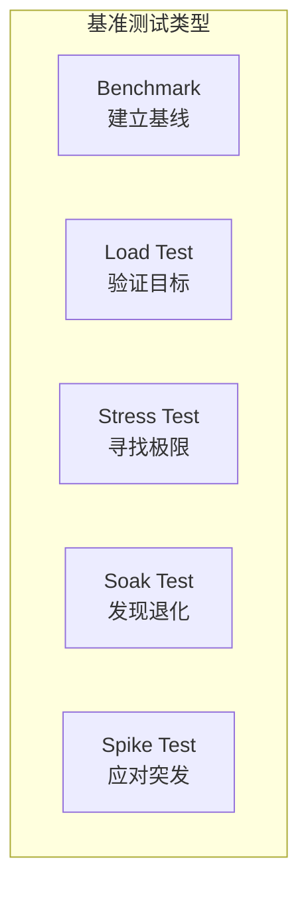
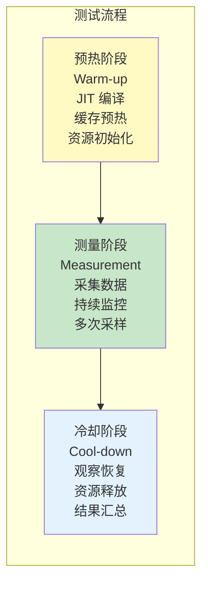
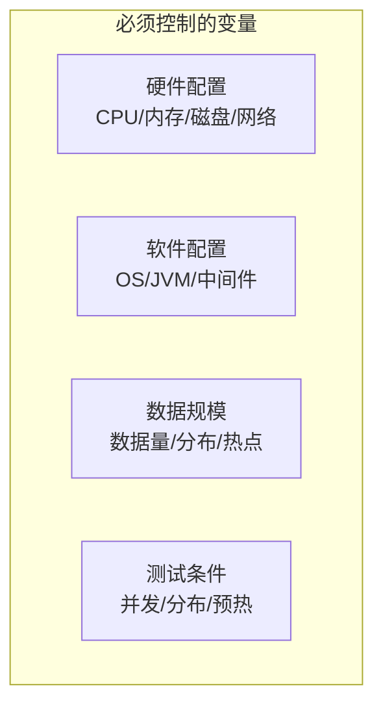
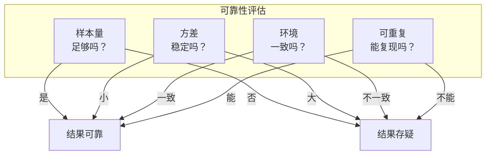

# 性能基准测试方法论

很多团队做过这样的事：开发环境跑了个接口，压测结果很漂亮，于是自信满满上线，结果第一个高峰就崩了。原因很简单：**测试环境和生产环境完全不同**。

性能基准测试不是「跑一下看看结果」那么简单。它需要科学的方法论来确保测试结果的可靠性和可重复性。

## 基准测试类型

### 按测试目标分类



#### 基准测试（Benchmark）

在标准环境下，使用标准化工作负载，测量系统的基准性能。

目的：建立性能基线，为后续优化提供参考。

#### 负载测试（Load Testing）

在预期负载下，验证系统是否能达到性能目标。

目的：确认系统是否满足需求。

#### 压力测试（Stress Testing）

超过预期负载，测试系统的极限和崩溃点。

目的：找到系统的容量边界。

#### 浸泡测试（Soak Testing）

在正常负载下长时间运行（通常 24~72 小时），观察性能是否退化。

目的：发现内存泄漏、连接池耗尽等长时间运行才暴露的问题。

#### 尖峰测试（Spike Testing）

模拟突发流量，观察系统的瞬时响应。

目的：验证弹性扩容和降级机制是否有效。

### 按测试粒度分类

| 类型 | 粒度 | 典型工具 | 适用场景 |
| --- | --- | --- | --- |
| Micro-Benchmark | 单个方法/类 | JMH | JDK 性能调优 |
| Macro-Benchmark | 单个系统 | wrk、JMeter | API 性能测试 |
| Macro-Benchmark | 多个系统 | k6、Gatling | 端到端性能测试 |

## 测试设计：预热/测量/冷却

### 标准测试流程



### 预热阶段

预热阶段的目的是让系统进入「正常状态」：

- **JIT 编译**：热点代码被编译成本地机器码
- **缓存预热**：常用数据进入缓存
- **GC 预热**：JVM 完成必要的 GC 循环
- **资源初始化**：连接池建立、线程池启动

**JMH 预热配置**：

```java
@BenchmarkMode(Mode.Throughput)
@OutputTimeUnit(TimeUnit.SECONDS)
@Measurement(iterations = 5, time = 3, timeUnit = TimeUnit.SECONDS)
@Warmup(iterations = 3, time = 2, timeUnit = TimeUnit.SECONDS)
public class MyBenchmark {
    @Benchmark
    public void testMethod() {
        // 测试代码
    }
}
```

### 测量阶段

测量阶段需要采集足够的数据：

- **多次采样**：避免单次测量的偶然性
- **持续监控**：确保测试期间系统状态稳定
- **数据聚合**：计算平均值、标准差、百分位数

```java
// 多次迭代测量
@Measurement(iterations = 5, time = 10, timeUnit = TimeUnit.SECONDS)
// 5 次迭代，每次 10 秒
```

### 冷却阶段

冷却阶段观察系统的恢复能力：

- 资源是否正常释放
- 连接是否正常关闭
- 内存是否回落到正常水平

## 测试环境隔离

### 变量控制

性能测试最大的敌人是**不确定性**。如果测试环境和生产环境差异巨大，测试结果就毫无参考价值。



### 环境对比表

| 维度 | 测试环境 | 生产环境 | 差异影响 |
| --- | --- | --- | --- |
| CPU | 8 核 | 32 核 | 4 倍性能差距 |
| 内存 | 16GB | 64GB | 可能 OOM |
| 数据量 | 100 万 | 1 亿 | 索引失效 |
| 网络 | 内网 | 公网 | 延迟增加 |
| 负载 | 隔离 | 共享资源 | 竞争影响 |

### 测试环境最佳实践

1. **使用生产镜像**：测试环境使用与生产完全相同的镜像
2. **数据脱敏但规模一致**：数据可以脱敏，但规模必须与生产一致
3. **网络隔离**：测试环境和生产环境网络隔离，避免相互影响
4. **资源独立**：使用独立的数据库、缓存等资源

## 结果分析

### 关键指标

性能测试的结果通常包含以下指标：

| 指标 | 说明 | 关注点 |
| --- | --- | --- |
| 吞吐量 | QPS/RPS/TPS | 是否达到目标 |
| 延迟 | TP50/TP90/TP99 | 是否满足 SLA |
| 错误率 | 失败请求占比 | 是否可接受 |
| 资源使用 | CPU/内存/网络 | 是否接近上限 |

### 结果可靠性

测试结果的可信度评估：



### 常见陷阱

1. **测试时间太短**：没有覆盖完整的 GC 周期
2. **没有预热**：JIT 还没完成编译
3. **忽略网络延迟**：测试环境和生产环境的网络差异
4. **数据量不足**：缓存效应掩盖了真实性能
5. **并发不足**：没有达到真正的压力

## JMH 实战

JMH（Java Microbenchmark Harness）是 OpenJDK 提供的微基准测试工具，专门解决 Java 微基准测试的各种坑。

### Maven 依赖

```xml
<dependency>
    <groupId>org.openjdk.jmh</groupId>
    <artifactId>jmh-core</artifactId>
    <version>1.37</version>
</dependency>
<dependency>
    <groupId>org.openjdk.jmh</groupId>
    <artifactId>jmh-generator-annprocess</artifactId>
    <version>1.37</version>
</dependency>
```

### 基本示例

```java
@BenchmarkMode(Mode.Throughput)
@OutputTimeUnit(TimeUnit.SECONDS)
@State(Scope.Thread)
public class StringBenchmark {

    private String input = "Hello World";

    @Benchmark
    public String concat() {
        return input + " appended";
    }

    @Benchmark
    public String stringBuilder() {
        return new StringBuilder(input).append(" appended").toString();
    }
}
```

### 运行结果解读

```bash
# 运行结果
Benchmark                            Mode  Cnt          Score   Error  Units
StringBenchmark.concat            thrpt       1000000      123.456 ± 2.345  ops/s
StringBenchmark.stringBuilder     thrpt       1000000      456.789 ± 5.678  ops/s
```

- **Mode**：测试模式（Throughput/AvgTime/SampleTime）
- **Cnt**：采样次数
- **Score**：平均得分
- **Error**：误差范围（±95% 置信区间）
- **Units**：单位（ops/s 表示每秒操作数）

### 常见 JMH 陷阱

#### 死代码消除（Dead Code Elimination）

JMH 优化器会消除「没有副作用」的代码：

```java
@Benchmark
public void deadCodeTrap() {
    // 这个方法会被消除，因为结果没有被使用
    int result = doComputation();
}

@Benchmark
public Blackhole blackholeTrap(Blackhole bh) {
    // 使用 Blackhole 消费结果，防止消除
    int result = doComputation();
    bh.consume(result);
}
```

#### 常量折叠（Constant Folding）

编译器会提前计算常量表达式：

```java
@Benchmark
public double constantFolding() {
    // JIT 会优化为 return 3.14159
    return Math.PI;
}

@Benchmark
public double randomValue() {
    // 真正计算的值
    return Math.random() * Math.PI;
}
```

#### 缓存效应

测试方法调用的顺序会影响缓存命中率：

```java
@Benchmark
@OutputTimeUnit(TimeUnit.NANOSECONDS)
public void cacheEffect() {
    // 第一次访问：cache miss
    // 第二次访问：cache hit
    int sum = 0;
    for (int i = 0; i < 100; i++) {
        sum += array[i];
    }
}
```

### JMH 进阶用法

#### Fork 配置

```java
@Fork(value = 2, warmups = 1)
// 运行 2 次 fork，每次 fork 前预热 1 次
```

#### 参数化测试

```java
@Param({"10", "100", "1000"})
private int size;

@Benchmark
public void testMethod() {
    // 根据 size 参数运行测试
}
```

#### 后处理器

```java
@Measurement(iterations = 5)
@State(Scope.Thread)
public class MyBenchmark {

    @Benchmark
    public void test() {
        // 测试代码
    }

    @TearDown(Level.Iteration)
    public void tearDown() {
        // 每次迭代后清理
    }
}
```

## 本章总结

**核心要点**：

1. **测试类型选择**：Benchmark/Load/Stress/Soak/Spike 各有用途
2. **预热-测量-冷却**：标准化测试流程确保结果可靠
3. **环境隔离**：控制变量，确保测试环境与生产一致
4. **结果分析**：关注吞吐量、延迟、错误率、资源使用
5. **JMH 避坑**：死代码消除、常量折叠、缓存效应

理解基准测试方法论是进行可靠性能测试的基础。下一节我们将深入讲解 JMH 实战的更多细节。