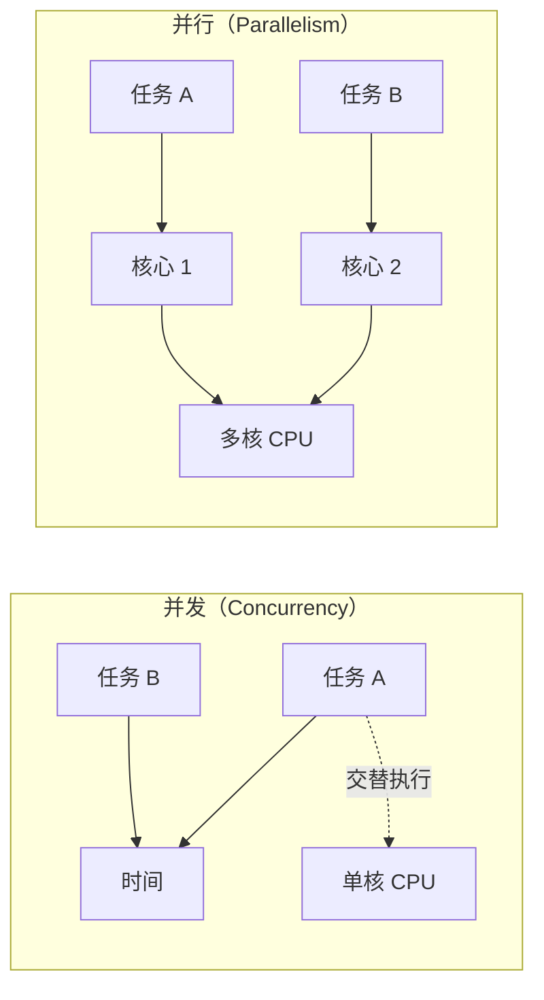
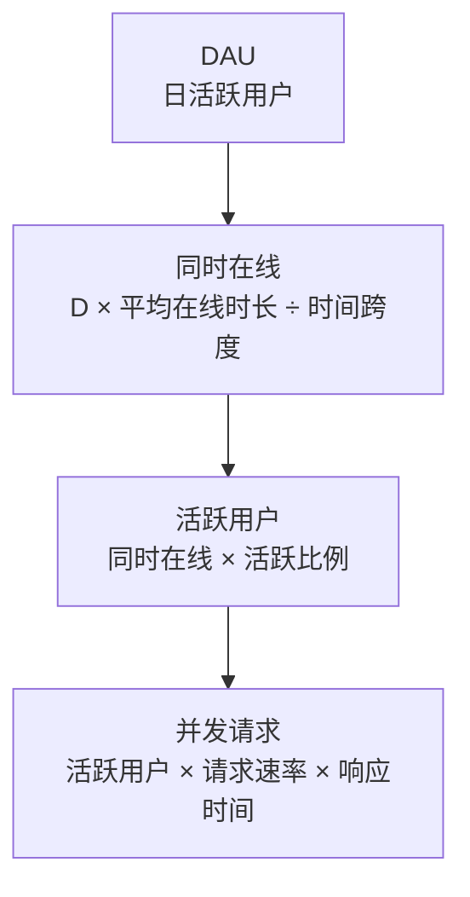

# 并发用户数

「我们的系统能抗多少并发？」——这是产品经理最常问的问题，也是最难回答的问题之一。因为「并发」本身就是一个模糊的概念，不同的定义会导致完全不同的答案。

## 并发的基本概念

### 并发（Concurrency）vs 并行（Parallelism）

这是两个最容易混淆的概念：



**并发**是多个任务在**同一时间段内**交替执行。在单核 CPU 上，操作系统通过时间片轮转，让多个任务「看起来」同时执行。关键点是：**任务是交替执行的，但时间线上是重叠的**。

**并行**是多个任务在**同一时刻**真正同时执行。这需要多核 CPU 或多台机器。关键点是：**任务在同一时刻真的在执行**。

### 并发用户数的定义

并发用户数有多种定义方式：

| 定义 | 含义 | 估算公式 |
| --- | --- | --- |
| 同时在线用户 | 任意时刻「连接」到系统的用户数 | DAU × 在线比例 |
| 活跃用户 | 任意时刻正在发起请求的用户数 | 同时在线 × 操作比例 |
| 并发请求 | 任意时刻正在处理的请求数 | 活跃用户 × 每用户请求速率 × 响应时间 |

通常说的「并发」指的是**并发请求数**，因为它直接影响系统负载。

### 同时在线 vs 活跃用户

这两个概念经常被混淆：

- **同时在线用户**：打开 App 或网站，但不一定在操作
- **活跃用户**：正在发起请求的用户

假设一个电商 App：
- 同时在线用户：10 万（用户打开 App 在浏览）
- 活跃用户：3 万（用户正在浏览、点击、加购）
- 发起请求的用户：1 万（用户正在产生 HTTP 请求）

## 并发用户数的估算方法

### 基于 DAU 估算

如果知道日活（DAU），可以通过以下方式估算并发用户数：



**公式推导**：

假设：
- DAU = 100,000 用户
- 平均使用时长 = 30 分钟
- 运营时间 = 8 小时（28800 秒）
- 同时在线比例 = 30%

```
同时在线 = 100000 × 30% = 30000 用户
```

假设其中 30% 是活跃用户：

```
活跃用户 = 30000 × 30% = 9000 用户
```

假设每个活跃用户每 10 秒发起一次请求，平均响应时间是 200ms：

```
并发请求 = 9000 × (1 ÷ 10) × 0.2 = 180 请求
```

### 基于峰值估算

DAU 估算给出的是平均值，但峰值可能远超平均值：

- 早上 9-10 点是办公场景的峰值
- 晚上 8-10 点是娱乐场景的峰值
- 促销活动的峰值可能是平日的 10 倍以上

**经验法则**：峰值并发通常是平均并发的 3~10 倍。

### 基于二八法则估算

80% 的请求发生在 20% 的时间内。假设日均 QPS 是 10000：

```
峰值 QPS ≈ 10000 × (1 ÷ 20%) = 50000 QPS
```

## 并发与吞吐量的关系

根据 Little's Law：

```
吞吐量 = 并发数 ÷ 平均响应时间
```

这个公式告诉我们：**吞吐量受并发数和响应时间的共同限制**。

### 例子：计算最大吞吐量

假设：
- 最大并发数 = 1000（线程池大小）
- 平均响应时间 = 100ms

```
最大吞吐量 = 1000 ÷ 0.1 = 10000 QPS
```

如果想提升吞吐量，有两种方式：

1. **增加并发数**：扩容到 2000 并发，吞吐量 = 2000 ÷ 0.1 = 20000 QPS
2. **降低响应时间**：优化到 50ms，吞吐量 = 1000 ÷ 0.05 = 20000 QPS

### 并发瓶颈识别

当并发达到一定规模时，系统会出现瓶颈：

```mermaid
flowchart TD
    subgraph 瓶颈识别
        A["并发增加"] --> B{"响应时间?"}
        B -->|"正常增长"| C["正常范围"]
        B -->|"急剧上升"| D["出现瓶颈"]
        D --> E{"CPU 使用率?"}
        E -->|"接近 100%| F["CPU 瓶颈"]
        E -->|"不高"| G{"I/O 等待?"}
        G -->|"高"| H["I/O 瓶颈"]
        G -->|"不高"| I["锁竞争/连接池瓶颈"]
    end
```

**CPU 瓶颈**：CPU 使用率接近 100%，计算能力达到上限。解决方案：优化算法、增加 CPU。

**I/O 瓶颈**：CPU 使用率不高，但 I/O 等待高。解决方案：使用异步 I/O、增加缓存、优化数据库查询。

**锁竞争**：CPU 使用率不高，等待锁的线程多。解决方案：减少锁粒度、使用无锁算法。

**连接池瓶颈**：等待数据库连接的线程多。解决方案：增加连接池大小、缩短事务时间。

## 并发用户数的实际测算

### JMeter 压测场景

使用 JMeter 进行并发压测：

```java
// JMeter 测试计划配置
// 线程组设置：100 个线程， ramp-up 时间 10 秒，循环 100 次
// 相当于：100 并发，预热 10 秒，总请求 10000 次
```

### wrk 快速压测

```bash
# 100 个并发连接，持续 30 秒
wrk -t4 -c100 -d30s http://localhost:8080/api/users
```

### 计算并发用户数

从压测结果反推并发用户数：

```
QPS = 5000
平均响应时间 = 50ms
并发数 = QPS × 响应时间 = 5000 × 0.05 = 250
```

## 并发配置建议

### 线程池大小配置

线程池大小与 CPU 密集程度相关：

```java
// CPU 密集型：线程数 = CPU 核心数 + 1
int cpuThreads = Runtime.getRuntime().availableProcessors() + 1;

// I/O 密集型：线程数 = CPU 核心数 × 期望 CPU 利用率 × (1 + 等待时间 ÷ 计算时间)
// 假设：4 核 CPU，期望利用率 60%，I/O 等待 100ms，计算时间 20ms
int ioThreads = (int) (4 × 0.6 × (1 + 100.0 / 20)) = 72;
```

### 连接池大小配置

数据库连接池大小也需要合理配置：

```java
// 最小连接数：正常负载下的并发数
// 最大连接数：峰值负载下的并发数
HikariConfig config = new HikariConfig();
config.setMinimumIdle(20);
config.setMaximumPoolSize(100);
config.setConnectionTimeout(30000);
config.setIdleTimeout(600000);
config.setMaxLifetime(1800000);
```

## 本章总结

**核心要点**：

1. **并发 vs 并行**：并发是交替执行，并行是同时执行
2. **并发用户数有多种定义**：同时在线、活跃用户、并发请求
3. **Little's Law**：并发数 = 吞吐量 × 响应时间
4. **峰值并发是平均的 3~10 倍**：容量规划要考虑峰值
5. **瓶颈识别**：CPU、I/O、锁竞争、连接池

理解并发用户数是容量规划的基础。下一节我们将深入讲解 TP 指标，完善延迟评估的完整图景。