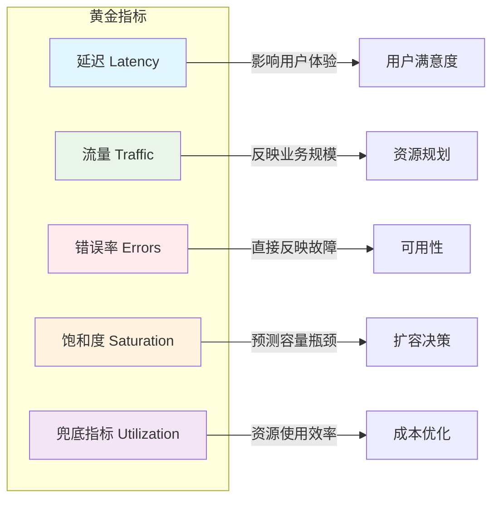
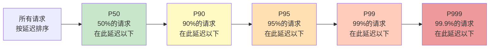
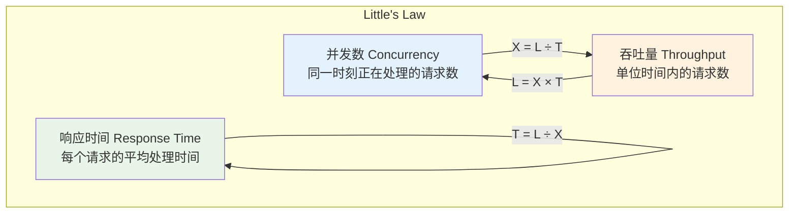
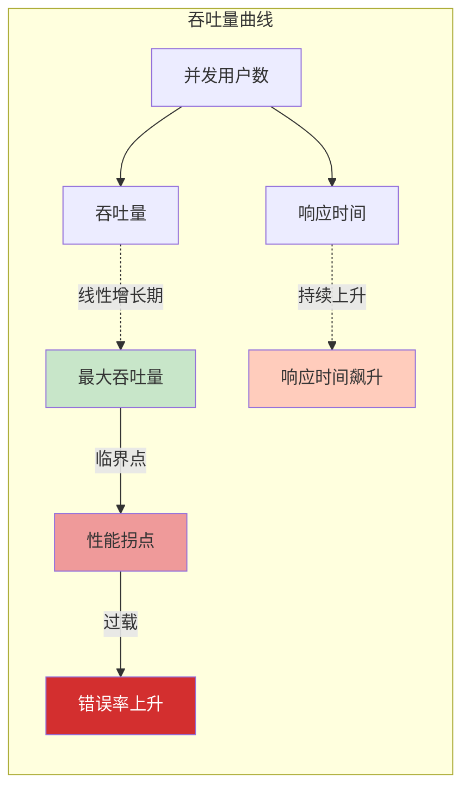

# 性能指标：如何用数字说话

凌晨两点，线上报警响了：「数据库 CPU 使用率 98%」。值班工程师紧急扩容、加索引、调整缓存策略，忙活了半小时，系统终于稳定。复盘会上大家松了一口气，准备庆祝这次故障的快速恢复。

但真正的问题，直到一周后才暴露出来。产品经理翻看监控数据时发现：**从半年前开始，用户平均页面加载时间就已经从 1.2 秒缓慢爬升到 2.8 秒**，只是在平均值上看不太出来。而这半年间，用户投诉量增加了 40%，转化率下降了 15%，但没有人把这些和「性能退化」关联起来。

这个故事揭示了一个经典陷阱：**团队只看平均值**，却忽略了那 1% 的用户正在经历 10 秒以上的等待——他们不会抱怨，只是默默离开了。

另一个常见误区是「吞吐量崇拜」。某团队把系统 QPS 优化到了 50 万，沾沾自喜地向领导汇报。直到一次大促，流量只有预期的 30%，系统却直接崩溃了。后来分析才发现：压测时用的是固定并发数，而大促时真实用户的请求分布极不均匀——前 5 分钟涌入了全天 40% 的流量，系统根本没有做流量削峰。

这两个故事告诉我们：**性能不是单一指标，而是一整套指标体系**。只看平均值会让你忽略长尾用户，只看 QPS 会让你忽视稳定性。只有关注正确的指标，才能真正把握系统的健康状况。

## 为什么需要性能指标体系

性能指标不是给监控大屏用的装饰品，而是**沟通业务与技术之间的桥梁**。

当业务方说「系统要快」，工程师需要追问「多快算快？」——这个追问的答案，就是性能指标。当老板问「这次优化效果如何」，工程师需要拿出数据证明——这个数据的载体，就是性能指标。当系统出问题时，工程师需要快速定位瓶颈——这个定位的依据，还是性能指标。

没有指标体系，技术决策就变成了「我觉得」「我以为」「以前就是这么做的」。有了指标体系，决策才能建立在数据之上，才能讨论「达标了吗」「优化了多少」「还能提升多少空间」。

更重要的是，性能指标帮助我们**建立共同语言**。产品、运营、老板都关心系统「快不快」「稳不稳」，但他们的感知是主观的。通过把主观感受量化成客观指标，团队才能在同一套标准下讨论问题、制定目标、评估结果。

### 黄金指标：Google SRE 的最佳实践

2010 年，Google 发布了 Site Reliability Engineering（SRE）系列文章，其中最广为流传的贡献之一，就是提出了**黄金指标（The Four Golden Signals）**的概念。这四个指标是：延迟（Latency）、流量（Traffic）、错误率（Errors）、饱和度（Saturation）。

后来社区在此基础上扩展，加入了兜底指标，形成了完整的五因子体系：



这五个指标不是孤立的，而是相互关联的。当流量增加时，延迟通常会上升；当延迟过高时，错误率可能上升；当饱和度接近 100% 时，整个系统的性能会急剧恶化。理解这种关联，是诊断性能问题的关键。

### 指标之间的关系

性能指标之间存在复杂的因果和约束关系，理解这些关系才能真正用好指标：

```mermaid
flowchart TD
    subgraph 输入指标（可操控）
        C["并发用户数 Concurrency"]
        R["请求率 Request Rate"]
        B["资源分配 Resources"]
    end

    subgraph 核心指标（可观测）
        L["延迟 Latency"]
        T["吞吐量 Throughput"]
        E["错误率 Errors"]
    end

    subgraph 约束指标（容量边界）
        S["饱和度 Saturation"]
        U["资源利用率 Utilization"]
    end

    C --> |"增加"| L
    C --> |"增加"| S
    R --> |"增加"| T
    R --> |"超过阈值"| E
    B --> U
    S --> |"接近100%| E
    S --> |"瓶颈| T

    style L fill:#e1f5fe
    style T fill:#e8f5e8
    style E fill:#ffebee
    style S fill:#fff3e0
    style U fill:#f3e5f5
```

**延迟**和**吞吐量**是性能的一体两面。在资源未饱和时，增加并发通常能同时提升吞吐量和延迟（因为排队时间增加）。但在资源饱和后，继续增加并发只会让延迟飙升，吞吐量反而下降。这就是为什么「加了资源系统反而更慢」——不是因为资源不够，而是因为资源分配策略有问题。

**错误率**是系统健康状况的直接反映。但要注意区分「真错误」和「假错误」：HTTP 404 是错误，HTTP 503 是错误，但 HTTP 200 带上「服务降级」标记也是错误。需要结合业务语义来判断。

**饱和度**是最重要的前瞻性指标。CPU 使用率 80% 看起来还好，但如果过去一周的增速是每天 +5%，那么四天后就会达到 100%。看到饱和度指标时，要问的不是「现在够不够」，而是「还能撑多久」。

## 延迟指标：为什么平均值会骗人

说延迟是性能指标中最重要的一项，恐怕没有人会反对。用户感知到的「快不快」，本质上就是延迟。

但「延迟」本身是一个模糊的概念。一条 HTTP 请求的端到端延迟可能只有 50ms，但在这 50ms 里，DNS 解析花了 5ms，TCP 连接花了 10ms，SSL 握手花了 15ms，服务端处理花了 15ms，响应传输花了 5ms。只有把延迟拆解到这一步，才能真正找到优化点。

### 为什么平均值不够

假设一个接口在 1 秒内有 100 次请求，其中 99 次的延迟是 10ms，只有 1 次的延迟是 5000ms（因为 GC 停顿）。这组数据的平均值是：

```
(99 × 10ms + 1 × 5000ms) ÷ 100 = 59.9ms
```

59.9ms 看起来还不错，但事实上有 1% 的用户经历了 5 秒的等待。如果这个接口是支付接口，5 秒的等待会直接导致用户放弃支付——即使只有 1%，按每天 100 万笔交易计算，也是 1 万笔失败的订单。

平均值会骗人，是因为**它对异常值不敏感**。在性能领域，真正的「坏」往往来自长尾。

### 百分位数详解

百分位数是解决平均值骗人问题的标准方案。它的定义是：把响应时间从小到大排序，第 N 百分位数表示有 N% 的请求响应时间在这个值以下。



**P50（中位数）**：一半的请求比这个值快，一半比它慢。中位数不受极端值影响，比平均值更稳定。但中位数只能告诉你「一半的用户体验如何」，无法告诉你「另一半用户有多差」。

**P90**：90% 的请求比这个值快，意味着有 10% 的用户经历更差的体验。如果你的 P90 是 100ms，意味着每 10 个用户中就有 1 个等待超过 100ms。这个比例看起来不高，但如果你的日活是 100 万，每天的「差体验用户」就是 10 万。

**P95/P99**：越靠近 100%，越关注长尾用户。P99 通常被认为是「绝大多数用户都能接受」的底线。很多大厂把 P99 作为 SLA 承诺的指标——不是因为它不重要，而是因为它足够严格。

**P999/P9999**：这些是极端长尾指标。P999 是 1000 个请求中只有 1 个比它慢。关注这些指标不是为了「让每个用户都满意」，而是为了发现系统的异常行为——如果 P999 突然飙升，往往意味着出现了慢查询、死锁、或者 GC 问题。

### 百分位数的实际意义

不同百分位数代表不同的含义和应用场景：

| 百分位 | 含义 | 适用场景 | 典型阈值 |
| --- | --- | --- | --- |
| P50 | 一半用户的体验 | 快速判断整体水平 | 无特定标准 |
| P90 | 大多数用户的体验 | 设置内部目标 | 业务可接受上限 |
| P95 | 头部用户的体验 | 设置 SLA 目标 | 行业参考标准 |
| P99 | 绝大多数用户的体验 | 承诺 SLA | 严格的对外承诺 |
| P999 | 极端长尾 | 发现系统异常 | 诊断级指标 |

有一个经验法则：**P99 / P50 的比值，反映了系统延迟的离散程度**。如果比值接近 1，说明系统响应非常稳定；如果比值超过 10，说明存在严重的延迟不一致性问题。

### 延迟直方图

百分位数是数字，直方图是图形。两者结合，才能完整理解延迟分布。

```mermaid
graph TD
    subgraph 理想分布（健康系统）
        H1["0-10ms: ████████████████ 95%"]
        H2["10-50ms: ███ 3%"]
        H3["50-100ms: █ 1%"]
        H4["100ms+: ▏ 1%"]
    end

    subgraph 问题分布（存在长尾）
        H5["0-10ms: ██████████ 60%"]
        H6["10-50ms: █████ 25%"]
        H7["50-100ms: ███ 10%"]
        H8["100ms+: ██ 5%"]
    end

    subgraph 严重问题（多峰分布）
        H9["0-10ms: ████████████ 50%"]
        H10["10-50ms: ██ 10%"]
        H11["50-100ms: ████ 15%"]
        H12["100-500ms: █████ 20%"]
        H13["500ms+: █ 5%"]
    end
```

多峰分布是特别值得警惕的信号。如果直方图出现两个明显的高峰，通常意味着系统处于两种不同的运行状态——比如正常请求和慢请求混合，或者缓存命中和未命中走的是不同路径。

## 吞吐量指标：QPS/TPS/RPS 的区别

如果说延迟关注的是「每个请求快不快」，吞吐量关注的就是「系统能扛多少请求」。

### 三个核心概念

**QPS（Queries Per Second）**：每秒查询数，通常用于描述数据库或缓存系统的处理能力。比如「MySQL 能支撑 5000 QPS」，意思是 MySQL 每秒能执行 5000 次查询。

**TPS（Transactions Per Second）**：每秒事务数。事务和查询的区别在于：事务是由多个操作组成的完整业务单元。比如一次用户登录可能包含 3 次查询（查用户信息、查权限信息、查会话信息），但只算 1 次 TPS。

**RPS（Requests Per Second）**：每秒请求数。这是一个更通用的概念，可以指任何类型的请求。在 HTTP 服务的场景下，RPS 和 QPS 经常混用。

三者的关系可以用一个公式概括：

```
TPS = QPS ÷ 平均每个事务的查询数
RPS ≈ QPS（在 HTTP 场景下）
```

### 并发用户数与吞吐量的关系

吞吐量不是凭空产生的，它来自真实用户的请求。理解并发用户数（Concurrency）和吞吐量的关系，是容量规划的基础。



**Little's Law**（利特法则）是理解这个关系的钥匙：**并发数 = 吞吐量 × 平均响应时间**。反过来：**吞吐量 = 并发数 ÷ 平均响应时间**。

假设一个系统的平均响应时间是 100ms，最大并发数是 1000，那么它的最大吞吐量是：

```
1000 ÷ 0.1s = 10000 QPS
```

这个公式告诉我们：**吞吐量不是想提升就能提升的，它受制于并发数和响应时间**。如果想提升吞吐量，要么增加并发数（扩容），要么降低响应时间（优化性能）。

### 吞吐量的天花板

每个系统都有吞吐量的上限，超过这个上限后，要么拒绝请求，要么系统崩溃。找到这个天花板，是性能测试的核心目标。



**吞吐量天花板往往不是单一因素造成的**，而是多个瓶颈叠加的结果。可能是 CPU 算力不够，可能是内存带宽不足，可能是网络带宽打满，可能是数据库连接池耗尽。定位主要瓶颈，是优化工作的关键。

有一个简单的方法判断瓶颈位置：**如果吞吐量达到上限时 CPU 使用率接近 100%，瓶颈在 CPU；如果 CPU 使用率不高但吞吐量上不去，瓶颈可能在 I/O 或等待锁。**

## 可用性指标：SLA/SLO/SLI 的三角关系

「系统可用性」是一个被说烂的词，但真正理解 SLA/SLO/SLI 区别的人并不多。

### 三者的定义与关系

**SLI（Service Level Indicator）** 是可量化的指标本身。比如「HTTP 请求的成功率」「接口的 P99 延迟」「服务的启动时间」。SLI 是原始数据，是监控仪表盘上的数字。

**SLO（Service Level Objective）** 是基于 SLI 设定的目标。比如「HTTP 请求成功率 >= 99.9%」「P99 延迟 < 200ms」。SLO 是承诺，是团队内部或对外的「达标线」。

**SLA（Service Level Agreement）** 是包含 SLO 的正式协议，通常有法律效力。SLA 会规定：如果 SLO 未达标，会有什么后果（比如赔偿、罚款）。SLA 是合同，是商业承诺。

三者的关系是：**SLI 是事实，SLO 是目标，SLA 是承诺**。没有 SLI，SLO 就是空话；没有 SLO，SLA 就是无本之木。

### 错误率与可用性的关系

可用性的计算公式很简单：

```
可用性 = 成功请求数 ÷ 总请求数 × 100%
```

但这个公式有时候会骗人。比如，一个系统在一天内有 1 分钟完全不可用（错误率 100%），其余时间完全正常（错误率 0%）。按请求数计算，可用性可能是 99.93%，看起来还不错。但如果这 1 分钟恰好是交易高峰期，损失可能是灾难性的。

这就是为什么有些公司采用**基于时间的可用性**计算方式：

```
基于时间 = 系统正常时间 ÷ 总时间 × 100%
```

两种计算方式各有适用场景：**面向用户体验时，用基于请求的计算**（因为用户关心的是自己的请求是否成功）；**面向业务风险时，用基于时间的计算**（因为业务关心的是系统在关键时段是否可用）。

### 错误预算的概念与用法

错误预算（Error Budget）是 SLO 的「另一半」。如果说 SLO 是「我们要达到的目标」，错误预算就是「我们还能承受多少失败」。

计算方式很简单：**错误预算 = 100% - SLO**。

如果 SLO 是 99.9%，错误预算就是 0.1%。换算成时间：
- 每月错误预算：43.8 分钟
- 每年错误预算：8.76 小时

错误预算的用法是：**用它来驱动发布决策**。当错误预算消耗过快时，应该暂停新功能发布，专注稳定性；当错误预算消耗正常时，可以正常迭代。

```mermaid
gantt
    title 错误预算消耗跟踪
    dateFormat  YYYY-MM-DD
    section 错误预算
    1月: 0, 31d
    2月: 31, 28d
    3月: 59, 31d

    section SLO红线
    75%消耗警戒: 0, 23d
    100%完全消耗: 31, 31d
```

很多团队的误区是：**把 SLO 当成最高目标，而不是最低标准**。SLO 是「我们承诺的最低水平」，不是「我们追求的最高水平」。如果团队总是踩着 SLO 线运行，说明 SLO 设置得太高了，或者团队根本没有提升空间。

## 性能基准测试：从方法论到工具

知道要关注哪些指标只是第一步，关键是如何准确地测量这些指标。这就需要性能基准测试。

### Benchmark 方法论

性能测试不是「跑一下看看结果」那么简单。不同的测试目标，需要不同的测试方法：

**基准测试（Benchmark）**：在标准环境下，使用标准化工作负载，测量系统的基准性能。目的是建立性能基线，为后续优化提供参考。

**负载测试（Load Testing）**：在预期负载下，验证系统是否能达到性能目标。目的是确认系统是否满足需求。

**压力测试（Stress Testing）**：超过预期负载，测试系统的极限和崩溃点。目的是找到系统的容量边界。

**浸泡测试（Soak Testing）**：在正常负载下长时间运行，观察性能是否退化。目的是发现内存泄漏、连接池耗尽等长时间运行才暴露的问题。

**尖峰测试（Spike Testing）**：模拟突发流量，观察系统的瞬时响应。目的是验证弹性扩容和降级机制是否有效。

### 测试环境与变量控制

性能测试最大的敌人是**不确定性**。如果测试环境和生产环境差异巨大，测试结果就毫无参考价值。

必须控制的变量包括：
- **硬件配置**：CPU 型号、内存大小、磁盘类型、网络带宽
- **软件配置**：操作系统版本、JVM 参数、数据库配置、中间件版本
- **数据规模**：数据量、数据分布、热点比例
- **测试条件**：并发数、请求分布、预热时间

有一个原则是：**测试结果的可信度，和你对测试环境的控制程度成正比**。在本地笔记本上跑的性能测试，和在 64 核服务器上跑的生产环境测试，数据可能相差 100 倍。

### 常见测试工具对比

| 工具 | 适用场景 | 优点 | 缺点 |
| --- | --- | --- | --- |
| **JMH** | Java 微基准测试 | 精度最高，JVM 友好 | 只能测单个方法的性能 |
| **JMeter** | Web 应用负载测试 | 功能全面，生态成熟 | 资源消耗大，配置复杂 |
| **Locust** | Python 脚本化测试 | 灵活，代码即测试 | 需要 Python 知识 |
| **Gatling** | Scala DSL 测试 | 报告美观，支持 CI | 学习曲线较陡 |
| **wrk** | 简单 HTTP 基准测试 | 轻量，易上手 | 功能有限 |

对于 JVM 性能优化场景，JMH 是绕不开的工具。它由 OpenJDK 团队开发，专门解决 Java 微基准测试的各种坑——JIT 预热、死代码消除、内存缓存效应等。对于端到端的 HTTP 性能测试，wrk 适合快速验证，JMeter/Gatling 适合复杂场景。

## 性能目标设定指南

「我们要让系统更快」不是一个目标，「我们要让 P99 延迟从 500ms 降低到 200ms，同时保持 99.9% 的成功率」才是目标。

### 从业务需求推导技术指标

性能目标不是拍脑袋定的，而是从业务需求倒推出来的。

**步骤一：明确业务场景**。是面向 C 端用户的实时接口，还是面向内部的批量处理？是强一致性要求的交易系统，还是可以延迟几秒的异步任务？

**步骤二：定义用户感受**。「快」是什么量级？1 秒内用户无感知，3 秒内用户可接受，5 秒以上用户开始焦虑。这是 UX 研究的基础结论。

**步骤三：转化为技术指标**。假设用户体验阈值为 3 秒，考虑到网络延迟、前端处理等因素，后端 P99 延迟的目标可能是 1 秒。

**步骤四：考虑系统容错**。目标应该是「正常情况下达到」，而不是「任何情况下都达到」。所以要留出 buffer，比如把目标乘以 0.8 作为真正的 SLA 承诺。

### 目标设定的 SMART 原则

性能目标和任何其他目标一样，应该符合 SMART 原则：

- **S（Specific）**：具体的。不是「快一点」，而是「P99 降低 50%」
- **M（Measurable）**：可测量的。必须有明确的数字和计算方式
- **A（Achievable）**：可实现的。要基于现有能力和资源评估
- **R（Relevant）**：相关的。要和业务目标直接关联
- **T（Time-bound）**：有时限的。要有明确的完成时间节点

### 测试与监控：两种不同的数据来源

性能数据有两个来源：**性能测试**和**生产监控**。两者都很重要，但不能混用。

**性能测试**的优势是可控、可重复、能覆盖边界条件。劣势是环境和真实生产有差异，无法覆盖所有用户场景。

**生产监控**的优势是真实，反映用户的真实体验。劣势是受外部因素影响大，无法做破坏性测试。

正确的做法是：**用性能测试建立基线和验证假设，用生产监控验证结果和发现问题**。两者结合，才能真正把握系统的性能状况。

## 本章文章导读

本章按照性能指标的学习路径，依次展开各个关键主题的深入讨论：

**性能指标体系全景** 从 Google SRE 的黄金指标出发，介绍完整的指标体系框架，帮助你建立系统化的性能认知。

**延迟（Latency）：P99/P999/P9999 详解** 深入讲解百分位数的原理、计算方式和实际意义，解释为什么 P99 比平均值更重要。

**吞吐量（Throughput）：QPS/TPS/RPS** 辨析三个易混淆的概念，讲解 Little's Law 和吞吐量的天花板识别方法。

**并发用户数（Concurrency）** 讲解并发与并行、并发与吞吐量的关系，帮助理解系统的并发处理能力。

**TP（Top Percentile）指标详解** 补充 APDEX 评分体系等补充指标，完善延迟评估的完整图景。

**SLA/SLO/SLI 与性能目标设定** 深入讲解可用性的度量方式和目标设定方法，帮助你和业务方建立共同语言。

**可用性与性能的关系** 探讨可用性和性能之间的权衡，讲解降级、熔断等保护手段。

**性能基准测试（Benchmark）方法论** 介绍各种测试类型的适用场景和方法，帮助你建立科学的测试体系。

**JMH（Java Microbenchmark Harness）实战** 手把手教你用 JMH 做准确的微基准测试，避免常见测试陷阱。

**性能测试工具对比（JMeter/Locust/Gatling）** 对比主流压测工具的优劣，帮助你选择适合的工具。

读完本章，你会拥有一套**从指标认知到测量实践的完整能力**。下次有人问「系统有多快」，你能给出具体的数字和来源，而不是含糊的「还行吧」「挺快的」。
