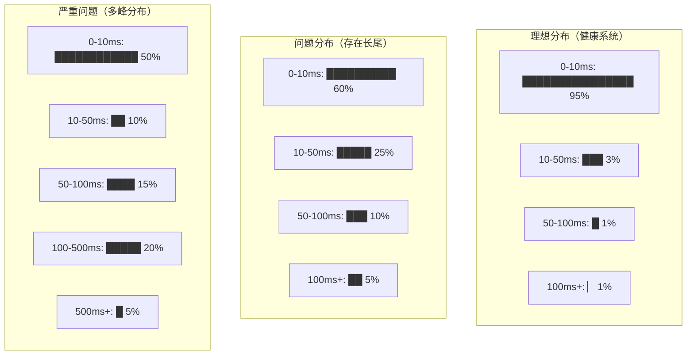
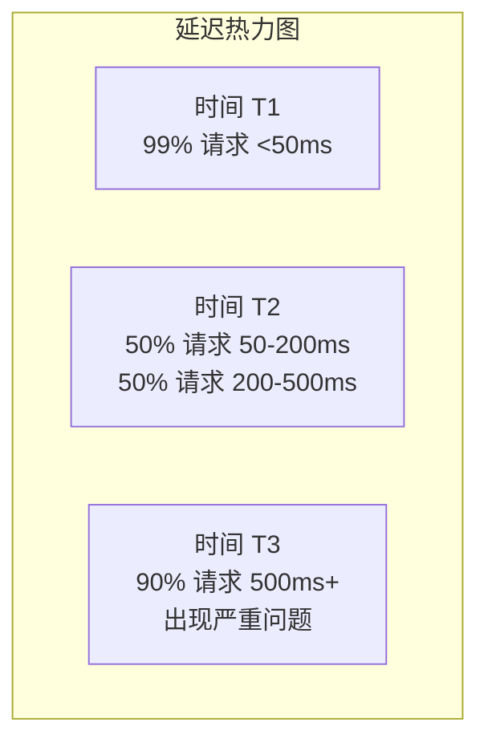

# 延迟详解：为什么平均值会骗人

凌晨两点，线上告警响了：「接口 P99 延迟超过 5 秒」。值班工程师紧急排查，却发现 CPU、内存、磁盘 I/O 一切正常，平均响应时间只有 50ms。问题出在哪？

这就是平均值骗人的典型场景。一个接口在 1 秒内有 1000 次请求，其中 999 次的延迟是 10ms，只有 1 次的延迟是 10 秒。这组数据的平均值是：

```
(999 × 10ms + 1 × 10000ms) ÷ 1000 = 19.99ms
```

19.99ms 看起来很不错，但事实上有 0.1% 的用户经历了 10 秒的等待。如果这个接口是支付接口，10 秒的等待会直接导致用户放弃支付——按每天 100 万笔交易计算，就是 1000 笔失败的订单。

**平均值会骗人，是因为它对异常值不敏感。在性能领域，真正的「坏」往往来自长尾。**

## 为什么只看平均值不够

假设一个电商网站的商品详情页接口，平均响应时间是 200ms。团队以此为目标进行优化，效果不错。但用户投诉却越来越多：「页面加载太慢了」。

后来才发现：虽然平均值是 200ms，但有 5% 的用户经历的是 2 秒以上的等待。这 5% 的用户恰好是移动端用户，在弱网环境下访问。而移动端用户占比已经达到 40%，他们产生的 GMV 占总 GMV 的 35%。

问题在于：**平均值掩盖了用户群体之间的差异**。平均值良好的系统，可能对某些用户群体非常不友好。

另一个典型场景是 GC 问题。假设系统在正常运行状态下，接口延迟稳定在 50ms。但每隔 30 秒会触发一次 Full GC，GC 期间延迟飙升到 2000ms。这组数据的平均值可能是 80ms，看起来还能接受。但实际上，**每 30 秒就会有一批用户经历噩梦般的体验**。

## 百分位数：解决平均值骗人的标准方案

百分位数是解决平均值骗人问题的标准方案。它的定义是：把响应时间从小到大排序，第 N 百分位数表示有 N% 的请求响应时间在这个值以下。


### P50（中位数）

P50 是一半的请求比它快，一半比它慢的阈值。中位数不受极端值影响，比平均值更稳定。

但中位数只能告诉你「一半的用户体验如何」，无法告诉你「另一半用户有多差」。只看 P50 可能会错过严重的尾部延迟问题。

### P90

P90 表示 90% 的请求比这个值快，意味着有 10% 的用户经历更差的体验。

如果你的 P90 是 100ms，意味着每 10 个用户中就有 1 个等待超过 100ms。这个比例看起来不高，但如果你的日活是 100 万，每天的「差体验用户」就是 10 万。

P90 通常用于设置**内部性能目标**。很多团队以 P90 作为「可接受的最大延迟」。

### P95

P95 是 95% 的请求比这个值快，有 5% 的用户经历更差的体验。

P95 通常用于设置 **SLA 目标**。相比 P90，P95 对长尾更加敏感，能够捕捉到更严重的延迟问题。

### P99

P99 是 99% 的请求比这个值快，只有 1% 的用户经历更差的体验。

P99 通常被认为是「绝大多数用户都能接受」的底线。很多大厂把 P99 作为 SLA 承诺的指标——不是因为它不重要，而是因为它足够严格。

如果你的 P99 是 500ms，意味着每 100 个请求中有 1 个超过 500ms。如果每天有 1000 万次请求，就有 10 万次「差体验」。

### P999/P9999

这些是极端长尾指标。P999 是 1000 个请求中只有 1 个比它慢，P9999 是 10000 个请求中只有 1 个比它慢。

关注这些指标不是为了「让每个用户都满意」，而是为了**发现系统的异常行为**。如果 P999 突然飙升，往往意味着出现了慢查询、死锁、或者 GC 问题。

## TP 指标详解

TP 是 Top Percentile 的缩写，与 P 百分位数是同一个概念，只是叫法不同。在金融行业、监控领域，TP 是更常见的叫法。

| 指标 | 含义 | 适用场景 | 典型阈值 |
| --- | --- | --- | --- |
| TP50 | 一半用户的体验 | 快速判断整体水平 | 无特定标准 |
| TP90 | 大多数用户的体验 | 设置内部目标 | 业务可接受上限 |
| TP95 | 头部用户的体验 | 设置 SLA 目标 | 行业参考标准 |
| TP99 | 绝大多数用户的体验 | 承诺 SLA | 严格的对外承诺 |
| TP999 | 极端长尾 | 发现系统异常 | 诊断级指标 |

### TP 指标的应用场景

**SLA 承诺**：对外承诺的 SLA 通常基于 TP99 或 TP999。例如，某云服务承诺「TP99 延迟 < 200ms」，意思是 99% 的请求延迟在 200ms 以内。

**容量规划**：通过 TP99 可以估算系统容量。如果 TP99 是 500ms，单机 QPS 上限大约是 2000（1000ms ÷ 500ms）。

**优化目标**：团队通常以 TP99 作为优化目标，因为它是「绝大多数用户都能接受的底线」。

## 百分位数的实际意义

有一个经验法则：**P99 / P50 的比值，反映了系统延迟的离散程度**。

- 比值接近 1：系统响应非常稳定，延迟分布集中
- 比值在 2~5 之间：存在一定的延迟波动，需要关注
- 比值超过 10：存在严重的延迟不一致性问题，需要深入排查

例如：
- P50 = 50ms，P99 = 60ms，比值 = 1.2，系统非常稳定
- P50 = 50ms，P99 = 500ms，比值 = 10，存在严重的延迟问题

## 延迟分布与直方图

百分位数是数字，直方图是图形。两者结合，才能完整理解延迟分布。



### 直方图的价值

**发现多峰分布**：如果直方图出现两个明显的高峰，通常意味着系统处于两种不同的运行状态。比如正常请求和慢请求混合，或者缓存命中和未命中走的是不同路径。

**发现延迟退化**：如果直方图的形状发生变化，比如原本集中在 0-50ms 的请求开始向 100-500ms 扩散，说明系统性能正在退化。

**识别异常模式**：某些异常会在直方图上留下明显的痕迹。比如 GC 停顿会在某个时间点产生大量长尾请求，在直方图上形成一个独立的「峰」。

### 延迟分布的可视化

在实际监控中，可以使用热力图（Heatmap）来展示延迟随时间的分布：



热力图的每一行是一个时间窗口，每一列是一个延迟区间，颜色深浅表示请求数量占比。通过热力图可以直观地看到延迟分布随时间的变化。

## 常见问题与优化思路

### P99 高但平均值正常

这种情况通常意味着存在**偶发的慢请求**。常见原因包括：

- GC 停顿：Full GC 导致所有请求暂停
- 外部依赖超时：数据库慢查询、第三方 API 超时
- 连接池耗尽：等待可用连接

优化思路：打点记录慢请求的上下文，分析根因。

### P99 抖动严重

如果 P99 在短时间内剧烈波动，可能是因为：

- 流量突增：某些时段请求量远超预期
- 资源竞争：与其他服务共享资源
- 代码逻辑：某些请求触发复杂逻辑

优化思路：增加资源冗余，优化流量控制策略。

### 多峰分布

直方图出现多个峰值，通常意味着：

- 缓存命中/未命中走不同路径
- 不同用户群体体验差异大
- 存在多种执行路径（正常/降级/异常）

优化思路：统一执行路径，或者为不同路径设置不同的 SLA。

## 本章总结

**核心要点**：

1. **平均值会骗人**：极端值会显著拉高平均值，但不影响中位数
2. **关注百分位数**：P99 才能真正反映「绝大多数用户」的体验
3. **P99/P50 比值**：比值超过 10 说明存在严重的延迟不一致性问题
4. **直方图补充**：百分位数是数字，直方图是图形，两者结合才能完整理解
5. **多峰分布是警告**：说明系统可能处于多种不同的运行状态

理解延迟指标是性能优化的第一步。下一节我们将讲解吞吐量，探讨 QPS/TPS/RPS 的区别与联系。